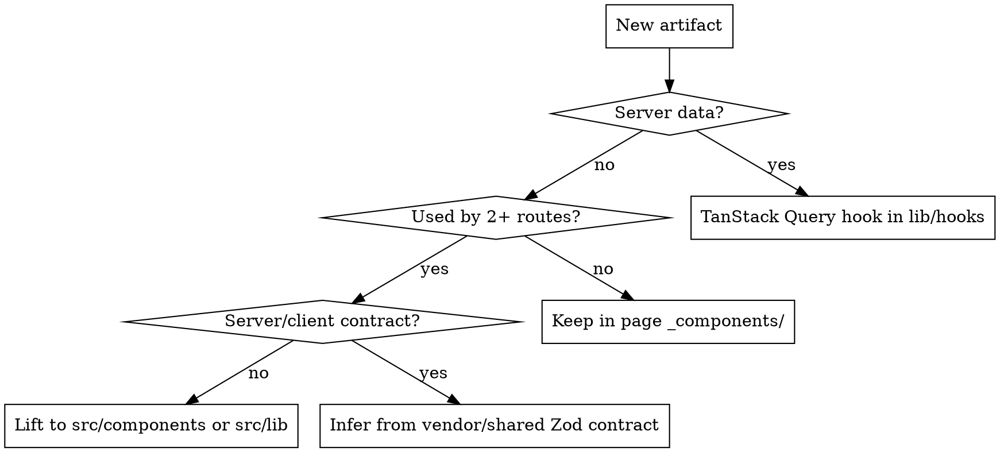

# Client Project Structure (DevDigest `client/`)

## Overview
`client/` colocates code by where it is used. **Page-local code lives next to its
route; shared code lives in a small set of top-level homes.** This skill is the
authority on *placement and naming*; `client/CLAUDE.md` is the source of truth for
the top-level map, and this skill must never contradict it.

Three rules govern every decision:

1. **Colocation + lift.** Used by **one page** → it lives in that page's
   `_components/`. Reused by **2+ pages** → lift it to a shared home
   (`src/components`, `src/lib`). Never pre-globalize single-use code.
2. **Data flows through hooks only.** ALL server state goes through a TanStack
   Query hook in `src/lib/hooks/` — a component **never** calls `fetch` or the API
   client (`src/lib/api.ts`) directly.
3. **App Router only.** Routes are `src/app/**/page.tsx`; there is NO `/pages`.
   Pages are thin — they compose `_components`, they don't hold logic.

This is a **pattern skill** — adapt names to the feature, but never bypass a data
hook, never contradict the top-level map, and never scatter one page's code.

## Where things live (decision table)

| Artifact | Page-local (one route) | Shared (2+ routes) |
|---|---|---|
| Component | `app/<route>/_components/<Name>/<Name>.tsx` | `src/components/<kebab>/` |
| Subcomponent | same `_components/<Name>/` folder as parent | `src/components/<kebab>/` |
| Data hook (server state) | `src/lib/hooks/<domain>.ts` (one per query) | `src/lib/hooks/<domain>.ts` |
| Pure helper / util | `_components/<Name>/helpers.ts` | `src/lib/<kebab>.ts` |
| Constant | `_components/<Name>/constants.ts` | `src/lib/<kebab>.ts` |
| Local type | colocated `types.ts` | `src/lib/types.ts` |
| Server-contract type | — (never redefine) | `src/vendor/shared/` — infer from the Zod contract |
| API call | never in a component — go through a hook that uses `src/lib/api.ts` | `src/lib/api.ts` |
| Business logic / predicate | `_components/<Name>/helpers.ts` — pure, **no React import** | `src/lib/<kebab>.ts` |
| App chrome (nav, shortcuts) | — | `src/components/app-shell/` |
| UI primitive | — | `src/vendor/ui/` (sealed — public exports only) |
| Route / page | `src/app/<route>/page.tsx` — thin, composes `_components` | — |

**Business logic never lives inside a component.** A predicate like "can the
current user edit this comment?" is a pure function (colocated `helpers.ts` when
page-local, `src/lib/` when shared) so it is unit-testable without rendering.

## Next.js App Router specifics

- **Route files** (`page.tsx`, `layout.tsx`, `loading.tsx`, `error.tsx`) stay in
  the route folder. `page.tsx` is a thin entry that renders one `_components` view.
- **Private folders** — prefix with `_` (`_components/`, `_hooks/`) so Next.js
  excludes them from routing. This is the page-local colocation home.
- **RSC boundary.** Components are Server Components by default. Add `'use client'`
  at the **leaf** that needs interactivity or hooks — not at the page root — so the
  server tree stays as large as possible.
- **Data fetching.** In this repo, server state is fetched via TanStack Query hooks
  in `src/lib/hooks/` (client-side), never with `fetch` in a component.
- For RSC mechanics, streaming, and metadata, **invoke skill `next-best-practices`**
  rather than re-deriving them here. For component design, **`react-best-practices`**.

## Naming (already established in the repo — match it)

| Kind | Convention | Example |
|---|---|---|
| Shared component folder (`src/components/`) | kebab-case | `app-shell/`, `diff-viewer/` |
| `_components/` slice folder (page-local) | PascalCase (matches component) | `CommentList/`, `AgentsListView/` |
| Component file | PascalCase | `AppShell.tsx`, `DiffViewer.tsx` |
| Colocated helpers file | `helpers.ts` (**not** `utils.ts`) | `diff-viewer/helpers.ts` |
| Colocated constants file | `constants.ts` | `diff-viewer/constants.ts` |
| Colocated styles file | `styles.ts` | `diff-viewer/styles.ts` |
| Public surface of a folder | `index.ts` barrel | re-exports what's imported outside |
| `lib/` utility file | kebab-case | `github-urls.ts`, `model-label.ts` |
| Data hook | `useX` fn, grouped by domain | `lib/hooks/reviews.ts` |

## The lift decision



## Example — a page-local feature

Feature "pull-request-comments" scoped to one route:

```
src/app/repos/[id]/comments/
  page.tsx                       # thin: renders <CommentList />, no logic
  _components/
    CommentList/
      CommentList.tsx            # 'use client' — needs the query hook + interactivity
      CommentItem.tsx            # subcomponent, only used by CommentList
      CommentForm.tsx
      helpers.ts                 # canEditComment(user, c) — pure, no React import
      constants.ts               # MAX_COMMENT_LENGTH = 500
      index.ts                   # barrel: exports CommentList

src/lib/hooks/comments.ts        # useComments(), usePostComment() — TanStack Query
```

- The `Comment` shape is returned by the Fastify server, so it is a **contract**:
  infer it from `src/vendor/shared/` — never redefine locally.
- A generic `"3h ago"` formatter is reused across routes, so it **lifts** out to
  `src/lib/format-relative-time.ts` (kebab-case), not the feature.

## Common mistakes

| Mistake | Fix |
|---|---|
| Inventing a top-level `src/features/` folder | Page-local code goes in `app/<route>/_components/`; there is no `features/` in this repo. |
| Calling `fetch` or `src/lib/api.ts` from a component | Server state always flows through a TanStack Query hook in `src/lib/hooks/`. |
| `'use client'` at the page root | Push the boundary to the interactive leaf; keep the server tree large. |
| Inconsistent casing (`CommentList.tsx` vs `formatRelativeTime.ts`) | PascalCase components, kebab-case `lib/` files (see table). |
| Naming a colocated helper `utils.ts` | The repo convention is `helpers.ts`. |
| Predicate logic inside a component or hook | Pure function in `helpers.ts` (page-local) or `src/lib/` (shared). |
| Redefining a server type locally | Infer from the Zod contract in `src/vendor/shared/`. |
| Reaching into `src/vendor/ui/` internals | Use its public exports only — it's a sealed vendored package. |
