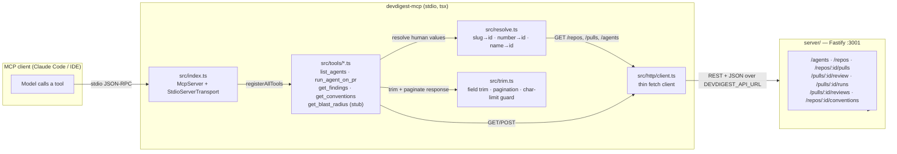

# `devdigest-mcp` — `@devdigest/mcp`

A local **stdio MCP server** that exposes DevDigest's PR-review workflow to any
MCP client (Claude Code, an IDE, etc.) as five tools. It never touches the
database or the server's service layer directly — it is a thin HTTP client
against the DevDigest Fastify API (`server/`, `:3001`) and speaks MCP
(JSON-RPC over stdio) to the model on the other side.

Not part of the pnpm/turbo/nx workspace — own `package.json` + lockfile
(npm), run straight from TypeScript source via `tsx` (no build step), per the
repo's [`CLAUDE.md`](../CLAUDE.md) conventions.

## Tools

Each tool follows the four design principles from the course slides: return a
finished **result, not an operation**; take **flat scalar arguments** (never a
nested object); return a **concise, trimmed response** (never a raw API dump);
and make **errors lead forward** (every error names the next tool/step).

| Tool | Purpose | Args |
|---|---|---|
| `list_agents` | List configured review agents (find a valid `agent` value). | `limit?`, `offset?` |
| `run_agent_on_pr` | Run one agent on a PR and return the finished result in a single call (create run → wait → fetch findings). Returns `{status:'running', run_id}` on timeout instead of a raw async handle. | `repo`, `pr`, `agent`, `timeout_ms?` |
| `get_findings` | Fetch the trimmed verdict + findings for an already-completed review. | `repo`, `pr`, `run_id?`, `limit?`, `offset?` |
| `get_conventions` | Fetch a repo's extracted house conventions. | `repo`, `limit?`, `offset?` |
| `get_blast_radius` | **Stub** — always returns `{status:'not_implemented'}`; the real analysis (reads `repo-intel`) lands in a later lesson. | `repo`, `pr` |

All findings/conventions responses are trimmed to a handful of fields (e.g. a
finding is `{id, severity, title, file, line}`, never the full markdown
`rationale`/`suggestion`) and paginated (`limit`/`offset`), with a hard
character-limit guard on the serialized payload.

## Running

```sh
cd devdigest-mcp
npm install
npm run dev     # tsx src/index.ts — connects over stdio
```

The **DevDigest server must already be running on `:3001`**
(`./scripts/dev.sh` from the repo root, or `cd server && pnpm dev`) — every
tool call is an HTTP request to it. If unreachable, `run_agent_on_pr` /
`get_findings` / etc. return a leads-forward error telling you to start it.

Configure the API base URL with:

```sh
DEVDIGEST_API_URL=http://localhost:3001   # default
```

This server is also registered in the repo root's [`.mcp.json`](../.mcp.json)
under the `devdigest` key, so any MCP client that reads that file (e.g. Claude
Code in this repo) picks it up automatically via `tsx devdigest-mcp/src/index.ts`.

No auth token is required — the DevDigest API runs `LocalNoAuthProvider` for
local dev and auto-resolves the default workspace.

## Architecture



## Testing

```sh
npm run typecheck
npm run test        # vitest, hermetic — HttpClient/Resolvers are mocked, no network/DB
```
