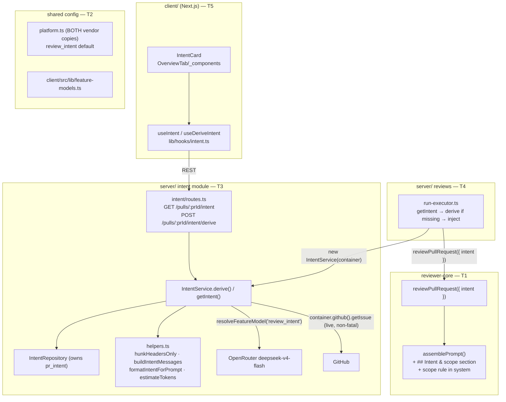

# Development Plan — Intent Layer (L03)

## Context & goal
Wire up the dormant **Intent** scaffolding into a live feature: a cheap flash-class model reads a PR's motivation signals (linked issue, body, title, file + hunk headers) and produces a structured `Intent = { intent, in_scope, out_of_scope }`. The intent is shown as a card on the PR Overview page **before** the review, and injected into the review prompt so agents stay on-topic. The classifier runs on **file + hunk headers only — never diff bodies** (the token-saving core), and logs the savings on every derivation.
Source of truth: `docs/superpowers/specs/2026-07-15-intent-layer-design.md`. All stubs already exist; we wire them, we do not rebuild them.

## Constraints from INSIGHTS & CLAUDE.md
- **Vendored-shared must be byte-identical in BOTH copies.** Any edit to `server/src/vendor/shared/contracts/platform.ts` must land identically in `client/src/vendor/shared/contracts/platform.ts` in the same change — there is no auto-sync — source: root `INSIGHTS.md:21`.
- **Integration tests live in `server/test/`, NOT co-located in `src/modules/<name>/`.** Mirror the harness in `server/test/conventions.it.test.ts` (`startPg()` + `seed(db)` + `buildApp({config,db,overrides})` + `app.inject(...)`; stub LLM via `overrides.llm`) — source: `server/INSIGHTS.md:27`, `server/INSIGHTS.md:11-... (it.test location)`.
- **Starter tables ship as minimal stubs — reuse, don't recreate.** `pr_intent`, the `Intent` contract, and the `review_intent` feature-model slot already exist; extend/wire them — source: `server/INSIGHTS.md:28`, spec §"What already exists".
- **Services receive the `Container`; never instantiate adapters directly.** Resolve LLM via `container.llm(provider)`, GitHub via `await container.github()` — source: `server/CLAUDE.md` Non-default conventions; skill `onion-architecture`.
- **Routes declare Zod `params`/`body`** — no hand-rolled `Schema.parse(req.body)` — source: `server/CLAUDE.md`.
- **Don't edit existing schema files.** `pr_intent` needs no migration (it exists at `server/src/db/schema/reviews.ts:48`) — source: `server/CLAUDE.md` do-not-touch.
- **reviewer-core is pure** — no DB/GitHub/fs; only the injected `LLMProvider`. `INJECTION_GUARD` already names "derived intent/scope" (`reviewer-core/src/prompt.ts:19`); the new scope rule coexists with it and can never zero-out a real defect — source: `reviewer-core/CLAUDE.md`, spec §"Prompt injection".
- **`reviewer-core` needs its own `node_modules`** — if `openai` resolution fails when running the server, run `cd reviewer-core && npm install` — source: `reviewer-core/INSIGHTS.md:15`.
- **Client: all server state through a TanStack Query hook** in `src/lib/hooks/`; never `fetch` from a component — source: `client/CLAUDE.md`.
- **Client cannot import runtime VALUES from vendored shared** (only types) — the client mirrors the model registry locally in `client/src/lib/feature-models.ts` — source: `client/src/lib/feature-models.ts:1-12`.
- **`styles.ts` maps typed `Record<string, CSSProperties>` cannot hold functions** — export dynamic styles as standalone `: CSSProperties` functions — source: `client/INSIGHTS.md:22`.

## Architecture sketch

## Shared contracts (define FIRST, before parallel work)
1. **reviewer-core seam (T1 exposes → T4 consumes).** Add optional `intent?: string` to `PromptParts` (`reviewer-core/src/prompt.ts:39`) and to `ReviewInput` (`reviewer-core/src/review/run.ts:44`), threaded into `promptParts` at `run.ts:130`. Same "omit when empty → byte-identical prompt" contract as `repoMap`/`callers`.
2. **REST contract (T3 exposes → T5 consumes).** `GET /pulls/:prId/intent` → `200` body `Intent | null` (null = not derived yet). `POST /pulls/:prId/intent/derive` → `200` body `Intent`. `Intent` is the existing Zod contract `{ intent: string, in_scope: string[], out_of_scope: string[] }` (`.../contracts/brief.ts:8`, present in both vendor copies) — **no contract change**.
3. **IntentService surface (T3 exposes → T4 consumes).** `class IntentService { constructor(container: Container); getIntent(prId): Promise<Intent|null>; derive(workspaceId, prId, logger?): Promise<Intent> }`. Manual route and auto-derive share the same `derive()`.
4. **Prompt-formatting helper (T3 exposes → T4 consumes).** `formatIntentForPrompt(intent: Intent): string` in `server/src/modules/intent/helpers.ts` — turns the stored `Intent` object into the single string reviewer-core expects.
5. **Feature-model default (T2, self-contained).** `review_intent` default becomes `provider: 'openrouter', model: 'deepseek/deepseek-v4-flash'` — **byte-identical** in `server/src/vendor/shared/contracts/platform.ts` and `client/src/vendor/shared/contracts/platform.ts`, and mirrored in `client/src/lib/feature-models.ts`.

## Tasks

### T1 — reviewer-core intent seam
- **Area:** Core
- **Owns (files):** `reviewer-core/src/prompt.ts`, `reviewer-core/src/review/run.ts`, `reviewer-core/test/prompt.test.ts`
- **Depends on:** none
- **Skills to invoke:** zod, security, typescript-expert
- **Steps:**
  1. In `reviewer-core/src/prompt.ts`, add optional `intent?: string` to the `PromptParts` interface (after `prDescription`, ~`:68`). Document it as untrusted (author/derived-controlled), delimiter-wrapped, omit-when-empty — mirroring the `prDescription` doc comment.
  2. In `assemblePrompt` (`prompt.ts:104-120`), after the `## PR description` section (`:106-108`) and before `## Skills / rules`, push `## Intent & scope\n${wrapUntrusted('intent', parts.intent)}` **only when** `parts.intent && parts.intent.trim().length > 0`. Keep the exact "omit when empty" shape so the assembled prompt is byte-identical to today when intent is absent.
  3. Define the scope-rule string as a module const (beside `INJECTION_GUARD`, `:16`) using the exact spec text (spec §"Prompt injection", the blockquote). In `assemblePrompt`, append it to the **trusted** `system` string (`const system = ...` at `:86`) **only when** intent is present: `const system = parts.intent?.trim() ? \`${base}\n\n${SCOPE_RULE}\` : base`. Do NOT remove or weaken `INJECTION_GUARD` — the scope rule coexists with it.
  4. Add `intent: parts.intent ?? null` is NOT required in `PromptAssembly` unless the type already has a slot — do not widen `PromptAssembly` (it is a shared contract); leave the assembly record shape unchanged.
  5. In `reviewer-core/src/review/run.ts`, add `intent?: string` to `ReviewInput` (`:44`, document like `prDescription` at `:71`) and add `intent: input.intent` to the `promptParts` object (`:130-139`).
  6. In `reviewer-core/test/prompt.test.ts`, add tests: (a) with `intent` present, `assemblePrompt` renders a `## Intent & scope` block wrapped in `<untrusted source="intent">` and the system string contains the scope-rule text; (b) with `intent` absent/empty, the assembled `user` and `system` strings are unchanged vs a no-intent baseline (byte-identical assertion).
- **Verify:** `cd reviewer-core && npm test && npm run typecheck`
- **Out of scope:** Do NOT change `INJECTION_GUARD`, grounding, `PromptAssembly` shape, or the `Review` contract. No keyword-scanning of untrusted text. No DB/GitHub/fs imports.

### T2 — feature-model default (review_intent) + client mirror drift fix
- **Area:** Full-stack (config only)
- **Owns (files):** `server/src/vendor/shared/contracts/platform.ts`, `client/src/vendor/shared/contracts/platform.ts`, `client/src/lib/feature-models.ts`
- **Depends on:** none
- **Skills to invoke:** zod, security, typescript-expert
- **Steps:**
  1. In `server/src/vendor/shared/contracts/platform.ts`, change the `review_intent` entry (`:52-57`) `defaultProvider` to `'openrouter'` and `defaultModel` to `'deepseek/deepseek-v4-flash'`. Leave `id`/`label`/`description` unchanged.
  2. Apply the **byte-identical** edit to `client/src/vendor/shared/contracts/platform.ts` (`review_intent` at `:52-57`). This is the vendored-shared-sync hazard (root `INSIGHTS.md:21`) — both copies must match exactly.
  3. In `client/src/lib/feature-models.ts`, update the `review_intent` entry (`:21-27`) `defaultProvider`→`'openrouter'`, `defaultModel`→`'deepseek/deepseek-v4-flash'`. **Adjacent fix:** the `conventions` entry (`:42-48`) still carries the stale `openai`/`gpt-5.4` default from commit `bef76ba` — correct it to `defaultProvider: 'openrouter'`, `defaultModel: 'deepseek/deepseek-v4-flash'` to match the vendored `conventions` default (`platform.ts:73-78`).
  4. Do not add any new UI — Settings → Models auto-lists every `FEATURE_MODELS` entry.
- **Verify:** `cd server && pnpm typecheck` && `cd client && pnpm typecheck`
- **Out of scope:** No new feature-model ids, no Settings UI, no changes to `resolveFeatureModel` logic. Do not touch any other `FEATURE_MODELS` entry (onboarding/risk_brief/conformance).

### T3 — server `intent` module (derivation + persistence + REST)
- **Area:** Backend
- **Owns (files):** `server/src/modules/intent/routes.ts`, `server/src/modules/intent/service.ts`, `server/src/modules/intent/repository.ts`, `server/src/modules/intent/helpers.ts`, `server/src/modules/intent/constants.ts`, `server/src/modules/index.ts` (registration), `server/src/modules/intent/helpers.test.ts` (unit), `server/test/intent.it.test.ts` (integration)
- **Depends on:** none (uses existing `Intent` contract + `resolveFeatureModel`)
- **Skills to invoke:** onion-architecture, fastify-best-practices, drizzle-orm-patterns, postgresql-table-design, security, zod, typescript-expert
- **Steps:**
  1. **repository.ts** — `class IntentRepository { constructor(private db: Db) {} }`. It is the ONLY place touching `pr_intent` going forward. Implement:
     - `getIntent(prId): Promise<Intent | null>` — select from `t.prIntent`; map row → `{ intent, in_scope: row.inScope, out_of_scope: row.outOfScope }`; return `null` when absent (port the exact mapping from `reviews/repository/pull.repo.ts:64-68`, returning `null` not `undefined`).
     - `upsertIntent(prId, intent): Promise<void>` — port the `onConflictDoUpdate` from `pull.repo.ts:49-62`.
     - `getPull(workspaceId, prId)` — workspace-scoped select from `t.pullRequests` (mirror `pull.repo.ts:9-19`) returning `{ id, number, title, body, base, headSha, repoId }`.
     - `getRepoRef(repoId)` — select `{ owner, name }` from `t.repos` (mirror `conventions/repository.ts:30-42`) for the GitHub `RepoRef`.
     - `getPrFiles(prId)` — select from `t.prFiles` (mirror `pull.repo.ts:29-34`) for header extraction.
  2. **helpers.ts** (pure, no I/O):
     - `buildDiffFromFiles(files): UnifiedDiff` — reconstruct a unified diff from `pr_files.patch` using `parseUnifiedDiff` (import from `../../adapters/git/diff-parser.js`), replicating the assembly in `reviews/diff-loader.ts:33-44`. Do NOT import from the `reviews` module (keep the dependency one-directional).
     - `hunkHeadersOnly(diff: UnifiedDiff): string` — emit `FILE: <path>` followed by each hunk's `@@ -oldStart,oldLines +newStart,newLines @@` header, reconstructed from `DiffHunk` fields (`server/src/vendor/shared/adapters.ts:175-183` — `DiffHunk` carries NO body text). Never include line content.
     - `parseLinkedIssueRef(body: string | null): number | null` — regex `(?:closes|fixes|resolves)?\s*#(\d+)` (mirror `octokit.ts:128`), returns the issue number or null.
     - `estimateTokens(text: string): number` — `Math.ceil(text.length / 4)` (chars/4 heuristic; spec §"Token-saving core" allows this fallback).
     - `buildIntentMessages({ title, body, issue, headers }): ChatMessage[]` — system prompt instructs the model to infer intent from available evidence in priority order (linked issue → body → title → file/hunk headers) and to always populate `in_scope`/`out_of_scope` from the changed files even with no prose motivation (spec §"Classifier input & graceful degradation"). Wrap untrusted signals plainly; the model returns the `Intent` schema.
     - `formatIntentForPrompt(intent: Intent): string` — one-line summary + `In scope:`/`Out of scope:` bullet lists → the single string the reviewer-core seam consumes (shared contract #4).
  3. **constants.ts** — `INTENT_MAX_RETRIES = 2`; any prompt caps.
  4. **service.ts** — `class IntentService { constructor(private container: Container) { this.repo = new IntentRepository(container.db); } }`:
     - `getIntent(prId)` → `this.repo.getIntent(prId)`.
     - `derive(workspaceId, prId, logger?)`:
       a. Load pull + repoRef + pr_files via `this.repo`.
       b. `const diff = buildDiffFromFiles(files)`; `const headers = hunkHeadersOnly(diff)`.
       c. Linked issue (live, **non-fatal**): `const n = parseLinkedIssueRef(pull.body)`; if `n`, `try { const gh = await this.container.github(); issue = await gh.getIssue({ owner, name }, n); } catch { issue = undefined; }` — a missing token, missing issue, or unreachable GitHub degrades to `undefined`, never throws (spec §"Linked issue").
       d. `const { provider, model } = await resolveFeatureModel(this.container, workspaceId, 'review_intent')` (import from `../settings/feature-models.js`).
       e. `const llm = await this.container.llm(provider as Provider)`; `const res = await llm.completeStructured({ model, schema: Intent, schemaName: 'Intent', messages: buildIntentMessages(...), maxRetries: INTENT_MAX_RETRIES })` (pattern from `conventions/service.ts:61-68`).
       f. Emit the token-savings log line exactly once: `logger?.info({ prId, model, fullDiffTokens: estimateTokens(diff.raw), headersOnlyTokens: estimateTokens(headers), saved: fullDiffTokens - headersOnlyTokens }, 'intent: token savings')`.
       g. `await this.repo.upsertIntent(prId, res.data)`; return `res.data`.
     - Derivation ALWAYS returns a best-effort `Intent` — there is no "no documentation → error" path.
  5. **routes.ts** — export a default Fastify plugin (mirror `conventions/routes.ts`): `const app = appBase.withTypeProvider<ZodTypeProvider>(); const service = new IntentService(app.container);`
     - `app.get('/pulls/:prId/intent', { schema: { params: IdParams } }, async (req) => { const { workspaceId } = await getContext(app.container, req); return service.getIntent(req.params.prId); })` — returns `Intent | null` (200; null = not derived yet). Use param name `prId` (adjust `IdParams` or define a small `PrIdParams` in `_shared/schemas` usage — reuse `IdParams` and read `req.params.id` if simpler, but keep the URL path `:prId`).
     - `app.post('/pulls/:prId/intent/derive', { schema: { params: ... } }, async (req) => { const { workspaceId } = await getContext(app.container, req); return service.derive(workspaceId, <prId>, req.log); })`.
  6. **register** in `server/src/modules/index.ts` — add `import intent from './intent/routes.js';` and one `intent,` entry in the `modules` record (`:26-37`). Touch no other module.
  7. **helpers.test.ts** (hermetic unit): `hunkHeadersOnly` emits only `@@` headers + file paths and never a `+`/`-` body line; `estimateTokens` chars/4; `buildIntentMessages` degrades gracefully (empty body + no issue still yields a user message built from title + headers); token-savings arithmetic (`saved = full - headers`).
  8. **intent.it.test.ts** in `server/test/` (NOT co-located — `server/INSIGHTS.md:27`): mirror `server/test/conventions.it.test.ts` harness (`startPg` + `seed` + `buildApp` + stub `overrides.llm.openrouter.completeStructured` returning a fixed `Intent`). Assert: `POST /pulls/:prId/intent/derive` persists `pr_intent` and returns the Intent; `GET /pulls/:prId/intent` returns it; `GET` returns `null` before any derive.
- **Verify:** `cd server && pnpm exec vitest run --exclude '**/*.it.test.ts'` (unit) then `pnpm exec vitest run .it.test` (Docker) and `pnpm typecheck`
- **Out of scope:** Do NOT touch `reviews/run-executor.ts` or the reviews repository (that is T4). Do NOT persist the linked issue to the DB (fetch live). Do NOT add a migration (`pr_intent` exists). Do NOT touch `pr_brief`, Blast Radius, or Smart Diff. Do NOT read `process.env`.

### T4 — reviews run-executor auto-derive + inject; relocate CRUD out of reviews
- **Area:** Backend
- **Owns (files):** `server/src/modules/reviews/run-executor.ts`, `server/src/modules/reviews/repository/pull.repo.ts`, `server/src/modules/reviews/repository.ts`
- **Depends on:** T1 (reviewer-core `intent` seam), T3 (`IntentService` + `formatIntentForPrompt`)
- **Skills to invoke:** onion-architecture, fastify-best-practices, drizzle-orm-patterns, security, zod, typescript-expert
- **Steps:**
  1. In `run-executor.ts`, import `IntentService` from `../intent/service.js` and `formatIntentForPrompt` from `../intent/helpers.js`.
  2. In `executeRuns` (`:96-106`), **after** the diff loads and **before** the per-agent loop (`:108`), derive-if-missing ONCE per PR: `const intentService = new IntentService(this.container); let intent = await intentService.getIntent(pull.id); if (!intent) intent = await intentService.derive(workspaceId, pull.id, logger);` — wrap in try/catch and log a non-fatal warning on failure so a derivation error never fails the review run (mirror the best-effort pattern of `buildCallersDigest`/`buildRepoMapDigest`, `:337-387`). Pass the resolved `intent` (may be null on failure) into each `runOneAgent`.
  3. Thread `intent: Intent | null` as a new parameter of `runOneAgent` (`:139-147`). At the `reviewPullRequest({...})` call (`:196-219`), add `...(intent ? { intent: formatIntentForPrompt(intent) } : {})` — same "omit when empty" pattern as `repoMap`/`callers`/`prDescription` (`:207-212`). Derivation happens once per PR run, not once per agent.
  4. Import the `Intent` type from `@devdigest/shared` where needed for the signatures.
  5. **Relocate CRUD:** remove `upsertIntent` and `getIntent` from `reviews/repository/pull.repo.ts` (`:47-68`) and remove their wrappers from `reviews/repository.ts` (`:143-151`). Remove the now-unused `import type { Intent } from '@devdigest/shared'` from `pull.repo.ts:4` if nothing else uses it. `pr_intent` is now owned solely by `IntentRepository` (T3) — satisfying the onion "one repository per table" rule. (Confirmed zero other callers via grep: only `repository.ts` referenced these.)
  6. Do NOT change `diff-loader.ts` or `getPrFiles` (still used by the reviews diff load).
- **Verify:** `cd server && pnpm typecheck` then `pnpm exec vitest run --exclude '**/*.it.test.ts'` and `pnpm exec vitest run .it.test` (Docker; includes the auto-derive round-trip)
- **Out of scope:** Do NOT create/modify the intent module's files (T3 owns them). Do NOT change `reviews/service.ts`, `routes.ts`, or `diff-loader.ts`. Do NOT alter the grounding/score pipeline. Do NOT re-add an intent CRUD path in reviews.

### T5 — client Intent hooks + IntentCard + Overview layout
- **Area:** Frontend
- **Owns (files):** `client/src/lib/hooks/intent.ts` (new), `client/src/app/repos/[repoId]/pulls/[number]/_components/OverviewTab/OverviewTab.tsx`, `client/src/app/repos/[repoId]/pulls/[number]/_components/OverviewTab/styles.ts`, `client/src/app/repos/[repoId]/pulls/[number]/_components/OverviewTab/_components/IntentCard/**` (new: `IntentCard.tsx`, `styles.ts`, `index.ts`, `IntentCard.test.tsx`), `client/src/app/repos/[repoId]/pulls/[number]/_components/PrDetailView/PrDetailView.tsx` (one-line prop wiring)
- **Depends on:** T3 for runtime (endpoints); buildable in parallel against the `Intent` contract + REST shape (contracts #2, #3)
- **Skills to invoke:** client-project-structure, react-best-practices, next-best-practices, react-testing-library, security, zod, typescript-expert
- **Steps:**
  1. **hooks/intent.ts** (`"use client"`; mirror `client/src/lib/hooks/conventions.ts`):
     - `useIntent(prId)` → `useQuery({ queryKey: ["intent", prId], queryFn: () => api.get<Intent | null>(\`/pulls/${prId}/intent\`), enabled: prId != null })`.
     - `useDeriveIntent(prId)` → `useMutation({ mutationFn: () => api.post<Intent>(\`/pulls/${prId}/intent/derive\`), onSuccess: () => qc.invalidateQueries({ queryKey: ["intent", prId] }) })`.
     - Import `type { Intent } from "@devdigest/shared"` (present in client vendor).
  2. **IntentCard/** folder (page-local `_components`, PascalCase per `client-project-structure`):
     - `IntentCard.tsx` (`"use client"`, leaf): takes `prId`. Uses `useIntent` + `useDeriveIntent`. Renders: quoted **summary**; **In scope** list with ✓; **Out of scope** list muted with ✗; a **Derive / Recompute** button (calls the mutation, disabled while pending); an **empty state** (data === null → CTA "Derive intent"); a **loading** state. Add an `aria-label` on the icon/button and `aria-live="polite"` on the results region (react-best-practices A11y). Keep it under 200 lines; extract pure predicates to a colocated `helpers.ts` only if needed.
     - `styles.ts` typed `Record<string, CSSProperties>` for static styles; any dynamic style as a standalone `: CSSProperties` function (client `INSIGHTS.md:22`). Use the vendored `@devdigest/ui` primitives via public exports only.
     - `index.ts` barrel exporting `IntentCard`.
     - `IntentCard.test.tsx`: 3 RTL flow tests (fetch mocked per `client/src/test/setup.ts`) — empty state renders CTA; populated state renders summary + in/out lists; clicking Recompute triggers the derive mutation (assert loading → refreshed content). Use `getByRole`/`getByText`; `userEvent.setup()`.
  3. **OverviewTab.tsx**: add `prId: string` to `OverviewTabProps`; render `<IntentCard prId={prId} />` above/beside the existing Description section. Introduce a responsive single-column layout in `styles.ts` that can later seat a Blast Radius card beside Intent (no placeholder for the unbuilt L04 card).
  4. **PrDetailView.tsx**: pass the existing `prId` into the tab: change `<OverviewTab prBody={pr.body} />` (`:203`) to `<OverviewTab prBody={pr.body} prId={prId} />` (`prId` is already in scope, `:193`). This is the only edit to this file.
- **Verify:** `cd client && pnpm test && pnpm typecheck`
- **Out of scope:** Do NOT touch `feature-models.ts` or any `vendor/` file (T2 owns config). Do NOT call `fetch`/`api` from a component — go through the hooks. No Blast Radius / Smart Diff UI. Do NOT add a `/pages` route.

## Execution order
- **Wave 1 (parallel, disjoint files):** T1 (reviewer-core), T2 (config, both platform.ts copies), T3 (server intent module), T5 (client UI). No two of these own the same file.
- **Wave 2 (sequential):** T4 — starts only after **both T1 and T3** merge (needs the reviewer-core `intent` seam and the `IntentService`/`formatIntentForPrompt` exports).
- Dependency graph (one line each):
  - `T1 → T4`  (reviewer-core `intent?: string` seam must exist before run-executor can inject it)
  - `T3 → T4`  (`IntentService.derive/getIntent` + `formatIntentForPrompt` must exist before run-executor calls them; T4 also removes the reviews-side CRUD that T3 relocated)
  - `T2`, `T5` — independent; `T5` needs T3's endpoints only at runtime (end-to-end), not to author its files.

### Ordering hazards (call-outs)
- **Byte-identical vendored edit (T2).** The `review_intent` default change must be identical in `server/src/vendor/shared/contracts/platform.ts` AND `client/src/vendor/shared/contracts/platform.ts`. Assigning BOTH copies to the single owner **T2** guarantees this (root `INSIGHTS.md:21`). No other task may edit either `platform.ts`.
- **Seam-before-consumer (T1 → T4).** The `PromptParts.intent` / `ReviewInput.intent` seam must land before T4 wires the run-executor, or the `reviewPullRequest({ intent })` call won't typecheck.
- **CRUD relocation single-ownership.** T3 creates `IntentRepository` (owns `pr_intent`); T4 removes the duplicate CRUD from `reviews/repository/pull.repo.ts` + `repository.ts`. Until T4 lands, `pr_intent` is briefly touched in two repositories — the onion "one repository per table" rule is only fully restored once T4 merges. Sequence T4 after T3.

## End-to-end verification (after all tasks merge)
1. `cd reviewer-core && npm test && npm run typecheck` — intent section renders only when present; prompt byte-identical when absent.
2. `cd server && pnpm typecheck && pnpm exec vitest run --exclude '**/*.it.test.ts'` — intent helpers unit green; no unused-import errors from the CRUD relocation.
3. `cd server && pnpm exec vitest run .it.test` (Docker) — `POST /pulls/:prId/intent/derive` persists `pr_intent`; `GET` returns it (and `null` before derive); a review run auto-derives intent when missing.
4. `cd client && pnpm test && pnpm typecheck` — IntentCard empty/loading/populated + recompute mutation.
5. Manual smoke (optional): boot `./scripts/dev.sh`, open a PR Overview tab → IntentCard shows empty state → click Derive → summary + scope lists appear; trigger a review run → the run trace's assembled prompt contains a `## Intent & scope` block and the run log shows one `intent: token savings` line with `saved > 0`.

## Planning notes
- The spec's "Files touched" places the intent `*.it.test.ts` under `src/modules/intent/`, but `server/INSIGHTS.md:27` is authoritative: server integration tests live in `server/test/`. The plan routes `intent.it.test.ts` to `server/test/` accordingly — surface this so the insight flow can note the spec/repo-convention mismatch.
- `INJECTION_GUARD` (`reviewer-core/src/prompt.ts:19`) already anticipates "derived intent/scope" as untrusted — the new scope rule is additive and needs no guard change; worth capturing that the guard was pre-wired for this lesson.
