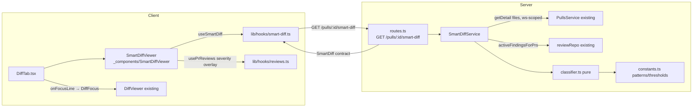

# Development Plan — Smart Diff («Розумний ДІФ»)

## Context & goal
Risk-ranked diff layout so a reviewer's eye lands on business logic first, not on
lock-files. Every changed file in a PR is deterministically classified into one of
three roles (`core` / `wiring` / `boilerplate`) and grouped; boilerplate collapses by
default; per-file "N findings" indicators (from the last review) deep-link to the
offending line. **No new LLM call** — Smart Diff only composes ready PR files
(`GET /pulls/:id` → `prFiles`) with ready findings (`GET /pulls/:id/reviews`). The
expensive model call already happened in the Structured Reviewer.

Data sources (grounded, do not invent):
- PR files: `PrDetail.files` = `{ path, additions, deletions, patch }` (server
  `src/modules/pulls/service.ts:105 getDetail`).
- Findings: active (non-dismissed) findings carry exact `file` + `start_line` +
  `severity` via `ReviewRepository.activeFindingsForPrs` (server
  `src/modules/reviews/repository.ts:75`).
- Contract: `SmartDiff` in `vendor/shared/contracts/brief.ts` — **already present and
  byte-identical in both vendor copies** (verified). No contract edit required.

## Constraints from INSIGHTS & CLAUDE.md
- **NO new LLM call** in any Smart Diff code. Any task that calls the model is wrong —
  source: feature spec KEY PRINCIPLE. `pseudocode_summary` in the contract stays `null`.
- **Dual-vendor Zod sync**: IF (and only if) a contract change becomes necessary, edit
  BOTH `server/src/vendor/shared/contracts/brief.ts` AND
  `client/src/vendor/shared/contracts/brief.ts` identically in the same commit — source:
  root `INSIGHTS.md:21`. For this feature the contract already exists identically, so no
  edit is planned.
- **Services receive `Container`; never `new` an adapter** — source: `server/CLAUDE.md`
  Non-default conventions + `onion-architecture` skill. Cross-module reads go through
  container-shared repos/services.
- **Tenancy / IDOR**: authorize the PR through a workspace-scoped read FIRST, then fetch
  its findings by that `prId` — a query filtered by `prId` alone is not tenant-scoped —
  source: `server/INSIGHTS.md:31`.
- **`IdParams` is keyed on `id`** (`z.object({ id: z.string().uuid() })`) — the path
  `/pulls/:id/smart-diff` uses `:id`, so reuse `IdParams`; do not hand-roll — source:
  `server/INSIGHTS.md:30` + `onion-architecture` (routes declare Zod params).
- **Don't edit existing DB schema; Smart Diff adds NO table/migration** — it is a pure
  read composition — source: `server/CLAUDE.md` Do-not-touch zones.
- **Do NOT touch `pr_brief`, Blast Radius, or the Intent Layer** — source: feature spec.
- **Client: all server state through a TanStack Query hook**, never `fetch` in a
  component — source: `client/CLAUDE.md` Non-default conventions.
- **`prId` is `string | null` at the PR detail render boundary** — any new prop fed it
  must be typed `string | null` or `pnpm typecheck` fails — source: `client/INSIGHTS.md:28`.

## Architecture sketch

Data flow (deterministic, no model): `getDetail(files)` + `activeFindings(file,line,severity)`
→ `classifier` groups files by role, attaches `finding_lines`, computes `split_suggestion`
→ `SmartDiff` DTO. Client renders groups; severity per line is overlaid from the existing
`usePrReviews` findings (the contract's `finding_lines` is `number[]` — line numbers only).

## Shared contracts (define FIRST, before parallel work)
- **`SmartDiff`** (+ `SmartDiffRole`, `SmartDiffFile`, `SmartDiffGroup`, `ProposedSplit`)
  in `vendor/shared/contracts/brief.ts` — **ALREADY EXISTS, byte-identical in both server
  and client vendor copies (verified with `diff` → IDENTICAL).** Shape:
  - `groups: [{ role: 'core'|'wiring'|'boilerplate', files: [{ path, pseudocode_summary (nullish → null), additions, deletions, finding_lines: number[] }] }]`
  - `split_suggestion: { too_big: boolean, total_lines: number, proposed_splits: [{ name, files: string[] }] }`
  - Exported from `vendor/shared/index.ts:19`. **No contract task needed** — both T1 and T2
    consume it as a read-only dependency and can start in parallel immediately.
- `split_suggestion` semantics (decided): `too_big = total_lines > SPLIT_TOO_BIG_LINES`
  **and** the PR is entangled (≥1 `core` file **and** ≥1 non-core file). `proposed_splits`
  deterministically partitions files by role bucket (`core` vs `wiring`+`boilerplate`),
  empty buckets omitted. When not too_big: `too_big=false`, `proposed_splits=[]`.

## Tasks

### T1 — Backend: file classifier + `GET /pulls/:id/smart-diff` module
- **Area:** Backend
- **Owns (files):**
  - `server/src/modules/smart-diff/constants.ts` (new)
  - `server/src/modules/smart-diff/classifier.ts` (new)
  - `server/src/modules/smart-diff/classifier.test.ts` (new)
  - `server/src/modules/smart-diff/service.ts` (new)
  - `server/src/modules/smart-diff/routes.ts` (new)
  - `server/src/modules/index.ts` (edit — one import + one registry entry only)
- **Depends on:** none (contract already exists; see Shared contracts)
- **Skills to invoke:** onion-architecture, fastify-best-practices, drizzle-orm-patterns,
  postgresql-table-design, security, zod, typescript-expert
- **Steps:**
  1. `constants.ts`: export the classification tables + thresholds — the ONLY place
     patterns/thresholds live. Precedence order: `BOILERPLATE_PATTERNS` (lock-files &
     generated: `pnpm-lock.yaml`, `package-lock.json`, `yarn.lock`, `*.snap`, `dist/**`,
     `build/**`, `*.min.js`, `*.map`, `**/__snapshots__/**`, `*.generated.*`), then
     `WIRING_PATTERNS` (configs & barrels: `*.config.*`, `tsconfig*.json`, `**/index.ts`,
     `**/index.tsx`, `.env*`, `Dockerfile`, `*.yml`, `*.yaml`, `**/routes.ts`). Unmatched → `core`.
     Also export `SPLIT_TOO_BIG_LINES = 400`. Use plain string/suffix predicates — NO
     dynamically-built `RegExp` from concatenated strings (root `INSIGHTS.md:25`).
  2. `classifier.ts` — pure, no I/O, no `this`:
     - `classifyPath(path: string): SmartDiffRole` — boilerplate → wiring → core, first match.
     - `buildSmartDiff(files: PrFile[], findingsByFile: Map<string, number[]>): SmartDiff` —
       assigns each file a role, sets `pseudocode_summary: null` (NO LLM), `finding_lines` from
       the map (sorted, deduped), groups files into `SmartDiffGroup`s in fixed order
       `[core, wiring, boilerplate]` (include a group only if it has files), and computes
       `split_suggestion` per the decided semantics (`total_lines` = Σ additions+deletions).
  3. `classifier.test.ts` — hermetic unit tests: lock-file → boilerplate, `index.ts` → wiring,
     `src/foo/service.ts` → core; grouping order; `finding_lines` mapping & dedup;
     `split_suggestion.too_big` true only when entangled AND over threshold; `pseudocode_summary`
     always `null`.
  4. `service.ts` — `class SmartDiffService { constructor(private container: Container) {} }`:
     - `async getSmartDiff(workspaceId, prId): Promise<SmartDiff>`.
     - Resolve + AUTHORIZE the PR via `new PullsService(this.container).getDetail(workspaceId, prId)`
       (workspace-scoped; throws `NotFoundError` if not in workspace). Reuse its `.files` — do NOT
       re-implement PR fetch. This is the tenancy guard (INSIGHTS IDOR rule).
     - Fetch findings via `this.container.reviewRepo.activeFindingsForPrs([prId])`; build the
       `Map<path, number[]>` from `{ file, startLine }`. Empty before any review → empty overlay.
     - Return `buildSmartDiff(detail.files, map)`.
  5. `routes.ts` — Fastify plugin (mirror `pulls/routes.ts`): `app.get('/pulls/:id/smart-diff',
     { schema: { params: IdParams } }, ...)`, resolve `workspaceId` via
     `getContext(container, req)`, delegate to `service.getSmartDiff`. Import `SmartDiff` type
     from `@devdigest/shared`, `IdParams` from `../_shared/schemas.js`, `getContext` from
     `../_shared/context.js`. Return type `Promise<SmartDiff>`.
  6. `modules/index.ts` — add `import smartDiff from './smart-diff/routes.js';` and one entry
     `smartDiff,` in the `modules` record. Touch nothing else in this file.
- **Verify:** `cd server && pnpm exec vitest run --exclude '**/*.it.test.ts' && pnpm typecheck`
- **Out of scope:** no DB schema / migration; no changes to `pulls`, `reviews`, `intent`,
  `pr_brief`, blast modules; no LLM/model call; no `pseudocode_summary` content; no new
  port/adapter or secret.

### T2 — Frontend: `SmartDiffViewer` + hook + DiffTab wiring
- **Area:** Frontend
- **Owns (files):**
  - `client/src/lib/hooks/smart-diff.ts` (new)
  - `client/src/app/repos/[repoId]/pulls/[number]/_components/SmartDiffViewer/SmartDiffViewer.tsx` (new)
  - `client/src/app/repos/[repoId]/pulls/[number]/_components/SmartDiffViewer/helpers.ts` (new)
  - `client/src/app/repos/[repoId]/pulls/[number]/_components/SmartDiffViewer/constants.ts` (new)
  - `client/src/app/repos/[repoId]/pulls/[number]/_components/SmartDiffViewer/index.ts` (new)
  - `client/src/app/repos/[repoId]/pulls/[number]/_components/SmartDiffViewer/SmartDiffViewer.test.tsx` (new)
  - `client/src/app/repos/[repoId]/pulls/[number]/_components/DiffTab/DiffTab.tsx` (edit)
- **Depends on:** none for build (contract exists); needs T1 for live data at end-to-end
  verification only. Unit tests mock the hooks, so T2 runs in parallel with T1.
- **Skills to invoke:** client-project-structure, next-best-practices, react-best-practices,
  react-testing-library, security, zod, typescript-expert
- **Steps:**
  1. `lib/hooks/smart-diff.ts` — `useSmartDiff(prId: string | null | undefined)` TanStack Query
     hook mirroring `usePrReviews` (`hooks/reviews.ts:51`): `queryKey: ['smart-diff', prId]`,
     `queryFn: () => api.get<SmartDiff>('/pulls/' + prId + '/smart-diff')`, `enabled: !!prId`.
     Import `SmartDiff` type from `@devdigest/shared`. NEVER call `fetch`/`api` from a component.
  2. `SmartDiffViewer/constants.ts` — role metadata (label, subtitle, marker color, default
     expansion) in fixed order:
     `core` → "Core logic" / "The substance of the change — review closely" / expanded;
     `wiring` → "Wiring" / "Hooks the core into the app" / per-file;
     `boilerplate` → "Boilerplate" / "Generated / mechanical — skim" / collapsed.
     Severity map (Finding severity → badge): `CRITICAL → 'blocker'`, `WARNING → 'warning'`,
     `SUGGESTION → 'suggestion'`.
  3. `SmartDiffViewer/helpers.ts` — pure, no React import: `severityByLine(reviews, file):
     Map<number, BadgeSeverity>` from `usePrReviews` findings filtered `!f.dismissed_at`
     (client `INSIGHTS.md:20` — always filter dismissed) keyed by `start_line`; and
     `originalOrder(groups): SmartDiffFile[]` flattening groups back to PR file order for the
     "Original order" toggle. Unit-testable without rendering.
  4. `SmartDiffViewer/SmartDiffViewer.tsx` — `'use client'` leaf. Props:
     `{ prId: string | null; onFocusLine: (file: string, line: number) => void }`. Consume
     `useSmartDiff(prId)` (layout + `finding_lines`) and `usePrReviews(prId)` (severity overlay).
     Render: header "REVIEWER-ORDERED DIFF" + a client-only "Smart order / Original order"
     toggle (Original order renders files in PR order, no group sections). Three group sections,
     each with colored marker + one-line subtitle + right-aligned file count. File row:
     expand/collapse chevron, path, a red dot when `finding_lines.length > 0`, and
     `+additions / −deletions`. Default expansion per role metadata (Core expanded, Boilerplate
     collapsed). Inside an expanded file, inline per-line severity badges
     (`blocker`/`warning`/`suggestion`) at each finding line; clicking a badge calls
     `onFocusLine(path, line)`. Keep component ≤200 lines — split row/section into small
     PascalCase subcomponents in the same folder if needed; add `aria-label` to icon-only
     chevron/toggle buttons.
  5. `SmartDiffViewer/index.ts` — barrel exporting `SmartDiffViewer`.
  6. `DiffTab/DiffTab.tsx` (edit) — mount `<SmartDiffViewer prId={prId} onFocusLine={...} />`
     above the existing `<DiffViewer>`. Hold a local `DiffFocus | null` state seeded from the
     incoming `focus` prop; `onFocusLine(file, line)` sets it with an incrementing `nonce` and
     passes it to `<DiffViewer focus={localFocus}>` — reuse the exported `DiffFocus` type from
     `@/components/diff-viewer`. This realizes deep-link-to-line via the EXISTING diff focus
     mechanism (spec `docs/superpowers/specs/2026-06-29-findings-deep-link-navigation.md` §4).
  7. `SmartDiffViewer.test.tsx` — RTL + Vitest, mock `useSmartDiff` and `usePrReviews` (module
     mock; `fetch` already mocked in `src/test/setup.ts`). Cover: (a) groups render, Boilerplate
     collapsed by default, Core expanded; (b) a flagged file shows the red dot + correct severity
     badge, clicking it fires `onFocusLine(file, line)`; (c) "Original order" toggle flattens to
     PR order (no group headers). Use `getByRole`/`getByText` + `userEvent.setup()`.
- **Verify:** `cd client && pnpm test && pnpm typecheck`
- **Out of scope (explicit):**
  - Per-file "✨ What this does" summary + "summary" pill from the mockup — NOT in scope: it
    needs model output (violates the no-LLM constraint) and pulls in `pr_brief`. Leave
    `pseudocode_summary` unrendered. See Open questions.
  - No changes to `page.tsx`, `PrDetailView.tsx`, `FindingsTab`, `ReviewRunAccordion`,
    `FindingsPanel`, or `components/diff-viewer/` internals — DiffTab is the only edited file.
  - No new API contract; no server code.

## Execution order
- **Parallel from the start:** T1 (backend) ∥ T2 (frontend). The `SmartDiff` contract
  already exists identically in both vendor copies, so neither task blocks the other and
  no shared file is co-owned (T1 owns `server/**` + `modules/index.ts`; T2 owns
  `client/**`). Dependency graph: `T1 → (none)`, `T2 → (none)`.
- **Integration point:** after both merge, T2's `useSmartDiff` hits T1's route for live data.

## End-to-end verification (after all tasks merge)
1. Backend green: `cd server && pnpm exec vitest run --exclude '**/*.it.test.ts' && pnpm typecheck`.
2. Frontend green: `cd client && pnpm test && pnpm typecheck`.
3. Live smoke (`./scripts/dev.sh` up): for a PR with changed files,
   `curl -s localhost:3001/pulls/<prId>/smart-diff | jq` returns `groups` ordered
   `[core, wiring, boilerplate]` with lock-files under `boilerplate` and empty
   `finding_lines` before any review; `split_suggestion.too_big=false` for a small PR.
4. Run a review on that PR, then re-`curl`: flagged files now carry `finding_lines`.
   In the UI PR detail → **Files changed** tab: SmartDiffViewer shows the three groups
   (Boilerplate collapsed, Core expanded), a red dot + severity badge on flagged files,
   and clicking a badge scrolls the DiffViewer to that line. Toggling "Original order"
   flattens to PR order.

## Planning notes
- The `SmartDiff` Zod contract was already vendored in both copies before this feature —
  confirmed byte-identical via `diff`. Worth capturing for `server/INSIGHTS.md` /
  `client/INSIGHTS.md`: several later-lesson contracts ship pre-vendored as stubs (mirrors
  the `conventions`/`pr_intent` pattern in `server/INSIGHTS.md:28`), so check
  `vendor/shared/contracts/` before planning a "new" contract edit — it may already exist,
  removing the dual-vendor sync task entirely.
- The contract's `finding_lines` is line-numbers-only (no severity), so the per-line badge
  COLOR must be overlaid client-side from `usePrReviews`; the endpoint alone can only drive
  the red dot + count. Flag if a future change wants severity server-side (would need a
  contract edit → dual-vendor sync).
