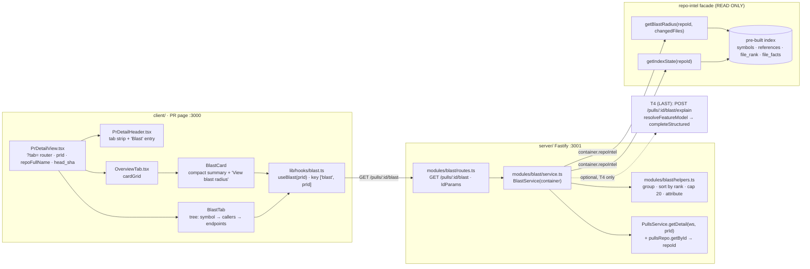
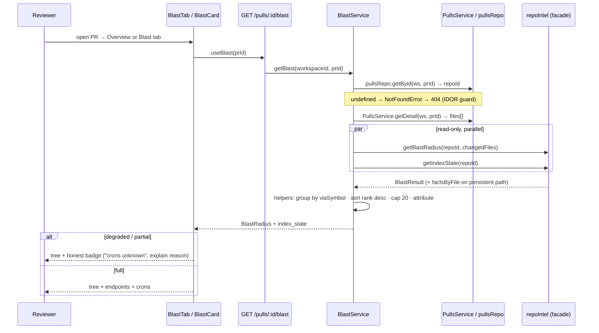
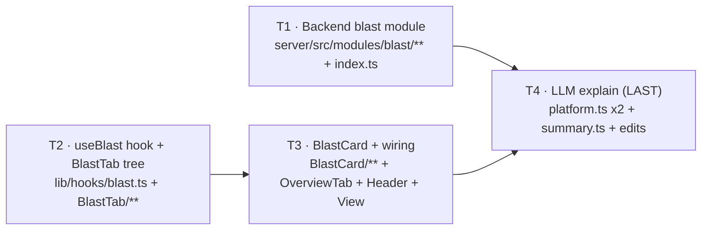

# Development Plan — Blast Radius (L04)

## Context & goal
Answer the reviewer's first question — **"what can these changes break?"** — on the PR page,
served **entirely from the pre-built repo-intel index**. Near-zero AI, **zero analysis at
review time**: we only READ through the `repoIntel.*` facade and never write/build the index.

Delivers **both** surfaces:
- a compact **`BlastCard`** on the Overview tab (sibling of the existing `IntentCard`) that
  summarises impact and links to the full view;
- a full **`Blast` tab** on the PR page rendering a **tree** (changed symbols → callers →
  affected endpoints/crons), where clicking a caller navigates to the code on GitHub.

**Out of scope for the whole feature:** Graph mode, "Prior PRs touching these files",
any index building/writing, any import-graph traversal (the facade already does it).

## Constraints from INSIGHTS & CLAUDE.md
- **The `BlastRadius` contract ALREADY EXISTS** and is byte-identical in both vendor copies
  (`server/src/vendor/shared/contracts/brief.ts:17-44`, client copy). It is a **read-only
  dependency** — do NOT add a contract task, do NOT edit `brief.ts`. This is exactly the Smart
  Diff situation and is what lets backend and frontend run fully parallel. — source: root `INSIGHTS.md:24`.
- **Dual-vendor sync is manual.** Both `server/src/vendor/shared/` and `client/src/vendor/shared/`
  must get identical contract changes in the same commit. Only **T4** does this (`platform.ts`), and
  `platform.ts` is a different file from `brief.ts`, so it collides with nothing. — source: root `INSIGHTS.md:23`.
- **`prId` props must be typed `string | null`, NEVER `string`.** `PrDetailView.tsx:37` computes
  `prId` as `pulls?.find(...)?.id ?? null` and never narrows it; `prId: string` fails `pnpm typecheck`
  at the call site. — source: client `INSIGHTS.md:28`.
- **`@testing-library/user-event` is NOT a dependency.** Use `fireEvent` from `@testing-library/react`
  for every click/interaction. — source: client `INSIGHTS.md:29`.
- **`IdParams` is hardcoded to the param key `id`** (`server/src/modules/_shared/schemas.ts:11`). Our
  route is `GET /pulls/:id/blast`, so `IdParams` works here — the warning does not bite. — source: server `INSIGHTS.md:30`.
- **IDOR rule:** any read reachable from a route must be workspace-scoped. `pullsRepo.getById(workspaceId, prId)`
  (`server/src/modules/pulls/repository.ts:21-27`) and `PullsService.getDetail(workspaceId, prId)` both filter on
  `workspace_id` and throw `NotFoundError`. — source: server `INSIGHTS.md:31`.
- **Cross-workspace IT test needs no second AuthProvider** — insert a second `t.workspaces` row + repo + PR and
  request that PR's id; `LocalNoAuthProvider` resolves the same default workspace → 404. — source: server `INSIGHTS.md:33`.
- **Services receive `Container`; never instantiate adapters directly.** `container.repoIntel` is overridable
  via `ContainerOverrides.repoIntel` (`server/src/platform/container.ts:126-130`) → integration tests inject a
  mock facade. — source: `server/CLAUDE.md` "Non-default conventions"; skill `onion-architecture`.
- **Routes declare Zod `params`/`body` only — no response schema.** Every module in this repo follows this
  (`server/src/modules/intent/routes.ts:18-26`, `smart-diff/routes.ts:20-27`), which is what lets the route return
  `BlastRadius` **plus** an extra `index_state` field without touching shared contracts.
- **Honest degradation is a requirement.** `degraded: true` / `status: 'partial'` → render a badge with an
  explanation, never an empty screen. **Crons exist ONLY on the persistent (`degraded:false`) path** — never
  fabricate `crons_affected: []` as "0 crons" on the degraded path; the UI must say "unknown", not "none".
- **No new table, no migration, no schema edit.** Blast reads the existing index only. — source: `server/CLAUDE.md` Do-not-touch zones.
- **Test split:** `*.it.test.ts` = DB-backed (testcontainers/Docker); everything else hermetic. — source: root `TESTING.md`.
- **No dynamically-built `RegExp`** for path/symbol matching — plain string ops (`split('/')`, `startsWith`, `===`). — source: root `INSIGHTS.md:29`, server `INSIGHTS.md:32`.

## Verified ground truth (cite these in steps — do NOT re-derive)

### The facade already does the analysis
`container.repoIntel.getBlastRadius(repoId, changedFiles)` (`server/src/modules/repo-intel/types.ts:147`)
returns `BlastResult` (`types.ts:74-87`):

| Field | Shape | Note |
|---|---|---|
| `changedSymbols` | `{ file, name, kind }[]` | symbols declared in changed files (`service.ts:250-258`) |
| `callers` | `{ file, symbol, viaSymbol, line, rank }[]` | `rank` = file_rank; **0 on the degraded path** (`service.ts:283`) |
| `impactedEndpoints` | `string[]` | `"METHOD /path"`, flat union (`types.ts:77`) |
| `factsByFile?` | `Record<string, { endpoints: string[]; crons: string[] }>` | **persistent path ONLY** (`types.ts:79-84`) |
| `degraded?` | `boolean` | |
| `reason?` | `'flag_off'\|'index_failed'\|'index_partial'\|'repo_too_large'\|'no_data'` | `types.ts:27-32` |

It ALREADY: finds symbols declared in changed files, finds callers, **excludes the declaration's own
file** (`if (r.fromPath === sym.file) continue`, `repo-intel/service.ts:273`), and resolves reachable HTTP
endpoints (`service.ts:288-294`). **Do NOT plan an import-graph traversal — it is inside the facade.**

What the facade does **not** do, and what `blast/helpers.ts` MUST do:
- group `callers` by `viaSymbol` into `DownstreamImpact[]`;
- sort each group's callers by `rank` **descending**;
- cap at **20 callers per symbol**;
- attribute endpoints/crons per symbol via `factsByFile`, falling back to the flat `impactedEndpoints`
  union when `factsByFile` is absent.

### Index state
`repoIntel.getIndexState(repoId)` (`repo-intel/service.ts:189-205`) **never throws** — it synthesises a
degraded row when nothing is persisted. Returns `IndexState` (`types.ts:42-50`):
`{ status: 'full'|'partial'|'degraded'|'failed', filesIndexed, filesSkipped, degraded?, degradedReason?, ... }`.

### The contract (read-only — do not edit)
`server/src/vendor/shared/contracts/brief.ts:17-44` (client copy identical), **snake_case**:
`ChangedSymbol = { name, file, kind }` · `BlastCaller = { name, file, line }` ·
`DownstreamImpact = { symbol, callers, endpoints_affected, crons_affected }` ·
`BlastRadius = { changed_symbols, downstream, summary }`. `summary` is the slot for the T4 LLM paragraph.

### ⚠ Correction to the brief: `PrDetail` has NO `repo_id`
`PrDetail = PrMeta.extend({ body, files, commits, linked_issue })`
(`server/src/vendor/shared/contracts/platform.ts:217-222`) and `PrMeta`
(`platform.ts:157-191`) has **no `repo_id` / `repoId` field**. So the service **cannot** read `repoId` off
`PullsService.getDetail(...)`. Get it from the workspace-scoped row instead:
`container.pullsRepo.getById(workspaceId, prId)` → `pull.repoId` (`server/src/modules/pulls/repository.ts:21-27`).

### i18n messages already exist
`client/messages/en/blast.json` already ships `stat.{symbols,callers,endpoints,crons}`, `view.{tree,graph}`,
`callerCount`, `noDownstream`, `graph.*`. Auto-loaded — no registration. **Use the tree/stat/callerCount/
noDownstream keys; ignore `view.graph` and `graph.*` (Graph mode is out of scope).** Note the existing
`IntentCard` does NOT use next-intl (hardcoded English, `IntentCard.tsx:22`) — either style typechecks;
prefer the `blast.json` keys since they exist.

### Client wiring facts
- Tabs are a `?tab=` search param, not a route segment. Two edit sites: the tab strip array literal
  (`PrDetailHeader/PrDetailHeader.tsx:111-120`) and the conditional render branch (`PrDetailView/PrDetailView.tsx:189-243`).
- `PrDetailView.tsx` already holds `repoFullName` (`:148`) and `pr.head_sha` (`:215`) and already passes both to `FindingsTab`.
- `githubBlobUrl(repoFullName, sha, file, startLine?, endLine?)` (`client/src/lib/github-urls.ts:24-37`) builds a
  `https://github.com/{owner}/{repo}/blob/{sha}/{file}#L{line}` deep-link — this is "click navigates to code".
- `client/src/lib/hooks/index.ts` barrel does **NOT** export `intent.ts` or `smart-diff.ts` — feature hooks are
  imported directly (`@/lib/hooks/blast`). **No barrel edit needed → zero collision.**
- Collapsible-row precedent (there is no Tree primitive): `client/src/components/diff-viewer/FileCard/FileCard.tsx`.
- Reusable primitives from `@devdigest/ui`: `Badge`, `Card`, `SectionLabel`, `EmptyState`, `Skeleton`, `ErrorState`, `Chip`.
- Styling: per-component `styles.ts` exporting `export const s = {...}`, used as `style={s.key}`. NOT Tailwind, NOT CSS modules.

## Architecture sketch



### Request flow (no analysis at review time)


## Shared contracts (define FIRST, before parallel work)

**No contract task exists and none is needed.** `BlastRadius` / `DownstreamImpact` / `BlastCaller` /
`ChangedSymbol` already ship byte-identically in both vendor copies (`brief.ts:17-44`) and are a
**read-only dependency** for T1 (server) and T2/T3 (client). Nobody edits `brief.ts`.

The **one** shape that must be agreed up front. It crosses the T1 to T2 boundary but lives in **no**
shared file — each side declares its own copy, mirroring the `RepoIntelState` precedent at
`client/src/lib/hooks/repo-intel.ts:14-24` ("kept local — not in @devdigest/shared, since repo-intel
types live server-side"):

```ts
// The HTTP response of GET /pulls/:id/blast — BlastRadius PLUS one extra field.
// Server: declared and exported in server/src/modules/blast/service.ts (T1).
// Client: declared and exported in client/src/lib/hooks/blast.ts (T2).
interface BlastIndexState {
  status: "full" | "partial" | "degraded" | "failed";
  filesIndexed: number;
  filesSkipped: number;
  degraded?: boolean;
  degradedReason?: string;
}
type BlastResponse = BlastRadius & { index_state: BlastIndexState };
```

- Outer key is snake_case (`index_state`) to match the contract; inner keys stay camelCase to match
  `IndexState` (`repo-intel/types.ts:42-50`) and the `RepoIntelState` client precedent. **Do not rename.**
- `summary` is `""` until T4 lands. T1 must set `summary: ''` and never invent text.

Agreed constant (owned by T1): `MAX_CALLERS_PER_SYMBOL = 20` in `server/src/modules/blast/constants.ts`.

## Tasks

### T1 — Backend: `blast` module (route + service + helpers), read-only over the facade
- **Area:** Backend
- **Owns (files):**
  `server/src/modules/blast/routes.ts`,
  `server/src/modules/blast/service.ts`,
  `server/src/modules/blast/helpers.ts`,
  `server/src/modules/blast/constants.ts`,
  `server/src/modules/blast/helpers.test.ts`,
  `server/src/modules/index.ts`,
  `server/test/blast.it.test.ts`
- **Depends on:** none
- **Skills to invoke:** `fastify-best-practices`, `drizzle-orm-patterns`, `postgresql-table-design`, `onion-architecture` + `security`, `zod`, `typescript-expert`
- **Steps:**
  1. Create `server/src/modules/blast/constants.ts` exporting `export const MAX_CALLERS_PER_SYMBOL = 20;`.
  2. Create `server/src/modules/blast/helpers.ts` — **pure functions only, no I/O, no container**. Export `toIndexStateDto(s: IndexState): BlastIndexState` picking `status`, `filesIndexed`, `filesSkipped`, `degraded`, `degradedReason`. Export `toBlastRadius(res: BlastResult): BlastRadius` per the algorithm below.
  3. `toBlastRadius` — `changed_symbols` = `res.changedSymbols.map((s) => ({ name: s.name, file: s.file, kind: s.kind }))`.
  4. `toBlastRadius` — build `downstream`: group `res.callers` by `viaSymbol` into a `Map<string, BlastCallerRow[]>`, preserving first-seen order. No regex anywhere (root `INSIGHTS.md:29`). For each group, in this exact order:
     - a. `callerFiles = new Set(group.map((c) => c.file))` computed from the **FULL** group, **before** capping.
     - b. `endpoints_affected`: if `res.factsByFile` is present, sorted dedup union of `res.factsByFile[f]?.endpoints ?? []` over `callerFiles`; else `[...res.impactedEndpoints]` (flat-union fallback).
     - c. `crons_affected`: if `res.factsByFile` is present, sorted dedup union of `res.factsByFile[f]?.crons ?? []` over `callerFiles`; else `[]`. **The degraded path carries no cron data — the UI renders "unknown" off `index_state`, so `[]` here must never be presented as "0 crons".**
     - d. Sort the group by `rank` **descending**, stable tie-break `file` asc then `line` asc, so output is deterministic.
     - e. `callers` = first `MAX_CALLERS_PER_SYMBOL` entries mapped to `{ name: c.symbol, file: c.file, line: c.line }`.
  5. `toBlastRadius` — sort `downstream` by `callers.length` desc, then `symbol` asc. Set `summary: ''`. A changed symbol with zero callers appears **only** in `changed_symbols`, never in `downstream` (this is what `blast.json`'s `noDownstream` message renders).
  6. Create `server/src/modules/blast/service.ts` — `export class BlastService { constructor(private container: Container) {} }`. Declare and export `BlastIndexState` + `BlastResponse` here, exactly as in "Shared contracts". **No `repository.ts`** for this module — it reads only through the facade and `container.pullsRepo`. Never `new` an adapter; never read `process.env`.
  7. `BlastService.getBlast(workspaceId: string, prId: string): Promise<BlastResponse>`:
     - a. `const pull = await this.container.pullsRepo.getById(workspaceId, prId); if (!pull) throw new NotFoundError('Pull request not found');` — the workspace-scoped IDOR guard AND the **only** source of `repoId` (`PrDetail` has no `repo_id` — see the Correction above). Import `NotFoundError` from `../../platform/errors.js`.
     - b. `const detail = await new PullsService(this.container).getDetail(workspaceId, prId);` then `const changedFiles = detail.files.map((f) => f.path);` — mirrors `server/src/modules/smart-diff/service.ts:23-27`.
     - c. `const [res, state] = await Promise.all([this.container.repoIntel.getBlastRadius(pull.repoId, changedFiles), this.container.repoIntel.getIndexState(pull.repoId)]);`
     - d. `return { ...toBlastRadius(res), index_state: toIndexStateDto(state) };`
  8. Create `server/src/modules/blast/routes.ts` copying the shape of `server/src/modules/smart-diff/routes.ts:15-28`: `const app = appBase.withTypeProvider<ZodTypeProvider>(); const { container } = app; const service = new BlastService(container);` then `app.get('/pulls/:id/blast', { schema: { params: IdParams } }, async (req): Promise<BlastResponse> => { const { workspaceId } = await getContext(container, req); return service.getBlast(workspaceId, req.params.id); });`. Use `IdParams` from `../_shared/schemas.js` — the param key is literally `id`. Declare **`params` only**, no response schema. **Never catch-and-reply** — let `NotFoundError` reach the central error handler (`server/src/app.ts:116-164`).
  9. Register the module: add `import blast from './blast/routes.js';` and one `blast,` entry to the `modules` record in `server/src/modules/index.ts:28-41`. The file's own comment at `:25` already names `blast` as planned. `server/src/app.ts:166` loops the registry — **no other mount site exists**.
- **Verify:** `cd server && pnpm exec vitest run --exclude '**/*.it.test.ts' && pnpm typecheck`, then `pnpm exec vitest run .it.test` (Docker required).
- **Out of scope:** any `client/**` file. Any LLM call or `summary` text (T4 — set `summary: ''`). Any DB schema file or migration. Any `repository.ts` for this module. Editing `brief.ts`, `platform.ts`, or any other module. The `repo-intel` module itself (read it, never change it). Graph mode, prior-PR history.

#### T1 test steps (same task, same owner)
  10. Write `server/src/modules/blast/helpers.test.ts` — hermetic (no Docker, no container), pure fixtures of `BlastResult`:
      - (i) grouping by `viaSymbol` yields one `DownstreamImpact` per symbol-with-callers;
      - (ii) callers sorted by `rank` descending;
      - (iii) 25 callers for one symbol produce exactly 20 in the output, and the kept 20 are the highest-ranked;
      - (iv) with `factsByFile`, `endpoints_affected`/`crons_affected` are attributed per symbol from that symbol's caller files (not the global union), and attribution uses the FULL group even when the cap drops callers;
      - (v) without `factsByFile` (degraded), `endpoints_affected` falls back to `impactedEndpoints` and `crons_affected` is `[]`;
      - (vi) a changed symbol with zero callers is in `changed_symbols` but not in `downstream`;
      - (vii) `summary` is `''`.
  11. Write `server/test/blast.it.test.ts` mirroring `server/test/smart-diff.it.test.ts:12-55` exactly: `dockerAvailable()` gate, `startPg()`, `seed(db)`, `buildApp({ config, db, overrides })`, `app.inject(...)`. Inject a **mock facade** through `overrides.repoIntel` (`ContainerOverrides.repoIntel`, `server/src/platform/container.ts:126-130`) — no real index needed. Cases:
      - (i) happy path — persistent-shape `BlastResult` **with** `factsByFile` gives 200, grouped `downstream`, endpoints + crons attributed, `index_state.status === 'full'`;
      - (ii) degraded — `{ degraded: true, reason: 'no_data' }` and no `factsByFile` gives **200, not an error**, `crons_affected: []`, `index_state.degraded === true`;
      - (iii) cross-workspace PR gives 404 `not_found` — insert a second `t.workspaces` row + repo + PR and request that PR's id (server `INSIGHTS.md:33`: no second AuthProvider needed);
      - (iv) non-uuid `:id` gives 422.

### T2 — Frontend: `useBlast` hook + `BlastTab` tree
- **Area:** Frontend
- **Owns (files):**
  `client/src/lib/hooks/blast.ts`,
  `client/src/app/repos/[repoId]/pulls/[number]/_components/BlastTab/BlastTab.tsx`,
  `client/src/app/repos/[repoId]/pulls/[number]/_components/BlastTab/SymbolRow.tsx`,
  `client/src/app/repos/[repoId]/pulls/[number]/_components/BlastTab/helpers.ts`,
  `client/src/app/repos/[repoId]/pulls/[number]/_components/BlastTab/styles.ts`,
  `client/src/app/repos/[repoId]/pulls/[number]/_components/BlastTab/index.ts`,
  `client/src/app/repos/[repoId]/pulls/[number]/_components/BlastTab/BlastTab.test.tsx`
- **Depends on:** none (codes against the existing `BlastRadius` contract + the agreed `BlastResponse` shape; runs in parallel with T1)
- **Skills to invoke:** `next-best-practices`, `react-best-practices`, `react-testing-library`, `client-project-structure` + `security`, `zod`, `typescript-expert`
- **Steps:**
  1. Create `client/src/lib/hooks/blast.ts`, mirroring `client/src/lib/hooks/intent.ts:9-15` and `smart-diff.ts:12-18`. Start the file with `"use client";`. Declare and export `BlastIndexState` + `BlastResponse` **locally** (exact shape from "Shared contracts"; import `BlastRadius` as a type from `@devdigest/shared`), with a comment citing the `RepoIntelState` precedent (`hooks/repo-intel.ts:12-13`). Export `useBlast(prId: string | null | undefined)` = `useQuery({ queryKey: ["blast", prId], queryFn: () => api.get<BlastResponse>(`/pulls/${prId}/blast`), enabled: prId != null })`. **Do NOT add it to `client/src/lib/hooks/index.ts`** — feature hooks (`intent.ts`, `smart-diff.ts`) are not in that barrel and are imported directly.
  2. Create `BlastTab/BlastTab.tsx` (`"use client"`). Props — **exactly**: `{ prId: string | null; repoFullName: string | null; headSha: string }`. `prId` MUST be `string | null`, never `string` (client `INSIGHTS.md:28`). Call `useBlast(prId)`; the component must NOT call `fetch`/`api` directly.
  3. `BlastTab` render states, using `@devdigest/ui` primitives and early returns (no nested ternaries):
     - `isLoading` → `Skeleton` rows;
     - `isError` → `ErrorState` with a retry that calls `refetch()`;
     - loaded but `changed_symbols.length === 0` → `EmptyState` explaining the index has nothing for these files (link the reason from `index_state`);
     - loaded → stat strip + degradation badge + tree.
  4. `BlastTab` stat strip — counts via `blast.json` keys `stat.symbols`, `stat.callers`, `stat.endpoints`, `stat.crons` (next-intl, namespace `blast`; messages auto-load, no registration). **Ignore `view.*` and `graph.*` keys — Graph mode is out of scope.**
  5. `BlastTab` honest-degradation badge — when `index_state.degraded === true` or `index_state.status !== 'full'`, render a `Badge` plus one explanatory sentence derived from `index_state.degradedReason`/`status` (map each of `flag_off`, `index_failed`, `index_partial`, `repo_too_large`, `no_data` to a human sentence in `helpers.ts`). On this path label crons **"unknown"**, never "0" — `crons_affected` is empty because the degraded facade path carries no cron data, not because there are no crons. Never render an empty screen.
  6. `BlastTab` tree, level 1 — one `SymbolRow` per entry of `downstream`, ordered as the server sent it (do not re-sort). Show `symbol`, the caller count via the `callerCount` message (`"{count} callers"`), and endpoint/cron chip counts. Collapsible via local `useState` — follow the collapsible-row precedent `client/src/components/diff-viewer/FileCard/FileCard.tsx` (there is no Tree primitive in `@devdigest/ui`). Give the toggle an `aria-expanded` and an `aria-label`.
  7. `BlastTab` tree, level 2 (inside an expanded `SymbolRow`) — one row per `caller`: `name`, `file`, `line`. Each row is a link that opens `githubBlobUrl(repoFullName, headSha, caller.file, caller.line)` (`client/src/lib/github-urls.ts:24-37`) in a new tab (`target="_blank"`, `rel="noreferrer"`). **Callers live outside the PR diff** (the facade excludes the declaration's own file, `repo-intel/service.ts:273`), so the local diff viewer cannot show them — the GitHub blob deep-link is the honest target. When `repoFullName == null`, render the row as plain text, not a dead link.
  8. `BlastTab` tree, level 3 — inside the expanded symbol, render `endpoints_affected` as `Chip`s (`"METHOD /path"`) and `crons_affected` as `Chip`s. When a list is empty on the **full** path, render nothing; on the **degraded** path, render the "unknown" affordance from step 5.
  9. Render `changed_symbols` that have no downstream entry using the `noDownstream` message (`"{count} changed symbol(s), no downstream callers found."`).
  10. Create `BlastTab/helpers.ts` — **pure, no React import**: `degradationSentence(state: BlastIndexState): string | null`, `symbolsWithoutDownstream(data: BlastResponse): ChangedSymbol[]`, and any count derivations. Business logic lives here, not in the component body.
  11. Create `BlastTab/styles.ts` exporting `export const s: Record<string, CSSProperties> = {...}`, used as `style={s.key}`. Inline style objects over CSS variables — NOT Tailwind utilities, NOT CSS modules. Any dynamic style must be a **standalone exported function** with an explicit `: CSSProperties` return, never a member of the `Record<string, CSSProperties>` map (client `INSIGHTS.md:22`).
  12. Create `BlastTab/index.ts` re-exporting `BlastTab` (barrel = the folder's public surface).
  13. Write `BlastTab.test.tsx` — vitest + RTL, hermetic (`fetch` is mocked in `client/src/test/setup.ts`). Use **`fireEvent` from `@testing-library/react`** for all interaction — `@testing-library/user-event` is NOT a dependency and fails import resolution (client `INSIGHTS.md:29`). Wrap in `NextIntlClientProvider` with the `blast` namespace and a `QueryClientProvider`; mock `useBlast` (or the `api` module) rather than the component under test. Cover, as few long flow tests: (i) loaded tree renders symbols, expanding one via `fireEvent.click` reveals its callers and a correct `githubBlobUrl` href; (ii) degraded response renders the badge + explanation and labels crons "unknown", and does NOT render an empty screen; (iii) zero changed symbols renders the empty state.
- **Verify:** `cd client && pnpm test && pnpm typecheck`
- **Out of scope:** `PrDetailHeader.tsx`, `PrDetailView.tsx`, `OverviewTab.tsx`, `OverviewTab/styles.ts`, and the whole `BlastCard/` folder — **all owned by T3**. Do not register the tab or render the component anywhere; T3 wires it. Do not touch `client/src/lib/hooks/index.ts`, `client/src/vendor/**`, or `client/messages/en/blast.json` (the keys you need already exist). No Graph mode, no prior-PR history. No `summary` rendering (T4).

### T3 — Frontend: `BlastCard` on Overview + tab/route wiring (sole owner of the shared files)
- **Area:** Frontend
- **Owns (files):**
  `client/src/app/repos/[repoId]/pulls/[number]/_components/OverviewTab/_components/BlastCard/BlastCard.tsx`,
  `client/src/app/repos/[repoId]/pulls/[number]/_components/OverviewTab/_components/BlastCard/styles.ts`,
  `client/src/app/repos/[repoId]/pulls/[number]/_components/OverviewTab/_components/BlastCard/index.ts`,
  `client/src/app/repos/[repoId]/pulls/[number]/_components/OverviewTab/_components/BlastCard/BlastCard.test.tsx`,
  `client/src/app/repos/[repoId]/pulls/[number]/_components/OverviewTab/OverviewTab.tsx`,
  `client/src/app/repos/[repoId]/pulls/[number]/_components/OverviewTab/styles.ts`,
  `client/src/app/repos/[repoId]/pulls/[number]/_components/PrDetailHeader/PrDetailHeader.tsx`,
  `client/src/app/repos/[repoId]/pulls/[number]/_components/PrDetailView/PrDetailView.tsx`
- **Depends on:** T2 (imports `useBlast` + the `BlastResponse` type from `client/src/lib/hooks/blast.ts`, and renders `BlastTab`)
- **Skills to invoke:** `next-best-practices`, `react-best-practices`, `react-testing-library`, `client-project-structure` + `security`, `zod`, `typescript-expert`
- **Steps:**
  1. Create `BlastCard/BlastCard.tsx` (`"use client"`), a sibling of `IntentCard` and structurally mirroring `OverviewTab/_components/IntentCard/IntentCard.tsx:15-27` (Skeleton while loading, `EmptyState` when there is nothing, `SectionLabel` header). Props — **exactly**: `{ prId: string | null; onOpenBlast: () => void }`. `prId` MUST be `string | null` (client `INSIGHTS.md:28`).
  2. `BlastCard` content — call `useBlast(prId)` (never `fetch`/`api` directly). Render a **compact summary only**: counts of changed symbols / callers / affected endpoints (reuse `blast.json` `stat.*` keys), the top 1-3 impacted endpoints as `Chip`s, and the degradation `Badge` when `index_state.degraded === true` or `index_state.status !== 'full'`. **No tree here** — the tree is T2's `BlastTab`.
  3. `BlastCard` link-out — a `Button` (kind `ghost`, `size="sm"`) labelled e.g. "View blast radius" that calls `onOpenBlast()`. The card must NOT call `useRouter` itself; tab switching stays in `PrDetailView` (the `setTab` prop pattern already used for `onRunStart` at `PrDetailView.tsx:198`).
  4. `BlastCard` empty/degraded states — when `changed_symbols.length === 0` render an `EmptyState` (no CTA that builds an index — **we never build the index**). Never render a bare empty card. Label crons "unknown" on the degraded path, never "0".
  5. Create `BlastCard/styles.ts` (`export const s: Record<string, CSSProperties>`, dynamic styles as standalone `: CSSProperties` functions — client `INSIGHTS.md:22`) and `BlastCard/index.ts` (barrel).
  6. Edit `OverviewTab/OverviewTab.tsx` — add `onOpenBlast: () => void` to `OverviewTabProps` (keep `prBody`, `prId: string | null`), import `BlastCard` from `./_components/BlastCard`, and render `<BlastCard prId={prId} onOpenBlast={onOpenBlast} />` **next to** `<IntentCard prId={prId} />` inside the existing `<div style={s.cardGrid}>` (`OverviewTab.tsx:16-18`). Do not remove or restyle `IntentCard`.
  7. Edit `OverviewTab/styles.ts` **only if** `cardGrid` needs a two-column adjustment for the second card. Prefer changing nothing.
  8. Edit `PrDetailHeader/PrDetailHeader.tsx` — add exactly one entry to the `Tabs` array literal at `:115-119`, after the `diff` entry: `{ key: "blast", label: "Blast", icon: "Zap" }`. Verify the icon key exists in the vendored registry `client/src/vendor/ui/icons.tsx` before using it — an unknown `IconName` fails `pnpm typecheck` (client `INSIGHTS.md:21`); pick another existing key if `Zap` is absent. Change nothing else in this file.
  9. Edit `PrDetailView/PrDetailView.tsx` — import `BlastTab` from `../BlastTab` and add one render branch after the `diff` branch (`:234-242`): `{tab === "blast" && <BlastTab prId={prId} repoFullName={repoFullName} headSha={pr.head_sha} />}`. `repoFullName` (`:148`) and `pr.head_sha` (`:215`) already exist in this component — do not re-derive them.
  10. Edit `PrDetailView/PrDetailView.tsx` — pass the card's link-out through: `<OverviewTab prBody={pr.body} prId={prId} onOpenBlast={() => setTab("blast")} />` (`:203`). `setTab` already exists at `:69`. Change nothing else in this file.
  11. Write `BlastCard.test.tsx` — vitest + RTL, hermetic, **`fireEvent`** only (client `INSIGHTS.md:29`), wrapped in `NextIntlClientProvider` (`blast` namespace) + `QueryClientProvider`, with `useBlast` mocked. Cover as one or two flow tests: (i) loaded card shows the counts and `fireEvent.click` on "View blast radius" calls the `onOpenBlast` spy exactly once; (ii) degraded response shows the badge and does not show a bare empty card.
- **Verify:** `cd client && pnpm test && pnpm typecheck`
- **Out of scope:** `client/src/lib/hooks/blast.ts` and the entire `BlastTab/` folder — **owned by T2; import them, never edit them.** Any `server/**` file. `client/src/vendor/**`. `client/messages/en/blast.json`. Any other tab, any other card, `RunTraceDrawer`, `FindingsTab`, `DiffTab`. No Graph mode toggle, no prior-PR history. No `summary` rendering (T4).

> **Shared-file ruling (explicit).** `PrDetailHeader.tsx`, `PrDetailView.tsx`, and `OverviewTab.tsx` are the
> only files both the tab work and the card work could want. They are assigned to **T3 and T3 only**. T2 owns
> the tab component and the hook but performs **zero** wiring; T3 does all wiring for both surfaces in one
> pass. This is why T3 is sequenced after T2 rather than run beside it.

### T4 — LAST, separate: optional cheap-model "explain this map in one paragraph"
- **Area:** Full-stack
- **Owns (files):**
  `server/src/modules/blast/summary.ts` *(new)*,
  `server/src/modules/blast/summary.test.ts` *(new)*,
  `server/src/modules/blast/service.ts` *(edit — sequenced after T1)*,
  `server/src/modules/blast/routes.ts` *(edit — sequenced after T1)*,
  `server/src/modules/blast/constants.ts` *(edit — sequenced after T1)*,
  `server/src/vendor/shared/contracts/platform.ts` *(edit)*,
  `client/src/vendor/shared/contracts/platform.ts` *(edit)*,
  `client/src/lib/hooks/blast.ts` *(edit — sequenced after T2)*,
  `client/src/app/repos/[repoId]/pulls/[number]/_components/OverviewTab/_components/BlastCard/BlastCard.tsx` *(edit — sequenced after T3)*
- **Depends on:** T1, T2, T3 (runs alone in the last wave — nothing else touches these files concurrently)
- **Skills to invoke:** `fastify-best-practices`, `drizzle-orm-patterns`, `postgresql-table-design`, `onion-architecture`, `next-best-practices`, `react-best-practices`, `react-testing-library`, `client-project-structure` + `security`, `zod`, `typescript-expert`
- **Steps:**
  1. Extend the `FeatureModelId` enum in `server/src/vendor/shared/contracts/platform.ts:14-21` with `'blast_explain'`, and add a matching `FeatureModelDef` to the `FEATURE_MODELS` array at `:43-79` (`label: 'Blast Radius · Explain'`, a one-line `description`, `defaultProvider: 'openrouter'`, `defaultModel: 'deepseek/deepseek-v4-flash'` — mirror the cheap `review_intent` entry at `:52-57`).
  2. Apply the **byte-identical** change to `client/src/vendor/shared/contracts/platform.ts` **in the same commit**. This is the ONLY dual-vendor edit in the whole feature (root `INSIGHTS.md:23`). Verify with `diff server/src/vendor/shared/contracts/platform.ts client/src/vendor/shared/contracts/platform.ts` — it must print nothing. `platform.ts` is a different file from `brief.ts`, so this collides with nothing.
  3. Create `server/src/modules/blast/summary.ts` — **pure prompt builder, no I/O**: `buildBlastSummaryMessages(data: BlastRadius): ChatMessage[]`. Serialise only the already-computed map (symbols, capped callers, endpoints, crons) — **never** re-run analysis. Wrap every untrusted string (symbol names, file paths, endpoints) with `wrapUntrusted` from `@devdigest/reviewer-core`'s public `src/index.ts:17` — it is a pure string function, so importing it does not violate reviewer-core's no-DB/FS/network purity rule (server `INSIGHTS.md:29`). Add a `BlastSummary = z.object({ summary: z.string() })` Zod schema for the structured call.
  4. Add `BLAST_SUMMARY_MAX_RETRIES = 2` to `server/src/modules/blast/constants.ts`.
  5. Add `BlastService.explain(workspaceId, prId): Promise<{ summary: string }>` to `server/src/modules/blast/service.ts`. It calls the existing `this.getBlast(workspaceId, prId)` (reusing its IDOR guard), then `const { provider, model } = await resolveFeatureModel(this.container, workspaceId, 'blast_explain'); const llm = await this.container.llm(provider as Provider); const res = await llm.completeStructured({ model, schema: BlastSummary, schemaName: 'BlastSummary', messages: buildBlastSummaryMessages(data), maxRetries: BLAST_SUMMARY_MAX_RETRIES });` — exactly the pattern at `server/src/modules/intent/service.ts:24-27,119-134`. Return `{ summary: res.data.summary }`.
  6. **`GET /pulls/:id/blast` must stay LLM-free** — do not call the model on the read path. `getBlast` keeps returning `summary: ''`. Add a separate route to `server/src/modules/blast/routes.ts`: `app.post('/pulls/:id/blast/explain', { schema: { params: IdParams } }, async (req) => { const { workspaceId } = await getContext(container, req); return service.explain(workspaceId, req.params.id); });`. `params` only, no response schema, no catch-and-reply.
  7. Add `useExplainBlast(prId: string | null | undefined)` to `client/src/lib/hooks/blast.ts` — `useMutation({ mutationFn: () => api.post<{ summary: string }>(`/pulls/${prId}/blast/explain`), ... })`, mirroring `useDeriveIntent` (`client/src/lib/hooks/intent.ts:17-23`).
  8. Edit `BlastCard.tsx` — add an "Explain" `Button` (`kind="ghost"`, `size="sm"`, `loading={explain.isPending}`, with an `aria-label`) that calls `explain.mutate()`, and render the returned paragraph in the card's `summary` slot with `aria-live="polite"`. **Optional and user-triggered** — never fires automatically, never blocks the read path. Show an inline error state if the mutation rejects; the rest of the card must keep working (the map is not AI-derived).
  9. Write `server/src/modules/blast/summary.test.ts` — hermetic, no LLM: assert `buildBlastSummaryMessages` includes the symbols/endpoints, and that untrusted input containing delimiter characters is escaped by `wrapUntrusted`.
- **Verify:** `cd server && pnpm exec vitest run --exclude '**/*.it.test.ts' && pnpm typecheck` and `cd client && pnpm test && pnpm typecheck`, plus `diff server/src/vendor/shared/contracts/platform.ts client/src/vendor/shared/contracts/platform.ts` printing nothing.
- **Out of scope:** `brief.ts` (either copy). `BlastTab` (the tree stays AI-free). Making the summary automatic, cached, or persisted — no new table, no migration. Any change to `getBlast`'s read path behaviour. Adding the model call to `GET /pulls/:id/blast`.

### T5 — Independent: fix the flaky `waitForPrRuns` timeout that fails `reviews.it.test.ts`
- **Area:** Backend (test harness)
- **Owns (files):**
  `server/test/helpers/runs.ts` *(edit)*
- **Depends on:** nothing. **Unrelated to Blast Radius** — this is a pre-existing flake that surfaced while verifying T1. Can run in any wave, including alone.
- **Skills to invoke:** `typescript-expert`
- **Diagnosis (measured, not inferred):**
  `test/reviews.it.test.ts:230` fails intermittently with `TypeError: Cannot read properties of undefined (reading 'findings')`. **The review code is not broken.** Confirmed by stashing all Blast Radius work and re-running: the failure reproduces byte-identically on a clean tree (1 failed | 5 passed, both with and without this feature) — so it is **not** a Blast Radius regression.
  Root cause: `waitForPrRuns` (`server/test/helpers/runs.ts:29-31`) defaults to `timeoutMs = 10_000` and, on timeout, **returns silently** (`if (Date.now() - start > timeoutMs) return runs;`) instead of failing. A full mocked review run legitimately takes **~8.6 s** (measured: a probe with `timeoutMs: 120_000` completed at `WAITED >>> 8603 ms` with `status: 'done', error: null`) — only ~1.4 s of headroom. The sibling openai test at `:150` takes 8935 ms and the anthropic test at `:214` takes 10155 ms, i.e. it crosses the line. When it does, `waitForPrRuns` returns non-terminal runs, `GET /pulls/:id/reviews` correctly returns `[]` (no review persisted yet), and the assertion explodes 200 lines away on `reviews[0].findings` — so a **timeout masquerades as a product bug**. A T1 implementer already misread it as "flaky/timing issues in an unrelated module".
- **Steps:**
  1. In `server/test/helpers/runs.ts`, raise the default `timeoutMs` from `10_000` to `30_000`. Runs legitimately take ~8.6 s; 10 s is not enough headroom on a loaded machine or in CI.
  2. Make the timeout **fail loudly instead of silently**. Replace `if (Date.now() - start > timeoutMs) return runs;` with a `throw new Error(...)` whose message states what was awaited and what was actually observed — e.g. `` `waitForPrRuns timed out after ${timeoutMs}ms waiting for ${expected ?? 'all'} terminal run(s) on pr ${prId}; observed ${runs.length} run(s): ${runs.map((r) => `${r.id}=${r.status}${r.error ? ` (${r.error})` : ''}`).join(', ')}` ``. This is the substantive half of the fix: the raised timeout only makes the flake rarer, whereas throwing makes any future occurrence **self-diagnosing** at the real failure site rather than a misleading `TypeError` downstream.
  3. Update the helper's docstring (`runs.ts:6-12`) to state that a timeout throws.
  4. Do **not** touch `reviews.it.test.ts` — no call site passes an explicit `timeoutMs`, so both changes apply automatically. Do not weaken any assertion.
- **Verify:** `cd server && pnpm exec vitest run test/reviews.it.test.ts` → `Tests 6 passed (6)` (needs Docker). Also `cd server && pnpm exec vitest run test/blast.it.test.ts` → still `4 passed`, and `pnpm typecheck` clean.
- **Out of scope:** Making the review run itself faster (the ~8.6 s is real work: map-reduce + grounding + repo-intel). `reviews.it.test.ts` itself. The 6 pre-existing Windows `ENOENT` failures in `test/indexer-pipeline.test.ts` — a separate, already-documented flake (`server/INSIGHTS.md:11`).

### T6 — Implement the `get_blast_radius` MCP tool against the new route
- **Area:** MCP (`devdigest-mcp`)
- **Owns (files):**
  `devdigest-mcp/src/tools/get-blast-radius.ts` *(rewrite — currently a stub)*,
  `devdigest-mcp/src/schemas.ts` *(edit — output shape)*,
  `devdigest-mcp/test/blast.test.ts` *(new)*
- **Depends on:** T1 (the route must exist). Independent of T2/T3/T4/T5/T7.
- **Skills to invoke:** `typescript-expert`, `zod`
- **Why:** `devdigest-mcp/src/tools/get-blast-radius.ts:1-10` is a hard-coded stub returning `{status:'not_implemented'}`, and its own comment explains why: *"There is no backing HTTP route for blast-radius impact analysis yet."* **T1 created that route**, so the premise no longer holds. Verified live: calling the tool today still returns `{"status":"not_implemented"}` while `GET /pulls/:id/blast` returns a full map — the tool now under-reports the system's real capability to any model using it. This is direct debt from this feature.
- **Steps:**
  1. Resolve `repo` + `pr` → `prId` using the existing resolver (`devdigest-mcp/src/resolve.ts`) — mirror how `run-agent-on-pr.ts` / `get-findings.ts` turn `repo`(owner/name) + `pr`(number) into an id. Do not add a second resolution mechanism.
  2. Call `GET /pulls/:prId/blast` over HTTP. **Never import server `src/`** — the MCP package speaks HTTP+JSON only (root `INSIGHTS.md:16`).
  3. **Trim the payload** — the whole point of the MCP layer. Return `{ changed_symbols, downstream, index_state }` narrowed to the fields a model needs; drop `summary` when empty. Follow the per-package rule (root `INSIGHTS.md:16`): declare narrow LOCAL types/Zod schemas in `devdigest-mcp/src/schemas.ts`; **do not vendor `@devdigest/shared`** into this package.
  4. **Surface degradation, do not swallow it.** `index_state.degraded`/`status !== 'full'` must appear in the tool result — a model must never read an incomplete map as a complete one. Where `crons_affected` is absent because the index is degraded, say so rather than emitting `[]` as fact.
  5. In the catch block: `import type { CallToolResult } from '@modelcontextprotocol/sdk/types.js'` and `return toToolResult(err) as CallToolResult;` — **required**, per root `INSIGHTS.md:28`, which names this exact file as needing the cast (`ToolErrorResult` lacks the implicit index signature `CallToolResult` infers from its loose Zod object).
  6. Update the tool `description` — remove "NOT IMPLEMENTED YET"; state that it reads a pre-built index and may report a degraded map.
  7. Hermetic test asserting the exact trimmed shape (mirror `devdigest-mcp/test/trim.test.ts`) — the only guard against local shapes drifting from the real DTO (root `INSIGHTS.md:16`).
- **Verify:** `cd devdigest-mcp && npm test && npx tsc --noEmit`. Then live: call the `get_blast_radius` MCP tool for a PR whose HTTP route returns data and confirm it no longer answers `not_implemented`.
- **Out of scope:** `mcp__devdigest__get_blast_radius`'s sibling tools. Vendoring `@devdigest/shared` into `devdigest-mcp`. Any server-side change.

### T7 — Fix the depgraph adapter: blast finds ZERO callers on every repo
- **Area:** Backend (adapter + pipeline)
- **Owns (files):**
  `server/src/adapters/depgraph/index.ts` *(edit)*,
  `server/test/depgraph.test.ts` *(new)*,
  `server/src/modules/repo-intel/pipeline/{full,incremental}.ts` *(edit — status honesty only)*
- **Depends on:** nothing. **Pre-existing starter bug, not introduced by Blast Radius** — but Blast Radius is the first feature that consumes this data, so it is the first to expose it.
- **Skills to invoke:** `typescript-expert`, `onion-architecture`
- **Diagnosis (measured on `IlaKuzich/next_js_harness_testing`, not inferred):**
  Blast returned 14 `changed_symbols` but `downstream: []`. DB state: `references` = 2491 rows, **`references.decl_file IS NOT NULL` = 0**, **`file_edges` = 0**, `file_rank` = 133. `getResolvedCallers` (`repo-intel/repository.ts:503-531`) filters `inArray(references.declFile, declFiles)`, so with zero resolved decl_files it returns zero rows — **blast can never show a caller on the persistent path**. Three independent defects:
  **(a) [FIXED] `toRel` did not normalise the path separator** (`adapters/depgraph/index.ts:108`). `path.relative` returns platform-native separators, so on win32 it produced `src\api\x.ts` while `walk`/`symbols.path` store POSIX `src/api/x.ts`; every `fileSet.has(...)` in `buildEdges` missed → all modules skipped → zero edges. Proven: `relative()` → `"src\\api\\reviews\\service.ts"`, `fileSet.has(rel)` → `false`, after `.split(sep).join('/')` → `true`. Windows-only. Already applied, with `sep` added to the `node:path` import.
  **(b) [OPEN] cruise resolves tsconfig `paths` relative to `process.cwd()`.** The adapter runs with cwd = `server/`, so alias imports never resolve. Proven: with cwd = `server/`, `~/api/reviews/service` → `couldNotResolve: true`; after `process.chdir(cloneRoot)`, the same import → `resolved: 'src/api/reviews/service.ts', couldNotResolve: false`. Neither `baseDir` nor an inline tsconfig carrying an absolute `baseUrl` fixes it (both tested, both still `couldNotResolve: true`). This hits **every platform**, not just Windows, and every repo using path aliases (`~/*`, `@/*`) — i.e. most modern TS/Next.js repos. After fix (a) alone the sample repo yields only 44 edges from 133 files (relative imports only) and **zero** edges into `src/api/reviews/service.ts`, despite `route.ts` importing it. The adapter's own docstring says *"cruise resolves against cwd; we normalise every source/resolved path back to `relative(root, …)`"* — the authors handled cwd for the **output** paths but not for the **resolution**.
  **(c) [OPEN] a total graph failure is reported as a healthy `full` index.** `buildEdges` catches everything and returns `[]` (`adapters/depgraph/index.ts:99`), but the pipeline only sets `graphFailed` when the call **throws** (`pipeline/full.ts:216-218`, `incremental.ts:217-221`). Since no exception ever escapes, `status` stays `'full'` (`full.ts:252`) even when zero edges were written. Live proof: the sample repo reported `status: 'full'`, `stats.edgesWritten: 0`, with the `graphFailed` key absent. The adapter's comment promises *"caller stamps status='partial'"* — the caller **cannot**, because `[]` is indistinguishable from "genuinely no edges". This is the same dishonesty this feature exists to prevent, one layer deeper: blast's badge correctly showed `full` because the index lied to it.
- **Steps:**
  1. **(b)** Make the cruise resolve from the repo root. Do **not** use a bare `process.chdir` — it is process-global and the indexer runs as a background job that can interleave with live requests, so a concurrent request would observe the wrong cwd. Prefer running the cruise in a child process with `cwd: root` (the `depcruise` CLI emits `--output-type json`), or confine `chdir` behind a mutex/`AsyncLocalStorage`-free critical section that always restores in a `finally`. Whichever is chosen, keep `buildEdges`'s existing signature and its repo-relative POSIX output contract.
  2. **(c)** Distinguish "cruise failed" from "genuinely zero edges". Change `buildEdges` to signal failure (return `{ edges, failed?, reason? }`, or throw a typed error the pipeline catches) and have `full.ts`/`incremental.ts` stamp `status: 'partial'` + `reason: 'graph_failed'` when it fires. **A repo whose graph could not be built must never report `status: 'full'`** — the blast badge, and T6's MCP consumers, key off that flag.
  3. Add `server/test/depgraph.test.ts` — hermetic, over a small fixture tree with BOTH a relative import and a tsconfig-alias import. Assert real edges for both, and POSIX separators in the output on every platform. **This is the regression test that would have caught all three defects**; there is currently no test for this adapter at all.
  4. Re-verify end-to-end on `IlaKuzich/next_js_harness_testing`: `POST /repos/:id/resync`, wait for the index, then assert `file_edges > 0`, `references.decl_file IS NOT NULL > 0`, and that `GET /pulls/:id/blast` returns a non-empty `downstream` for PR #2 (`route.ts` must appear as a caller of `getReviewsForProduct`).
- **Verify:** `cd server && pnpm exec vitest run test/depgraph.test.ts && pnpm exec vitest run --exclude '**/*.it.test.ts' && pnpm typecheck`, plus the step-4 live check.
- **Out of scope:** `rank.ts` / PageRank tuning. The `symbols`/`references` extraction itself (ast-grep) — it works; 2491 references were recorded. Rewriting the indexer pipeline. `getResolvedCallers`'s query shape — it is correct; it was starved of data.

### T8 — `endpoints_affected` is always empty on Next.js App Router repos
- **Area:** Backend (adapter)
- **Owns (files):**
  `server/src/adapters/codeindex/extract.ts` *(edit)*,
  `server/test/extract.test.ts` *(edit — add cases)*
- **Depends on:** nothing. Pre-existing starter gap, independent of T1–T7.
- **Skills to invoke:** `typescript-expert`
- **Diagnosis (measured after T7 landed, on `IlaKuzich/next_js_harness_testing`):**
  With the graph repaired (233 edges, 561 resolved decl_files), `downstream` populates correctly — `getReviewsForProduct` ← `GET` at `route.ts:24`, etc. But **every** `endpoints_affected` is `[]`, and `file_facts` has **0 rows with a non-empty `endpoints` array across all 133 files**. Cause: `extractEndpoints` (`adapters/codeindex/extract.ts:182-196`) only matches Express/Fastify shapes — `app|router|fastify|server|api.get('/path')` and `{ method: 'GET', url: '/x' }`. Next.js App Router declares a route as `export async function GET(request)` in a file whose **path** is the route (`src/app/api/reviews/route.ts` → `/api/reviews`); the source contains no path string at all, so the regex can never match. The endpoints level of the tree — one of the three levels this feature exists to show — therefore never populates for any Next.js repo, which is the single most likely repo type for this tool's users.
- **Steps:**
  1. Teach the endpoint extractor Next.js App Router conventions. This needs the **file path**, which `extractEndpoints(content)` does not currently receive — so its signature must grow (e.g. `extractEndpoints(content, filePath?)`), keeping `filePath` optional so existing call sites and tests stay valid. Check every caller (`repo-intel/service.ts`, `pipeline/{full,incremental}.ts`) and thread the path through.
  2. Map `src/app/**/route.ts` → the route path: strip the `src/app` prefix and the `/route.ts` suffix, keep `[param]` segments as-is (or normalise to `:param` — pick one and state it), and drop route groups `(group)` from the path since they do not appear in the URL. Emit one entry per exported HTTP verb found (`export async function GET|POST|PUT|PATCH|DELETE|HEAD|OPTIONS`).
  3. Consider `src/app/**/page.tsx` → a navigable route as a **separate** decision — do NOT silently fold pages into `endpoints_affected`; they are not HTTP API endpoints and conflating them would misreport blast radius. If included at all, they need their own field.
  4. Keep the existing Express/Fastify patterns working — this is additive. Do NOT build the path with a dynamically-constructed `RegExp` (root `INSIGHTS.md:29`); plain `split('/')`/`startsWith`/`endsWith` string ops are sufficient, and `smart-diff/classifier.ts:33`'s `matchPath`/`matchSegment` is the in-repo precedent (server `INSIGHTS.md:32`).
  5. Extend `server/test/extract.test.ts` with App Router cases: `src/app/api/reviews/route.ts` exporting GET/POST/DELETE → `GET /api/reviews`, `POST /api/reviews`, `DELETE /api/reviews`; a `[id]` dynamic segment; a `(group)` route group; and a regression case proving the Express/Fastify patterns still match.
  6. Requires an `INDEXER_VERSION` bump (currently `3`) — `file_facts` content changes shape, and `resync` alone will not rebuild it for a repo already at the latest SHA (`pipeline/incremental.ts:120` short-circuits on zero changed files). See the v3 note in `repo-intel/constants.ts` for the same trap.
- **Verify:** `cd server && pnpm exec vitest run test/extract.test.ts && pnpm typecheck`. Then live: bump the version, `POST /repos/:id/resync`, and confirm `GET /pulls/:id/blast` for PR #2 returns `GET /api/reviews` under `getReviewsForProduct`'s `endpoints_affected`.
- **Out of scope:** cron detection (`extractCrons` — separate heuristic, separate gap). Express/Fastify pattern coverage. The `downstream`/caller logic (T7 fixed it; it works). Pages-as-routes unless step 3 is decided affirmatively.

## Execution order



- **Wave 1 — T1 ∥ T2, fully parallel.** Zero shared files: T1 is `server/**`, T2 is `client/**`. Both code
  against the already-vendored `BlastRadius` contract, which nobody edits. T2 does not need T1's route to
  exist — its tests mock the hook.
- **Wave 2 — T3 alone.** Depends on T2 for `useBlast` + `BlastResponse` + the `BlastTab` component. T3 is the
  **sole owner** of `PrDetailHeader.tsx`, `PrDetailView.tsx`, `OverviewTab.tsx` and `OverviewTab/styles.ts`.
- **Wave 3 — T4 alone (LAST, by requirement).** It is the only task that edits both `platform.ts` vendor
  copies and the only one that re-opens T1/T2/T3 files, so it must run when nothing else is in flight.
- One line each: `T1 → T4` · `T2 → T3 → T4` · `{T1 ∥ T2}` · `T3` · `T4`.

**Follow-up tasks added after wave 1 shipped (T5–T7).** All three came out of verifying T1/T2/T3 against a
real repo (`IlaKuzich/next_js_harness_testing`) rather than fixtures. None of them share a file with each
other or with T4, so **T5 ∥ T6 ∥ T7 can all run in parallel** — and T7 ∥ T4 is also safe (`adapters/depgraph`
+ `pipeline/**` vs `modules/blast/**` + `platform.ts`).

| Task | Owns | Blocks | Parallel with |
|---|---|---|---|
| **T5** — flaky `waitForPrRuns` timeout | `server/test/helpers/runs.ts` | nothing | T4, T6, T7 |
| **T6** — implement the `get_blast_radius` MCP tool | `devdigest-mcp/**` | needs T1's route (already shipped) | T4, T5, T7 |
| **T7** — depgraph adapter: zero callers on every repo | `server/src/adapters/depgraph/**`, `pipeline/{full,incremental}.ts` | nothing | T4, T5, T6 |

**T7 is the priority.** Until it lands, `downstream` is empty for every repo with path aliases, so the tab and
card render only the "changed symbols" level — the callers → endpoints levels that justify the whole feature
never populate. T1/T2/T3 are correct; they are being starved of data by the index beneath them.

### File-ownership matrix (no two tasks in the same wave share a file)
| File / folder | Owner | Wave |
|---|---|---|
| `server/src/modules/blast/{routes,service,helpers,constants}.ts` | T1 (T4 re-opens in wave 3) | 1 |
| `server/src/modules/blast/helpers.test.ts`, `server/test/blast.it.test.ts` | T1 | 1 |
| `server/src/modules/index.ts` | T1 | 1 |
| `client/src/lib/hooks/blast.ts` | T2 (T4 re-opens in wave 3) | 1 |
| `client/.../_components/BlastTab/**` | T2 | 1 |
| `client/.../OverviewTab/_components/BlastCard/**` | T3 (T4 re-opens `BlastCard.tsx` in wave 3) | 2 |
| `client/.../OverviewTab/OverviewTab.tsx`, `OverviewTab/styles.ts` | **T3 only** | 2 |
| `client/.../PrDetailHeader/PrDetailHeader.tsx` | **T3 only** | 2 |
| `client/.../PrDetailView/PrDetailView.tsx` | **T3 only** | 2 |
| `server/src/vendor/shared/contracts/platform.ts` + client copy | T4 only | 3 |
| `*/vendor/shared/contracts/brief.ts` | **nobody — read-only** | — |

## End-to-end verification (after all tasks merge)

1. **Static + hermetic, both packages:**
   - `cd server && pnpm exec vitest run --exclude '**/*.it.test.ts' && pnpm typecheck`
   - `cd client && pnpm test && pnpm typecheck`
   - Expected: green. (Known unrelated flake: `server/test/indexer-pipeline.test.ts` fails 6/11 on Windows with `ENOENT` in its own tmp-dir helper — an OS/tmp-path issue in the test setup, **not** a regression from this feature; server `INSIGHTS.md:11`.)
2. **DB-backed route (Docker required):** `cd server && pnpm exec vitest run .it.test`
   - Expected: `blast.it.test.ts` green — happy path grouped/capped/attributed, degraded path 200 with `crons_affected: []`, cross-workspace 404 `not_found`, non-uuid 422.
3. **Dual-vendor sync (T4 only):** `diff server/src/vendor/shared/contracts/platform.ts client/src/vendor/shared/contracts/platform.ts` prints **nothing**. Also confirm `diff server/src/vendor/shared/contracts/brief.ts client/src/vendor/shared/contracts/brief.ts` still prints nothing (proof nobody edited the contract).
4. **The single check that proves the whole feature:** run `./scripts/dev.sh` (Postgres + API :3001 + web :3000), open a PR page for the seeded `acme/payments-api` repo, then:
   - **Overview tab** shows `BlastCard` beside `IntentCard` with symbol/caller/endpoint counts; clicking "View blast radius" switches to `?tab=blast`.
   - **Blast tab** renders the tree; expanding a symbol lists its callers (≤ 20, highest-`rank` first) and its affected endpoints; clicking a caller opens `https://github.com/acme/payments-api/blob/<head_sha>/<file>#L<line>` in a new tab.
   - **Honest degradation:** with `REPO_INTEL_ENABLED=false` (or an unindexed repo) the tab still renders 200 with a degradation badge + explanation and crons labelled **"unknown"** — never an empty screen, never "0 crons".
   - **Zero AI on the read path:** with every provider key removed, `GET /pulls/:id/blast` still returns the full map and `summary: ""`. Only the explicit "Explain" button (T4) makes a model call.
   - **No index writes:** the blast surfaces perform no `indexRepo`/`refreshIndex` call — `repo_index_state.updated_at` is unchanged after loading both surfaces.

## Risks & unknowns (could not be resolved read-only)

1. **`Zap` icon key is unverified.** T3 step 8 proposes `{ key: "blast", label: "Blast", icon: "Zap" }`. The vendored registry (`client/src/vendor/ui/icons.tsx`) aliases some lucide names and drops others — passing an `IconName` that doesn't exist fails `pnpm typecheck` (client `INSIGHTS.md:21`, the `Pencil`/`Edit` case). T3 must grep the registry and pick an existing key. **Low risk, contained to one line.**
2. **`rank` is `0` on the entire degraded path** (`repo-intel/service.ts:283`). "Sort callers by rank descending" is therefore a **no-op** whenever the index is absent, and the 20-caller cap then keeps an arbitrary-but-deterministic 20 (tie-broken by `file`/`line`). Users on the degraded path may see a less useful top-20. Mitigation: the honest-degradation badge already tells them the index is incomplete. **Accepted, not fixable without building the index — which is out of scope.**
3. **Endpoint attribution on the degraded path is deliberately imprecise.** Without `factsByFile`, every symbol's `endpoints_affected` gets the same flat `impactedEndpoints` union (T1 step 4b), so the card/tab will over-attribute endpoints per symbol. This is the specified fallback, but it is a correctness/UX trade-off worth calling out in review. An alternative — showing endpoints only at the top level on the degraded path — was not chosen because it complicates the tree; **flag if the mockup disagrees.**
4. **`PullsService.getDetail` hits GitHub on the hot path.** It calls `container.github()` and falls back to persisted files only on throw (`pulls/service.ts:111-127`). So `GET /pulls/:id/blast` inherits a network call and its latency even though blast itself is index-only. This matches Smart Diff's existing behaviour (`smart-diff/service.ts:27`), so it is consistent — but "zero analysis at review time" does **not** mean "zero network". **Flag if the lesson requires a strictly offline read**; the fix would be reading `pullsRepo.getFiles(prId)` directly, at the cost of diverging from the Smart Diff precedent.
5. **`BlastCard` and `BlastTab` both call `useBlast(prId)`.** TanStack Query dedupes on the shared key `["blast", prId]`, so this is one request — but only if T2 and T3 use the **exact** same key. The key is pinned in "Shared contracts"; do not vary it.
7. **A STALE index is invisible to the honesty badge — observed live, not hypothetical.** `index_state` distinguishes `full`/`partial`/`degraded`, but **not "current" vs "behind"**. On `IlaKuzich/next_js_harness_testing` the clone sat at `b535592` while `origin/main` was `a0f6cb2` — one merge behind, and that merge was the one that *created* `src/api/reviews/**`. PR #2 changes those files, so the indexed snapshot had no symbols for them, and blast rendered "No blast radius data" with `status: 'full'`, `degraded: false`. Every layer was telling the truth about the SHA it indexed; the user reads it as "this PR breaks nothing". `POST /repos/:id/resync` fixed it (127 → 135 files, symbols appeared). **Proposed follow-up (not yet a task):** compare `IndexState.lastIndexedSha` against the PR's base SHA and, when they diverge AND the changed files yield no symbols, say "the index is behind this PR — resync" instead of "no symbols recorded". The distinction between *nothing is affected* and *we do not know yet* is the entire point of this feature.
6. **`blast.json` already ships `view.{tree,graph}` and `graph.*` keys** — pre-seeded for a Graph mode that this plan explicitly excludes. Leaving them unused is intentional; **do not delete them** (they are not ours to prune) and do not let their presence tempt a Graph implementation.

## Planning notes
- `PrDetail` carries **no `repo_id`** (`platform.ts:157-191`, `:217-222`), so a blast/brief-style service cannot read `repoId` off `PullsService.getDetail(...)` — it must come from `pullsRepo.getById(workspaceId, prId).repoId` (`pulls/repository.ts:21-27`), which is also the workspace-scoped IDOR guard. This corrects the original research brief and is a durable trap for any future feature that needs `repoId` + changed files together (blast, brief, context, onboarding). Candidate entry for `server/INSIGHTS.md` → *Codebase Patterns* — to be appended by the `engineering-insights` flow or an implementer allowed to write there, per the append-only convention.
- The "check whether the contract already exists" rule (root `INSIGHTS.md:24`) paid off a second time: `brief.ts` already had the full `BlastRadius` family **and** `client/messages/en/blast.json` already had the UI strings. Grepping `*/vendor/shared/contracts/` **and** `client/messages/en/` before planning removed two would-be tasks and is what keeps T1 ∥ T2 collision-free. Candidate refinement to the same root INSIGHTS entry (extend it to cover pre-seeded i18n message files, not just contracts).
