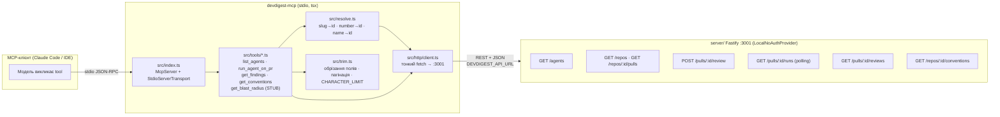
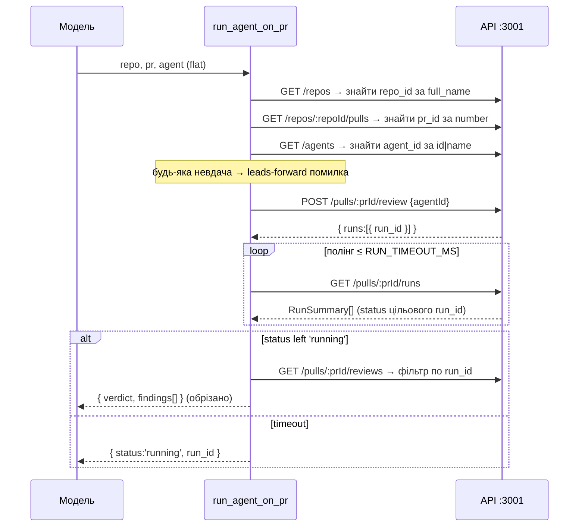

# Development Plan — `devdigest-mcp` (stdio MCP-сервер, L04)

## Context & goal
Додаємо новий локальний пакет-сусід **`devdigest-mcp/`** — stdio MCP-сервер, що
надає моделі **5 інструментів** поверх існуючого DevDigest Fastify API (`:3001`).
Це урок курсу **L04** (`README.md:85`). Пакет НЕ є частиною workspace, має власний
`package.json` + lockfile, запускається через `tsx` на TS-джерелі (без білду) і
спілкується з сервером виключно **тонким HTTP-клієнтом** — він НЕ імпортує сервісний
шар сервера (правило «не імпортувати чужий `src/`» + сервісам потрібен DI/DB/Fastify,
яких у stdio-процесі немає).

Інструменти (імена фіксовані слайдами користувача, snake_case):
`list_agents`, `run_agent_on_pr`, `get_findings`, `get_conventions`, `get_blast_radius` (STUB).

Чотири принципи дизайну інструментів (зі слайдів — обовʼязково закодувати в контракти):
1. **Result, not operation** — `run_agent_on_pr` всередині робить create-run → wait → fetch-findings і повертає готовий результат одним викликом.
2. **Flat arguments** — `repo`, `pr`, `agent` — окремі скалярні аргументи, ніколи не вкладений обʼєкт.
3. **Concise structured response** — повертаємо тільки потрібні поля (`id`, `severity`, `title`, `file`, `line`), ніколи не сирий дамп.
4. **Error leads forward** — помилки є дієвими підказками наступного кроку, а не сухими кодами.

## Constraints from INSIGHTS & CLAUDE.md
- **НЕ workspace.** Кожен пакет має власний `package.json` + lockfile; крос-пакетний код — через tsconfig-аліаси, не через workspace-інструмент. Не додавати pnpm workspace / turbo / nx. — джерело: root `CLAUDE.md` («Project-wide conventions», «Do-not-touch zones»).
- **Не імпортувати чужий `src/` напряму.** MCP-сервер спілкується з сервером лише по HTTP. — джерело: root `CLAUDE.md` («Do-not-touch zones»).
- **`@devdigest/shared` вендориться в кожного консюмера, і обидві копії мають мінятись синхронно вручну.** Тому свідомо **НЕ вендоримо** shared у `devdigest-mcp` (він говорить HTTP+JSON) — визначаємо кілька локальних Zod-схем. Це прибирає тягар dual-vendor sync. — джерело: root `INSIGHTS.md:21` (Codebase Patterns).
- **Перед «додаванням нового контракту» — grep наявні vendor-контракти:** тут навпаки, свідоме рішення НЕ тягнути контракти взагалі (менша поверхня залежностей). — джерело: root `INSIGHTS.md:22`.
- **Динамічно збудовані `RegExp` через вкладені шари Bash/heredoc мовчки зʼїдають `\`.** У тестах і хелперах уникати динамічних `new RegExp('...'+x)`; матчинг slug/номера робити простими рядковими операціями (`===`, `split('/')`, `startsWith`). — джерело: root `INSIGHTS.md:26`, `server/INSIGHTS.md:32`.
- **Тести хермметичні** (без Postgres): мокати `fetch`/HTTP-клієнт; жодного `*.it.test.ts` DB-харнесу. Раннер — vitest (стандарт репо). — джерело: root `TESTING.md` («Hermetic by default»), `README.md:143-150`.
- **Секрети — ніколи через `process.env` у фіче-коді сервера.** Тут інше: для ЛОКАЛЬНОГО MCP-клієнта авторизація НЕ потрібна (`LocalNoAuthProvider` авторезолвить дефолтний workspace через `getContext`), тож єдина конфігурація — `DEVDIGEST_API_URL`. Токен не передаємо. — джерело: `server/CLAUDE.md:30`, підтверджено `getContext` у всіх backing-роутах (`reviews/routes.ts:31`, `agents/routes.ts:69`).
- **Finding DTO багатий** (`server/src/vendor/shared/contracts/findings.ts:47-63`: markdown `rationale`/`suggestion`, optional `evidence`/`trifecta_components`) — обрізання полів для виводу інструмента обовʼязкове (принцип 3).

## Verified backing API surface (реальні роути та DTO — цитувати в кроках)
- `list_agents` → `GET /agents` → `AgentsService.list(workspaceId)` (`server/src/modules/agents/routes.ts:68`). Повертає `Agent[]`; поля: `id`, `name`, `description`, `provider`, `model`, `enabled`, `version` (`server/src/vendor/shared/contracts/knowledge.ts:257-273`).
- `run_agent_on_pr`:
  - Старт: `POST /pulls/:id/review`, тіло `{ agentId }` → повертає `{ pr_id, runs:[{ run_id, agent_id, agent_name }], reviews:[] }` (`server/src/modules/reviews/routes.ts:27-44`, `service.ts:103-138`). Запуск АСИНХРОННИЙ (фонове виконання).
  - Очікування: полінг `GET /pulls/:id/runs` → `RunSummary[]` з полями `run_id`, `status`, `error`, `findings_count`, `score`, `ran_at` (`server/src/modules/reviews/routes.ts:101`, `repository/run.repo.ts:41-70`). `status ∈ {'running','done','failed','cancelled'}` (`run.repo.ts:58,136,147`). Чекаємо, доки цільовий `run_id` вийде зі `'running'`.
  - Результат: `GET /pulls/:id/reviews` → `ReviewDto[]` (`reviews/routes.ts:129`, `service.reviewsForPull`, `helpers.ts:18-32`); фільтруємо по `run_id`.
- `get_findings` → `GET /pulls/:id/reviews` → `ReviewDto[]`. `ReviewDto`: `verdict`, `summary`, `score`, `run_id`, `findings: ReviewDtoFinding[]`; `ReviewDtoFinding`: `id`, `severity`, `category`, `title`, `file`, `start_line`, `end_line`, `rationale`(md), `suggestion`(md), `confidence`, `kind` (`server/src/modules/reviews/helpers.ts:12-32`).
- `get_conventions` → `GET /repos/:id/conventions` → `ConventionsService.list(workspaceId, repoId)` (`server/src/modules/conventions/routes.ts:25`) → `ConventionCandidate[]` (`server/src/vendor/shared/contracts/knowledge.ts`, поля `rule/evidencePath/evidenceSnippet/confidence/accepted` + розширення).
- `get_blast_radius` → **HTTP-роуту НЕМАЄ.** `RepoIntel.getBlastRadius(repoId, changedFiles)` існує лише як метод фасаду (`server/src/modules/repo-intel/types.ts:147`), не експонований по HTTP → stub фактично коректний сьогодні.

## Resolution endpoints (людські значення → внутрішні UUID)
- **repo (slug `owner/name`)** → `GET /repos` → `Repo[]`, зіставити slug з полем `full_name` (`server/src/vendor/shared/contracts/platform.ts:140-151`: `id`, `owner`, `name`, `full_name`). Прямого lookup за slug немає — резолвимо списком+матчем.
- **pr (номер)** → `GET /repos/:id/pulls` → `PrMeta[]`, зіставити за `number`; внутрішній id — поле `id` (nullish!) (`server/src/modules/pulls/routes.ts:24`, `platform.ts:157-172`). Якщо `id == null` (PR ще не імпортовано) — leads-forward помилка.
- **agent (name або id)** → `GET /agents` → зіставити за `id` АБО за `name`.

## Architecture sketch


### run_agent_on_pr — послідовність (Result, not operation)


## Shared contracts (визначити ПЕРШИМИ, до паралельної роботи)
Локальні, живуть у `devdigest-mcp/src/` (НЕ вендоримо `@devdigest/shared`). Створюються в **T1** і є read-only залежністю для T2–T5.

- **`src/config.ts`** — константи та конфіг:
  - `API_URL = process.env.DEVDIGEST_API_URL ?? 'http://localhost:3001'`
  - `RUN_TIMEOUT_MS = 120_000` (дефолтний timeout очікування run у `run_agent_on_pr`)
  - `POLL_INTERVAL_MS = 2_000`
  - `CHARACTER_LIMIT = 25_000` (жорсткий гард на розмір payload одного tool-виклику)
  - `DEFAULT_LIMIT = 20`, `MAX_LIMIT = 100` (пагінація list-інструментів)
- **`src/types.ts`** — контракт реєстрації інструмента (щоб T5 міг зібрати `tools/index.ts` без правок tool-файлів):
  - `interface ToolDeps { http: HttpClient; resolve: Resolvers }`
  - `type ToolModule = (server: McpServer, deps: ToolDeps) => void` — кожен tool-файл експортує `registerXxx: ToolModule`.
- **`src/schemas.ts`** — Zod input/output-схеми (raw shape для SDK + `.strict()` z.object для парсингу в хендлері):
  - `Severity = z.enum(['CRITICAL','WARNING','SUGGESTION'])` (локальна копія з `findings.ts:11`, лише 3 значення — не тягнемо shared).
  - `listAgentsShape = { limit: z.number().int().min(1).max(100).optional(), offset: z.number().int().min(0).optional() }`
  - `runAgentShape = { repo: z.string().min(1), pr: z.number().int().positive(), agent: z.string().min(1), timeout_ms: z.number().int().positive().optional() }`
  - `getFindingsShape = { run_id: z.string().optional(), repo: z.string().optional(), pr: z.number().int().positive().optional(), limit, offset }` — flat; `run_id` optional, `repo`+`pr` — fallback.
  - `getConventionsShape = { repo: z.string().min(1), limit, offset }`
  - `getBlastRadiusShape = { repo: z.string().min(1), pr: z.number().int().positive() }`
  - `outputSchema` оголошуємо ТІЛЬКИ для `get_findings` та `get_conventions` (структурна валідація там корисна); для інших — опускаємо.
- **`src/errors.ts`** — leads-forward помилки (принцип 4):
  - `class ToolError extends Error` + `toToolResult(err): { content:[{type:'text',text}], isError:true }`.
  - Білдери повідомлень, напр.: `agentNotFound(name)` → «agent "X" not found — call `list_agents` to get valid ids»; `repoNotFound(slug)` → «repo "X" not found — call the API `GET /repos` or add it first»; `prNotFound(n, repo)` → «PR #N not found in repo X — import it first».
- **`src/http/client.ts`** — `interface HttpClient { get<T>(path): Promise<T>; post<T>(path, body): Promise<T> }` поверх `fetch`, база `API_URL`; на не-2xx кидає `ToolError` з actionable-текстом (включно з підказкою «is the DevDigest server running on `DEVDIGEST_API_URL`?» при network-fail).
- **`src/resolve.ts`** — `interface Resolvers { repoId(slug): Promise<string>; prId(repoId, number): Promise<string>; agentId(nameOrId): Promise<string> }` — резолвлять через list-роути; на невдачу кидають відповідну `ToolError`.
- **`src/trim.ts`** — чисті хелпери: `trimFinding(f)` → `{ id, severity, title, file, line }` (де `line = start_line`); `paginate(items, limit, offset)` → `{ items, has_more }`; `guardCharacterLimit(payload)` → якщо `JSON.stringify(payload).length > CHARACTER_LIMIT`, урізає масив і додає нотатку.

## Tasks

### T1 — Скафолд пакета + спільний фундамент (config, http, resolve, trim, errors, schemas, types)
- **Area:** Full-stack (pure TS / Node, без Fastify/DB)
- **Owns (files):**
  `devdigest-mcp/package.json`, `devdigest-mcp/tsconfig.json`, `devdigest-mcp/vitest.config.ts`,
  `devdigest-mcp/src/config.ts`, `devdigest-mcp/src/types.ts`, `devdigest-mcp/src/schemas.ts`,
  `devdigest-mcp/src/errors.ts`, `devdigest-mcp/src/http/client.ts`, `devdigest-mcp/src/resolve.ts`,
  `devdigest-mcp/src/trim.ts`, `devdigest-mcp/test/resolve.test.ts`, `devdigest-mcp/test/trim.test.ts`
- **Depends on:** none
- **Skills to invoke:** security, zod, typescript-expert
- **Steps:**
  1. `package.json`: `"name": "@devdigest/mcp"`, `"private": true`, `"type": "module"`. Scripts: `"dev": "tsx src/index.ts"`, `"start": "tsx src/index.ts"`, `"test": "vitest run"`, `"typecheck": "tsc --noEmit -p tsconfig.json"`. Deps: `@modelcontextprotocol/sdk@^1.29.0`, `zod@^3`. DevDeps: `tsx@^4.19.2`, `typescript@^5.7.2`, `@types/node@^22.10.0`, `vitest@^2`. Пакетний менеджер — **npm** (як `e2e/`, `e2e/package.json`); згенеруй `package-lock.json`.
  2. `tsconfig.json` за зразком `e2e/tsconfig.json` / `server/tsconfig.json:1-28`: `target ES2022`, `module ESNext`, `moduleResolution Bundler`, `strict: true`, `noUncheckedIndexedAccess: true`, `esModuleInterop: true`, `skipLibCheck: true`, `types: ["node"]`, `include: ["src/**/*.ts","test/**/*.ts"]`. **Без** `paths` для `@devdigest/shared` (shared не використовуємо — див. Constraints).
  3. `vitest.config.ts` (environment `node`, `include: ['test/**/*.test.ts']`).
  4. `src/config.ts` — константи з розділу Shared contracts (`API_URL`, `RUN_TIMEOUT_MS=120000`, `POLL_INTERVAL_MS`, `CHARACTER_LIMIT=25000`, `DEFAULT_LIMIT=20`, `MAX_LIMIT=100`).
  5. `src/errors.ts`: `ToolError` + `toToolResult(err)` + leads-forward білдери (`agentNotFound`, `repoNotFound`, `prNotFound`, `runNotFound`, `serverUnreachable`). Кожне повідомлення називає наступний крок/інструмент.
  6. `src/http/client.ts`: `makeHttpClient(baseUrl)` поверх глобального `fetch`; `get`/`post`; на не-2xx та network-fail кидай `ToolError` з дієвим текстом. НЕ писати в `stdout` (його займає JSON-RPC) — діагностика лише в `console.error`/stderr.
  7. `src/schemas.ts` (raw shapes + `.strict()` z.object-версії для парсингу в хендлері; локальний `Severity`). Експортуй output-схеми для `get_findings`/`get_conventions`.
  8. `src/resolve.ts`: `repoId` (match slug проти `full_name` через `GET /repos`), `prId` (match `number` через `GET /repos/:id/pulls`; якщо `id == null` → `prNotFound` «import it first»), `agentId` (match `id` або `name` через `GET /agents`). **Матчинг простими рядковими операціями**, без динамічних `RegExp` (root `INSIGHTS.md:26`).
  9. `src/trim.ts`: `trimFinding` (лишає `id`,`severity`,`title`,`file`,`line=start_line`), `paginate` (`{items,has_more}`, clamp limit до `MAX_LIMIT`, дефолт `DEFAULT_LIMIT`), `guardCharacterLimit`.
  10. `src/types.ts`: `HttpClient`, `Resolvers`, `ToolDeps`, `ToolModule`.
  11. Тести: `test/resolve.test.ts` — мок `HttpClient` (`get`/`post` = `vi.fn()`), happy-path резолву + кожна leads-forward помилка (repo/pr/agent not found, pr id null). `test/trim.test.ts` — `trimFinding` лишає лише 5 полів, `paginate` рахує `has_more`, `guardCharacterLimit` уріже завеликий масив.
- **Verify:** `cd devdigest-mcp && npm install && npm run typecheck && npm run test`
- **Out of scope:** tool-файли (`src/tools/*`), `src/index.ts`, `.mcp.json`, root `README.md`. Не вендорити `@devdigest/shared`. Без білд-кроку.

### T2 — Прості read-інструменти: `list_agents` + `get_conventions`
- **Area:** Full-stack
- **Owns (files):** `devdigest-mcp/src/tools/list-agents.ts`, `devdigest-mcp/src/tools/get-conventions.ts`
- **Depends on:** T1
- **Skills to invoke:** security, zod, typescript-expert
- **Steps:**
  1. `list-agents.ts`: експортуй `registerListAgents: ToolModule`; всередині `server.registerTool('list_agents', { title, description, inputSchema: listAgentsShape }, handler)`. Опис — 1–2 речення + що повертає + що робити далі. Handler: `GET /agents`, обріж до `{ id, name, provider, model }`, застосуй `paginate` (limit/offset), поверни `has_more`. `outputSchema` НЕ оголошувати. Тіло в try/catch → `toToolResult`. Payload крізь `guardCharacterLimit`.
  2. `get-conventions.ts`: експортуй `registerGetConventions: ToolModule`; tool `get_conventions`, input `getConventionsShape`. Handler: `deps.resolve.repoId(repo)` → `GET /repos/:id/conventions`, обріж кожен candidate до `{ rule, evidence_path, confidence, accepted }`, `paginate`, `guardCharacterLimit`. Оголоси `outputSchema` (зі `src/schemas.ts`) і поверни `structuredContent` РАЗОМ із `content` (text). Помилки резолву вже leads-forward (кидає `resolve.repoId`).
- **Verify:** `cd devdigest-mcp && npm run typecheck && npm run test`
- **Out of scope:** `run_agent_on_pr`, `get_findings`, `get_blast_radius`, реєстрація в `src/index.ts`/`tools/index.ts` (T5).

### T3 — `run_agent_on_pr` (Result, not operation) + `get_findings`
- **Area:** Full-stack
- **Owns (files):** `devdigest-mcp/src/tools/run-agent-on-pr.ts`, `devdigest-mcp/src/tools/get-findings.ts`, `devdigest-mcp/test/run-agent-on-pr.test.ts`
- **Depends on:** T1
- **Skills to invoke:** security, zod, typescript-expert
- **Steps:**
  1. `run-agent-on-pr.ts`: `registerRunAgentOnPr: ToolModule`, tool `run_agent_on_pr`, input `runAgentShape` (flat: `repo`, `pr`, `agent`, опц. `timeout_ms`). Handler:
     а) резолв `repoId → prId → agentId` (через `deps.resolve`), кожна невдача → leads-forward помилка;
     б) `POST /pulls/:prId/review` з тілом `{ agentId }`, візьми `runs[0].run_id`;
     в) полінг `GET /pulls/:prId/runs` кожні `POLL_INTERVAL_MS`, шукай цільовий `run_id`, доки `status` ∈ `{'done','failed','cancelled'}` або доки не мине `timeout_ms ?? RUN_TIMEOUT_MS`;
     г) при timeout → повернути `{ status: 'running', run_id }` (модель дочитає пізніше через `get_findings`);
     д) при завершенні → `GET /pulls/:prId/reviews`, відфільтрувати по `run_id`, зібрати `{ verdict, findings: findings.map(trimFinding) }`, `guardCharacterLimit`. `outputSchema` НЕ оголошувати (форма running|result — union, тримаємо просту). try/catch → `toToolResult`.
  2. `get-findings.ts`: `registerGetFindings: ToolModule`, tool `get_findings`, input `getFindingsShape` (flat: `run_id?` АБО `repo`+`pr`). Handler: коли задані `repo`+`pr` — резолв `prId`, `GET /pulls/:prId/reviews`, фільтр по `run_id` (якщо заданий) або взяти найновіший review; коли заданий ЛИШЕ `run_id` без repo/pr — leads-forward помилка, що вимагає `repo`+`pr` разом (API читає findings per-PR, не per-run глобально — `reviews/routes.ts:129`). Обріж findings через `trimFinding`, додай `verdict`/`score`, `paginate` findings, оголоси `outputSchema` і поверни `structuredContent` + `content`.
  3. Тест `test/run-agent-on-pr.test.ts` (мок `HttpClient` + `Resolvers`): (i) happy-path — полінг `running → done`, повертає `{ verdict, findings }` з обрізаними полями; (ii) timeout — `status` лишається `'running'` понад `timeout_ms` → `{ status:'running', run_id }` (малий `timeout_ms` + fake-таймери vitest, БЕЗ реального очікування); (iii) невірний agent → leads-forward помилка з підказкою про `list_agents`.
- **Verify:** `cd devdigest-mcp && npm run typecheck && npm run test`
- **Out of scope:** `list_agents`, `get_conventions`, `get_blast_radius`, реєстрація в `index.ts` (T5). Без реального `setTimeout`-очікування в тестах.

### T4 — `get_blast_radius` (STUB, not-implemented, без throw)
- **Area:** Full-stack
- **Owns (files):** `devdigest-mcp/src/tools/get-blast-radius.ts`
- **Depends on:** T1
- **Skills to invoke:** security, zod, typescript-expert
- **Steps:**
  1. `registerGetBlastRadius: ToolModule`, tool `get_blast_radius`, input `getBlastRadiusShape` (`repo`, `pr`). У `description` явно зазнач, що інструмент ще не реалізований (планується пізніше, читатиме `repo-intel`).
  2. Handler НЕ кидає і НЕ ходить в API. Повертає рівно:
     `{ content: [{ type: 'text', text: 'get_blast_radius is not implemented yet — blast radius (repo-intel) lands in a later lesson.' }], structuredContent: { status: 'not_implemented' }, isError: false }`.
- **Verify:** `cd devdigest-mcp && npm run typecheck && npm run test`
- **Out of scope:** будь-які HTTP-виклики, доступ до `RepoIntel`, реєстрація в `index.ts` (T5).

### T5 — Інтеграція: entry-point, реєстрація інструментів, `.mcp.json`, документація
- **Area:** Full-stack
- **Owns (files):** `devdigest-mcp/src/index.ts`, `devdigest-mcp/src/tools/index.ts`, `devdigest-mcp/README.md`, `devdigest-mcp/test/tools.test.ts`, `.mcp.json`, `README.md` (root)
- **Depends on:** T2, T3, T4
- **Skills to invoke:** security, zod, typescript-expert, mermaid-diagram
- **Steps:**
  1. `src/tools/index.ts`: `registerAllTools(server, deps)` викликає `registerListAgents`, `registerRunAgentOnPr`, `registerGetFindings`, `registerGetConventions`, `registerGetBlastRadius`.
  2. `src/index.ts`: збери `deps` (`makeHttpClient(API_URL)`, `makeResolvers(http)`), створи `new McpServer({ name: 'devdigest', version: '0.1.0' })` (import з `@modelcontextprotocol/sdk/server/mcp.js`), `registerAllTools(server, deps)`, підключи `new StdioServerTransport()` (import з `@modelcontextprotocol/sdk/server/stdio.js`), `await server.connect(transport)`. Уся діагностика — лише `stderr` (`console.error`), ніколи `stdout`.
  3. `.mcp.json` (root): додай другий запис у `mcpServers` поряд із наявним `github` (`.mcp.json:2-10`):
     ```json
     "devdigest": {
       "command": "tsx",
       "args": ["devdigest-mcp/src/index.ts"],
       "env": { "DEVDIGEST_API_URL": "${DEVDIGEST_API_URL:-http://localhost:3001}" }
     }
     ```
     Наявний `github`-запис не чіпати.
  4. `devdigest-mcp/README.md`: короткий опис пакета; таблиця 5 інструментів (name · призначення · аргументи); як запускати (`tsx`); змінна `DEVDIGEST_API_URL`; замітка «сервер має бути на :3001»; один mermaid-діаграм потоку (skill `mermaid-diagram`).
  5. root `README.md`: додай рядок у таблицю пакетів (`README.md:12-18`) для `devdigest-mcp/` (`@devdigest/mcp`, «stdio MCP-сервер поверх API», порт «—»); познач L04-рядок (`README.md:85`) як частково зроблений (`devdigest-mcp` — done; Blast Radius — stub). Документуй, не переобіцяй.
  6. `test/tools.test.ts`: фейковий `server` (`registerTool: vi.fn()`), виклич `registerAllTools(server, fakeDeps)`, переконайся що зареєстровано рівно 5 інструментів із іменами `list_agents`, `run_agent_on_pr`, `get_findings`, `get_conventions`, `get_blast_radius`. За бажанням — smoke blast-radius handler повертає `status:'not_implemented'`, `isError:false`.
- **Verify:** `cd devdigest-mcp && npm run typecheck && npm run test`
- **Out of scope:** логіка окремих tool-файлів (T2–T4). Не міняти `server/**`. Не додавати HTTP-роут для blast radius.

## Execution order
- **T1** — перший, поодинці (весь фундамент + скафолд; блокує решту).
- **T2, T3, T4** — паралельно після T1 (файли не перетинаються; кожен володіє власними tool-файлами).
- **T5** — останній, після T2+T3+T4 (збирає entry-point, реєстрацію, `.mcp.json`, доки).
- Граф: `T1 → {T2 ∥ T3 ∥ T4} → T5`.

## End-to-end verification (після мержу всіх задач)
1. Типи + юніт-тести пакета: `cd devdigest-mcp && npm install && npm run typecheck && npm run test` — зелено (резолв, trim, полінг/timeout, реєстрація 5 інструментів).
2. Живий smoke проти реального сервера (потрібен піднятий стек):
   - `./scripts/dev.sh` (Postgres + API :3001 + web), сервер має seed-репо `acme/payments-api` та PR #482 (`e2e/CLAUDE.md`).
   - Ручний виклик через MCP-inspector або короткий скрипт, що імпортує `makeHttpClient`/`makeResolvers`:
     - `list_agents` → повертає ≥1 агента з валідними `id`;
     - `run_agent_on_pr(repo='acme/payments-api', pr=482, agent=<id з list_agents>)` → або `{ verdict, findings[] }`, або `{ status:'running', run_id }` при timeout;
     - `get_findings(repo='acme/payments-api', pr=482)` → `{ verdict, findings[] }` з полями лише `id,severity,title,file,line`;
     - `get_conventions(repo='acme/payments-api')` → список conventions (можливо порожній) без throw;
     - `get_blast_radius(repo='acme/payments-api', pr=482)` → `structuredContent.status === 'not_implemented'`, `isError:false`.
   - Негативний кейс: `run_agent_on_pr(agent='does-not-exist')` → leads-forward помилка з підказкою «call `list_agents`».
3. `.mcp.json` парситься і містить обидва записи (`github`, `devdigest`); `github`-запис не змінено.

## Planning notes
- Свідоме рішення НЕ вендорити `@devdigest/shared` у `devdigest-mcp`: пакет говорить HTTP+JSON, тож кілька локальних Zod-схем дешевші за постійний dual-vendor sync (root `INSIGHTS.md:21`). Це також тримає всі 5 tool-задач вільними від спільних файлів → максимальна паралельність (пор. `INSIGHTS.md:22` про Smart Diff). Кандидат в root `INSIGHTS.md` (Decisions) — нехай запише `engineering-insights` flow або implementer, що має право писати туди.
- `get_findings` НЕ може працювати лише за `run_id` без `repo`+`pr`, бо backing-роут читає findings per-PR (`GET /pulls/:id/reviews`, `reviews/routes.ts:129`), а не per-run глобально. Це формує flat-схему `run_id?` + `repo`+`pr` (fallback) і leads-forward помилку при самотньому `run_id`.
