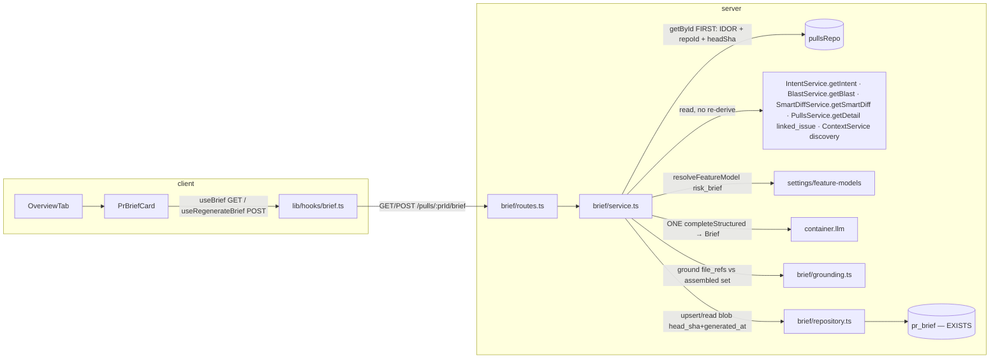

# Implementation Plan — Why+Risk Brief

## Context & goal
Add a top-of-Overview `PrBriefCard` that states, in one glance, **what** a PR does, **why**, an
overall **risk level**, a grounded **risks** list, and a **review-focus** ("read these first")
list. The brief **assembles** already-built outputs — PR title/body, `PrDetail.linked_issue`,
derived Intent (`IntentService.getIntent`), the blast summary/map (`BlastService.getBlast`),
smart-diff group stats (`SmartDiffService.getSmartDiff`), and the L05 project-context docs — into
**exactly one** structured LLM call, grounds every `file_ref` against the assembled input, and
caches the result per PR in the **existing** `pr_brief` table (`server/src/db/schema/reviews.ts:57-62`).
It re-derives nothing (Non-goals), adds no table/migration, and re-opening a cached PR performs a
pure cache read with zero LLM calls. Traced to spec `specs/2026-07-17-why-risk-brief.md`
(Status: ready), AC-1…AC-25.

## Design reference
Two real mockups on disk (dark theme, PR #482 "Add rate limiting to public API endpoints"):
- `specs/assets/2026-07-17-why-risk-brief/pr-overview-tab.png` — the **new surface** the brief adds
  is the **REVIEW FOCUS — READ THESE FIRST** list (each row `file:line` + a short reason) plus the
  composed what/why/risk verdict. The mockup's top "PR BRIEF" verdict panel (verdict pill, findings
  count, PR SCORE gauge, `$0.014` cost line) is the **review-run** `VerdictBanner` + cost badge —
  **NOT** this card's fields (resolved Q2/Q5). `PrBriefCard` is a **new card that coexists** with
  `VerdictBanner`, `IntentCard`, `BlastCard`; it subsumes none of them, and shows **no cost line**.
  Build the card's risk rows and focus rows to the same `file:line` + reason shape the mockup's
  REVIEW FOCUS list uses (blue file links, muted reason text).
- `specs/assets/2026-07-17-why-risk-brief/files-changed-tab.png` — the SmartDiffViewer (Core /
  Wiring / Boilerplate). The brief **consumes its group counts as input**; it does **not** render
  this tab. T3 must open `pr-overview-tab.png` before building the card so it matches real pixels.

## Requirements source
- Spec: `specs/2026-07-17-why-risk-brief.md` — the request points here.
- Spec ID: `2026-07-17-why-risk-brief` · Status: **ready** (header verified: line 1). All 8 draft
  clarifications (Q1–Q8) were resolved by the owner on 2026-07-17 and folded into the ACs.
- Questions answered by the requester (owner-confirmed 2026-07-17):
  - **Execution mode → MULTI-AGENT, 2 lanes** (committed; see `## Execution mode`).
  - **GAP-1 → DISCOVERY SET** — the brief's context-spec input is the repo clone's **discovered**
    context docs (the safe grounding superset), not an agent-attached union. No per-PR selector, no
    new selector code (faithful to resolved Q3). Wired unconditionally in T2 Step 5.
- **Two spec gaps surfaced during planning** (GAP-1, GAP-2) — both now resolved: GAP-1 by the
  owner (discovery set), GAP-2 in-plan (the `BriefEnvelope` transport wrapper). Neither blocks
  building. See `## Planning notes`.

## Criteria coverage
<!-- Every AC-1 … AC-25 in the spec mapped to the task(s) that deliver it. -->
| AC | Task | Notes |
|---|---|---|
| AC-1 | T2 | assemble input from PR title/body, linked_issue, Intent, Blast, SmartDiff groups, context specs — reuse, no re-derive |
| AC-2 | T2 | no raw hunk/patch/file body — summaries only; do NOT reuse intent's `hunkHeadersOnly` |
| AC-3 | T2 | exactly one `completeStructured` call → `Brief{what,why,risk_level,risks,review_focus}` (contract T1) |
| AC-4 | T2 | `resolveFeatureModel(container, ws, 'risk_brief')`; never hardcode a model |
| AC-5 | T2 | ground every `risks[].file_refs` against the assembled file/endpoint set; drop ungrounded; drop empty risk; log |
| AC-6 | T2 | same grounding on `review_focus[].file_ref` |
| AC-7 | T2, T3 | server returns valid brief with empty list; card renders explicit "none flagged" state |
| AC-8 | T2 | cached PR → cache read, **zero** LLM calls |
| AC-9 | T2, T3 | first open, no cache → auto-generate **once** (server POST path); client fires POST once |
| AC-10 | T2, T3 | Regenerate → one fresh call, overwrite cache, display |
| AC-11 | T2 | no linked issue → assemble from the rest |
| AC-12 | T2 | Intent not derived (`getIntent` null) → still one call, note intent absent; do NOT derive Intent |
| AC-13 | T2 | blast degraded/empty/unindexed → assemble from available blast data |
| AC-14 | T2 | `pullsRepo.getById(workspaceId, prId)` FIRST on GET **and** POST → 404 if cross-workspace |
| AC-15 | T2, T3 | server computes `stale = blob.head_sha != pull.headSha`; card shows STALE badge + Regenerate; never auto-regenerate |
| AC-16 | T3 | `risk_level` color-coded via severity color map **plus** a text label |
| AC-17 | T3 | `review_focus[]` rows link to `file_ref` (+ line) with reason |
| AC-18 | T3 | `risks[]` rows render severity + link to each referenced file/endpoint |
| AC-19 | T3 | Regenerate control triggers AC-10 |
| AC-20 | T3 | `prId` prop `string | null`; null → non-interactive placeholder, no request |
| AC-21 | T3 | in-flight → loading/generating state + disabled Regenerate; failure → error state + retry |
| AC-22 | T3 | all model text rendered as data via vendored primitives; no `dangerouslySetInnerHTML` |
| AC-23 | T1 | `Brief`/`ReviewFocus`/`BriefEnvelope` byte-identical in both vendor copies, same commit |
| AC-24 | T2, T3 | call fails → cache left intact, typed error surfaced (not a crash/erase); card shows error |
| AC-25 | T2, T3 | server per-PR in-flight coalescing guard; client does not fire a second concurrent generation |

## Execution mode
**Committed: Multi-agent (2 lanes)** — owner-decided. Phase 0 = the T1 contract gate; Phase 1 = T2
(backend) ∥ T3 (frontend) in **parallel by disjoint file ownership**, sharing only the read-only T1
contract (this mirrors the `docs/plans/2026-07-17-project-context.md` shape). *Single-agent fallback
(not the chosen mode): run T1 → T2 → T3 as a strict sequence — the ownership lists are already
disjoint, so nothing else would change.* **No `test-writer` phase** — `test-writer` is disabled;
every Task owns and writes its own tests and its scoped `Verify` is its release gate.

## Constraints from INSIGHTS & CLAUDE.md
- **`PrDetail`/`PrMeta` carry no `repoId`.** Call `container.pullsRepo.getById(workspaceId, prId)`
  FIRST — it is BOTH the workspace-scoped IDOR guard AND the only source of `repoId` **and**
  `headSha` (for stale detection). Source: `server/INSIGHTS.md:50`; the `pr_intent` IDOR pattern
  `server/INSIGHTS.md:43`. Mirror `blast/service.ts:80-86` (getById before getDetail).
- **`pr_brief` is PK'd on `pr_id` with no `workspace_id`** (`schema/reviews.ts:57-62`) — an IDOR
  trap exactly like `pr_intent`. Every repository read/write MUST be gated by the `getById`
  workspace lookup, never by `prId` alone. Source: `server/INSIGHTS.md:43`.
- **Dual-vendor contract sync in ONE commit, byte-identical.** `Brief`/`ReviewFocus`/`BriefEnvelope`
  land identically in `server/src/vendor/shared/contracts/brief.ts` and
  `client/src/vendor/shared/contracts/brief.ts`. No automation — manual by convention. Source: root
  `INSIGHTS.md:26`. **Before editing, `diff` the two `brief.ts` copies** — a type may be one-sided
  (root `INSIGHTS.md:29`); reconcile to byte-identical first.
- **`PrBrief {intent,blast,risks,history}` already exists** (`brief.ts:116-122`) — leave it intact
  as the assembled **input** bundle; do NOT overload it as the output. Add a **new** `Brief` output
  (resolved Q1). `Risk` (`brief.ts:50-57`) and `RiskSeverity` (`brief.ts:47`) already exist — reuse.
- **Client `prId` is `string | null`** at the call site (`PrDetailView.tsx:37`,
  `client/INSIGHTS.md:45`) — the card prop must be `prId: string | null`, not `string`.
- **i18n namespace IS the filename, camelCase** (`client/INSIGHTS.md:17`) — keep `brief.json`
  (namespace `brief`). Realign its keys to the new output shape; do not rename the basename.
- **`@testing-library/user-event` is NOT installed** (`client/INSIGHTS.md:19,46`) — use `fireEvent`
  from `@testing-library/react`; controlled inputs via `fireEvent.change(...)`.
- **Nested-interactive a11y** (`client/INSIGHTS.md:51`, spec §Accessibility) — a focus/risk row
  that is a link must not nest an inner interactive (e.g. a Regenerate/expand button) inside another
  interactive container. Wrap only the toggle in a real `<button aria-label>`; keep siblings as flex
  children. Reuse the `SymbolRow.tsx` precedent.
- **Vendored `Markdown` primitive styles only `p/strong/code/a`; `.dd-md` has no CSS**
  (`client/INSIGHTS.md:11`, spec §Non-functional) — headings in model text render flat. Known
  limitation, not a bug; do not touch sealed `vendor/ui`.
- **Test split** (`TESTING.md`, `server/INSIGHTS.md:39`) — DB-backed integration is `*.it.test.ts`
  in `server/test/` (mirror `server/test/blast.it.test.ts` / `intent`-style harness:
  `startPg()` + `seed(db)` + `buildApp({...,overrides})` + `app.inject(...)`; stub the LLM via
  `overrides.llm`). Everything else hermetic.
- **Tokenizer worst-case** (`server/INSIGHTS.md:19-20`) — this feature adds **no token counting**
  (spec §Non-functional). Do NOT introduce a `container.tokenizer.count(...)` over context text.
- **Server rules** (`server/CLAUDE.md`) — services receive `Container`, never `new` an adapter;
  routes declare Zod `params`/`body` (use a **local** `PrIdParams = z.object({ prId: z.string().uuid() })`
  — `IdParams` is keyed `id`, `server/INSIGHTS.md:42`); secrets via `SecretsProvider`; do NOT edit
  an existing schema file. **No new table, no migration** (the `pr_brief` table already exists).
- **reviewer-core is a hard Non-goal** (spec §Non-goals) — the brief's structured call is a
  **server-module** call patterned on `IntentService.derive` / `BlastService.explain`. Do not touch
  `reviewer-core`. `wrapUntrusted` from `@devdigest/reviewer-core` is a pure string helper safe to
  import into a server module (`server/INSIGHTS.md:41`) — use it to wrap the untrusted segments
  (PR/issue text, context specs) in the assembled input.

## Architecture sketch


## Shared contracts (define FIRST, before parallel work) — T1
Edit **both** vendored `contracts/brief.ts` copies byte-identically; the barrel already
`export *`s the file (verify). Reuse existing `Risk`, `RiskSeverity`. Add (Zod, `snake_case`):
- `ReviewFocus = z.object({ file_ref: z.string(), line: z.number().int().nullish(), reason: z.string() })`
  — the "read these first" row (grounded like `risks`, AC-6).
- `Brief = z.object({ what: z.string(), why: z.string(), risk_level: RiskSeverity, risks: z.array(Risk), review_focus: z.array(ReviewFocus) })`
  — the output brief (resolved Q1, AC-3). This is the schema passed to `completeStructured`.
- `BriefEnvelope = z.object({ brief: Brief, generated_at: z.string(), stale: z.boolean() })`
  — the **transport wrapper** returned by GET (nullable) and POST. **GAP-2 resolution:** the spec's
  contract table says `GET → Brief | null`, but the client provably cannot compute AC-15 staleness
  from a bare `Brief` (it carries no `head_sha`, and the client has no PR head). The server has both
  (via `getById`), so it computes `stale`/`generated_at` and returns them in this envelope. This is
  an **addition** consistent with the spec's resolved Q6, not a contradiction. Flagged in the report.
- Do **not** add `head_sha`/`generated_at` to `Brief` itself — those are cache-envelope fields; the
  blob shape (`CachedBrief`) is a **server-internal** type in `brief/repository.ts`, not vendored.

## Tasks
**No `test-writer` phase** — `test-writer` is disabled and must not be invoked. Every Task owns its
test files and its `Verify` is the release gate for its ACs; the implementer iterates until that
scoped command is green.

### T1 — Shared contract: `Brief` + `ReviewFocus` + `BriefEnvelope` (GATE)
- **Area:** Full-stack (contracts)
- **Satisfies:** AC-23; enables AC-3 and all UI.
- **Owns (files):**
  - `server/src/vendor/shared/contracts/brief.ts` (edit — append new types)
  - `client/src/vendor/shared/contracts/brief.ts` (edit — byte-identical append)
  - `server/test/brief-contract.test.ts` (new — hermetic)
- **Depends on:** none
- **Skills to invoke:** security, zod, typescript-expert
- **Steps:**
  1. `diff` the two `contracts/brief.ts` copies first (root `INSIGHTS.md:29`); confirm they are
     identical before editing, then apply the same append to both.
  2. Add `ReviewFocus`, `Brief`, `BriefEnvelope` (shapes above) after the existing `PrBrief`, each
     with `export type X = z.infer<typeof X>`. Reuse the existing `Risk`/`RiskSeverity` — do not
     redefine. Do not reorder or alter existing exports.
  3. Confirm each vendor barrel (`vendor/shared/index.ts`) already re-exports `contracts/brief.js`
     (it exports `PrBrief` today) — if it uses an explicit named list rather than `export *`, add the
     three new names to **both** barrels.
  4. `brief-contract.test.ts`: `Brief.parse(...)` a sample; assert `BriefEnvelope.parse` accepts
     `{ brief, generated_at, stale }`; assert `ReviewFocus.parse` accepts a row with and without
     `line`; assert `Brief` rejects an unknown `risk_level` (must be `high|medium|low`).
- **Verify:** `cd server && pnpm exec vitest run test/brief-contract.test.ts`
- **Out of scope:** DB, routes, service, UI, i18n, any `.js` emit. No change to `PrBrief`/`Risk`.

### T2 — Brief backend module (assemble · one call · ground · cache · tenancy)
- **Area:** Backend
- **Satisfies:** AC-1, AC-2, AC-3, AC-4, AC-5, AC-6, AC-7(server), AC-8, AC-9(POST), AC-10(server),
  AC-11, AC-12, AC-13, AC-14, AC-15(server), AC-24(server), AC-25(server)
- **Owns (files):**
  - `server/src/modules/brief/{routes,service,repository,grounding,helpers,constants}.ts` (new)
  - `server/src/modules/index.ts` (edit — register `brief`)
  - `server/test/brief-grounding.test.ts` (new — hermetic)
  - `server/test/brief.it.test.ts` (new — DB-backed, Docker)
- **Depends on:** T1
- **Skills to invoke:** onion-architecture, fastify-best-practices, drizzle-orm-patterns, postgresql-table-design, security, zod, typescript-expert
- **Steps:**
  1. **constants.ts:** `BRIEF_MAX_RETRIES` (mirror `INTENT_MAX_RETRIES`); no model constant (AC-4).
  2. **repository.ts** (`class BriefRepository { constructor(private db: Db) {} }`): the `pr_brief`
     table is keyed only on `pr_id`, so tenancy is enforced by the **service** via `getById` — the
     repo methods take an already-verified `prId`. Define a server-internal blob type
     `CachedBrief = { brief: Brief; head_sha: string; generated_at: string }`.
     - `read(prId): Promise<CachedBrief | null>` — select `pr_brief.json` by `prId`; parse the blob
       (`Brief.parse` on the `brief` field so a malformed cache can't leak untyped data). Return null
       if no row (AC-8/AC-9 branch).
     - `upsert(prId, cached: CachedBrief)` — `insert ... onConflictDoUpdate` on `pr_id`, storing the
       whole `CachedBrief` in `json` (AC-10). No new column, no migration.
  3. **grounding.ts** (pure — hermetic-testable, AC-5/AC-6): `groundBrief(brief: Brief, fileSet: Set<string>): { brief: Brief; dropped: string[] }`.
     - Normalize each candidate ref before the set check: strip a trailing `:line` / `:start-end`
       suffix (e.g. `src/x.ts:12-18` → `src/x.ts`) so a line-annotated ref grounds against the bare
       path set. Endpoints (e.g. `GET /api/public/items`) are matched verbatim against the set.
     - `risks`: filter each `risk.file_refs` to grounded refs; if a risk retains **no** ref, drop the
       whole risk (AC-5). `review_focus`: drop any item whose `file_ref` is ungrounded (AC-6).
     - Collect every dropped ref/item into `dropped` (the service logs it, AC-5 "record the drop").
  4. **helpers.ts** (pure): `buildBriefMessages(input)` — assemble the ONE prompt from **summaries
     only** (AC-2): PR title/body, `linked_issue` (when present, AC-11), Intent (or an explicit
     "intent not derived yet" note when null, AC-12), the blast **summary + map** (changed symbols,
     downstream callers, affected endpoints/crons — AC-13: whatever is available), the smart-diff
     **group statistics** (core/wiring/boilerplate + per-file path/additions/deletions/pseudocode
     summary — NEVER the raw patch), and the context spec texts. Wrap the untrusted segments
     (PR/issue text, context specs) with `wrapUntrusted` (`@devdigest/reviewer-core`,
     `server/INSIGHTS.md:41`); keep system instructions separate from that data. **Do NOT** import or
     reuse intent's `hunkHeadersOnly`/`buildDiffFromFiles` — hunk headers are patch text (AC-2).
     Also `assembleFileSet(...)` — the union of grounding targets: PR changed file paths
     (`PullsService.getDetail(...).files[].path`), blast map files (`changed_symbols[].file`,
     `downstream[].callers[].file`) and `endpoints_affected`, and the context spec paths.
  5. **service.ts** (`class BriefService { constructor(private container: Container) {} }`):
     - Module-scope in-flight guard: `const inFlight = new Map<string, Promise<BriefEnvelope>>()`
       (declared at module top, outside the class — AC-25: coalesce concurrent generations per PR;
       single-process local-first server, so an in-memory map is sufficient). `set` before the LLM
       call, `delete` in `finally`.
     - `get(workspaceId, prId): Promise<BriefEnvelope | null>` — `getById` FIRST (AC-14; null → throw
       `NotFoundError` → 404). Read cache; null → return null (client auto-generates, AC-9). Else map
       `CachedBrief` → `BriefEnvelope` with `stale = cached.head_sha !== pull.headSha` (AC-8/AC-15,
       **zero LLM**).
     - `regenerate(workspaceId, prId): Promise<BriefEnvelope>` — `getById` FIRST (AC-14). If a
       generation for `prId` is in flight, return that promise (AC-25). Otherwise: read Intent
       (`IntentService.getIntent`, may be null — AC-12, do NOT derive), Blast
       (`BlastService.getBlast`, may be degraded/empty — AC-13), SmartDiff
       (`SmartDiffService.getSmartDiff`), PR detail (`PullsService.getDetail` for title/body/files/
       `linked_issue` — AC-1/AC-11), and context specs (the discovery-set wiring below). Resolve the model
       via `resolveFeatureModel(this.container, workspaceId, 'risk_brief')` (AC-4). Make **exactly
       one** `llm.completeStructured({ model, schema: Brief, schemaName: 'Brief', messages, maxRetries })`
       (AC-3). Run `groundBrief(res.data, fileSet)` (AC-5/AC-6); `logger?.info` the `dropped` list.
       Build `CachedBrief = { brief: grounded, head_sha: pull.headSha, generated_at: new Date().toISOString() }`,
       `upsert` it (AC-10), return the envelope (`stale: false`). **On LLM failure: do NOT upsert**;
       let the typed error propagate so the existing cache is left intact (AC-24).
     - **Context specs (owner-decided: DISCOVERY SET, unconditional):** assemble the brief's
       project-context input from the repo clone's **discovered** context docs — reuse
       `ContextService` discovery (`server/src/modules/context/service.ts`; the same guarded,
       per-doc-bounded read it already performs, bounded by `CONTEXT_MAX_DOC_BYTES`) to obtain the
       context doc **paths + text**. Feed those texts (wrapped untrusted, Step 4) as the "relevant
       project-context specs" input, and include every discovered context doc **path** in
       `assembleFileSet` so a `file_ref` into a context spec grounds (AC-5). This is faithful to
       resolved Q3 — reuse L05 discovery as-is, **no per-PR relevance selector and no agent-attached
       union**, no new selector code. There is **no** conditional fallback and **no** `// TODO`: the
       discovery wiring is required, and the it.test asserts a context-spec path appears in the
       grounding set.
  6. **routes.ts** (Zod, local `PrIdParams`; `getContext` for workspaceId):
     - `GET /pulls/:prId/brief` → `service.get(workspaceId, prId)` (returns `BriefEnvelope | null`).
     - `POST /pulls/:prId/brief` → `service.regenerate(workspaceId, prId)` (returns `BriefEnvelope`).
       This same POST serves both first-open auto-gen (AC-9) and Regenerate (AC-10).
  7. Register `brief` in `modules/index.ts` (one import + one entry).
  8. **Tests (release gate — must be green):**
     - `brief-grounding.test.ts` (hermetic): ungrounded risk `file_ref` dropped; risk with no valid
       ref removed; line-annotated ref (`src/x.ts:12-18`) grounds against bare `src/x.ts`; endpoint
       ref matched verbatim; ungrounded `review_focus` item dropped; grounding-removes-all yields
       empty lists with the brief still valid (AC-5/AC-6/AC-7 server side).
     - `brief.it.test.ts` (DB + `overrides.llm` stub returning a fixed `Brief`): mirror
       `server/test/blast.it.test.ts` harness. Assert: (a) first GET → null (AC-9 precondition);
       (b) POST → grounded `BriefEnvelope`, cache row written, `stale:false` (AC-3/AC-10);
       (c) second GET → same brief, **stub asserts zero `completeStructured` calls on the GET path**
       (AC-8); (d) cross-workspace `prId` → 404 on both GET and POST, nothing read/written (AC-14);
       (e) PR with no `linked_issue` and null Intent → still one call, brief returned (AC-11/AC-12);
       (f) stub returns a risk citing `src/does/not/exist.ts` → that ref dropped, risk removed
       (AC-5); (g) simulate a moved head (update the PR row's headSha after caching) → GET returns
       `stale:true` and makes no LLM call (AC-15); (h) stub throws → POST errors, prior cache row
       still present and unchanged (AC-24); (i) assert the assembled prompt string (capture via the
       stub) contains **no** raw patch text from the PR files (AC-2); (j) two concurrent `regenerate`
       calls for one PR → the stub sees **exactly one** `completeStructured` call (AC-25);
       (k) seed a **discovered** context doc (e.g. `docs/foo.md` / `specs/bar.md`) under the repo
       clone → its path is in the assembled grounding set, so a stub `review_focus`/`file_ref` citing
       that context doc survives grounding while an undiscovered path is dropped (AC-1/AC-5
       discovery-set wiring).
- **Verify:** `cd server && pnpm exec vitest run test/brief-grounding.test.ts test/brief.it.test.ts`
  *(the `.it.test.ts` needs Docker)*
- **Out of scope:** any UI; i18n; touching `reviewer-core`, `PrBrief`/`Risk` contracts, the DB
  schema, or any other module. No new table/migration.

### T3 — `PrBriefCard` + brief hooks + i18n realign
- **Area:** Frontend
- **Satisfies:** AC-7(card), AC-9(client fire-once), AC-10(UI), AC-15(badge), AC-16, AC-17, AC-18,
  AC-19, AC-20, AC-21, AC-22, AC-24(surface), AC-25(client guard)
- **Owns (files):**
  - `client/src/app/repos/[repoId]/pulls/[number]/_components/OverviewTab/_components/PrBriefCard/*`
    (new: `PrBriefCard.tsx`, `helpers.ts`, `styles.ts`, `index.ts`, `PrBriefCard.test.tsx`)
  - `client/src/app/repos/[repoId]/pulls/[number]/_components/OverviewTab/OverviewTab.tsx` (edit —
    mount `<PrBriefCard prId repoFullName headSha />` at the **top** of the Overview, above the
    Intent/Blast grid; coexists with them per resolved Q2)
  - `client/src/lib/hooks/brief.ts` (new — `useBrief`, `useRegenerateBrief`)
  - `client/messages/en/brief.json` (edit — realign keys to the new output shape)
- **Depends on:** T1 (contracts). Independent of T2 at build time (hook targets the T1-typed routes).
- **Skills to invoke:** next-best-practices, react-best-practices, react-testing-library, client-project-structure, security, zod, typescript-expert
- **Steps:**
  1. `lib/hooks/brief.ts` (mirror `lib/hooks/intent.ts`): `useBrief(prId: string | null)` →
     `useQuery(['brief', prId], () => api.get<BriefEnvelope | null>(\`/pulls/${prId}/brief\`), { enabled: prId != null })`;
     `useRegenerateBrief(prId)` → `useMutation(() => api.post<BriefEnvelope>(\`/pulls/${prId}/brief\`), { onSuccess: (env) => qc.setQueryData(['brief', prId], env) })`.
     Infer `BriefEnvelope`/`Brief`/`ReviewFocus`/`Risk` from `@devdigest/shared` — never redefine.
  2. `PrBriefCard.tsx` (`'use client'`, prop `prId: string | null` — AC-20, plus `repoFullName`,
     `headSha` for building `file:line` links like `SymbolRow`/REVIEW-FOCUS mockup rows). Open
     `pr-overview-tab.png` and match the REVIEW FOCUS / risk row shape (blue file link + muted
     reason). Early returns in order (react-best-practices):
     - `prId == null` → non-interactive placeholder, **no** hook request fires (AC-20:
       `useBrief(null)` is `enabled:false`; render a static skeleton/placeholder).
     - loading / mutation pending → loading/generating state, Regenerate disabled (AC-21).
     - query error OR mutation error → error state with a retry affordance (AC-21/AC-24).
     - `data === null` (no cache) → **auto-generate once** (AC-9): fire `regenerate.mutate()` exactly
       once via a `useRef` "fired" latch guarded on `!regenerate.isPending && !fired.current`
       (AC-25 client side — never fire while pending); show generating state.
     - success → render the brief (below).
  3. Render the brief:
     - `risk_level` as a **color-coded** indicator using the existing severity color map (reuse the
       vendored `SEV`/`SeverityBadge` primitive, `client/INSIGHTS.md:47`) **plus a visible text
       label** so color is not the only signal (AC-16, spec §Accessibility).
     - `what` and `why` as data via the vendored text/`Markdown` primitive — **no**
       `dangerouslySetInnerHTML` (AC-22). Accept flat headings (known limitation,
       `client/INSIGHTS.md:11`).
     - `review_focus[]`: one row per item — a file link (`file_ref` + `line` when present) plus its
       `reason` (AC-17). `risks[]`: one row per risk — severity badge + explanation + a link to each
       `file_ref` (AC-18). **Non-nested interactives** (`client/INSIGHTS.md:51`): the file link and
       any inner control are separate flex children, not nested interactives.
     - empty `risks` / `review_focus` → explicit "no grounded risks flagged" / equivalent copy, never
       a blank region (AC-7).
     - When `env.stale` is true → a **STALE** badge + a Regenerate prompt; do not auto-regenerate
       (AC-15). A **Regenerate** control (`Button icon="RefreshCw"`) always available in the header,
       calling `regenerate.mutate()` (AC-19/AC-10), disabled while pending (AC-21).
  4. `helpers.ts` (pure, unit-tested): the "should auto-generate once" predicate and the
     `file_ref` → link-target derivation (strip `:line`, build the repo file URL from `repoFullName`
     + `headSha`). Keep predicates out of the component body (react-best-practices).
  5. `brief.json`: realign keys to the new output shape — add `what`, `why`, `riskLevel` (+ the three
     severity labels), `reviewFocus`, `regenerate`, `stale`, `noRisks`/`noFocus` empty-state copy,
     `generating`, `error`/`retry`. Keep the basename `brief.json` (namespace `brief`,
     `client/INSIGHTS.md:17`). The old `{intent,blast,risks,history}` `block.*` keys and `why.*`
     (git-why) keys: remove `block.intent/blast/history` and `noHistory`/`overlap` (they encode the
     abandoned pre-seeded shape, resolved Q1) but **verify by grep first** that no other component
     still reads them; if any does, leave it and only add the new keys.
  6. **Test (release gate — must be green; `fireEvent`, not `userEvent`):** `PrBriefCard.test.tsx`
     — mock `@/lib/hooks/brief` (use the `importOriginal`-spread form, `client/INSIGHTS.md:38`).
     Cover: (a) `prId={null}` → placeholder, and assert the query hook was called with `enabled:false`
     / no fetch (AC-20); (b) loaded brief → `risk_level` shows both color and a text label,
     `review_focus` rows link to files with reasons, `risks` rows show severity + file links
     (AC-16/17/18); (c) empty `risks`+`review_focus` → "none flagged" copy, not blank (AC-7);
     (d) `stale:true` → STALE badge + Regenerate present, and assert no auto-mutation fired (AC-15);
     (e) click Regenerate → calls the mutation once; while pending the control is disabled and a
     generating state shows (AC-10/AC-19/AC-21); (f) `data===null` → auto-generate mutation fires
     **exactly once** across re-renders (AC-9/AC-25 client); (g) error → error state with retry
     (AC-21/AC-24); (h) assert no `dangerouslySetInnerHTML` and model text renders as inert data
     (AC-22). Mock `next/navigation` if the card reads route params.
- **Verify:** `cd client && pnpm exec vitest run "src/app/repos/[repoId]/pulls/[number]/_components/OverviewTab/_components/PrBriefCard/PrBriefCard.test.tsx"`
- **Out of scope:** backend; the `VerdictBanner`/cost panel (not this card, resolved Q2/Q5); the
  Files-changed tab; touching `vendor/ui` internals or the sealed `Markdown` primitive.

## Execution order
Multi-agent, 2 lanes. Every task's tests are owned by that task (no test-writer phase).
- **Phase 0 (gate):** T1 (contracts). Blocks both lanes.
- **Phase 1 (parallel):** T2 (backend, needs T1) ∥ T3 (frontend, needs T1). Disjoint ownership —
  the only shared artifact is the read-only T1 contract.
- Single-agent fallback: strict sequence **T1 → T2 → T3**.

## End-to-end verification (after all tasks merge)
```
cd server && pnpm exec vitest run --exclude '**/*.it.test.ts' && pnpm typecheck
cd server && pnpm exec vitest run .it.test        # Docker: brief integration
cd client && pnpm test && pnpm typecheck
```
→ expect: all green, plus the observable proof — open a PR with no cached brief: the card
auto-generates **once** (one LLM call) and renders what/why/color-coded risk_level/grounded
risks/review-focus; reopen the PR: the card renders instantly with **zero** LLM calls (AC-8); push a
new commit (move head SHA): the cached brief shows a **STALE** badge + Regenerate and does not
auto-refresh (AC-15); click Regenerate: exactly one fresh call overwrites the cache (AC-10); and a
model risk citing a non-existent file never reaches the UI (AC-5).

## Planning notes
- **GAP-1 (context-spec input granularity) — OWNER-RESOLVED: discovery set.** AC-1 + AC-5 say the
  brief reuses "attached" L05 context specs, but the only attachment resolution in the codebase
  (`ContextService.resolveForAgent`) is **agent-scoped**, and the brief has no agent. The owner
  decided (2026-07-17) the brief's context-spec input is the repo clone's **discovered** context
  docs — the safe grounding superset, faithful to resolved Q3's "no per-PR selector, reuse as-is."
  Wired unconditionally in T2 Step 5 (no agent-attached union, no selector code, no `// TODO`).
  Durable lesson candidate (root `INSIGHTS.md`): a "reuse the existing attachments" AC is
  under-specified whenever the consuming feature isn't scoped to the same owner the attachments hang
  off — name the resolution granularity in the spec. Flagged for the `engineering-insights` flow.
- **GAP-2 (transport wrapper) — resolved in-plan.** The spec's `GET → Brief | null` cannot carry the
  AC-15 stale signal; added `BriefEnvelope { brief, generated_at, stale }` (server-computed) as the
  GET/POST response. An addition consistent with resolved Q6, not a contradiction.
- The single most likely implementer slip is reusing intent's `hunkHeadersOnly`/`buildDiffFromFiles`
  to "give the model the diff" — that violates AC-2. Called out in T2 Steps 4 and its it.test (i).
