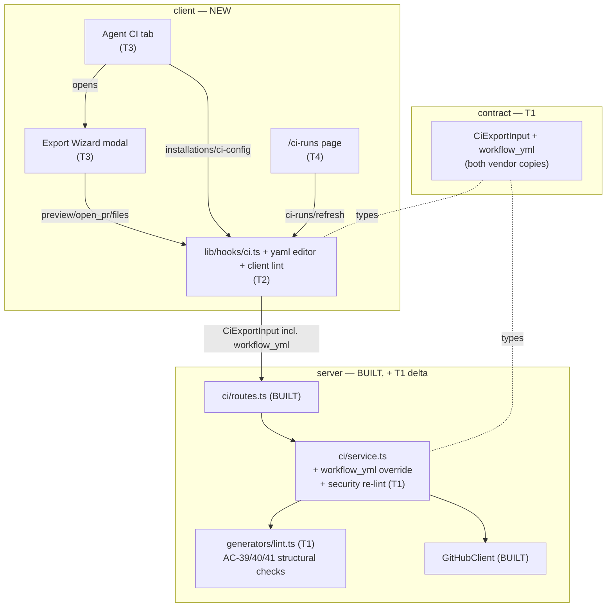

# Implementation Plan — Export to CI (wizard, agent CI tab, CI Runs page)

## Context & goal
The server `ci/` module (export, ingest, workflow generation, security-hardened `workflow.yml`),
its DB schema, migrations, and the `GitHubClient` port are **already built and verified**. The
studio has **no client UI to reach any of it** — no CI tab, no wizard wired to real data, no
`/ci-runs` page. This plan builds that missing client surface (spec Sections B/C/D) plus **one**
deliberate server change: an edited-`workflow.yml` round-trip on `CiExportInput` with a server-side
security re-lint that hard-rejects AC-39/40/41 violations before committing (AC-14/48).

## Requirements source
- Spec: `specs/2026-08-25-export-to-ci.md` — 48 EARS acceptance criteria (Sections A–H).
- Spec ID: `2026-08-25-export-to-ci` · Status: **draft** (see "Spec-gate note" below).
- Design references (read this session): `specs/assets/2026-08-25-export-to-ci/` — 6 mockups
  (`wizard-step1-target.png`, `wizard-step2-preview.png`, `wizard-step3-configure.png`,
  `wizard-step4-install.png`, `ci-tab-repo-list.png`, `ci-runs-page.png`).
- Questions answered by the requester: route is `/ci-runs`; nav entry in the **GLOBAL** tier;
  legacy `publishDialog.*`/`ciTab.publish`/`ciTab.republish`/`ciTab.empty` i18n keys are dead (do not
  build); client deps limited to CodeMirror 6 + `yaml` (no Monaco, no JSZip). **Follow-up (all
  resolved):** exactly **4 implementer tasks** (`test-writer` is disabled — each task writes its own
  tests, AC-48 e2e folded into T1); **execution is multi-agent parallel** (T3 ∥ T4 after T2); the
  GLOBAL nav group carries **all 4 mockup entries** (only `ci-runs` live; Memory / Multi-Agent Review /
  Agent Performance are disabled placeholders); the wizard **repo input is on the Target step**,
  defaulting to the active workspace repo (`useActiveRepo().activeRepo.full_name`).

> **Spec-gate note.** The spec header still reads `Status: draft`. The requester certified it
> **human-reviewed with all open questions resolved**, the spec's own `## Resolved decisions`
> section states "no open clarifications remain", and there are **zero** `[NEEDS CLARIFICATION]`
> markers. The substantive purpose of the spec gate (no unresolved human question) is satisfied,
> so this plan proceeds. **Recommendation:** flip the spec header to `Status: approved` (owner:
> `spec-creator`) so the artifact matches its state.

## Criteria coverage
<!-- Every AC-N in the spec is listed. "BUILT" = delivered by existing server code, verified at
     the E2E gate, not re-implemented (spec Sections A/E/F/G/H). -->

| AC | Task | Notes |
|---|---|---|
| AC-1 | BUILT (existing) | `ci` export service — verified at E2E gate |
| AC-2 | BUILT (existing) | runner-bundle read; error-if-absent |
| AC-3 | BUILT (existing) | slug computation |
| AC-4 | BUILT (existing) | `editable` only on `workflow.yml` |
| AC-5 | BUILT (existing) | `action=files` zip, no installation |
| AC-6 | BUILT (existing) | Update CI config re-export |
| AC-7 | BUILT (existing) | module registered in `modules/index.ts` |
| AC-8 | T3 | wizard opened from "Add to CI" + "+ Add repository" |
| AC-9 | T3 | Target step; only `gha` selectable |
| AC-10 | T3 | Preview fetches live bundle (`action=preview`) |
| AC-11 | T3 | CodeMirror editor for `workflow.yml` (primitive from T2) |
| AC-12 | T3 | YAML parse error hard-blocks (helper from T2) |
| AC-13 | T3 | structural lint **soft** warn (helper from T2) |
| AC-14 | T1, T3 | contract field (T1) + hold edits & send on Install (T3) |
| AC-15 | T3 | Configure: triggers / post_as / secrets / callout |
| AC-16 | T3 | Install: open_pr vs zip; surface `pr_url`; error handling |
| AC-17 | T3 | "Active in N repos" + add `ci` tab to `TABS` |
| AC-18 | T3 | installation rows; "No runs yet" |
| AC-19 | T3 | "Fail CI on" → `ci_fail_on` via existing agents-update |
| AC-20 | T4 | CI Runs nav entry in GLOBAL tier + page header |
| AC-21 | BUILT + T4 | server filters (built); client sends params (T4) |
| AC-22 | T4 | CI Runs table columns |
| AC-23 | T4 | FINDINGS column reuses `SeverityBadge`/findings popover |
| AC-24 | T4 | render-side finding sort |
| AC-25 | T4 | Trace drawer + "View full logs on GitHub Actions" |
| AC-26 | T4 | empty state + "+ Set up CI for an agent" CTA |
| AC-27 | BUILT + T4 | server ingest (built); client `refetchOnMount`/Refresh (T4) |
| AC-28 | BUILT (existing) | ETag / If-None-Match |
| AC-29 | BUILT (existing) | completed runs only |
| AC-30 | BUILT (existing) | artifact parse → upsert |
| AC-31 | BUILT (existing) | PR title best-effort |
| AC-32 | BUILT + T4 | status derivation (built); client renders it (T4) |
| AC-33 | BUILT + T4 | gate-blocked = succeeded; client renders server value (T4) |
| AC-34 | T4 | "synced Xm ago" indicator, not "polling" |
| AC-35 | BUILT (existing) | `ci_runs` columns / no `verdict` |
| AC-36 | BUILT (existing) | artifact → row mapping |
| AC-37 | BUILT (existing) | `GitHubClient` port |
| AC-38 | T1 | new `workflow_yml` field applied to BOTH vendor copies |
| AC-39 | BUILT (existing) | generated `permissions` exact |
| AC-40 | BUILT (existing) | secret via `${{ secrets.* }}`; no `pull_request_target` |
| AC-41 | BUILT (existing) | `node .devdigest/runner/index.js` |
| AC-42 | BUILT (existing) | `lastSyncedEtag`/`lastSyncedAt` |
| AC-43 | T3 | "Update CI config" disabled + tooltip when no installs |
| AC-44 | T3, T4 | inert rendering of GitHub/model text (CI tab + CI Runs) |
| AC-45 | T4 | page shows only `agent_runs.source='ci'` (via `GET /ci-runs`) |
| AC-46 | T3 | Preview renders generator YAML verbatim (no stale sample) |
| AC-47 | T2, T3 | callout copy fixed in `ci.json` (T2), rendered on Configure (T3) |
| AC-48 | T1 | server hard-reject of violating edited `workflow.yml` |

## Execution mode
**Chosen: multi-agent, parallel** (confirmed by the requester). Four implementer tasks (T1–T4). The
two client UI surfaces (T3 agent CI tab+wizard, T4 CI Runs page) are file-disjoint and genuinely
independent once the foundation (T2) lands, so they run in parallel. The task partition is identical
in a single-agent pass — only `## Execution order` differs — so a sequential fallback is documented
there as an alternative, but parallel is the path.

## Constraints from INSIGHTS & CLAUDE.md
- **Dual-vendor sync.** `server/src/vendor/shared/` and `client/src/vendor/shared/` must receive the
  **identical** contract change in the **same commit** — source: root `INSIGHTS.md:26`. → one task (T1)
  owns both copies of `eval-ci.ts`.
- **Diff both vendor copies before extending a shared type** — a type can be one-sided — source: root
  `INSIGHTS.md:29`. (Here both copies already carry `CiExportInput` at the same location — verified
  `server/.../eval-ci.ts:319`, `client/.../eval-ci.ts:319`.)
- **Pre-seeded i18n keys encode design scope; an unused key is a scope question, not noise** — source:
  root `INSIGHTS.md:27`. Legacy `publishDialog.*` / `ciTab.publish|republish|empty` are explicitly
  resolved as **dead** (spec Non-goals) — do not build/wire them; new CI-tab empty copy uses new keys.
- **i18n namespace = filename verbatim (camelCase)** — source: client `INSIGHTS.md:17`. `ci.json` →
  `useTranslations("ci")`; `agents.json` → `useTranslations("agents")`.
- **`@testing-library/user-event` is NOT installed** — use `fireEvent` from `@testing-library/react`
  in every client test — source: client `INSIGHTS.md:19,57`.
- **`?tab=` allowlist must derive from `TABS`** — `VALID_TABS = TABS.map(t => t.key)` already does this
  (`AgentEditor/constants.ts:20`); adding the `ci` tab to `TABS` auto-extends the allowlist — source:
  client `INSIGHTS.md:35`.
- **`activeKeyFor` already maps `/ci-runs` → `"ci-runs"`** (`app-shell/helpers.ts:38`); the nav entry
  relies on that mapping — editing `activeKeyFor` is a no-op — source: client `INSIGHTS.md:63`.
- **Nested-interactive rule.** A clickable installation/run row that holds its own buttons must NOT nest
  interactive elements inside one `role="button"` — wrap only the toggle text in a real `<button>`,
  keep sibling actions as separate flex children — source: client `INSIGHTS.md:62`; spec §Non-functional.
- **`numeric` reads as string.** `cost_usd` is `NUMERIC(12,6)`; the `CiRun.cost_usd` contract is already
  `number|null` (server maps it) — render defensively — source: server `INSIGHTS.md:33`.
- **vitest does not type-check** (esbuild transpile); `noUncheckedIndexedAccess` is on server-side —
  index-heavy or route↔service code can be green under `vitest` and red under `tsc`. Task Verify stays
  scoped (per the hard rule); the authoritative `tsc` runs at the E2E gate — source: server `INSIGHTS.md:62`.
- **Secrets never touched by the client** — the wizard shows secret **names/status only**, never values
  (AC-15/40) — spec §Untrusted inputs.
- **Server `ci` module deliberately avoids a YAML library** (hand-rolled serializer, `generators/manifest.ts:11`).
  The AC-48 re-lint SHALL be **structural string/scan checks** matching AC-39/40/41 — do NOT pull a YAML
  parser into the server generator. Avoid dynamically-built `RegExp` from strings — root `INSIGHTS.md:25`.
- **Onion architecture (server).** T1's lint is application/domain logic: a pure helper under
  `modules/ci/`, called by `service.ts`; routes stay thin (body already validates `CiExportInput`).

## Architecture sketch


## Shared contracts (define FIRST, before parallel work)
- **`CiExportInput` gains `workflow_yml?: string`** (optional) — the user's edited `workflow.yml`
  override for the single editable file. Applied **identically** to both:
  - `server/src/vendor/shared/contracts/eval-ci.ts` (canonical, `CiExportInput` at :319)
  - `client/src/vendor/shared/contracts/eval-ci.ts` (mirror, `CiExportInput` at :319)
  Semantics: when present on `open_pr`/`files`, the server commits THIS content for
  `.github/workflows/devdigest-review.yml` instead of its regenerated copy, **after** passing the
  security re-lint (AC-48). Only `workflow.yml` is overridable. Owned by **T1**; read-only for T2–T4.
- All other CI contracts (`CiExport`, `CiInstallationsResponse`, `CiRun`, `CiRunsQuery`,
  `CiRefreshResult`, `CiFile`, `Finding`) **already exist and are synced** — read-only dependency.

## Tasks

### T1 — Contract `workflow_yml` + server security re-lint (AC-14/38/48)
- **Area:** Backend
- **Satisfies:** AC-14 (server half), AC-38, AC-48
- **Owns (files):**
  - `server/src/vendor/shared/contracts/eval-ci.ts`
  - `client/src/vendor/shared/contracts/eval-ci.ts`
  - `server/src/modules/ci/service.ts`
  - `server/src/modules/ci/generators/lint.ts` (new)
  - `server/src/modules/ci/service.test.ts` (extend — unit)
  - `server/src/modules/ci/ci.it.test.ts` (extend — AC-48 e2e, DB-backed)
- **Depends on:** none (this is the "shared contract FIRST" task)
- **Skills to invoke:** onion-architecture, zod, security, typescript-expert
- **Steps:**
  1. Add `workflow_yml: z.string().optional()` to `CiExportInput` in **both** vendor `eval-ci.ts`
     copies (server :319 and client :319) — byte-identical, same edit. Update the `CiExportInputBody`
     comment if needed. Do NOT change any other field.
  2. Create `server/src/modules/ci/generators/lint.ts` exporting a pure
     `lintWorkflowYml(contents: string): { ok: true } | { ok: false; violations: string[] }`.
     Implement the AC-39/40/41 invariants with **structural string scanning** (no YAML library,
     mirroring the hand-rolled style of `generators/manifest.ts:11`; avoid string-built `RegExp` per
     root `INSIGHTS.md:25`): reject if (a) `permissions:` grants anything beyond `contents: read` +
     `pull-requests: write`; (b) a `pull_request_target` trigger is present; (c) a secret is hardcoded
     instead of `${{ secrets.* }}`; (d) there is no `node .devdigest/runner/index.js` invocation step.
  3. In `service.ts` `exportCi`, after `assembleFiles(...)`: if `input.workflow_yml` is set, run
     `lintWorkflowYml`; on `!ok` throw a `platform/errors` validation error (400-class, message listing
     violations) BEFORE any GitHub commit / zip — this hard-rejects for both `open_pr` and `files`. On
     `ok`, replace the contents of the `.github/workflows/devdigest-review.yml` entry in `files` with
     `input.workflow_yml` (keep `editable:true`) so the edited content is what gets committed/zipped.
  4. Confirm routes need no change (`routes.ts` already validates `body: CiExportInput`). Confirm the
     thrown error maps to a non-2xx via the existing error handler.
  5. Extend `service.test.ts` (unit): (a) violating `workflow_yml` (e.g. `permissions: write-all`,
     `pull_request_target`, hardcoded key, missing runner step) → `exportCi` throws and no GitHub
     commit is attempted (assert the mock `github().commitFiles` was not called); (b) a clean edited
     `workflow_yml` → committed file contents equal the override; (c) unit cases for `lintWorkflowYml`
     directly (each of the four violation classes → `ok:false`; the real generator output → `ok:true`).
  6. Extend `server/src/modules/ci/ci.it.test.ts` (integration, DB-backed) for the AC-48 hard-reject
     **end-to-end through the HTTP route**: `app.inject` `POST /agents/:id/export-ci` with
     `action:"open_pr"` and a `workflow_yml` that violates AC-39/40/41 → assert non-2xx AND that no
     `ci_installation` row was created; then a clean edited `workflow_yml` → assert the committed
     workflow file (via the github mock) equals the override. Mirror the existing `*.it.test.ts`
     harness (`startPg()`/`seed()`/`buildApp()` — server `INSIGHTS.md:41`).
- **Verify:** `cd server && pnpm exec vitest run src/modules/ci/service.test.ts src/modules/ci/ci.it.test.ts`
  (the `.it.test.ts` case needs Docker/testcontainers running).
- **Out of scope:** the ingest path, generators other than the lint, any DB schema/migration, the
  route file's structure (body already validates `CiExportInput`). Do not add a YAML dependency.

### T2 — Client CI foundation: deps, hooks, i18n, YAML editor + lint helpers
- **Area:** Frontend
- **Satisfies:** AC-47 (i18n copy fix) — supplies primitives/hooks for AC-8..26 (delivered in T3/T4)
- **Owns (files):**
  - `client/package.json` (add `codemirror`, `@codemirror/lang-yaml`, `yaml`)
  - `client/src/lib/hooks/ci.ts` (new)
  - `client/messages/en/ci.json` (edit)
  - `client/src/components/yaml-editor/YamlEditor.tsx` (new)
  - `client/src/components/yaml-editor/lint.ts` (new — pure `parseYamlSafe` + `lintWorkflowYml`)
  - `client/src/components/yaml-editor/index.ts` (barrel)
  - `client/src/components/yaml-editor/lint.test.ts` (new)
- **Depends on:** T1 (client vendor `CiExportInput.workflow_yml`)
- **Skills to invoke:** client-project-structure, next-best-practices, react-best-practices,
  react-testing-library, zod, security, typescript-expert
- **Steps:**
  1. Add deps to `client/package.json`: `codemirror`, `@codemirror/lang-yaml`, `yaml` (runtime deps).
     No Monaco, no JSZip. Run `pnpm install`.
  2. Create `lib/hooks/ci.ts` (TanStack Query, `"use client"`, one hook per concern), all typed off
     `@devdigest/shared`:
     - `useCiInstallations(agentId)` → `GET /agents/:id/ci-installations` (`CiInstallationsResponse`);
       `enabled: !!agentId`.
     - `useExportCiPreview()` → mutation `POST /agents/:id/export-ci` with `action:"preview"` →
       `{ files: CiFile[] }`.
     - `useExportCiInstall()` → mutation `POST /agents/:id/export-ci` with `action:"open_pr"` (body
       incl. optional `workflow_yml`) → `CiExport`; on success invalidate `["ci-installations", agentId]`.
     - `useExportCiZip()` → the `action:"files"` path returns `application/zip`, which `api.ts` cannot
       handle (`api.ts:62` calls `res.json()`). Implement a **bespoke `fetch`** here that reads the
       response as a `Blob` and triggers a browser download (`URL.createObjectURL` + anchor click);
       surface non-2xx as an error. Do NOT route the zip through `api.post`.
     - `useUpdateCiConfig()` → mutation `POST /agents/:id/ci-config`; invalidate installations.
     - `useCiRuns(filters)` → `GET /ci-runs` with `CiRunsQuery` params; `refetchOnMount:"always"`,
       **no `refetchInterval`** (AC-27 — zero background polling).
     - `useRefreshCiRuns()` → mutation `POST /ci-runs/refresh` (empty body) → `CiRefreshResult`;
       on success invalidate `["ci-runs"]`.
  3. `YamlEditor.tsx` (`"use client"`): a controlled CodeMirror-6 editor (`value`, `onChange`) with
     YAML highlighting, line numbers, auto-indent; accepts `readOnly?` for the non-editable file
     displays. Keep it a thin, presentational wrapper (no business logic) so it is reusable.
  4. `lint.ts`: pure `parseYamlSafe(text): { ok: true } | { ok: false; message: string }` (wraps
     `yaml.parse`, catches throw → AC-12) and `lintWorkflowYml(text): string[]` returning advisory
     warnings for the AC-13 structural checks (permissions too broad; `pull_request_target`; hardcoded
     secret; missing runner step). This is the **client soft-warn** logic only — the authoritative gate
     is T1's server re-lint.
  5. Edit `ci.json`:
     - Fix `exportWizard.blockMergeDesc` to the **exact** AC-47 copy: "To block merges: set Fail CI on
       (CI tab) so the run exits non-zero, then add a required status check in the repo's GitHub branch
       protection. No GitHub App needed." (or add a new key carrying it and stop displaying the stale one).
     - Add the keys the design needs that are missing: `runs.filters.allSources`, `runs.table.agent`,
       `runs.table.duration`, `runs.table.trace`, `runs.trace.*` (drawer labels + "View full logs on
       GitHub Actions"), and a `ciTab.*` set for the new CI-tab surface (`ciDeployment`,
       `activeInRepos`, `updateConfig`, `addToCi`, `addRepository`, `noRuns`, `updateDisabledTooltip`).
     - Do NOT add/wire `publishDialog.*`, `ciTab.publish`, `ciTab.republish`, `ciTab.empty` (dead).
  6. `lint.test.ts`: unit-test `parseYamlSafe` (valid vs throwing YAML) and `lintWorkflowYml`
     (clean workflow → `[]`; each violation → a warning). Use `fireEvent` conventions only if any
     component test is added (none required for the pure helpers).
- **Verify:** `cd client && pnpm exec vitest run src/components/yaml-editor/lint.test.ts`
- **Out of scope:** the wizard modal, the CI tab, the CI Runs page, `agents.json`, `nav.ts`. Do not
  add `refetchInterval` to `useCiRuns`. Do not put finding-rendering logic here.

### T3 — Agent CI surface: Export Wizard (Section B) + CI tab (Section C)
- **Area:** Frontend
- **Satisfies:** AC-8, AC-9, AC-10, AC-11, AC-12, AC-13, AC-14 (client half), AC-15, AC-16, AC-17,
  AC-18, AC-19, AC-43, AC-44 (CI tab), AC-46, AC-47 (render)
- **Owns (files):**
  - `client/src/app/agents/[id]/_components/AgentEditor/constants.ts` (add `ci` tab to `TABS`)
  - `client/src/app/agents/[id]/_components/AgentEditor/AgentEditor.tsx` (render `CiTab`)
  - `client/src/app/agents/[id]/_components/AgentEditor/AgentEditor.test.tsx` (update)
  - `client/src/app/agents/[id]/_components/AgentEditor/_components/CiTab/**` (new: `CiTab.tsx`,
    `InstallationRow.tsx`, `FailCiOnSelect.tsx`, `helpers.ts`, `styles.ts`, `index.ts`, `CiTab.test.tsx`)
  - `client/src/app/agents/[id]/_components/AgentEditor/_components/ExportWizard/**` (new: `ExportWizard.tsx`
    modal + `TargetStep.tsx`, `PreviewStep.tsx`, `ConfigureStep.tsx`, `InstallStep.tsx`, `helpers.ts`,
    `styles.ts`, `index.ts`, `ExportWizard.test.tsx`)
  - `client/messages/en/agents.json` (add `editor.tabs.ci` label)
- **Depends on:** T2 (hooks, `YamlEditor`, lint helpers, `ci.json` keys), T1 (contract type)
- **Skills to invoke:** client-project-structure, next-best-practices, react-best-practices,
  react-testing-library, zod, security, typescript-expert
- **Steps:**
  1. **CI tab wiring (AC-17).** Add `{ key: "ci", labelKey: "editor.tabs.ci", icon: "..." }` to `TABS`
     in `constants.ts` (pick an existing `IconName` — verify against `vendor/ui/icons.tsx`; e.g.
     a CI/branch glyph). `VALID_TABS` derives automatically (client `INSIGHTS.md:35`) — do not add a
     separate allowlist. In `AgentEditor.tsx` render `<CiTab agent={agent} />` when `tab === "ci"`.
     Add the `editor.tabs.ci` string to `agents.json`.
  2. **CI tab body (AC-17/18/43, mockup `ci-tab-repo-list.png`).** `CiTab.tsx` uses
     `useCiInstallations(agent.id)`: header "CI deployment", an "Active in N repos" pill
     (`active_count`), an "+ Add to CI" primary button and an "Update CI config" button. Render one
     `InstallationRow` per installation (repo + GitHub Actions target badge + `last_run_status` pill +
     relative `last_ran_at`; "No runs yet" when null — AC-18). A dashed "+ Add repository" row.
     "Update CI config" is **disabled with tooltip** "No repos yet — use Add to CI" when
     `active_count === 0` (AC-43), else calls `useUpdateCiConfig`. All GitHub/model text rendered as
     inert JSX text (AC-44). Rows follow the nested-interactive rule (client `INSIGHTS.md:62`).
  3. **Fail CI on (AC-19).** `FailCiOnSelect` maps Critical|Warning+|Never → `critical|warning|never`
     and updates via the existing `useUpdateAgent` (`lib/hooks/agents.ts`, `patch: { ci_fail_on }`) —
     do NOT auto-push to CI; the new policy reaches CI only on the next explicit "Update CI config".
  4. **Wizard shell (AC-8).** `ExportWizard` is a vendored `Modal` opened by "Add to CI",
     "+ Add repository" (same agent, new repo scope), and reused for "Update CI config" flows if
     applicable. Use the vendored `ExportWizardSteps` stepper (`@devdigest/ui`) with labels
     Target → Preview → Configure → Install. Hold all wizard state (target, repo, triggers, post_as,
     edited `workflow.yml`) in React state; preserve across Back/Continue; discard on close (AC-14, no
     draft persistence).
  5. **Target step (AC-9, `wizard-step1-target.png`).** 4 cards; only GitHub Actions selectable;
     CircleCI/Jenkins/Generic CLI `aria-disabled` with "Coming soon"; `target` defaults `"gha"`;
     clicking a disabled card does not change selection and does not advance. **The repo input lives
     on THIS step** (labelled per `exportWizard.repoLabel/Hint/Placeholder`): a text field for
     `owner/name` that **defaults to the active workspace repo** — read it from the app's existing
     active-repo source of truth (`useActiveRepo()` in `client/src/components/app-shell/hooks`, which
     returns `{ activeRepo, repos, repoId }`; use `activeRepo?.full_name`, e.g. `acme/payments-api`, as
     the default value) rather than introducing a new source. The user may edit it (e.g. for
     "+ Add repository"). Do not require typing from scratch when an active repo exists.
  6. **Preview step (AC-10/11/12/13/46, `wizard-step2-preview.png`).** On reaching Preview, call
     `useExportCiPreview()` (`action=preview`) and render the returned `files[]` in a left selector
     (manifest, each `skills/*.md`, `memory.jsonl`, `workflow.yml`; the runner bundle is NOT listed).
     Right pane shows the selected file's **live** contents verbatim (AC-46 — never the stale mockup
     sample). Only `workflow.yml` is editable via `YamlEditor` (badge "editable"); others are read-only.
     On edit: run `parseYamlSafe` — a throw **hard-blocks** Continue/Install with a syntax error
     (AC-12); run `lintWorkflowYml` — violations show a **soft** advisory warning that does NOT block
     (AC-13).
  7. **Configure step (AC-15/47, `wizard-step3-configure.png`).** Trigger checkboxes (`opened` on,
     `synchronize` on, `reopened` off) → `triggers`; "Post results as" single-choice
     (`github_review` default | `pr_comment` | `none`) → `post_as`, each with a dynamic hint that
     changes with selection; "Secrets expected" list showing `OPENROUTER_API_KEY` / `GITHUB_TOKEN`
     **names + status only** (never values); the static block-merge callout rendering the AC-47 copy
     from `ci.json`.
  8. **Install step (AC-16, `wizard-step4-install.png`).** Two options: "Open a PR with these files"
     (default → `useExportCiInstall`, sends edited `workflow_yml`, creates an installation, surfaces
     the returned `pr_url` on success) and "Copy files as a zip" (→ `useExportCiZip`, no installation);
     plus the GitHub Actions docs help link. On any non-2xx, surface the error and do NOT report
     success (no false `pr_url`, no phantom installation). On success, invalidate installations so the
     CI tab reflects the new row.
  9. **Tests** (`fireEvent` only — client `INSIGHTS.md:19`; mock `lib/hooks/ci.ts`): CiTab happy path
     (installations render, "Update CI config" disabled when empty); wizard flow (disabled target card
     cannot advance; preview renders live YAML; invalid YAML blocks Continue; lint violation warns but
     does not block; Install open_pr surfaces `pr_url`; Install failure surfaces error).
- **Verify:** `cd client && pnpm exec vitest run "src/app/agents/[id]/_components/AgentEditor/_components/CiTab" "src/app/agents/[id]/_components/AgentEditor/_components/ExportWizard"`
- **Out of scope:** the `/ci-runs` page, `nav.ts`, `ci.json` (owned by T2 — read only), the server.
  Do not build/wire legacy `publishDialog.*`/`ciTab.publish|republish|empty` keys. Do not display a
  secret value. Do not add the CI Runs table here.

### T4 — CI Runs page (`/ci-runs`, Section D) + GLOBAL nav entry
- **Area:** Frontend
- **Satisfies:** AC-20, AC-21 (client), AC-22, AC-23, AC-24, AC-25, AC-26, AC-27 (client trigger),
  AC-32/33 (client render), AC-34, AC-44 (CI Runs), AC-45
- **Owns (files):**
  - `client/src/app/ci-runs/page.tsx` (new — thin route entry)
  - `client/src/app/ci-runs/_components/CiRunsView/**` (new: `CiRunsView.tsx`, `RunRow.tsx`,
    `FiltersBar.tsx`, `TraceDrawer.tsx`, `helpers.ts`, `styles.ts`, `index.ts`, `CiRunsView.test.tsx`)
  - `client/src/vendor/ui/nav.ts` (add GLOBAL section with 4 entries + optional `disabled` field)
  - `client/src/vendor/ui/shell/NavItem.tsx` (honor a `disabled` nav item — render non-navigable)
- **Depends on:** T2 (`useCiRuns`, `useRefreshCiRuns`, `ci.json` runs keys)
- **Skills to invoke:** client-project-structure, next-best-practices, react-best-practices,
  react-testing-library, zod, security, typescript-expert
- **Steps:**
  1. **Nav group (AC-20, `ci-runs-page.png`).** `nav.ts` currently has only `WORKSPACE` and
     `SKILLS LAB` groups — there is **no GLOBAL group yet**. Add a new
     `NavGroup { section: "GLOBAL", items: [...] }` with **exactly four entries, in mockup order**:
     - `{ key: "memory", label: "Memory", icon: <IconName>, disabled: true }` — placeholder
     - `{ key: "multi-agent-review", label: "Multi-Agent Review", icon: <IconName>, disabled: true }` — placeholder
     - `{ key: "agent-performance", label: "Agent Performance", icon: <IconName>, disabled: true }` — placeholder
     - `{ key: "ci-runs", label: "CI Runs", icon: <IconName>, href: "/ci-runs" }` — **live** (this feature)

     Only `ci-runs` is real (route + behavior). The other three are **disabled/non-navigable
     placeholders** — no `href`, no-op, visually present but not clickable — because they belong to
     separate, unbuilt features and this plan must not implement or route to them (same treatment as
     the disabled CircleCI/Jenkins/Generic CLI target cards in T3). To support this: add an optional
     `disabled?: boolean` to `NavItemDef` in `nav.ts`, and make the vendored `NavItem.tsx` render a
     `disabled` item as inert text with `aria-disabled="true"` and **no** `Link`/`href` (a minimal,
     render-only capability addition — matching the sparkline/vendor-primitive-fix precedent in client
     `INSIGHTS.md:45`; not business logic). Do **not** add `gKey` shortcuts for the three placeholders.
     `activeKeyFor` already maps `/ci-runs`, `/memory`, `/multi-agent`, `/agent-performance`
     (`app-shell/helpers.ts:29,37,38`) — do **not** edit it (client `INSIGHTS.md:63`). Touch no other
     nav group (`WORKSPACE`, `SKILLS LAB` unchanged).
  2. **Page + header (AC-20, `ci-runs-page.png`).** `page.tsx` is a thin entry rendering `<CiRunsView/>`.
     Header "CI Runs" + subtitle "Agent reviews executed inside CI · not local runs"; top-right an
     auto-refresh indicator and a manual Refresh button (`useRefreshCiRuns`).
  3. **Refresh/sync (AC-27/34).** `useCiRuns` already refetches on mount with no interval (T2). The
     indicator shows the last-synced time ("synced Xm ago" from the refresh result), NOT a "polling"
     state. Refresh button triggers `useRefreshCiRuns` then re-reads runs.
  4. **Filters (AC-21).** `FiltersBar` renders 5 controls (date range "Last 7 days", All agents,
     All repos, All statuses, All sources) and sends active values as `CiRunsQuery` params to
     `useCiRuns` — server applies them.
  5. **Table (AC-22/23/24/44/45).** Columns TIMESTAMP (`ran_at`) | PULL REQUEST (`#pr_number` link +
     `pr_title` truncated) | AGENT (`agent`) | SOURCE (`target_type` badge) | DUR. (`duration_ms`) |
     FINDINGS | COST (`cost_usd`) | STATUS (`status` pill) | Trace. FINDINGS reuses the existing shared
     primitives — `FindingsSeverityBadges` + `FindingsTooltip`
     (`client/src/components/findings-severity-badges/`) — for per-severity counts, a hover popover of
     per-finding detail (title, category, file:line, confidence, rationale), and "—" when none (AC-23).
     Sort findings render-side (severity, then file:line) since the artifact is unordered (AC-24). The
     STATUS pill renders the server-derived `status` value, never a GitHub conclusion (AC-32/33). All
     GitHub/model text is inert JSX text (AC-44). The page shows only CI runs because `GET /ci-runs`
     already scopes to `source='ci'` (AC-45).
  6. **Trace drawer (AC-25).** Clicking Trace opens a vendored `Drawer` showing only available data
     (agent, PR #+title, source, status, duration, cost, severity-breakdown findings, timestamp) plus
     a prominent "View full logs on GitHub Actions" button linking `CiRun.github_url`; when
     `github_url` is null, omit/disable the button (no broken link). No prompt/tool/raw-output content.
  7. **Empty state (AC-26).** When there are no runs, render `runs.emptyTitle`/`emptyBody` with a
     "+ Set up CI for an agent" CTA navigating to `/agents`.
  8. **Tests** (`fireEvent` only; mock `lib/hooks/ci.ts` — remember a static `vi.mock` factory must
     stub every export the component calls, client `INSIGHTS.md:41`; and mock `AppShell`/`next/navigation`
     if the view renders the shell, client `INSIGHTS.md:53`): runs render into the table; empty state
     shows CTA; Trace opens the drawer and omits the logs button when `github_url` is null; Refresh
     triggers the refresh hook.
- **Verify:** `cd client && pnpm exec vitest run src/app/ci-runs` (the `nav.ts` + `NavItem.tsx`
  placeholder change is render-only and is exercised at the E2E/manual gate — the GLOBAL group shows
  4 entries, only "CI Runs" navigable).
- **Out of scope:** the wizard, the CI tab, `AgentEditor`, `agents.json`, `ci.json` (owned by T2 —
  read only), the server. Do not add a background poller/interval. Do not build a full RunTrace parity
  drawer (ingested data + GitHub logs link only). Do NOT create routes/pages/behavior for the three
  placeholder nav items (`memory`, `multi-agent-review`, `agent-performance`) — they render disabled
  only. Do not touch the `WORKSPACE` or `SKILLS LAB` nav groups, and do not edit `activeKeyFor`.

## Testing note
This repo's `test-writer` agent is **disabled** (token cost). There is no separate test-authoring
phase and no `TT` tasks: **each implementer task owns and writes its own tests**, proven by its
runnable `Verify` command. `plan-verifier` (Mode B) reports any untested behavior as PARTIAL, so
coverage gaps are caught, not silently dropped. The AC-48 hard-reject end-to-end test that would
otherwise be a separate task is folded into **T1** (unit in `service.test.ts` + DB-backed in
`ci.it.test.ts`; see T1 steps 5–6 and its Verify).

## Execution order
- **Chosen — multi-agent, parallel:**
  - T1 (contract + server lint) — first; defines the shared contract both sides depend on.
  - T2 (client foundation) — after T1 (needs client vendor `workflow_yml`).
  - **T3 (agent CI surface) ∥ T4 (CI Runs page) — parallel**, after T2 (disjoint file ownership:
    T3 in the agents route + `agents.json`; T4 in the `ci-runs` route + `nav.ts`).
- **Alternative (single-agent, one warm pass):** T1 → T2 → T3 → T4, strictly sequential — same four
  tasks, same file ownership, only serialized. Not the chosen path.

## End-to-end verification (after all tasks merge)
```
cd server && pnpm exec vitest run --exclude '**/*.it.test.ts' && pnpm typecheck
cd server && pnpm exec vitest run '**/*.it.test.ts'   # Docker up — covers T1's AC-48 e2e
cd client && pnpm test && pnpm typecheck
```
→ expect: all green. Then, manually against a running stack (`./scripts/dev.sh`): open an agent →
**CI** tab shows "Active in N repos" and installation rows → "Add to CI" opens the 4-step wizard →
Preview shows the live, secure `workflow.yml` (real generator output, `permissions: contents:read /
pull-requests:write`, no `pull_request_target`) → edit it to add `permissions: write-all` → Install
is **not** blocked client-side (soft warn only) but the server **rejects** it (non-2xx, no PR) →
revert the edit → Install (open_pr) surfaces the PR link → `/ci-runs` (GLOBAL nav) lists CI runs with
findings, status pills, and a working Trace drawer; Refresh updates the "synced Xm ago" indicator.

## Planning notes
- The `api.ts` client cannot handle the `action=files` **zip** response (`api.ts:62` calls
  `res.json()`); the zip download needs a bespoke `fetch`→`Blob` in `useExportCiZip` (T2). This is a
  reusable lesson for any future binary-download endpoint on this client. Flagged for the
  `engineering-insights` flow — not yet in any `INSIGHTS.md`.
- `nav.ts` ships no `GLOBAL` section despite `activeKeyFor` and the mockup assuming one; the siblings
  (Memory / Multi-Agent Review / Agent Performance) are keyed in `activeKeyFor` but have no nav entry
  or route — another instance of the "scaffolding forward-references outrun the nav" pattern
  (client `INSIGHTS.md:63`). T4 creates the GLOBAL group with all four mockup entries: `ci-runs` live,
  the other three as disabled/non-navigable placeholders (via a new `disabled?` flag on `NavItemDef`
  honored by `NavItem.tsx`), so the section matches the design without routing to unbuilt features.
