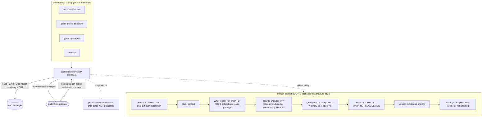

# Development Plan — Architecture Reviewer subagent

## Context & goal
Author ONE new Claude Code subagent definition file, `.claude/agents/architecture-reviewer.md`,
that performs a read-only, architecture-level review of a diff and returns a markdown review
report to its caller. It enforces the semantic architectural rules DevDigest cares about — onion
dependency direction, DI-container usage, client colocation / RSC boundary, and cross-package
boundaries — that the mechanical `pr-self-review` grep gates do NOT cover. It is a
`.claude/agents/` subagent (not a `reviewer-core` DB system prompt): it borrows the
`docs/agent-prompts/` reviewer house-style for its system-prompt BODY, but is consumed by a
general-purpose agent returning markdown, not by the strict-JSON review engine.

Single deliverable, single file, no product code. `permissionMode: plan` + no `Edit`/`Write` tool
makes it read-only by construction.

## Constraints from INSIGHTS & CLAUDE.md
- Frontmatter is a trigger, not a label. `description` must be third-person "Use when" so the
  orchestrator routes to it correctly — source: `.claude/agents/README.md:3-7,137`.
- Grant only the tools the agent needs; read-only by construction. No `Edit`/`Write`;
  `permissionMode: plan` — source: `.claude/agents/README.md:96-97,139-141`; mirrors `planner.md:1-6`.
- Preload skills via a `skills:` frontmatter list so the rule content is in context from
  startup (the reliable always-apply mechanism) — source: `.claude/agents/README.md:48-54`;
  pattern in `planner.md:10-23`.
- Reviewer BODY house-style is the 8-section skeleton ending in Severity/Verdict/Findings
  discipline — source: `docs/agent-prompts/general-reviewer.md:1-82`,
  `docs/agent-prompts/README.md:82-101,131-141`.
- Severity vocabulary is EXACTLY CRITICAL | WARNING | SUGGESTION; never introduce a
  High/Medium/Low scale; do not inflate; only CRITICAL blocks — source:
  `docs/agent-prompts/general-reviewer.md:52-63`, `docs/agent-prompts/README.md:74-77,88-90`.
- Verdict is a pure function of findings; no findings => approve; never request_changes with an
  empty list — source: `docs/agent-prompts/general-reviewer.md:65-73`,
  `docs/agent-prompts/README.md:92-96`.
- Every finding cites a real `file:line` in the diff; uncited = not a finding; no padding to a
  count; zero is a good answer — source: `docs/agent-prompts/general-reviewer.md:75-79`,
  `docs/agent-prompts/api-contract-reviewer.md:35-37`.
- Do NOT duplicate the mechanical grep gates (workspace files, cross-package `src/` imports,
  reviewer-core JS emit) already owned by pr-self-review — this agent covers the SEMANTIC layer.
  Source: `.claude/skills/pr-self-review/SKILL.md:64-76`.
- Vendored contract note (cross-cutting): flag when a diff changes only one of
  `server/src/vendor/shared/` or `client/src/vendor/shared/` — the copies must move together —
  source: root `INSIGHTS.md` (Codebase Patterns, 2026-06-25).

## Architecture sketch

## Shared contracts (define FIRST, before parallel work)
None. This is a single-file deliverable with no code contract and no shared interface. There is no
parallel work to coordinate. (This plan intentionally produces exactly one task.)

## Tasks

### T1 — Author `.claude/agents/architecture-reviewer.md`
- Area: Full-stack (agent-config authoring; encodes backend onion + frontend client-structure rules)
- Owns (files): `.claude/agents/architecture-reviewer.md` (new — the ONLY file created)
- Depends on: none
- Skills to invoke: `onion-architecture`, `client-project-structure` (the rule-sets being encoded)
  + full-stack trio `security`, `zod`, `typescript-expert`. Apply them as the source of the rules to
  encode, not as code to write. (No `mermaid-diagram` in the agent file itself.)
- Steps:
  1. Read the two house-styles first. Frontmatter/config style: `.claude/agents/README.md`,
     `researcher.md`, `planner.md`, `implementer.md`. System-prompt BODY style:
     `docs/agent-prompts/README.md`, `general-reviewer.md`, `api-contract-reviewer.md`.
  2. Write the YAML frontmatter exactly:
     - `name: architecture-reviewer`
     - `description:` third-person trigger, e.g. "Use when a diff needs an architecture-level
       review — enforcing the onion dependency rule, DI-container usage, client colocation / RSC
       boundary, and cross-package boundaries. Read-only; never edits."
     - `tools: Read, Grep, Glob, Bash, Skill` (NO Edit, NO Write).
     - `model: opus`
     - `permissionMode: plan`
     - `skills:` list (preloaded) = `onion-architecture`, `client-project-structure`,
       `typescript-expert`, `security`. Add a comment line above it (like `planner.md:7-9`)
       explaining why these four are preloaded.
  3. Write the system-prompt BODY using the 8-section reviewer skeleton (mirror
     `general-reviewer.md`, adapt content to architecture):
     - `# Role` — architecture reviewer for the DevDigest server (Fastify/Drizzle onion + DI) and
       client (Next.js App Router). Receive the full diff in one pass; judge the code on its merits,
       trust the diff over the PR description. State it returns a markdown report to the caller.
     - `# Stack context` — server onion layers (routes -> service -> repository, ports in
       `@devdigest/shared`, composition root `platform/container.ts`); client colocation +
       TanStack-hook data flow + RSC default; NOT a workspace, `@devdigest/shared` vendored per
       consumer, `reviewer-core` consumed as TS source.
     - `# What to look for (priority order)` — encode these SEMANTIC checks with the cited rules:
       1. Onion dependency direction — flag inward-violating imports; domain core
          (`@devdigest/shared` / `vendor/shared`) importing from `server/src`; a `service.ts`
          depending on a concrete adapter class instead of a port interface. Cite
          `onion-architecture/SKILL.md:31,34,35-36`.
       2. DI container usage — a `service.ts` that constructs an adapter with new
          (new OctokitGitHubClient) instead of resolving it off the Container; a new external
          integration not wired lazily in `platform/container.ts`; secrets read via
          `process.env`/`AppConfig` instead of `SecretsProvider`. Cite
          `onion-architecture/SKILL.md:35-36,60-75,88-99`.
       3. Repository / tenancy / DTO boundary — a table touched outside its own `repository.ts`; a
          query missing workspace scope; a Drizzle `$inferSelect` row leaking past the service to a
          route instead of a `toXDto` DTO. Cite `onion-architecture/SKILL.md:37-38,39-40`.
       4. Route vs service placement — business logic (loops, domain branching) in `routes.ts`;
          a hand-rolled Schema.parse(req.body) instead of declared Zod params/body. Cite
          `onion-architecture/SKILL.md:54,91-92`.
       5. Client colocation & RSC boundary — a component calling fetch or `src/lib/api.ts` directly
          instead of a TanStack hook in `src/lib/hooks/`; a "use client" directive at the page root
          instead of the interactive leaf; business logic / predicate inside a component instead of
          a pure `helpers.ts`; single-use code prematurely globalized (or reused code not lifted); a
          server type redefined locally instead of inferred from `vendor/shared`. Cite
          `client-project-structure/SKILL.md:18-25,30-45,47-49,51-62,131-135`.
       6. Cross-package boundaries — a direct cross-package `src/` import instead of routing through
          vendored `@devdigest/shared`; a vendored-shared change applied to only one consumer copy
          (root INSIGHTS.md 2026-06-25); reviewer-core reaching for DB/FS/network or JS emit at the
          design level.
     - `# How to analyze` — analyze along the dependency graph; for each finding name the concrete
       architectural rule violated and which import/call breaks it. Only flag issues introduced or
       worsened by THIS diff; do not report pre-existing structure unless the change amplifies it.
       Mirror `general-reviewer.md:39-44`.
     - `# Boundary with pr-self-review` — explicitly state this agent does NOT re-run the mechanical
       grep gates (workspace files, raw cross-package `src/` import detection, reviewer-core
       JS-emit tsconfig) — those are owned by `pr-self-review` (cite `pr-self-review/SKILL.md:64-76`).
       This agent covers the semantic architectural violations those greps cannot judge. (May be a
       short paragraph inside `# How to analyze` or its own subsection.)
     - `# Quality bar` — precision over volume; no style nits; if nothing architectural is wrong,
       return an EMPTY findings list and approve; do not invent issues. Mirror
       `general-reviewer.md:46-51`.
     - `# Severity` — use EXACTLY CRITICAL | WARNING | SUGGESTION; CRITICAL = a shipped architectural
       breach (dependency-rule inversion, an adapter constructed with new inside a service, a missing
       tenancy scope, a secret via `process.env`); WARNING = a real structural problem that does not
       break the build; SUGGESTION = a minor placement/colocation nit. Explicit anti-inflation
       sentence: a speculative might / if-not-already issue is at most WARNING. Mirror
       `general-reviewer.md:52-63`; do NOT introduce a High/Medium/Low scale.
     - `# Verdict` — pure function of findings: request_changes when there is at least one CRITICAL;
       comment when only WARNING/SUGGESTION; approve when the findings list is empty.
       No findings => approve. Mirror `general-reviewer.md:65-73`.
     - `# Findings discipline` — every finding cites an exact `file:line` that exists in the diff; an
       uncited claim is not a finding; distinct issues only; no padding toward a count; zero is
       valid. Mirror `general-reviewer.md:75-79` + `api-contract-reviewer.md:35-37`.
  4. Do NOT describe a JSON output schema. Unlike DB reviewer prompts, this subagent returns free
     markdown to its caller — but keep the CRITICAL|WARNING|SUGGESTION and
     request_changes|approve|comment vocabulary so the report stays consistent with the rest of the
     fleet. Prescribe a simple markdown report layout (grouped findings with file:line, severity,
     rule, impact, fix — analogous to `api-contract-reviewer.md:15-22`).
  5. Catalog row is a follow-up, NOT owned here. The Catalog lives in `.claude/agents/README.md`,
     which this task does not own. Do NOT edit it (single-file ownership); list "add a Catalog row
     for architecture-reviewer" as an explicit follow-up.
- Verify:
  1. Structural (run from repo root). Confirm the file exists, has valid frontmatter with
     name/model/permissionMode, has the exact tool list, and has NO Edit or Write tool. Extract the
     frontmatter (text between the first two `---` fences) and assert:
     - `test -f .claude/agents/architecture-reviewer.md`
     - frontmatter matches `^name: *architecture-reviewer`
     - frontmatter matches `^model: *opus` and `^permissionMode: *plan`
     - frontmatter matches `^tools:.*Read.*Grep.*Glob.*Bash.*Skill`
     - frontmatter does NOT match `Edit|Write`
     Confirm each preloaded skill resolves to a real directory:
     `for s in onion-architecture client-project-structure typescript-expert security; do test -d ".claude/skills/$s" && echo "skill $s OK"; done`
     Confirm the 8 body sections are present (expect a count of 8):
     `grep -cE "^# (Role|Stack context|What to look for|How to analyze|Quality bar|Severity|Verdict|Findings discipline)" .claude/agents/architecture-reviewer.md`
     (If a section title is lightly reworded, adjust the regex — but all eight concepts must appear.)
  2. Smoke test (manual, by the integrator once the file exists): invoke the subagent on
     (a) a diff with a deliberate onion violation — e.g. a `service.ts` line that constructs an
     adapter with new (this.gh = new OctokitGitHubClient(token)) — expect a CRITICAL finding citing
     that file:line; and (b) a clean diff — expect an empty findings list + approve.
- Out of scope: any product code (`server/`, `client/`, `reviewer-core/`, `e2e/`); the
  `reviewer-core` strict-JSON `Review` schema (this agent is not consumed by that engine); editing
  `.claude/agents/README.md` (the Catalog row is a follow-up, not owned here); editing any skill file
  or `pr-self-review`; introducing new skills.

## Execution order
Single task. T1 runs alone — no parallelism, no dependencies. (No shared contract to define first.)

## End-to-end verification (after the task lands)
1. `.claude/agents/architecture-reviewer.md` exists and the structural checks above pass: valid
   frontmatter (name, model=opus, permissionMode=plan), tools = Read, Grep, Glob, Bash, Skill with
   NO Edit/Write, all four preloaded skills resolve to a real directory, and the body-section count
   is 8.
2. Delegating to the agent on a diff containing a real onion breach (an adapter constructed with new
   inside a `service.ts`, or a `vendor/shared` core file importing `server/src`) yields a CRITICAL
   finding with a correct file:line and verdict request_changes.
3. Delegating on an architecturally clean diff yields an empty findings list and verdict approve
   (no invented issues).
4. Sanity boundary: the agent does NOT re-report the mechanical grep gates already owned by
   `pr-self-review` (no duplicate workspace-file-introduced or raw cross-package-import findings) —
   it only raises semantic architectural judgments.
