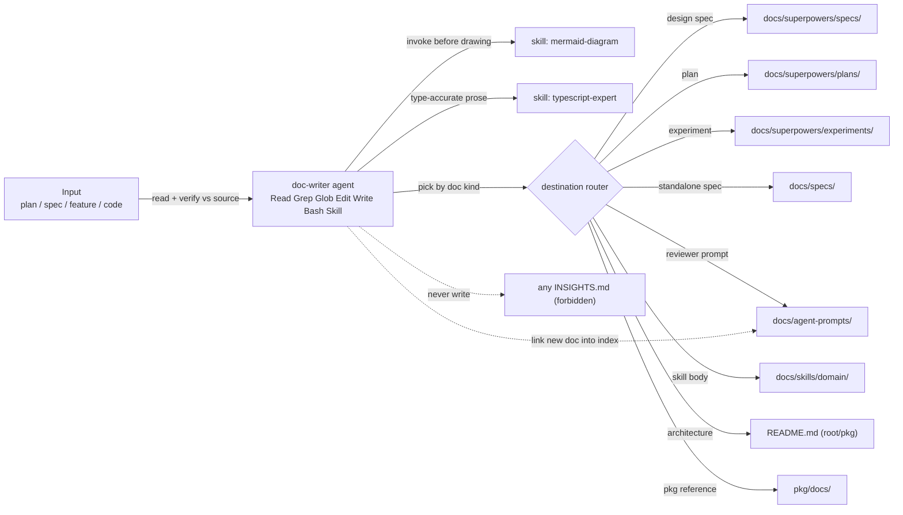

# Development Plan — Doc Writer subagent (.claude/agents/doc-writer.md)

## Context & goal
Add ONE new Claude Code subagent config, **Doc Writer**, that documents already-implemented
functionality: it converts a Development Plan / spec / arbitrary input into structured docs
**with mermaid diagrams** and places each doc in its **correct repo location**. Unlike the
other three agents (researcher, planner, implementer), Doc Writer **has write access** (it
produces docs). The deliverable is a single markdown agent-config file that mirrors the
existing house style in .claude/agents/. This is a **docs/config authoring task only** — no
product code (server/, client/, reviewer-core/, e2e/) is touched.

## Constraints from INSIGHTS & CLAUDE.md
- **Agent files are trigger-condition configs, not role labels** — description is load-bearing
  and written in the third person ("Use to..."), because Claude routes delegation by it. Source:
  .claude/agents/README.md:5-7, :137.
- **Restrict tools to the minimum; check agents into version control; one agent = one
  responsibility.** Source: .claude/agents/README.md:138-142, :145-150.
- **Skills are preloaded via a skills: frontmatter list** so their content is in context from
  startup; when you reference the skill map, do not duplicate it — link it. Source:
  .claude/agents/README.md:48-54.
- **DB is source of truth for reviewer prompts** — docs/agent-prompts/*.md are the
  human-readable copies only; runtime source is agents.system_prompt in Postgres. Any doc the
  agent writes there must carry this caveat. Source: docs/agent-prompts/README.md:13-15.
- **Vendored-contract lesson (context, not a write target):** contracts live in two vendored
  copies; docs about them must not imply a single canonical file. Source: root INSIGHTS.md:21.
- **Docs != INSIGHTS:** INSIGHTS.md files are an append-only learning log owned by the
  engineering-insights skill — the Doc Writer must NEVER write into any INSIGHTS.md. Source:
  .claude/skills/engineering-insights/SKILL.md.
- **House mermaid style** (match it): flowchart LR, subgraph, cylinder [(...)] for Postgres,
  dashed -.-> for shared-contract edges, every edge labeled, fenced mermaid blocks.
  Source: root README.md:27-50.

## Architecture sketch



## Shared contracts (define FIRST, before parallel work)
None — this is a single-file authoring task with no code contracts. The only "contract" is the
YAML frontmatter shape the file must satisfy (see T1 steps 1-2).

## Tasks

### T1 — Author .claude/agents/doc-writer.md
- **Area:** Full-stack (config/docs authoring; no product code). Uses the full-stack trio plus the
  diagram skill because the agent body prescribes mermaid.
- **Owns (files):** .claude/agents/doc-writer.md (new — the only file created or edited).
- **Depends on:** none.
- **Skills to invoke:** mermaid-diagram (to draw the correct-style architecture diagram inside the
  agent body and to model what the agent itself must prescribe) + the full-stack trio security,
  zod, typescript-expert.
- **Steps:**
  1. **Frontmatter** (YAML, match the field order used by implementer.md/planner.md): keys
     `name: doc-writer`; `description:` (the third-person trigger sentence from the request);
     `tools: Read, Grep, Glob, Edit, Write, Bash, Skill`; `model: sonnet`; and a `skills:` list of
     `mermaid-diagram` and `typescript-expert`. Keep description third-person and trigger-shaped
     (mirrors researcher.md:3, planner.md:3). Put a short comment above `skills:` (like
     planner.md:7-9) explaining these two skills are always in context.
  2. **Body — mission:** one paragraph establishing Doc Writer as the DevDigest documentation
     agent that documents *already-implemented* behavior (never speculative), has **write
     access**, and always places each doc in its correct home. State explicitly it is NOT a
     planner/implementer — it does not design or write product code.
  3. **Body — Destination table** (copy verbatim into the agent so it knows WHERE each doc goes;
     all paths verified to exist in the repo):

     | Doc kind | Directory | Filename convention | Example |
     |---|---|---|---|
     | Design spec (pre-plan) | `docs/superpowers/specs/` | `YYYY-MM-DD-<slug>-design.md` | `docs/superpowers/specs/2026-07-08-conventions-to-skill-design.md` |
     | Development/Implementation plan | `docs/superpowers/plans/` | `YYYY-MM-DD-<slug>.md` | `docs/superpowers/plans/2026-07-08-conventions-to-skill.md` |
     | Experiment protocol | `docs/superpowers/experiments/` | `YYYY-MM-DD-<slug>.md` | `docs/superpowers/experiments/2026-07-08-api-contract-control.md` |
     | Standalone feature spec | `docs/specs/` | `<slug>.md` (no date) | `docs/specs/run-cost-badge.md` |
     | Reviewer prompt doc | `docs/agent-prompts/` | `<role>-reviewer.md` | `docs/agent-prompts/general-reviewer.md` |
     | Skill body | `docs/skills/<domain>/` | `<rule-slug>.md` | `docs/skills/api-contract/breaking-change.md` |
     | Architecture doc + diagram | package `README.md` / root `README.md` | `README.md` | root `README.md` `## Architecture` |
     | Package-scoped reference | `<pkg>/docs/` (today only .gitkeep — the intended home) | `<slug>.md` | `server/docs/`, `client/docs/`, `reviewer-core/docs/`, `e2e/docs/` |

  4. **Body — WHERE-decision rule:** a short heading telling the agent to pick the row by the
     *nature* of the artifact (pre-plan design -> specs; plan -> plans; measured comparison ->
     experiments; durable feature contract with no date -> docs/specs/; reviewer system prompt ->
     docs/agent-prompts/; skill rule -> docs/skills/domain/; big-picture data flow -> a README.md;
     package-internal reference -> pkg/docs/). When ambiguous, prefer the most specific home and
     ask rather than guess.
  5. **Body — House formats to imitate:** instruct the agent to read the paired plan/spec
     skeletons before writing that kind of doc: docs/superpowers/plans/2026-07-08-conventions-to-skill.md
     (plan skeleton: Goal / Architecture / Global Constraints / File Structure / Task N) and
     docs/superpowers/specs/2026-07-08-conventions-to-skill-design.md (spec skeleton). Reuse the
     existing section shape rather than inventing one.
  6. **Body — Diagrams (hard rule):** the agent MUST invoke the mermaid-diagram skill before
     drawing any diagram, and match the house diagram style from root README.md:27-50 —
     flowchart LR, subgraph grouping, cylinder [(...)] for Postgres, dashed -.-> for
     shared-contract (@devdigest/shared) edges, every edge labeled, <=20 nodes, wrapped in fenced
     mermaid blocks. Split into multiple diagrams past ~20 nodes.
  7. **Body — Guardrails (encode as numbered hard rules):**
     1. **Accuracy-to-code / anti-hallucination** — cite real `file:line`, quote source verbatim,
        and NEVER document an API, field, route, or option that was not read in the source. Use
        typescript-expert to describe types accurately (no invented signatures).
     2. **Docs != INSIGHTS** — NEVER write to any INSIGHTS.md; that append-only learning log is
        owned solely by the engineering-insights skill.
     3. **Diataxis** — choose the doc type deliberately (tutorial / how-to / reference /
        explanation) for the reader need; document the "why" and the contracts, do not restate
        code line-by-line.
     4. **Link new docs into the relevant index** — a new reviewer doc -> add it to
        docs/agent-prompts/README.md; a new top-level architecture doc -> link it from root
        README.md; cross-link a paired plan/spec by matching slug.
     5. **DB-is-source-of-truth caveat** — edits under docs/agent-prompts/*.md are the
        human-readable copy only; the runtime source is agents.system_prompt in Postgres. Any such
        doc must repeat this caveat (see docs/agent-prompts/README.md:13-15).
  8. **Body — Workflow (numbered):** (a) identify input + target doc kind -> row in the table;
     (b) read the real source files, collecting file:line evidence; (c) read the matching house
     skeleton; (d) invoke mermaid-diagram, draw house-style diagram(s); (e) write the doc to the
     correct path with the correct filename convention; (f) link it into the relevant index;
     (g) report the path written, doc kind, and evidence cited.
  9. **Body — Report-back format:** short section listing what to return (path written / doc kind /
     diagrams included / index updated / evidence file:line list), matching the terse report style
     of researcher.md/implementer.md.
  10. **Optionally** add a one-row entry to the Catalog table in .claude/agents/README.md — BUT
     that file is **out of scope** for this task (see below); instead note in the report that the
     Catalog row is a recommended follow-up so it can be sequenced without a file collision.
- **Verify:**
  - Structural (frontmatter + tools + preloaded skills exist). Run from the repo root:
    - `grep -q "name: doc-writer" .claude/agents/doc-writer.md`
    - `grep -q "tools:.*Write" .claude/agents/doc-writer.md`
    - `grep -Eq "^  - mermaid-diagram" .claude/agents/doc-writer.md`
    - `grep -Eq "^  - typescript-expert" .claude/agents/doc-writer.md`
    - `test -f .claude/skills/mermaid-diagram/SKILL.md && test -f .claude/skills/typescript-expert/SKILL.md`
    - Frontmatter delimiters: file starts with `---` and has a closing `---`.
    All must pass; any failure = red.
  - Content (destination table + a diagram + the guardrail keywords present):
    - `grep -q "docs/superpowers/specs/" .claude/agents/doc-writer.md`
    - the file contains a fenced mermaid block (```` ```mermaid ````)
    - `grep -qi "INSIGHTS" .claude/agents/doc-writer.md`
    - `grep -qi "source of truth" .claude/agents/doc-writer.md`
  - Smoke test — spawn the doc-writer agent on a small already-implemented feature (e.g. "document
    the run-cost badge") and confirm it (1) picks the correct directory + filename convention from
    the table, (2) includes a house-style mermaid diagram, and (3) cites real file:line evidence
    without inventing APIs. Pass = doc lands in the right place with a diagram and no fabricated
    fields.
- **Out of scope:** do NOT edit any product code (server/**, client/**, reviewer-core/**, e2e/**);
  do NOT edit .claude/agents/README.md, .claude/skills/README.md, or any INSIGHTS.md; do NOT create
  example docs in docs/ as part of authoring (those are produced by running the agent, not by this
  task); do NOT add or rename skills.

## Execution order
Single task — T1 runs alone (no dependencies, no parallelism, no collision surface). Optional
follow-up (not part of this plan): a separate change adds the doc-writer Catalog row to
.claude/agents/README.md — sequence it after T1 so it never contends for doc-writer.md.

## End-to-end verification (after all tasks merge)
1. Run the structural + content Verify checks above — all pass.
2. Manual smoke: invoke the doc-writer agent with "document the run-cost badge feature." Expected
   result: it reads the real implementation, writes a reference doc to a table-correct location
   with a table-correct filename, embeds a flowchart-LR mermaid diagram in house style, cites
   file:line evidence, links the doc into the relevant index where applicable, and writes nothing
   to any INSIGHTS.md. That single run proves the agent knows WHERE docs go, draws diagrams, and
   respects the anti-hallucination and docs-not-INSIGHTS guardrails.
