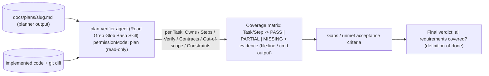

# Development Plan — Plan Verifier subagent

## Context & goal
Add ONE new Claude Code subagent config file, `.claude/agents/plan-verifier.md`, that
verifies an **already-implemented** change against **its Development Plan** — a
requirements-traceability pass: every Task / Owns / Step / Verify / Shared-contract
in the plan is mapped to concrete evidence in the code and labelled **PASS / PARTIAL /
MISSING**. It answers "was everything in the plan actually delivered?", NOT "is the code
good?" (that is the Architecture Reviewer's job) and NOT "does the diff obey the skills?"
(that is `pr-self-review`). The deliverable is a Markdown agent-config file in the
existing house style of `.claude/agents/` (`researcher.md`, `planner.md`, `implementer.md`,
`README.md`). Read-only by construction. This is a single-file authoring task — no product
code, no package touched.

## Constraints from INSIGHTS & CLAUDE.md
- **House style is fixed:** every agent file is YAML frontmatter (`name`, `description`,
  `tools`, `model`, optional `permissionMode` / `isolation`, optional `skills:` preload)
  + a system-prompt body; `description` is written as a **third-person trigger condition**,
  not a role label — source: `.claude/agents/README.md:5-7`, `.claude/agents/README.md:137`.
- **Read-only agents are read-only by construction:** `permissionMode: plan` + no
  Edit/Write in `tools` + minimum tools — mirror how `planner` is declared —
  source: `.claude/agents/planner.md:4-6`, `.claude/agents/README.md:96`.
- **Grant only the tools the agent needs; route model by task** (Opus for reasoning-heavy
  analysis) — source: `.claude/agents/README.md:139-141`.
- **The input it consumes is the planner's output template**, written to
  `docs/plans/<slug>.md`: sections `# Development Plan`, `## Context & goal`,
  `## Constraints from INSIGHTS & CLAUDE.md`, `## Architecture sketch`, `## Shared
  contracts`, `## Tasks` (each Task = `Area / Owns (files) / Depends on / Skills to invoke
  / Steps / Verify / Out of scope`), `## Execution order`, `## End-to-end verification` —
  source: `.claude/agents/planner.md:118-152`, Task fields at `.claude/agents/planner.md:136-143`.
- **Evidence discipline (from `researcher`):** cite `file:line` for every codebase claim;
  never invent findings; an honest "not found" is a valid result — the verifier must apply
  the same rule as MISSING when evidence is absent — source: `.claude/agents/researcher.md:23-24`.
- **Boundary vs `pr-self-review`:** `pr-self-review` routes the open **diff** through the
  domain skills + project rules and gates push; the Plan Verifier checks the **diff against
  a written plan's Tasks/Steps/Verify** — orthogonal axis, do not duplicate —
  source: `.claude/skills/README.md` (pr-self-review row), `.claude/agents/README.md:20`.
- **NOT a workspace / no cross-package edits:** irrelevant to this task's file, but the agent
  prompt must not instruct running workspace tooling — source: root `CLAUDE.md` do-not-touch zones.

## Architecture sketch

Workflow position: it runs **after** implementers merge and **beside** the Architecture
Reviewer — coverage axis, not quality axis. It never edits; it reads the plan, reads/greps
the code, and runs each Task's declared Verify command (Bash, read-only) to confirm it PASSES.

## Shared contracts (define FIRST, before parallel work)
None — single deliverable, no code contract. The one "interface" this agent depends on is
the **planner plan template** it reads (`.claude/agents/planner.md:118-152`); the agent body
must mirror that section/field list verbatim so a future edit to the planner template is
easy to keep in sync.

## Tasks

### T1 — Author `.claude/agents/plan-verifier.md`
- **Area:** Full-stack (Markdown agent-config authoring — no framework/product code)
- **Owns (files):** `.claude/agents/plan-verifier.md` (new; sole file)
- **Depends on:** none
- **Skills to invoke:** security, zod, typescript-expert (full-stack trio, always) +
  mermaid-diagram (only if you embed a diagram in the body). No Backend/Frontend/Core
  framework skills — this is a prose config file, not product code.
- **Steps:**
  1. **Frontmatter** — write YAML matching the house style (`.claude/agents/README.md:5-7`):
     - `name: plan-verifier`
     - `description:` third-person trigger, verbatim intent: "Use to verify an
       already-implemented change against its Development Plan — checks every
       Task/Owns/Step/Verify/Shared-contract was delivered (requirements traceability),
       not general code quality. Read-only."
     - `tools: Read, Grep, Glob, Bash, Skill`  (NO Edit, NO Write — read-only by construction)
     - `model: opus`
     - `permissionMode: plan`
     - `skills:` preload list (exactly, in this order):
       `onion-architecture`, `client-project-structure`, `react-testing-library`,
       `typescript-expert`, `zod`, `security` — so the verifier knows the conventions a
       plan's Steps/Constraints reference when it checks whether they were honored. Add the
       sync-note comment like `planner.md:7-9` / `implementer.md:6-9` ("keep in sync with
       `.claude/skills/README.md`").
  2. **Body — identity & mission:** state it is *Plan Verifier*, read-only by construction,
     and that its ONE axis is **requirements traceability: plan item -> evidence in code
     (PASS/PARTIAL/MISSING)**. Explicitly disclaim the two adjacent axes: it is NOT the
     Architecture Reviewer (code quality / best-practices) and NOT `pr-self-review` (diff vs
     skills/rules). Call out the orthogonal axis in prose.
  3. **Body — the input it consumes:** describe the planner plan template it reads from
     `docs/plans/<slug>.md`, listing every section and the per-Task field set
     (`Area / Owns (files) / Depends on / Skills to invoke / Steps / Verify / Out of scope`),
     mirroring `.claude/agents/planner.md:118-152` so the verifier knows exactly what to
     check against. Include how it locates the plan (argument path, or newest under
     `docs/plans/`).
  4. **Body — per-Task traceability procedure** (encode as an explicit checklist run for EACH Task):
     1. **Owns:** were the listed files actually created/changed? Confirm via `git diff` /
        `git log` / Read.
     2. **Steps:** is each step implemented? Cite `file:line` evidence.
     3. **Verify:** does the declared command exist and **PASS**? Run it with Bash
        (read-only — tests/typecheck only; never mutate git or files) and capture output.
     4. **Shared contracts:** defined exactly as specified (Zod schema / interface, required shape)?
     5. **Out of scope:** respected — nothing extra touched beyond the Task's Owns?
     6. **Constraints from INSIGHTS/CLAUDE.md:** honored in the delivered code?
  5. **Body — evidence discipline:** **no evidence = MISSING, never assume** (mirror
     `researcher.md:23-24`); every claim cites `file:line` or literal command output.
  6. **Body — output format:** prescribe a report containing (a) a **coverage matrix**
     `Task/Step -> PASS | PARTIAL | MISSING + evidence (file:line or command output)`;
     (b) a **gaps list** of unmet acceptance criteria; (c) a **final verdict**. Explicitly
     distinguish **acceptance criteria** (per-Task Verify/Steps) from **definition-of-done**
     (the plan's global `## End-to-end verification`). Reference the external grounding by
     name: *requirements-traceability matrix*, *acceptance-criteria vs definition-of-done*.
  7. **Body — working style / guardrails:** read-only (Bash only for read-only inspection and
     running the plan's own Verify commands); if the plan file is missing/ambiguous, return a
     short clarification block and stop (mirror `researcher.md:34-43` interview mode). Keep the
     report scannable — the matrix carries the content.
  8. Match the tone, section depth, and Markdown conventions of `planner.md` / `implementer.md`
     (headings, bold field labels, tables). Keep it self-contained: a fresh-context verifier
     must be able to run from this file alone.
- **Verify:**
  1. **Structural (Bash, read-only):** confirm the file exists and its frontmatter is valid.
     Run a `node -e` script that parses the frontmatter block and asserts: `name: plan-verifier`,
     `model: opus`, `permissionMode: plan` present; `tools` includes Read/Grep/Glob/Bash/Skill;
     the frontmatter contains NO `Edit` and NO `Write`; and each of the six preload skills
     (`onion-architecture`, `client-project-structure`, `react-testing-library`,
     `typescript-expert`, `zod`, `security`) is both listed in frontmatter AND exists as a
     directory under `.claude/skills/`. Expected: prints `FRONTMATTER OK` and exits 0.
  2. **Content check (Grep):** confirm the body encodes the procedure and output contract —
     each token matches at least once: `PASS`, `PARTIAL`, `MISSING`, `coverage matrix`,
     `traceability`, `Owns`, `Verify`, `Shared contract`, `Out of scope`, `acceptance criteria`,
     `definition-of-done`, `file:line`. Expected: all present.
  3. **Smoke test (manual, read-only):** feed the agent an existing plan
     `docs/superpowers/plans/2026-07-01-pulls-onion-refactor.md` (or any file in
     `docs/superpowers/plans/`) + the current code; confirm it produces a coverage matrix with
     PASS/PARTIAL/MISSING verdicts and cited evidence — not prose commentary. Expected: a filled
     matrix + a final verdict, no Edit/Write attempted.
- **Out of scope:** do NOT edit any other file — not `README.md`, not `planner.md`,
  `implementer.md`, `researcher.md`, no skill, no product code. (Updating the Catalog table in
  `.claude/agents/README.md` is intentionally deferred and owned by no task here, to keep this
  single-file plan collision-free — flag it as a follow-up in the report.)

## Execution order
Single task. `T1` runs alone; no dependencies, no parallelism needed.

## End-to-end verification (after T1)
1. Run the T1 Verify step 1 frontmatter script -> prints `FRONTMATTER OK` (valid frontmatter,
   read-only, all six skills resolve).
2. Run the T1 Verify step 2 Greps -> every required keyword present.
3. Run the T1 smoke test: point the new `plan-verifier` agent at
   `docs/superpowers/plans/2026-07-01-pulls-onion-refactor.md` + the repo -> it emits a coverage
   matrix (`Task/Step -> PASS|PARTIAL|MISSING + evidence`), a gaps list, and a final verdict, and
   makes zero write attempts.

Passing all three proves the agent is well-formed, read-only, correctly scoped to
requirements-traceability, and usable end-to-end.
