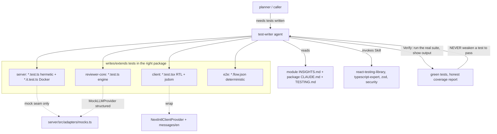

# Development Plan — Test Writer subagent (`.claude/agents/test-writer.md`)

## Context & goal
Create ONE new Claude Code subagent definition, **Test Writer**, that writes and extends
automated tests across all four DevDigest packages (`server/` unit + `*.it.test.ts`,
`client/` React Testing Library, `reviewer-core/` pure engine, `e2e/`). It sits alongside
the existing `researcher` / `planner` / `implementer` agents and must match their house
style exactly (YAML frontmatter + system-prompt body). The deliverable is a **single
markdown config file** — no product code changes. Unlike the `implementer`, the Test
Writer has write access (it writes test files) and is a specialist: it produces tests,
verifies them against real output, and reports coverage honestly rather than self-certifying.

## Constraints from INSIGHTS & CLAUDE.md
These are hard rules the agent body MUST encode (each cited to source):

- **Testing is typological, not exhaustive** — cover the *kinds* of things that break per
  layer (happy path + the edge that matters), skip the rest. Source: `TESTING.md:8-24`.
- **DB-backed tests MUST use the `*.it.test.ts` suffix** (testcontainers, real Postgres,
  self-skip when Docker is unavailable). The unit lane excludes that glob; the integration
  lane selects only it. Source: `TESTING.md:79-86`, `TESTING.md:50-51`.
- **Do NOT add `test:unit` / `test:integration` npm scripts** — `server/package.json` is
  `skip-worktree`; CI invokes the split with explicit `pnpm exec vitest run …`.
  Source: `TESTING.md:83-86`, `server/CLAUDE.md` (Do-not-touch zones).
- **Hermetic by default** — mock the outside world only at the designated seam
  `server/src/adapters/mocks.ts` (`MockLLMProvider`, `MockGitClient`, `MockGitHubClient`,
  `MockEmbedder`, `MockCodeIndex`, `MockAuthProvider`, `MockSecretsProvider`), injected via
  `buildApp({ config, overrides })`. Never real network/keys. Source: `TESTING.md:87-88`,
  `server/src/adapters/mocks.ts:58,130,254`, `server/test/routes-smoke.test.ts:22-38`.
- **Server route tests use `app.inject()`** and assert status code + response envelope
  (e.g. `res.json().error.code === 'validation_error'` on 422). Source:
  `server/test/routes-smoke.test.ts:14-66`.
- **Integration tests gate on Docker** with `const d = hasDocker ? describe : describe.skip`
  and start Postgres via `test/helpers/pg.ts`. Source: `server/test/integration.it.test.ts:11-19`.
- **reviewer-core tests inject `MockLLMProvider({ structured })`** and assert grounding /
  score behavior on the real assemble → complete → reduce → grounding pipeline; the
  grounding gate drops hallucinated findings (line not in diff) and the model's self-reported
  score is IGNORED. Source: `reviewer-core/test/run.test.ts:1-40`, `server/CLAUDE.md`
  ("Grounding gate is mandatory; model's self-reported score is IGNORED").
- **client RTL tests wrap components in `NextIntlClientProvider`** with `messages/en/*.json`
  and query by role/text. Source:
  `client/src/app/repos/[repoId]/pulls/[number]/_components/FindingCard/FindingCard.test.tsx:1-30`.
  NOTE: that existing file uses `fireEvent`; the `react-testing-library` skill and this
  plan's guardrails prefer `userEvent.setup()` — the agent must prescribe `userEvent` for
  new interaction tests even though one legacy file uses `fireEvent`.
- **House-style facts to imitate** (from sibling agents): `description` is a third-person
  trigger condition, not a role label (`.claude/agents/README.md:5-7`); frontmatter carries
  `name` / `description` / `tools` / `model` and an optional `skills:` preload list
  (`implementer.md:1-23`); the body mirrors implementer's numbered structure —
  read-insights, invoke-skills, work-within-guardrails, self-verify, report, capture insights
  (`implementer.md:35-122`).

## Architecture sketch

## Shared contracts (define FIRST, before parallel work)
None. This plan authors a single self-contained markdown file with no code contracts and
no cross-file dependency. It is intentionally a **one-task plan** (per the sizing heuristic:
a coherent unit one implementer finishes and verifies alone).

## Tasks

### T1 — Author `.claude/agents/test-writer.md`
- **Area:** Full-stack (authoring an agent config; no product code). Content spans all four
  package testing conventions, so the writer must reference the backend + frontend + core
  test patterns even though the file itself is markdown.
- **Owns (files):** `.claude/agents/test-writer.md` (new). No other file is edited.
  Editing `.claude/agents/README.md` is **out of scope** (see below) to avoid collision with
  sibling planners running in parallel.
- **Depends on:** none.
- **Skills to invoke:** `react-testing-library`, `typescript-expert`, `zod`, `security`
  (the full-stack trio + RTL — exactly the frontmatter `skills:` preload set the agent will
  carry). Optionally consult `mermaid-diagram` only if adding a diagram to the agent body.
- **Steps:**
  1. Read the three sibling agents to lock the format: `.claude/agents/implementer.md`
     (closest analog — mirror its numbered body + report-back + insights wrap-up),
     `.claude/agents/planner.md`, `.claude/agents/researcher.md`, and
     `.claude/agents/README.md` (frontmatter rules, description-as-trigger convention).
  2. Write the **YAML frontmatter** exactly:
     - `name: test-writer`
     - `description:` a third-person trigger, e.g. *"Use when a DevDigest task needs
       automated tests written or extended — server unit + `*.it.test.ts` integration,
       client React Testing Library, reviewer-core engine, or e2e flows. It writes tests,
       verifies them against real output, and reports which behaviors are/aren't covered;
       it never weakens a test to make it pass and never certifies its own quality."*
     - `tools: Read, Grep, Glob, Edit, Write, Bash, Skill` (minimum for writing + running
       tests; NO WebSearch/WebFetch).
     - `model: sonnet`.
     - `skills:` preload list — `react-testing-library`, `typescript-expert`, `zod`,
       `security`, `engineering-insights` (exactly these five, in this order).
     - **No `permissionMode`** — it has write access by design (contrast planner's
       `permissionMode: plan`). Add a short comment above `skills:` explaining the preload,
       matching implementer.md's commented style.
  3. Write the **system-prompt body** as a numbered workflow mirroring `implementer.md`:
     - **Identity + scope:** it is the Test Writer; it writes/extends tests for all four
       packages; writer != reviewer — it does NOT grade its own output or run `pr-self-review`.
     - **Step 1 — Read before writing:** the target package's `INSIGHTS.md` + `CLAUDE.md`,
       and root `TESTING.md` (the unit/integration split authority). Map: `server/**` to
       `server/INSIGHTS.md`; `client/**` to `client/INSIGHTS.md`; `reviewer-core/**` to
       `reviewer-core/INSIGHTS.md`; `e2e/**` to `e2e/INSIGHTS.md`.
     - **Step 2 — Testing conventions (encode as hard rules):** typological not exhaustive
       (`TESTING.md:8-24`); `*.it.test.ts` suffix for DB-backed tests, self-skipping on no
       Docker (`TESTING.md:79-86`); do NOT add `test:unit`/`test:integration` scripts
       (server package.json is skip-worktree); hermetic-by-default via
       `server/src/adapters/mocks.ts`.
     - **Step 3 — Per-package patterns to imitate** (a small table/list), each citing a
       reference file the writer should read on site:
       - server: `app.inject()` + status/envelope asserts + mock overrides via
         `buildApp({ overrides })` -> `server/test/routes-smoke.test.ts`; DB-backed ->
         `server/test/integration.it.test.ts` (`hasDocker ? describe : describe.skip`,
         `test/helpers/pg.ts`).
       - client: RTL `getByRole`/`getByText`, `userEvent.setup()` (prefer over `fireEvent`),
         wrap in `NextIntlClientProvider` with `messages/en/*.json` ->
         `client/src/app/repos/[repoId]/pulls/[number]/_components/FindingCard/FindingCard.test.tsx`.
       - reviewer-core: `MockLLMProvider({ structured })`, assert grounding drops
         out-of-diff findings and the self-reported score is ignored ->
         `reviewer-core/test/run.test.ts`.
       - e2e: deterministic batch JSON `e2e/specs/*.flow.json` using only url/text/find
         locators, never the AI `chat` command (`TESTING.md:90-91`).
     - **Step 4 — Guardrails (hard rules in the prompt):** (1) never enshrine buggy
       behavior — derive expected values from the spec/contract; if real behavior looks
       wrong, FLAG it, don't assert it; (2) ban weak/tautological asserts (`toBeDefined`,
       `toBeTruthy`, `length > 0`); (3) no new snapshot tests unless explicitly asked;
       (4) mock only at designated seams, never the subject under test; (5) test behavior at
       the seam, not internals (no `useState`/CSS-class/hook-call-count asserts); (6)
       self-verify against real output and NEVER weaken a test to make it pass; (7) do not
       self-certify quality — list which behaviors WERE and WEREN'T covered.
     - **Step 5 — Self-verify (show output as evidence):** run the exact command for the
       package (see Verify below); iterate until green; never report success on a red run.
     - **Step 6 — Report back:** files added/changed, package, exact command run + key
       output line(s), and an explicit **coverage ledger** (behaviors covered vs. skipped
       and why) — writer != reviewer.
     - **Step 7 — Capture insights:** `engineering-insights` wrap-up against the touched
       package's `INSIGHTS.md` (append-only, dated statement + `file:line`).
  4. Embed the **exact Verify commands** in the body so the agent always runs the right one:
     - server unit: `cd server && pnpm exec vitest run --exclude '**/*.it.test.ts'`
     - server integration (Docker): `cd server && pnpm exec vitest run .it.test`
     - server typecheck: `cd server && pnpm typecheck`
     - client: `cd client && pnpm test` and `cd client && pnpm typecheck`
     - reviewer-core: `cd reviewer-core && npm test`
     - e2e: `cd e2e && npm test`
- **Verify:** Structural check on the authored file plus a behavioral smoke test that it
  produces a runnable, regression-catching test. Run:
  1. Frontmatter has the required keys, minimal tools, and NO `permissionMode`. Use a
     `grep`-based check (no extra deps): confirm `name: test-writer`, `model: sonnet`, a
     `tools:` line containing all of `Read, Grep, Glob, Edit, Write, Bash, Skill`, and
     `skills:` entries for `react-testing-library`, `typescript-expert`, `zod`, `security`,
     `engineering-insights` are present, and that `permissionMode` does NOT appear.
  2. Every preloaded skill exists on disk:
     `for s in react-testing-library typescript-expert zod security engineering-insights; do test -d ".claude/skills/$s" && echo "$s OK" || echo "$s MISSING"; done`
  3. Smoke test (behavioral): follow the agent's own instructions to write ONE throwaway
     test that asserts real behavior against a known regression; confirm it PASSES on current
     code, then hand-introduce the regression and confirm it FAILS — proving the generated
     test catches a real defect (not a tautology). Delete the throwaway test afterward.
     Suggested target: a server route smoke via `app.inject()` asserting the 422
     `validation_error` envelope (mirrors `server/test/routes-smoke.test.ts:56-66`), run with
     `cd server && pnpm exec vitest run --exclude '**/*.it.test.ts'`.
- **Out of scope:**
  - Do NOT edit `.claude/agents/README.md` (its Catalog table) — a sibling planner may own
    it; listing the new agent there is a separate follow-up task.
  - Do NOT add or modify any product code, permanent test files (the throwaway smoke test is
    deleted), `package.json` scripts, or CI workflows.
  - Do NOT add `test:unit`/`test:integration` scripts anywhere.
  - Do NOT introduce a workspace tool or cross-package `src/` imports (the agent body must
    still state these DevDigest invariants for the tests it writes).

## Execution order
Single task — no parallelism, no dependencies. `T1` runs alone and self-verifies.

## End-to-end verification (after the task lands)
1. Frontmatter renders valid (keys: `name`, `description`, `tools`, `model`, `skills`; NO
   `permissionMode`) — run T1 Verify #1 → prints `frontmatter OK`.
2. All five preloaded skills resolve on disk — T1 Verify #2 prints five `OK` lines.
3. Behavioral proof: the throwaway test generated by following the agent's instructions
   PASSES on clean code and FAILS when a real regression is injected (T1 Verify #3), then is
   removed — proving the agent writes regression-catching, non-tautological tests. Final
   state: repo has exactly one new file (`.claude/agents/test-writer.md`) and no leftover
   test artifacts.
