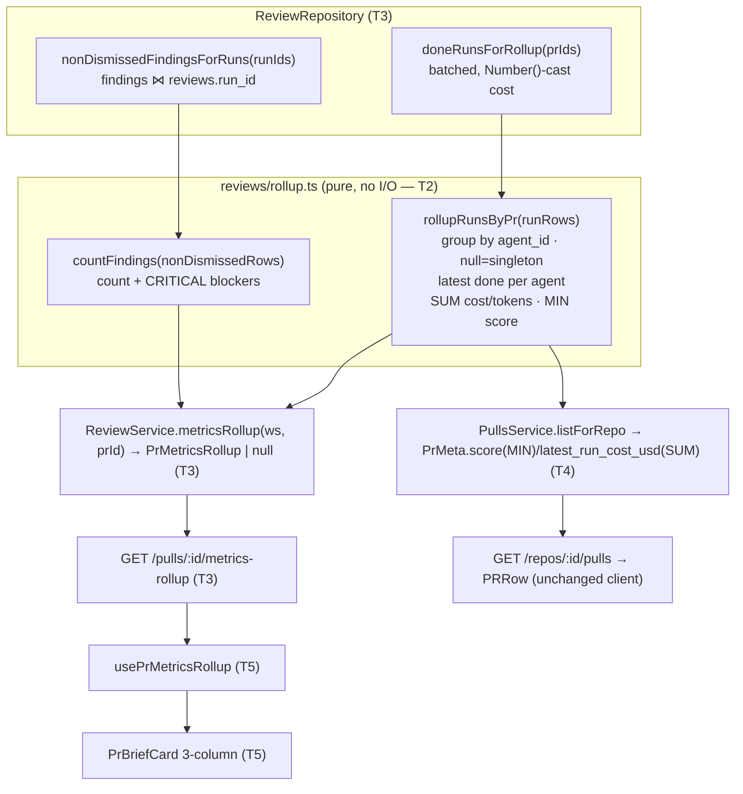

# Implementation Plan — PR Brief cross-run rollup & 3-column card layout

## Context & goal
Both the PR Brief top card and the PR-list SCORE/COST columns summarise a PR from a **single**
completed run, so a multi-agent PR shows only one agent's score/cost and hides the others.
This change computes one **PR-wide metrics rollup** server-side (latest `done` run per `agent_id`
→ SUM cost/tokens, MIN score, pooled non-dismissed findings/CRITICAL blockers) as the single
source of truth, exposes it on a new endpoint the card reads, re-sources the list SCORE/COST from
the same rollup logic, and restructures the card into three regions with a filled risk indicator.
Traced to spec `2026-08-11-pr-brief-rollup-layout` (approved, supersedes the implemented
`2026-08-08-pr-brief-card`).

## Requirements source
- Spec: `specs/2026-08-11-pr-brief-rollup-layout.md`
- Spec ID: `2026-08-11-pr-brief-rollup-layout` · Status: approved (supersedes `2026-08-08-pr-brief-card`, now implemented)
- Questions answered by the requester:
  - Q1 (rollup carrier) → **Option A**: new dedicated `GET /pulls/:prId/metrics-rollup → PrMetricsRollup | null` route + `usePrMetricsRollup` hook. `POST /pulls/:prId/brief` stays byte-identical (AC-17).
  - Q2 (execution mode) → **single-agent**.
  - Q2b (dead-code) → **leave** `reviewScoresForPrs` / `doneRunCostsForPrs` in the repository even though the list stops calling them; no cleanup task.

## Criteria coverage
<!-- Every AC in the spec mapped to the task(s) that deliver it. -->
| AC | Task | Notes |
|---|---|---|
| AC-1 (group by agent_id, latest done per agent) | T2, T3 | pure grouping in T2; done-run query in T3 |
| AC-2 (cost SUM, omit if all null) | T2, T3, T4, T5 | SUM ignoring null in T2; surfaced by consumers |
| AC-3 (tokens_in/out independent SUM) | T2 | |
| AC-4 (score MIN of non-null, else omit) | T2 | |
| AC-5 (findings pooled non-dismissed count) | T2, T3 | `countFindings` in T2; join query in T3 |
| AC-6 (blockers = non-dismissed CRITICAL) | T2, T3 | |
| AC-7 (server single source, both consumers, no client recompute) | T3, T4, T5 | endpoint T3; list T4; card consumes T5 (removes `latestDoneMetrics`) |
| AC-8 (card shows rolled-up score/findings/blockers/cost/tokens) | T5 | |
| AC-9 (list SCORE=MIN, COST=SUM) | T4 | |
| AC-10 (no done run → both omit gracefully) | T3, T4, T5 | endpoint returns null; list nulls; card omits region 3 |
| AC-11 (null agent_id runs are singletons) | T2 | |
| AC-12 (three left-to-right regions) | T5 | |
| AC-13 (filled/solid risk indicator, shape+label not color-only) | T5 | |
| AC-14 (regenerate stays top-right, unchanged behavior) | T5 | |
| AC-15 (findings/blockers badge = rollup counts) | T5 | |
| AC-16 (region 3 omitted when set empty, layout intact) | T5 | |
| AC-17 (Brief document + `POST /brief` contract unchanged) | T1–T5 | **guardrail**: no task edits `modules/brief/**` or the `Brief` type; proven by `brief.it.test.ts` staying green in end-to-end verification |
| AC-18 (regenerate a single `<button>`, not nested) | T5 | |
| AC-19 (cost SUM respects NUMERIC(12,6) + `Number()` cast) | T2, T3, T4 | |
| AC-20 (list rollup batched over PR-id set, no per-PR round trip) | T3, T4 | |

## Execution mode
**Single-agent (one pass)** — chosen by the requester. Strict ordered sequence T1 → T2 → T3 → T4 → T5,
then the TT phase. Owned-file overlap between sequential tasks is allowed and is called out where it occurs.

## Constraints from INSIGHTS & CLAUDE.md
- **This spec knowingly partially supersedes** `client/INSIGHTS.md` (2026-08-08 "card metrics need
  zero server work / `latestDoneMetrics` reads off `usePrRuns`"). That entry holds only for a
  *single-run* metric read; this cross-run, findings-aware rollup **must** be computed server-side
  and read by the card. Treat the entry as superseded here, not as a contradiction to resolve. — source: spec §Contracts "Tension with a just-written insight"; `client/INSIGHTS.md:42`
- **Money = `NUMERIC(12,6)` + `Number()`-on-read / `String()`-on-write, never `double precision`.**
  Drizzle `numeric()` returns strings; SUM must be over `Number()`-cast values (AC-19). — source: `server/INSIGHTS.md:32`; `server/src/db/schema/runs.ts:32`; `run.repo.ts:205`
- **Blockers are pooled non-dismissed CRITICAL findings, NOT a sum of `agent_runs.blockers`.**
  Findings severity enum is `CRITICAL|WARNING|SUGGESTION`; predicate `severity==='CRITICAL' && !dismissed_at`. — source: spec Contracts "Finding blocker predicate"; `contracts/findings.ts`; `ReviewRunAccordion.tsx:69`
- **`IdParams` is hardcoded to the `id` param key.** The new route uses `/pulls/:id/metrics-rollup`
  with `IdParams` (matches the sibling reviews routes `/pulls/:id/runs`), so no custom params schema
  is needed. — source: `server/INSIGHTS.md` 2026-07-15; `server/src/modules/reviews/routes.ts:101`
- **Dual-vendor contract sync + diff-first.** A new shared contract must land in BOTH
  `server/src/vendor/shared/` and `client/src/vendor/shared/` identically; `diff` the two
  `contracts/trace.ts` copies first (one may be one-sided). — source: `server/INSIGHTS.md` 2026-06-25 / 2026-07-17; root `INSIGHTS.md:26`
- **`ReviewRepository` wrapper defines its OWN inline method types** over `run.repo.ts`; a new repo
  function must be added in BOTH the wrapper class and the impl, kept in sync. — source: `server/INSIGHTS.md:36`
- **Nested-interactives rule (AC-18):** the regenerate control stays a single real `<button>`; do not
  wrap it inside another clickable element in the restructured layout. — source: `client/INSIGHTS.md` 2026-07-16
- **Client tests use `fireEvent`, not `userEvent`** (`@testing-library/user-event` is not a client dep). — source: `client/INSIGHTS.md` 2026-07-15/07-16
- **Vitest positional args are path SUBSTRINGS, not paths** — every `Verify` here uses a full real path
  segment (`.../OverviewTab/_components/PrBriefCard/...`); a truncated path silently matches zero files. — source: `client/INSIGHTS.md` 2026-08-08
- **`prId` on the card is `string | null`** and never narrowed by the parent; keep the prop typed
  `string | null` and hooks `enabled` on non-null. — source: `client/INSIGHTS.md` 2026-07-15
- **Filled indicator without touching `vendor/ui`.** Achieve the solid shape with card-local styles
  (a colored filled disc containing the risk glyph); `src/vendor/ui/` is sealed. — source: `client/CLAUDE.md` do-not-touch; spec AC-13
- **Don't touch the `brief` module or the `Brief` type** (AC-17). The rollup is a separate endpoint/contract. — source: spec Non-goals / AC-17

## Architecture sketch


## Shared contracts (define FIRST, before any consumer)
- **`PrMetricsRollup`** (new) in `contracts/trace.ts` (both vendor copies), co-located with `RunSummary`:
  ```ts
  export const PrMetricsRollup = z.object({
    score: z.number().int().nullable(),   // MIN of non-null run scores; null if all null (AC-4)
    findings_count: z.number().int(),     // pooled non-dismissed count (AC-5)
    blockers: z.number().int(),           // pooled non-dismissed CRITICAL (AC-6)
    cost_usd: z.number().nullable(),      // SUM; null if all null (AC-2)
    tokens_in: z.number().int(),          // SUM (AC-3)
    tokens_out: z.number().int(),         // SUM (AC-3)
  });
  export type PrMetricsRollup = z.infer<typeof PrMetricsRollup>;
  ```
  The endpoint returns `PrMetricsRollup | null` where **null = empty latest-done-run-per-agent set** (AC-10/16).
- No change to `Brief`, `BriefRequest`, `PrMeta`, or the `POST /pulls/:prId/brief` contract.

## Tasks

### T1 — Shared `PrMetricsRollup` contract (both vendor copies)
- **Area:** Full-stack (shared contract)
- **Satisfies:** none directly (enabling scaffolding for AC-2…AC-8)
- **Owns (files):** `server/src/vendor/shared/contracts/trace.ts`, `server/src/vendor/shared/index.ts`, `client/src/vendor/shared/contracts/trace.ts`, `client/src/vendor/shared/index.ts`
- **Depends on:** none
- **Skills to invoke:** zod, security, typescript-expert
- **Steps:**
  1. `diff` `server/src/vendor/shared/contracts/trace.ts` against `client/src/vendor/shared/contracts/trace.ts` first; confirm they agree before editing (INSIGHTS dual-vendor rule). If one-sided, reconcile so both are byte-identical before adding the new type.
  2. Add the `PrMetricsRollup` Zod schema + inferred type (shape above) to `contracts/trace.ts`, next to `RunSummary`.
  3. Ensure it is re-exported from `src/vendor/shared/index.ts` if that barrel enumerates exports (grep the barrel; if it uses `export * from './contracts/trace.js'` no edit is needed — verify, don't assume).
  4. Apply the **identical** change to the client copy of both files.
- **Verify:** `cd server && pnpm exec vitest run src/modules/reviews/helpers.test.ts` — a hermetic smoke that `@devdigest/shared` still resolves/loads (the type itself is exercised by T2/T3/T5). This task cannot be proven by a scoped test of its own; downstream tasks are its real verification.
- **Out of scope:** any runtime code; the `Brief`/`PrMeta` contracts; adding fields to `RunSummary`.

### T2 — Pure rollup aggregation helpers (reviews)
- **Area:** Backend (pure — reviewer-core-style; server module home)
- **Satisfies:** AC-1, AC-2, AC-3, AC-4, AC-11, AC-19 (arithmetic side); contributes AC-5, AC-6
- **Owns (files):** `server/src/modules/reviews/rollup.ts`, `server/src/modules/reviews/rollup.test.ts`
- **Depends on:** T1
- **Skills to invoke:** typescript-expert, zod, security
- **Steps:**
  1. Create `rollup.ts` (pure, no DB/FS/network imports). Define an input row type
     `RollupRunRow = { prId: string; runId: string; agentId: string | null; ranAt: Date | string | null; score: number | null; costUsd: number | null; tokensIn: number | null; tokensOut: number | null }`
     and an aggregate type `PrRunAgg = { runIds: string[]; score: number | null; costUsd: number | null; tokensIn: number; tokensOut: number }` (export both).
  2. Implement `rollupRunsByPr(rows: RollupRunRow[]): Map<string, PrRunAgg>`:
     - group per `prId`, then per group key = `agentId` when non-null, else the run's own `runId` (each null-`agent_id` run is its own singleton — AC-11, never merged, never dropped);
     - within each group keep only the newest run by `ranAt` (compare as timestamps; treat missing `ranAt` as oldest);
     - over the retained set per PR: `score` = MIN of non-null scores, else `null` (AC-4); `costUsd` = SUM of non-null costs, else `null` (AC-2); `tokensIn`/`tokensOut` = independent SUM treating null as 0 (AC-3); collect the retained `runIds`.
     - Do arithmetic on numbers only (callers pass already-`Number()`-cast costs — AC-19); never string-concatenate.
  3. Implement `countFindings(rows: { severity: string }[]): { findingsCount: number; blockers: number }` — `findingsCount` = `rows.length`; `blockers` = count of `severity === 'CRITICAL'` (rows are already non-dismissed-filtered by the query; AC-5/AC-6).
  4. Implement `toMetricsRollup(agg: PrRunAgg | undefined, counts: { findingsCount: number; blockers: number }): PrMetricsRollup | null` — return `null` when `agg` is undefined (empty set → AC-10/16); else assemble the `PrMetricsRollup` DTO.
  5. In `rollup.test.ts` cover the edge matrix: two agents 61/78 → MIN 61; same agent older+newer done → newer only; a run with null `agent_id` → own singleton (two null runs never merged); all costs null → `costUsd` null; all scores null → `score` null; tokens summed independently; `countFindings` blockers = CRITICAL only.
- **Verify:** `cd server && pnpm exec vitest run src/modules/reviews/rollup.test.ts`
- **Out of scope:** any DB query, the route, the list; findings *fetching* (only counting a pre-fetched array).

### T3 — Rollup repository queries + service + `GET /pulls/:id/metrics-rollup`
- **Area:** Backend
- **Satisfies:** AC-5, AC-6, AC-7 (endpoint side), AC-10 (endpoint null), AC-19 (cost cast), AC-20 (batched query); consumes AC-1
- **Owns (files):** `server/src/modules/reviews/repository/run.repo.ts`, `server/src/modules/reviews/repository.ts`, `server/src/modules/reviews/service.ts`, `server/src/modules/reviews/routes.ts`, `server/test/metrics-rollup.it.test.ts`
- **Depends on:** T1, T2
- **Skills to invoke:** fastify-best-practices, drizzle-orm-patterns, postgresql-table-design, onion-architecture, security, zod, typescript-expert
- **Steps:**
  1. In `repository/run.repo.ts` add `doneRunsForRollup(db, prIds: string[]): Promise<RollupRunRow[]>` — one batched query: `select prId, id AS runId, agentId, ranAt, score, costUsd, tokensIn, tokensOut from agent_runs where prId IN (prIds) AND status='done'`. Return `[]` on empty input (mirror `doneRunCostsForPrs`). `Number()`-cast `costUsd` on read (AC-19); pass `agentId`/`ranAt`/tokens through. Import `RollupRunRow` from `../rollup.js`.
  2. In `repository/run.repo.ts` add `nonDismissedFindingsForRuns(db, runIds: string[]): Promise<{ severity: string }[]>` — `select findings.severity from findings inner join reviews on findings.review_id = reviews.id where reviews.run_id IN (runIds) AND findings.dismissed_at IS NULL`. Return `[]` on empty input.
  3. Add both methods to the `ReviewRepository` wrapper class in `repository.ts` with matching inline signatures (INSIGHTS: wrapper types must stay in sync with `run.repo.ts`).
  4. In `service.ts` add `async metricsRollup(workspaceId: string, prId: string): Promise<PrMetricsRollup | null>`:
     a. IDOR guard + existence: `const pull = await this.container.reviewRepo.getPull(workspaceId, prId); if (!pull) throw new NotFoundError('Pull request not found');` (workspace-scoped, same guard the module already uses).
     b. `const agg = rollupRunsByPr(await repo.doneRunsForRollup([prId])).get(prId);` if `!agg` return `null`.
     c. `const findings = await repo.nonDismissedFindingsForRuns(agg.runIds);`
     d. `return toMetricsRollup(agg, countFindings(findings));`
  5. In `routes.ts` add `app.get('/pulls/:id/metrics-rollup', { schema: { params: IdParams } }, async (req) => { const { workspaceId } = await getContext(container, req); return service.metricsRollup(workspaceId, req.params.id); });` (place beside the existing `/pulls/:id/runs` route; reuse `IdParams`).
  6. Create `server/test/metrics-rollup.it.test.ts` (DB-backed, gated on Docker) mirroring `brief.it.test.ts`'s harness (`startPg` + `seed` + `buildApp` + `app.inject`). Cover: two agents with different scores → MIN + SUM cost/tokens; a done + a failed run → failed contributes nothing; no done run → `null` (AC-10); cross-workspace prId → 404 (IDOR).
- **Verify:** `cd server && pnpm exec vitest run test/metrics-rollup.it.test.ts` (requires Docker; if Docker is unavailable the suite self-skips — note that in the run).
- **Out of scope:** the pulls list; the client; the `brief` module; removing `reviewScoresForPrs`/`doneRunCostsForPrs` (kept per Q2b).

### T4 — Re-source the PR-list SCORE/COST from the rollup
- **Area:** Backend
- **Satisfies:** AC-9, AC-2 (list cost), AC-10 (list nulls), AC-20 (batched, no per-PR round trip); consumes AC-1, AC-4
- **Owns (files):** `server/src/modules/pulls/service.ts`, `server/src/modules/pulls/helpers.ts`, `server/src/modules/pulls/helpers.test.ts`, `server/src/modules/pulls/service.test.ts`
- **Depends on:** T1, T2 (imports `rollupRunsByPr`/`PrRunAgg` from `../reviews/rollup.js`), T3 (repo method `doneRunsForRollup` exists)
- **Skills to invoke:** drizzle-orm-patterns, onion-architecture, fastify-best-practices, postgresql-table-design, security, zod, typescript-expert
- **Steps:**
  1. In `helpers.ts` change `PrListRollups` so score/cost come from the rollup: replace the `review: Map<string, ReviewScoreRow>` and `cost: Map<string, RunCostRow>` members with `metrics: Map<string, PrRunAgg>` (import `PrRunAgg` from `../reviews/rollup.js`); keep `findings`.
  2. In `helpers.ts` update `toPrMetaDto` to read `const agg = rollups.metrics.get(row.id);` then `score: agg?.score ?? null` (MIN) and `latest_run_cost_usd: agg?.costUsd ?? null` (SUM). `findings_by_severity`/`top_findings` unchanged. Do NOT rename `latest_run_cost_usd` (out of scope per spec Contracts).
  3. In `service.ts` update `PrListReadModel` to `Pick<ReviewRepository, 'doneRunsForRollup' | 'activeFindingsForPrs'>` and in `listForRepo` replace the `reviewScoresForPrs` + `doneRunCostsForPrs` calls with a single `this.reviews.doneRunsForRollup(prIds)` in the `Promise.all`, then build `rollups.metrics = rollupRunsByPr(runRows)`. Keep `activeFindingsForPrs` + `buildFindingsBuckets` exactly as-is. One batched query over the PR-id set — no per-PR loop (AC-20).
  4. Update `helpers.test.ts` (`toPrMetaDto` cases) to the new `metrics` rollup shape and update `service.test.ts`'s injected `reviews` stub to expose `doneRunsForRollup` returning `RollupRunRow[]` and drop the removed methods from the stub.
- **Verify:** `cd server && pnpm exec vitest run src/modules/pulls/helpers.test.ts src/modules/pulls/service.test.ts`
- **Out of scope:** deleting `reviewScoresForPrs`/`doneRunCostsForPrs` from the repository (kept, per Q2b); the FINDINGS columns; the client PRRow (needs no change — `PrMeta.score`/`latest_run_cost_usd` fields are unchanged).

### T5 — Client: rollup hook + 3-column card + filled indicator
- **Area:** Frontend
- **Satisfies:** AC-7 (client no-recompute), AC-8, AC-10 (card omit), AC-12, AC-13, AC-14, AC-15, AC-16, AC-18
- **Owns (files):** `client/src/lib/hooks/reviews.ts`, `client/src/app/repos/[repoId]/pulls/[number]/_components/OverviewTab/_components/PrBriefCard/PrBriefCard.tsx`, `client/src/app/repos/[repoId]/pulls/[number]/_components/OverviewTab/_components/PrBriefCard/styles.ts`, `client/src/app/repos/[repoId]/pulls/[number]/_components/OverviewTab/_components/PrBriefCard/helpers.ts`, `client/src/app/repos/[repoId]/pulls/[number]/_components/OverviewTab/_components/PrBriefCard/PrBriefCard.test.tsx`
- **Depends on:** T1 (contract), T3 (endpoint exists for real calls; tests mock the hook)
- **Skills to invoke:** next-best-practices, react-best-practices, react-testing-library, client-project-structure, security, zod, typescript-expert
- **Steps:**
  1. In `lib/hooks/reviews.ts` add `usePrMetricsRollup(prId: string | null | undefined)` — `useQuery({ queryKey: ["pr-metrics-rollup", prId], queryFn: () => api.get<PrMetricsRollup | null>(\`/pulls/${prId}/metrics-rollup\`), enabled: prId != null })`. Import `PrMetricsRollup` from `@devdigest/shared`. Leave `usePrRuns` in place (still used elsewhere).
  2. In `PrBriefCard/helpers.ts` **remove** `latestDoneMetrics` and the `BriefMetrics` interface (AC-7 — the card no longer computes the rollup). If nothing remains in the file, delete it and drop its import from `PrBriefCard.tsx`.
  3. In `PrBriefCard.tsx` replace `usePrRuns(prId)` + `latestDoneMetrics(runs)` with `const { data: rollup } = usePrMetricsRollup(prId);` (`rollup: PrMetricsRollup | null | undefined`). Keep `useBrief`/`useGenerateBrief` and the loading/error/empty (`brief == null`) branches unchanged (AC-17 — no brief-endpoint change).
  4. Restructure the populated card into three left-to-right regions (AC-12) using `styles.ts` (flex/grid; a colored disc for region 1):
     - **Region 1** — the risk-severity indicator alone, full card height: a **filled** colored disc (`background: meta.color`, `borderRadius: 50%`) containing the `RISK_META` glyph in a contrasting color (AC-13 — solid shape; the three glyphs + the region-2 label keep shape+label distinguishing risk, never color alone). No `vendor/ui` edit.
     - **Region 2** — title row = risk headline label + the findings/blockers badge (badge numbers from `rollup.findings_count` / `rollup.blockers` — AC-15), with the `what`/`why` summary block below (`aria-live="polite"`, rendered as returned).
     - **Region 3** — stacked: the `CircularScore` ring + `PR SCORE` label, then cost, then tokens (in→out), from the rollup (AC-8).
  5. Rollup-aware rendering (AC-16/AC-2/AC-4/AC-10): render **region 3 only when `rollup != null`**; when omitted, region 2 reflows to fill (no empty column). Inside region 3, render the score ring only when `rollup.score != null` (AC-4, no `0`), the cost line only when `rollup.cost_usd != null` (AC-2, no `$0`); tokens always. The findings/blockers badge in region 2 renders only when `rollup != null`.
  6. Keep the regenerate control in the `SectionLabel` top-right slot, a single real `<button>` with its `aria-label`, unchanged in placement/behavior, and NOT nested inside any other interactive element (AC-14, AC-18). Use `formatCost`/`formatTokenCount` and `CircularScore` as today.
  7. Rewrite `PrBriefCard.test.tsx`: mock `usePrMetricsRollup` (from `@/lib/hooks/reviews`, `importOriginal` spread) instead of `usePrRuns`; use `fireEvent` (not `userEvent`). Cover: full card (brief + non-null rollup) shows headline, findings/blockers badge, score `61`, cost `$0.014`, tokens `8.2K→1.3K`, and `what`/`why`; empty rollup (`null`) → region 3 omitted, no `PR score`/`$`, headline+summary still render (AC-16/AC-10); the Generate empty state (`brief == null`) still works; the error state's Regenerate still fires the mutation.
- **Verify:** `cd client && pnpm exec vitest run "src/app/repos/[repoId]/pulls/[number]/_components/OverviewTab/_components/PrBriefCard/PrBriefCard.test.tsx"`
- **Out of scope:** the PR-list row `PRRow.tsx` (no change — `PrMeta` fields are unchanged); the `brief` hooks/endpoint; new i18n keys (existing `brief.json` keys `riskLevel.*`, `prScore`, `regenerate`, `empty.*`, `error.*` + `prReview` findings/blockers keys already cover this restructure — grepped, no new copy required); any `vendor/ui` change.

## Test tasks (executed by `test-writer`, after every T-task)
### TT1 — DB-backed rollup edge-case matrix
- **Owns (files):** `server/test/metrics-rollup.it.test.ts`
- **Covers:** AC-1 (same-agent older/newer, failed-only agent), AC-5 (dismissed-after-run excluded from count), AC-6 (blockers = CRITICAL only), AC-11 (two null-`agent_id` runs stay separate, none dropped) — the spec's Edge-cases table rows not already asserted by T3's core cases.
- **Runs after:** T1…T5 (extends the file T3 created — same file, later phase, so no T-phase collision).
- **Verify:** `cd server && pnpm exec vitest run test/metrics-rollup.it.test.ts`
- **Out of scope:** product code — if the rollup is untestable for any case, report it, do not modify `rollup.ts`/`service.ts`.

## Execution order
Single-agent, strict sequence:
T1 (shared contract) → T2 (pure helpers) → T3 (repo + service + route + it-test) → T4 (list re-source) → T5 (client hook + card).
Then the TT phase: TT1 (test-writer extends the rollup it-test). T4 and T5 both consume T2/T3 but do not touch each other's files; running them in order keeps one warm context.

## End-to-end verification (after all tasks land)
```
cd server && pnpm exec vitest run --exclude '**/*.it.test.ts' && pnpm typecheck
cd server && pnpm exec vitest run test/brief.it.test.ts test/metrics-rollup.it.test.ts   # Docker; brief.it.test.ts proves AC-17 (brief endpoint unchanged)
cd client && pnpm test && pnpm typecheck
```
→ expect: all green. Manually (or via the it-tests): for a PR reviewed by two agents (security=61, general=78), the Brief card score ring and the PR-list SCORE cell both read **61**, and the card cost + list COST both read the **SUM** of the two runs' costs — the card and list never disagree for the same PR (AC-7).

## Planning notes
- The AC-17 "unchanged `POST /brief` contract" line and the Contracts-table "rollup rides alongside" line
  are internally ambiguous; resolved by the requester to Option A (a **separate** `GET /pulls/:prId/metrics-rollup`
  endpoint), which keeps `POST /brief` byte-identical and matches the spec's "not as Brief-LLM output" framing.
  Durable lesson for future rollup/derived-metric work: when a spec says "carry X alongside an existing
  response" but also freezes that response's contract, a **new sibling endpoint** satisfies both without
  entangling an unrelated cached document — flag for `client/INSIGHTS.md` if this pattern recurs.
```
