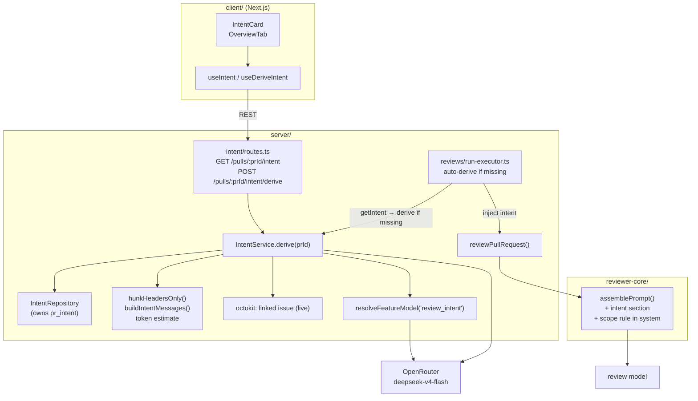

# Intent Layer — Design Spec

**Date:** 2026-07-15
**Course lesson:** L03 (Intent layer)
**Status:** Approved design → ready for implementation planning

## Summary

Give the reviewer an explicit understanding of *why* a pull request was opened,
and use that understanding to focus the review. A cheap flash-class model reads
the PR's motivation signals (title, body, linked issue/spec, and the shape of the
changes) and produces a structured **Intent** — a one-line summary plus `in_scope`
and `out_of_scope` lists. That intent is (a) shown to the user as a card on the PR
Overview page *before* they read the review, and (b) injected into the review
prompt so agents stay on-topic and don't drown the user in out-of-scope noise.

The classifier deliberately runs on **file + hunk headers only, never diff
bodies** — this is the token-saving core of the feature, and we log how many
tokens it saves on every derivation.

## Motivation & goals

- **Understand intent.** Surface the machine's reading of the PR's purpose so a
  human can sanity-check it before trusting the review.
- **Cheap.** Use a separate, inexpensive model (flash-class via OpenRouter), not
  the full review model, and prove the token savings in logs.
- **Focus the review.** Inject intent + scope into the review prompt with a clear
  rule: review within intent; if a serious problem sits clearly out of scope, emit
  one signal finding, not twenty — without ever suppressing in-scope or security
  findings.

## What already exists (starter stubs — reused, not rebuilt)

The starter shipped Intent as dead scaffolding, the same way Conventions shipped
before L02. We wire it up rather than design it fresh:

- **Table** `pr_intent` — `pr_id` (PK, FK → `pull_requests.id`, cascade),
  `intent text`, `in_scope jsonb string[]`, `out_of_scope jsonb string[]`
  (`server/src/db/schema/reviews.ts:48`). **No migration needed.**
- **Contract** `Intent = { intent, in_scope, out_of_scope }`
  (`server/src/vendor/shared/contracts/brief.ts:8`). **No contract change needed.**
- **CRUD** `upsertIntent` / `getIntent`
  (`server/src/modules/reviews/repository/pull.repo.ts:47`) — implemented but has
  zero callers today. Ownership relocates to the new `intent` module so the
  dependency graph stays one-directional (see Architecture).
- **Feature-model slot** `review_intent` already registered
  (`server/src/vendor/shared/contracts/platform.ts:16,52`) — currently defaults to
  `openai/gpt-4.1`; we change the default to a cheap OpenRouter model.

## Template

This feature mirrors the **Conventions** feature (L02) end-to-end — the closest
existing pattern for "cheap feature-model call → structured output → per-entity
storage → UI card with a recompute button":

- Server module shape: `server/src/modules/conventions/{routes,service,repository,helpers,constants}.ts`
- Model resolution: `resolveFeatureModel(container, workspaceId, <FeatureModelId>)`
- Structured call: `llm.completeStructured({ model, schema, schemaName, messages, maxRetries })`
- Client: TanStack Query hooks + a card component with a rescan/recompute button.

## Architecture

**Module boundary decision:** derivation lives in a **dedicated `intent` module**
(cohesive, independently testable, mirrors Conventions). The `pr_intent` CRUD
relocates from `reviews` to the `intent` module so the dependency runs one way:
`reviews` (run-executor) → `intent` (service). No cycle.

## Classifier input & graceful degradation (first-class requirement)

Derivation **always runs and always produces a best-effort intent.** There is no
"no documentation → skip/error" path. Motivation signals are gathered in priority
order and whatever is available is used:

1. **Linked issue** (title + body), fetched live from GitHub when the PR body
   references one (`closes/fixes/resolves #N`) — treated as the *primary* stated
   motivation when present.
2. **PR body** — spec links, ticket references, or an inline plan/motivation.
3. **PR title.**
4. **File list with hunk headers** (always available) — the structural signal.

Rules:

- **A spec/issue/link, when present, is a bonus, not a prerequisite.** It is
  included and weighted as the primary intent signal.
- **When there is no explicit motivation at all**, the model still derives intent
  from the title + the shape of the changes (files + hunk headers). A thin signal
  yields a best-effort summary and scope lists — never a failure.
- **A missing linked issue, or an unreachable GitHub call, is non-fatal.**
  Derivation proceeds with body + files; the issue fetch is wrapped so its failure
  degrades gracefully rather than aborting the derivation.
- The prompt instructs the model to infer intent from available evidence and to
  populate `in_scope`/`out_of_scope` from the changed files even when prose
  motivation is absent.

## Token-saving core & logging

- Classifier input uses **file paths + hunk headers only** (`@@ -a,b +c,d @@`),
  never hunk bodies. A new helper `hunkHeadersOnly(diff)` derives this from stored
  `pr_files.patch` by reusing `diffFromPrFiles` + `parseUnifiedDiff` (the
  `DiffHunk` type already retains no line content — `server/src/vendor/shared/adapters.ts:175`).
- On every derivation, emit one structured log line comparing the estimated tokens
  of the **full diff** vs the **headers-only input**:
  `{ prId, model, fullDiffTokens, headersOnlyTokens, saved }`. Reuse the existing
  token/cost estimator used by the LLM providers where possible; a chars/4
  heuristic is an acceptable fallback if no shared estimator is exposed.

## Prompt injection (reviewer-core)

Two-file change plus a rule string:

- `reviewer-core/src/prompt.ts`: add optional `intent?: string` to `PromptParts`;
  render a `## Intent & scope` section (wrapped as untrusted, like `pr-description`)
  **immediately after** the `## PR description` section. Same "omit when empty"
  contract as `repoMap`/`callers` — when absent, the assembled prompt is byte-identical to today's.
- The **scope rule** is appended to the *trusted* `system` string, beside the
  existing `INJECTION_GUARD` (only when intent is present):

  > A stated intent and scope for this PR is provided below. Focus your review on
  > changes within that intent. Never withhold a finding that falls within scope,
  > and never let the stated scope suppress a security, secret, or data-loss
  > finding. If you find a serious problem that is clearly outside the stated
  > scope, emit a single signal finding for it rather than many.

  This coexists with — does not override — `INJECTION_GUARD` (derived intent can
  never zero-out a real defect) and the task-framing "review the whole diff" rule.
- `reviewer-core/src/review/run.ts`: thread `intent?: string` through `ReviewInput`
  → `promptParts`.

## Auto-derive on first review

In `server/src/modules/reviews/run-executor.ts`, once per PR in `executeRuns`
(where the diff is already loaded once, before the per-agent loop): read
`getIntent(pull.id)`; if absent, call `intentService.derive(pull.id)` to populate
it. Each `runOneAgent` then reads the stored intent and passes it into
`reviewPullRequest({ intent })`. Manual button and auto-derive share the same
`derive()` code path. Derivation happens **once per PR run**, not once per agent.

## Feature model config

- Change `review_intent` default to `openrouter` / `deepseek/deepseek-v4-flash` in
  **both** vendored `platform.ts` copies (`server/src/vendor/shared/...` and
  `client/src/vendor/shared/...`) — identical edit, per the root INSIGHTS
  vendored-shared-sync rule.
- Update the client-local mirror `client/src/lib/feature-models.ts` `review_intent`
  entry to match. **Adjacent fix:** that same file still has a stale *Conventions*
  default (`openai/gpt-5.4`) from commit `bef76ba` — correct it to
  `openrouter/deepseek-v4-flash` while in the file.
- Settings → Models already auto-lists every `FEATURE_MODELS` entry, so the intent
  model is user-selectable with no new UI. Only the default changes.

## Client UI

- New hooks `client/src/lib/hooks/intent.ts`:
  - `useIntent(prId)` → `GET /pulls/:prId/intent`
  - `useDeriveIntent(prId)` → `POST /pulls/:prId/intent/derive`, invalidates `["intent", prId]`
- New component `OverviewTab/_components/IntentCard/` (`IntentCard.tsx`, `styles.ts`,
  `index.ts`, test). Renders:
  - intent **summary** (quoted),
  - **In scope** list with ✓,
  - **Out of scope** list with muted ✗,
  - a **Derive / Recompute** button,
  - **empty state** (no intent yet → CTA to derive) and **loading** state.
- `OverviewTab` gains a responsive layout that presents the Intent card now and
  can seat a Blast Radius card beside it later (single-column today; no placeholder
  for the unbuilt L04 card).

## Testing

- **Server unit:** `hunkHeadersOnly` extraction; token-savings computation; intent
  prompt-message assembly; graceful degradation when no linked issue / empty body.
- **Server `*.it.test.ts`:** `POST /pulls/:prId/intent/derive` round-trip persists
  `pr_intent`; `GET` returns it; auto-derive populates intent on a review run when missing.
- **reviewer-core:** `assemblePrompt` renders the `## Intent & scope` section and
  scope rule when `intent` is present; prompt is unchanged when it's absent.
- **client RTL:** IntentCard empty / loading / populated states; recompute button
  triggers the mutation.

## Out of scope (YAGNI)

- Persisting the linked issue to the DB (fetched live at derive time instead).
- Blast Radius / Risk Areas card (L04).
- Smart Diff (separate L03 feature).
- PR Brief composition (`pr_brief` stub stays untouched).
- Any new workspace/settings UI beyond the existing auto-generated model picker.

## Files touched (map)

**server/**
- `src/modules/intent/{routes,service,repository,helpers,constants}.ts` (new)
- `src/modules/intent/*.it.test.ts`, unit tests (new)
- `src/modules/reviews/run-executor.ts` (auto-derive + inject)
- `src/modules/reviews/repository/pull.repo.ts` + `repository.ts` (relocate/expose CRUD)
- module registration wherever modules are wired into the container/app
- `src/vendor/shared/contracts/platform.ts` (review_intent default)

**reviewer-core/**
- `src/prompt.ts` (intent section + scope rule)
- `src/review/run.ts` (thread `intent` through `ReviewInput`)
- prompt test

**client/**
- `src/vendor/shared/contracts/platform.ts` (review_intent default — identical to server)
- `src/lib/feature-models.ts` (review_intent default + conventions drift fix)
- `src/lib/hooks/intent.ts` (new)
- `src/app/repos/[repoId]/pulls/[number]/_components/OverviewTab/OverviewTab.tsx` (layout)
- `src/app/repos/[repoId]/pulls/[number]/_components/OverviewTab/_components/IntentCard/**` (new)
