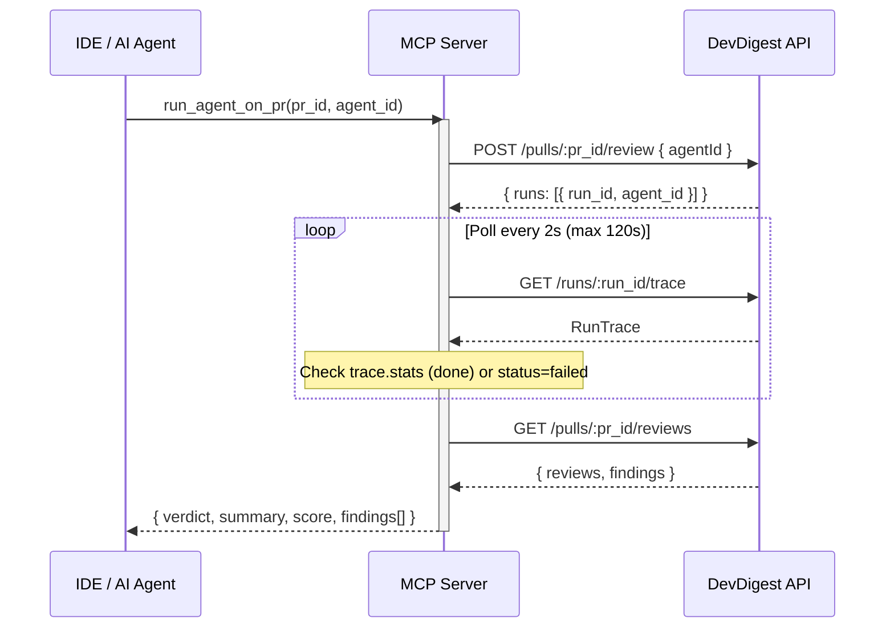

# Plan: MCP Server for DevDigest

> Status: DRAFT
> Created: 2026-06-28

## Problem

DevDigest lacks an MCP (Model Context Protocol) integration, preventing AI agents in IDEs (Claude Code, Cursor) from programmatically triggering code reviews, querying findings, and accessing repository conventions. A standalone MCP server with stdio transport will expose five tools that proxy requests to the existing Fastify API, following token-efficient design principles and actionable error patterns.

## Affected Modules

| Module | Path | Change Type |
|--------|------|-------------|
| mcp (new package) | `mcp/` | Add |

**No existing files in `server/`, `client/`, or `reviewer-core/` are modified.**

## Tasks

### TASK-001: Package scaffold and API client

**Scope:** backend (new `mcp/` package)

**Owned Paths:**
- `mcp/package.json`
- `mcp/tsconfig.json`
- `mcp/src/index.ts`
- `mcp/src/config.ts`
- `mcp/src/server.ts`
- `mcp/src/api-client.ts`

**Details:**

#### `mcp/package.json`

```json
{
  "name": "@devdigest/mcp",
  "version": "0.1.0",
  "type": "module",
  "bin": { "devdigest-mcp": "./src/index.ts" },
  "scripts": {
    "start": "tsx src/index.ts",
    "typecheck": "tsc --noEmit"
  },
  "dependencies": {
    "@modelcontextprotocol/sdk": "^1.12.0",
    "zod": "^3.23.0"
  },
  "devDependencies": {
    "tsx": "^4.0.0",
    "typescript": "^5.4.0"
  }
}
```

#### `mcp/tsconfig.json`

Standard `"module": "nodenext"`, `"moduleResolution": "nodenext"`, `"strict": true`, `"noEmit": true`, target `"es2022"`.

#### `mcp/src/config.ts` -- Config reader (single env access point, Zod-validated)

```typescript
import { z } from "zod";

const ConfigSchema = z.object({
  apiUrl:         z.string().url().default("http://localhost:3001"),
  pollIntervalMs: z.coerce.number().int().positive().default(2_000),
  pollTimeoutMs:  z.coerce.number().int().positive().default(120_000),
});

export type McpConfig = z.infer<typeof ConfigSchema>;

export function readConfig(): McpConfig {
  return ConfigSchema.parse({
    apiUrl:         process.env.DEVDIGEST_API_URL,
    pollIntervalMs: process.env.MCP_POLL_INTERVAL_MS,
    pollTimeoutMs:  process.env.MCP_POLL_TIMEOUT_MS,
  });
}
```

Zod-валидация при старте: невалидные значения (`MCP_POLL_INTERVAL_MS=banana`) бросают ошибку сразу, не молча. Согласуется с паттерном `server/src/platform/config.ts`.

#### `mcp/src/server.ts` -- Server factory with DI (no default instantiation)

```typescript
export function createServer(client: DevDigestClient) {
  const server = new McpServer({ name: "devdigest", version: "0.1.0" });
  server.tool("list_agents",      {}, (args) => listAgents(client, args));
  server.tool("run_agent_on_pr",  schema, (args) => runAgentOnPr(client, args));
  server.tool("get_findings",     schema, (args) => getFindings(client, args));
  server.tool("get_conventions",  schema, (args) => getConventions(client, args));
  server.tool("get_blast_radius", schema, (args) => getBlastRadius(args));
  return server;
}
```

`client` — обязательный аргумент без дефолта. `server.ts` — чистая фабрика, не знает как создавать конкретные классы.

#### `mcp/src/index.ts` -- Composition root (вся конкретная инициализация здесь)

```typescript
import { StdioServerTransport } from "@modelcontextprotocol/sdk/server/stdio.js";
import { readConfig } from "./config.js";
import { DevDigestClient } from "./api-client.js";
import { createServer } from "./server.js";

const config = readConfig();               // validates env at startup
const client = new DevDigestClient(config); // concrete instantiation here
const server = createServer(client);        // pure factory, no new inside
const transport = new StdioServerTransport();
await server.connect(transport);
```

Вся конкретная инициализация — в `index.ts`. Согласуется с паттерном `server/src/platform/container.ts`.

#### `mcp/src/api-client.ts` -- HTTP fetch wrapper

Design:
- Принимает `apiUrl` из `McpConfig` (не читает `process.env` напрямую)
- Single `async function apiRequest<T>(method, path, body?): Promise<T>` using native `fetch`
- Error mapping for actionable messages:

| HTTP Status | MCP Response |
|-------------|-------------|
| 404 | `{ content: [{ type: "text", text: "<actionable message>" }], isError: true }` |
| 500 | `{ content: [{ type: "text", text: "DevDigest API error: <status>. Check server logs." }], isError: true }` |
| Network error | `{ content: [{ type: "text", text: "Cannot reach DevDigest API at <url>. Is the server running?" }], isError: true }` |

- Helper `function mcpError(text: string)` returns `{ content: [{ type: "text", text }], isError: true }`
- Helper `function mcpSuccess(data: unknown)` returns `{ content: [{ type: "text", text: JSON.stringify(data) }] }`

**Acceptance Criteria:**
- [ ] AC-001: `pnpm install` in `mcp/` completes without errors
- [ ] AC-002: `pnpm typecheck` in `mcp/` passes
- [ ] AC-003: Running `pnpm start` with no DevDigest API returns actionable "Cannot reach" error on any tool call

**Verification:**

| AC | How to measure |
|----|----------------|
| AC-001 | `cd mcp && pnpm install` exits 0 |
| AC-002 | `cd mcp && pnpm typecheck` exits 0 |
| AC-003 | Start MCP server without API, send tool call via MCP inspector, observe actionable error |

---

### TASK-002: list_agents tool

**Scope:** backend (new file)

**Owned Paths:**
- `mcp/src/tools/list-agents.ts`

**Details:**

**Tool registration:**
```typescript
server.tool(
  "list_agents",
  "List configured review agents with their IDs and models.",
  {},  // no input params
  handler
)
```

**Input schema:** None (empty object `{}`)

**Handler logic:**
1. `GET /agents` via api-client
2. Map response to compact format

**Compact output format:**
```typescript
{
  agents: Array<{
    id: string;
    name: string;
    description: string;
    model: string;
    enabled: boolean;
  }>
}
```

Fields excluded from full Agent type: `provider` (not needed by caller).

**Actionable errors:**
- API unreachable: `"Cannot reach DevDigest API. Is the server running? (DEVDIGEST_API_URL=${url})"`

**Acceptance Criteria:**
- [ ] AC-001: Calling `list_agents` with DevDigest API running returns an array of agents with id, name, description, model, enabled fields
- [ ] AC-002: Calling `list_agents` with API down returns `isError: true` with actionable message

**Verification:**

| AC | How to measure |
|----|----------------|
| AC-001 | MCP Inspector: call `list_agents` -> JSON with `agents[]` |
| AC-002 | Stop API server, call `list_agents` -> `isError: true` |

---

### TASK-003: run_agent_on_pr tool

**Scope:** backend (new file)

**Owned Paths:**
- `mcp/src/tools/run-agent-on-pr.ts`

**Details:**

**Tool registration:**
```typescript
server.tool(
  "run_agent_on_pr",
  "Run a review agent on a pull request and return findings.",
  {
    pr_id: z.string().describe("Pull request ID, e.g. 'pr-abc123'"),
    agent_id: z.string().describe("Agent ID from list_agents, e.g. 'agent-456'. Always a specific agent — to run all agents call this tool once per agent.")
  },
  handler
)
```

**Input schema (flat args, token-lean):**

| Param | Type | Required | Description |
|-------|------|----------|-------------|
| `pr_id` | `z.string()` | yes | `"Pull request ID, e.g. 'pr-abc123'"` |
| `agent_id` | `z.string()` | yes | `"Agent ID from list_agents. Always a specific agent ID — never 'all'."` |

> **Decision:** `agent_id` is always a concrete ID. Running all agents = call this tool N times, once per agent. This keeps the output predictable and token-bounded.

**Handler logic (result, not operation -- 3 steps in 1 call):**



**Polling strategy:**
1. `POST /pulls/:pr_id/review { agentId: agent_id }` -> extract `run_id` from `runs[0]`
2. Poll `GET /runs/:run_id/trace` every 2 seconds
3. Stop conditions:
   - `trace.stats` is present -> success, proceed to step 4
   - `trace.config.status === 'failed'` -> return error with `isError: true`
4. On success: `GET /pulls/:pr_id/reviews` -> extract matching review and findings
5. Timeout after 120 seconds -> `isError: true`

**Compact output format:**
```typescript
{
  verdict: "approve" | "request_changes" | "comment";
  summary: string;
  score: number;
  findings: Array<{
    severity: string;
    category: string;
    title: string;
    file: string;
    start_line: number;
    rationale: string;
    suggestion: string;
  }>;
}
```

**Actionable errors:**

| Condition | Message |
|-----------|---------|
| Agent not found (404 on POST) | `"Agent 'X' not found. Call list_agents to get valid IDs."` |
| PR not found (404 on POST) | `"PR 'X' not found. Check the pr_id or import PRs via the DevDigest UI."` |
| Run failed | `"Review run failed with status 'failed'. Check DevDigest UI for details."` |
| Timeout (120s) | `"Run timed out after 120s. Check run status later via get_findings with pr_id='X'."` |

**Acceptance Criteria:**
- [ ] AC-001: Calling `run_agent_on_pr` with valid pr_id and agent_id returns compact `{ verdict, summary, score, findings[] }` within 120s
- [ ] AC-002: Calling with invalid agent_id returns `isError: true` with "Call list_agents" hint
- [ ] AC-003: Calling with invalid pr_id returns `isError: true` with "import PRs" hint
- [ ] AC-004: If run exceeds 120s timeout, returns `isError: true` with timeout message referencing get_findings

**Verification:**

| AC | How to measure |
|----|----------------|
| AC-001 | MCP Inspector: call with valid IDs, observe verdict + findings |
| AC-002 | MCP Inspector: call with `agent_id: "nonexistent"` -> isError with actionable text |
| AC-003 | MCP Inspector: call with `pr_id: "nonexistent"` -> isError with actionable text |
| AC-004 | Simulate slow run (mock or large PR), observe timeout behavior |

---

### TASK-004: get_findings tool

**Scope:** backend (new file)

**Owned Paths:**
- `mcp/src/tools/get-findings.ts`

**Details:**

**Tool registration:**
```typescript
server.tool(
  "get_findings",
  "Get the review verdict and findings for a pull request.",
  {
    pr_id: z.string().describe("Pull request ID, e.g. 'pr-abc123'")
  },
  handler
)
```

**Input schema:**

| Param | Type | Required | Description |
|-------|------|----------|-------------|
| `pr_id` | `z.string()` | yes | `"Pull request ID, e.g. 'pr-abc123'"` |

**Handler logic:**
1. `GET /pulls/:pr_id/reviews`
2. Map to compact output (same shape as run_agent_on_pr output)

**Compact output format:**
```typescript
{
  reviews: Array<{
    verdict: "approve" | "request_changes" | "comment";
    summary: string;
    score: number;
    agent_id: string;
  }>;
  findings: Array<{
    severity: string;
    category: string;
    title: string;
    file: string;
    start_line: number;
    rationale: string;
    suggestion: string;
  }>;
}
```

**Actionable errors:**

| Condition | Message |
|-----------|---------|
| PR not found (404) | `"PR 'X' not found. Check the pr_id or import PRs via the DevDigest UI."` |
| No reviews yet | `"No reviews found for PR 'X'. Run a review first with run_agent_on_pr."` |

**Acceptance Criteria:**
- [ ] AC-001: Calling `get_findings` on a PR with completed reviews returns compact reviews + findings
- [ ] AC-002: Calling on non-existent PR returns `isError: true` with actionable message
- [ ] AC-003: Calling on a PR with no reviews returns `isError: true` suggesting `run_agent_on_pr`

**Verification:**

| AC | How to measure |
|----|----------------|
| AC-001 | MCP Inspector: call after run_agent_on_pr, observe matching data |
| AC-002 | MCP Inspector: call with `pr_id: "nonexistent"` -> isError |
| AC-003 | MCP Inspector: call on a fresh PR with no runs -> isError with hint |

---

### TASK-005: get_conventions tool

**Scope:** backend (new file)

**Owned Paths:**
- `mcp/src/tools/get-conventions.ts`

**Details:**

**Tool registration:**
```typescript
server.tool(
  "get_conventions",
  "Get accepted coding conventions for a repository.",
  {
    repo_id: z.string().describe("Repository ID, e.g. 'repo-789'")
  },
  handler
)
```

**Input schema:**

| Param | Type | Required | Description |
|-------|------|----------|-------------|
| `repo_id` | `z.string()` | yes | `"Repository ID, e.g. 'repo-789'"` |

**Handler logic:**
1. `GET /repos/:repo_id/conventions`
2. Filter to `accepted === true` only
3. Map to compact format

**Compact output format:**
```typescript
{
  conventions: Array<{
    rule: string;
    confidence: number;
  }>;
}
```

Fields excluded: `id`, `evidence_path`, `accepted` (already filtered).

**Actionable errors:**

| Condition | Message |
|-----------|---------|
| Repo not found (404) | `"Repository 'X' not found. Check the repo_id."` |
| No conventions | Return empty array (not an error -- repo may genuinely have none yet) |

**Acceptance Criteria:**
- [ ] AC-001: Calling `get_conventions` on a repo with accepted conventions returns compact list
- [ ] AC-002: Calling on non-existent repo returns `isError: true` with actionable message
- [ ] AC-003: Calling on repo with no conventions returns empty `conventions: []`

**Verification:**

| AC | How to measure |
|----|----------------|
| AC-001 | MCP Inspector: call with valid repo_id -> conventions array |
| AC-002 | MCP Inspector: call with `repo_id: "nonexistent"` -> isError |
| AC-003 | MCP Inspector: call on repo with no conventions -> empty array |

---

### TASK-006: get_blast_radius stub tool

**Scope:** backend (new file)

**Owned Paths:**
- `mcp/src/tools/get-blast-radius.ts`

**Details:**

**Tool registration:**
```typescript
server.tool(
  "get_blast_radius",
  "Get the blast radius (impact map) of a pull request. (Coming soon)",
  {
    pr_id: z.string().describe("Pull request ID, e.g. 'pr-abc123'")
  },
  handler
)
```

**Handler logic:**
- Always returns a normal (non-error) stub response:

```typescript
return mcpSuccess({ stub: true, pr_id, message: "Blast radius coming soon." });
```

> **Decision:** `isError: false` — this is not a failure, just an unimplemented feature. The calling agent can proceed without it.

**Acceptance Criteria:**
- [ ] AC-001: Calling `get_blast_radius` with any pr_id returns a normal response `{ stub: true, pr_id, message: "Blast radius coming soon." }` (isError: false)

**Verification:**

| AC | How to measure |
|----|----------------|
| AC-001 | MCP Inspector: call with any pr_id -> normal response with `stub: true`, no isError |

---

## Implementation Phases

### Phase 1: Package Setup
- [ ] Create `mcp/package.json` with dependencies
- [ ] Create `mcp/tsconfig.json`
- [ ] `cd mcp && pnpm install`
- [ ] Create `mcp/src/api-client.ts` -- fetch wrapper with actionable error helpers
- [ ] Create `mcp/src/server.ts` -- McpServer factory with tool registrations
- [ ] Create `mcp/src/index.ts` -- entry point with StdioServerTransport

### Phase 2: Tools Implementation
- [ ] `mcp/src/tools/list-agents.ts`
- [ ] `mcp/src/tools/run-agent-on-pr.ts` (with polling logic)
- [ ] `mcp/src/tools/get-findings.ts`
- [ ] `mcp/src/tools/get-conventions.ts`
- [ ] `mcp/src/tools/get-blast-radius.ts` (stub)

### Phase 3: Integration Testing
- [ ] Verify all tools via MCP Inspector against running DevDigest API
- [ ] Verify error paths (API down, invalid IDs, timeout)
- [ ] `cd mcp && pnpm typecheck` passes

### Phase 4: IDE Configuration
- [ ] Document Claude Code configuration in `mcp/` README or inline comments
- [ ] Test end-to-end from Claude Code

---

## IDE Configuration

### Claude Code (`~/.claude/settings.json`)

```json
{
  "mcpServers": {
    "devdigest": {
      "type": "stdio",
      "command": "npx",
      "args": ["tsx", "/absolute/path/to/dev-digest/mcp/src/index.ts"],
      "env": {
        "DEVDIGEST_API_URL": "http://localhost:3001"
      },
      "timeout": 150000
    }
  }
}
```

> `timeout: 150000` (150с) — внешний лимит IDE. Обязательно больше внутреннего polling timeout (120с), иначе IDE убьёт вызов `run_agent_on_pr` до завершения.

### Cursor (`.cursor/mcp.json`)

```json
{
  "mcpServers": {
    "devdigest": {
      "command": "npx",
      "args": ["tsx", "/absolute/path/to/dev-digest/mcp/src/index.ts"],
      "env": {
        "DEVDIGEST_API_URL": "http://localhost:3001"
      }
    }
  }
}
```

---

## Risks & Mitigations

| Risk | Mitigation |
|------|------------|
| Polling `run_agent_on_pr` may exceed 120s for large PRs | Hard timeout at 120s with actionable message pointing to `get_findings` for later check |
| DevDigest API not running when MCP server starts | All errors are actionable -- "Cannot reach API at X. Is the server running?" |
| API contract drift (endpoints change) | MCP server is a thin HTTP proxy; easy to update. No TS import coupling to server internals |
| Large findings array consumes many tokens | Compact output format strips unnecessary fields (id, evidence_path, etc.) |
| Race condition: multiple `run_agent_on_pr` on same PR | DevDigest API handles concurrency; MCP server is stateless per-request |

## Out of Scope

- SSE transport (only stdio for IDE integration)
- Authentication/authorization on MCP server itself
- `get_blast_radius` actual implementation (stub only)
- Automated tests for MCP tools (manual verification via MCP Inspector)
- Publishing to npm
- Modifications to existing `server/`, `client/`, or `reviewer-core/` code

## Architecture Notes

### Four Tool Design Principles Applied

1. **Result, not operation** -- `run_agent_on_pr` orchestrates 3 HTTP calls (create run, poll, fetch findings) into a single tool call. The calling agent never needs to understand the polling protocol.

2. **Flat arguments** -- Every tool parameter is a simple `z.string()`. No nested objects, no arrays as input. This maximizes compatibility across LLM providers.

3. **Compact structured response** -- Each tool returns only the fields the caller needs. `run_agent_on_pr` returns `{ verdict, summary, score, findings[] }` not the full `RunTrace` (which can be 10K+ tokens). Finding objects include only: severity, category, title, file, start_line, rationale, suggestion.

4. **Errors lead forward** -- Every error message tells the caller what to do next:
   - "Agent not found" -> "Call list_agents to get valid IDs"
   - "PR not found" -> "Check pr_id or import PRs via DevDigest UI"
   - "Timeout" -> "Check run status via get_findings"

### MCP Best Practices Applied

- **Tool descriptions**: One sentence, verb-first, under 12 words each
- **Parameter descriptions**: One line with example value (`"Agent ID from list_agents, e.g. 'agent-456'"`)
- **Simple Zod types**: `z.string().describe("...")` instead of complex unions -- 44% token savings
- **5 tools total**: Under the 15-tool threshold, so no discovery/routing pattern needed
- **`isError: true`** for expected errors (404, timeout); `throw` only for unexpected failures (network, parse)
- **No shared contracts import**: MCP server uses its own minimal types, communicating with the API purely over HTTP. This avoids coupling to `@devdigest/shared` and keeps the package fully standalone

### Standalone Architecture

The MCP server is intentionally decoupled from the Fastify server:
- **No TypeScript imports** from `server/` -- pure HTTP proxy
- **No shared database** -- all data access through REST API
- **Stdio transport** -- standard for IDE integrations, no port conflicts
- **Single env var** -- `DEVDIGEST_API_URL` (defaults to `http://localhost:3001`)
