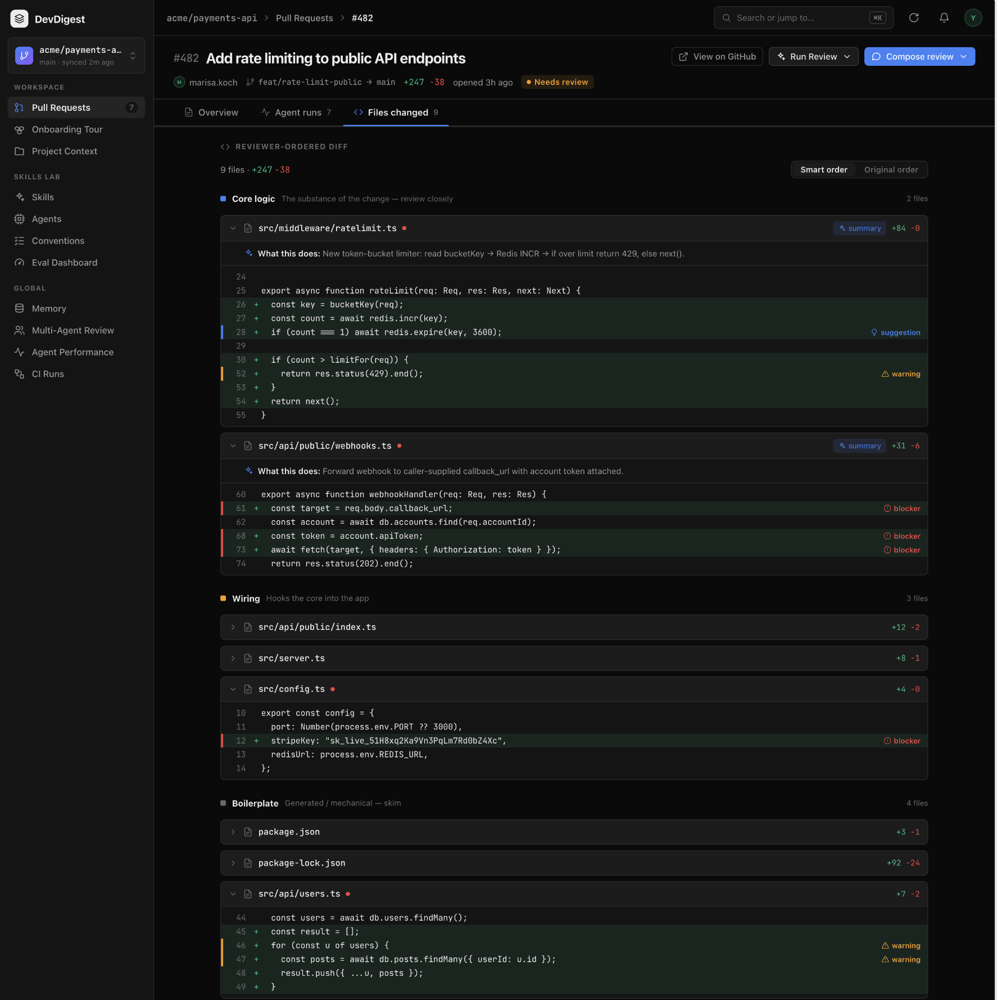
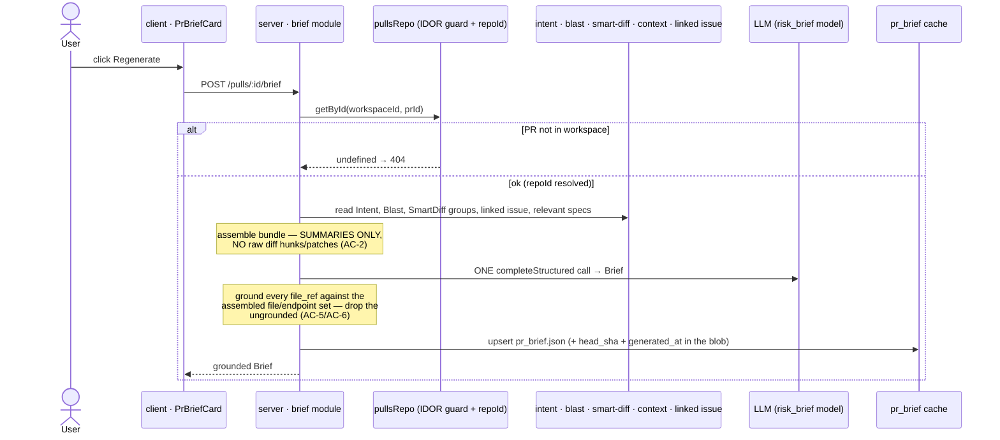
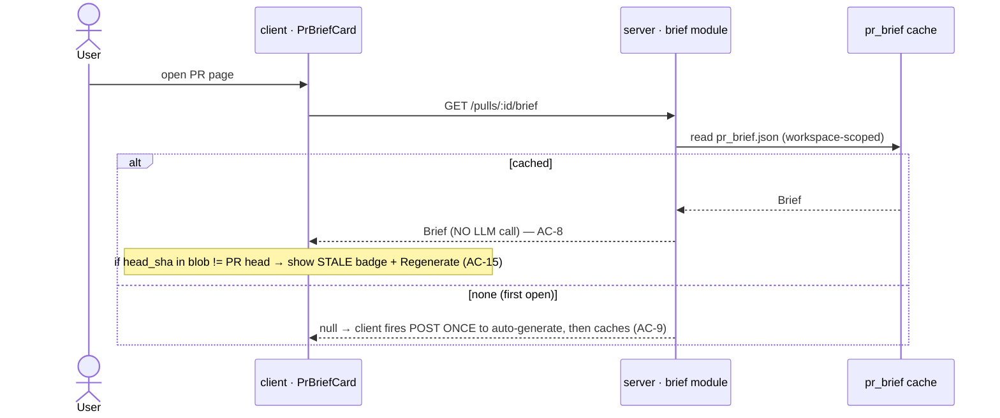

# Spec: Why+Risk Brief  |  Spec ID: 2026-07-17-why-risk-brief  |  Status: approved
Supersedes: None

## Problem & why

A reviewer opening a PR sees a diff and, today, several disconnected panels — Intent, Blast
radius, a reviewer-ordered diff — each answering one narrow question. Nothing tells them, in
one glance, *what this PR does, why, how risky it is, and where to look first*. The signals
needed to say that already exist and are already computed (L03 intent + smart-diff, L04 blast
radius, L05 project-context specs, the linked issue), but they are never composed into a
single verdict-shaped summary, so the reviewer assembles it in their head on every PR.

This feature is deliberately **cheap**: it does not re-derive any of those signals. It
**assembles** the already-built outputs into one structured LLM call and caches the result
per PR. The whole point is reuse — a new pipeline that re-computed intent/blast/diff would be
both slower and a second source of truth that can disagree with the panels already on screen.

If we do nothing, the reviewer keeps doing the integration by hand, the pre-seeded `pr_brief`
table and `risk_brief` feature-model slot keep advertising a feature that does not exist, and
the "read these first" guidance the design promises never reaches the person reviewing.

## Goals / Non-goals

**Goals**
- Add a **PR-page card** (`PrBriefCard`) that states, at a glance: **what** the PR does,
  **why**, an overall **risk level**, a list of **concrete risks** (each linked to a real
  file or endpoint), and a **review-focus** list (what to read first, each linked to a file).
- Assemble the brief's LLM input **entirely from already-built outputs** — PR title/body, the
  linked issue, derived Intent (L03), the blast-radius summary/map (L04), smart-diff group
  statistics (L03), and relevant project-context specs (L05) — via **exactly one** structured
  LLM call.
- **Ground every file reference**: every `file_ref` in `risks[]` (and in `review_focus[]`)
  must name a file or endpoint that actually appears in the assembled input — no hallucinated
  paths reach the UI.
- **Cache per PR** in the existing `pr_brief` table; re-opening the PR serves the cached brief
  with **zero new LLM calls**; only an explicit **Regenerate** button triggers a fresh call.
- Do not send **raw change bodies** (diff hunks/patches/file contents) to the model — only the
  assembled summaries.

**Non-goals**
- **Re-deriving intent, blast, or smart-diff** — the brief consumes their existing outputs
  (`IntentService.getIntent`, `BlastService`, `SmartDiffService`). Recomputing them here would
  create a second source of truth that can disagree with the Intent/Blast/Diff panels already
  rendered on the same page. The brief reads; it does not re-analyze.
- **Modifying `reviewer-core`** — the brief's structured call is a **server-module** LLM call
  (the pattern of `IntentService.derive` / `BlastService.explain`), not a change to the review
  engine. `reviewer-core` is shared with the CI runner; modifying it breaks that runner.
- **A new persistence table or migration** — `pr_brief` (`{ pr_id PK, json jsonb }`,
  `server/src/db/schema/reviews.ts:57-62`) already exists and is the per-PR cache. Stale
  detection stores `head_sha` + `generated_at` **inside the existing `json` blob** (resolved
  Q6), so no column and no migration is added.
- **Displaying the brief's own generation cost / token counts** — decided (resolved Q5): the
  mockup's cost line belongs to the review-run verdict panel, not this card. No cost-capture
  plumbing is added.
- **A PR-relevance selector for context specs** — the Project Context spec
  (`specs/2026-07-17-project-context.md`, Non-goals) deliberately deferred "auto-selection of
  specs per PR", and no such mechanism is built here. The brief reuses the **existing L05
  agent/workspace context attachments as-is** (resolved Q3); it does not introduce a per-PR
  relevance selector.
- **Repurposing the pre-seeded `PrBrief {intent,blast,risks,history}` contract as the output**
  — decided (resolved Q1): a **new** `Brief {what,why,risk_level,risks[],review_focus[]}`
  output contract is added (byte-identically in both vendor copies), and the pre-seeded
  `PrBrief` is left intact as the assembled **input** bundle. The two are not overloaded onto
  one type.

## User stories

- As a reviewer, I want a one-glance card that says what this PR does and why, so that I can
  orient before reading a single line of diff.
- As a reviewer, I want an overall risk level shown by color, so that I can triage which PRs
  need my deepest attention.
- As a reviewer, I want the concrete risks each linked to the real file/endpoint they concern,
  so that I can jump straight to the code a risk is about — and trust that the file exists.
- As a reviewer, I want a "read these first" list linked to files, so that I spend my
  attention where it matters instead of top-to-bottom.
- As a reviewer, I want re-opening the PR to be instant and free, so that revisiting a PR never
  silently spends a model call.
- As a reviewer, I want a Regenerate button, so that after new commits I can refresh the brief
  on demand.

## Design sources

<!-- Two mockups, now placed in ./assets/2026-07-17-why-risk-brief/ by /design-assets. The
     salient detail is transcribed below so a cold planner/implementer can build from it even
     without opening the pixels. -->

 — user-supplied mockup (PR Brief + Intent + Blast + Review-focus)

 — user-supplied mockup (reviewer-ordered diff, Core/Wiring/Boilerplate)

Mockup context: PR detail page, **dark theme**, PR #482 "Add rate limiting to public API
endpoints".

- **Overview tab, top:** a **"PR BRIEF" panel** — a verdict pill ("Request changes"), a
  findings/blockers count, a one-paragraph summary, a circular **PR SCORE** gauge (61), and a
  **cost line** ($0.014, token counts). *Grounding note:* verdict, score, findings count, and
  cost are **review-run** outputs already rendered by `VerdictBanner`
  (`.../VerdictBanner/VerdictBanner.tsx`) and the review cost badge — they are **not** the
  Why+Risk Brief's fields. Per resolved Q2, `PrBriefCard` is a **new, coexisting** card; it
  does not replace or absorb this panel, and it shows no cost line of its own (resolved Q5).
- Below it, two side-by-side panels: **INTENT** (italic intent sentence + IN SCOPE / OUT OF
  SCOPE columns + a RISK AREAS stack of `file:line` cards) and **BLAST RADIUS** (symbol/caller/
  endpoint/cron counts, Tree/Graph toggle, expandable symbol tree). *Grounding note:* these are
  the **already-shipped** `IntentCard` and `BlastCard`
  (`.../OverviewTab/_components/{IntentCard,BlastCard}`).
- Below both: a **REVIEW FOCUS — READ THESE FIRST** list — each row a `file:line` plus a short
  reason. *This is the new surface the brief adds.*
- **Files changed tab:** a "reviewer-ordered diff" grouped into **Core logic / Wiring /
  Boilerplate** with per-file AI summaries and inline blocker/warning/suggestion annotations.
  *Grounding note:* the already-shipped `SmartDiffViewer`. The brief **consumes** its group
  counts as input; it does not render this tab.

**What the Why+Risk Brief genuinely adds** to a page that already has Intent, Blast, and the
smart diff: a single composed **what / why / risk_level** verdict, a **grounded risks** list,
and the **review-focus** ("read these first") list — plus a Regenerate control. Per resolved
Q2, the new `PrBriefCard` is a **new top-of-Overview summary card that coexists** with
`VerdictBanner`, `IntentCard`, `BlastCard` and the smart diff — it subsumes none of them.

## Contracts & flows

### Two shapes, not one — input bundle vs. output brief

The requester flagged a pre-seeded contract collision. Resolved (Q1): keep the two concerns as
**two separate contracts** rather than overloading one type.

- **Assembled input bundle** — the already-built artifacts fed to the model. The pre-seeded
  `PrBrief { intent, blast, risks, history }`
  (`*/src/vendor/shared/contracts/brief.ts:116-122`) is **left intact** and serves as (part of)
  this input bundle.
- **Output brief** — a **new** `Brief { what, why, risk_level, risks[], review_focus[] }`
  contract, added byte-identically in **both** vendor copies (`server/` and `client/`) in the
  same commit (AC-23). `risk_level` reuses the existing `RiskSeverity` enum (`high|medium|low`,
  resolved Q7).

The pre-seeded `brief.json` i18n keys — which encode the OLD `{intent,blast,risks,history}`
shape — are brought into line with the new output shape (`what`, `why`, `riskLevel`,
`reviewFocus`, `regenerate`, `stale`, plus the empty/stale states).

### Regenerate (button) — one structured call, grounded, cached

The same POST path serves the **auto-generate-once** first open (resolved Q4): when the page
loads and the GET returns no cache, the client fires this POST exactly once; every later reopen
reads the cache (below) with no LLM call. An in-flight guard prevents a concurrent first-open
from firing a second generation (AC-10).

### Re-open (page load) — cache read, zero LLM

### Contracts

| Contract | Direction | Shape | Notes |
|---|---|---|---|
| `POST /pulls/:id/brief` | client → server | → `Brief` | **New.** Regenerate: one structured call, ground, upsert cache, return. Named by the requester. |
| `GET /pulls/:id/brief` | client → server | → `Brief \| null` | **New — confirmed (Q4)** as the cache-read path (AC-8). Mirrors `GET /pulls/:prId/intent` (cache read) vs `POST …/intent/derive`. On a `null` return the client fires the POST **once** to auto-generate. |
| Output `Brief` | server → client | `{ what: string, why: string, risk_level: RiskSeverity, risks: Risk[], review_focus: ReviewFocus[] }` | **New contract** added in both vendor copies (resolved Q1, AC-23). `risk_level` **is** the existing `RiskSeverity` enum (`high\|medium\|low`, resolved Q7). |
| `Risk` | — | `{ kind, title, explanation, severity, file_refs: string[] }` | **EXISTS** (`brief.ts:50-57`). `file_refs` is the grounding target (AC-5). |
| `RiskSeverity` | — | `high \| medium \| low` | **EXISTS** (`brief.ts:47`). |
| `ReviewFocus` | server → client | `{ file_ref: string, reason: string }` (line optional) | **New** — the "read these first" row. No pre-seeded shape found (grepped `brief.ts`). Grounded like `risks` (AC-6). |
| `pr_brief` | server internal | `{ pr_id PK, json jsonb }` | **EXISTS** (`schema/reviews.ts:57-62`). The per-PR cache. `json` is untyped — the output `Brief` **plus `head_sha` + `generated_at`** serialize into the blob (resolved Q6). No new column, no migration. |
| `risk_brief` feature model | server internal | provider+model via `resolveFeatureModel(container, ws, 'risk_brief')` | **EXISTS** (`platform.ts:17,60-61`; `settings/feature-models.ts:51`). The model-resolution seam — do not hardcode a model. |
| `PrDetail.linked_issue` | server internal | `IssueMeta.nullish()` | **EXISTS** (`platform.ts:229`). Nullable input — spec the null path (AC-11). |
| `pullsRepo.getById(ws, prId)` | server internal | PR row incl. `repoId`, `headSha` | **EXISTS.** Tenancy/IDOR guard AND the only source of `repoId` — `PrDetail`/`PrMeta` carry none (`server/INSIGHTS.md:50`). Must run first (AC-14). |
| Client i18n `brief.json` | client | namespace `brief` | **EXISTS** with keys for the OLD `{intent,blast,risks,history}` design (`block.*`, `noRisks`, `noHistory`, `overlap`, `unavailable`, `unavailableHint`). Resolved Q1: these are **brought into line** with the new output shape — add `what`, `why`, `riskLevel`, `reviewFocus`, `regenerate`, `stale`, and the empty/stale-state copy; keep the basename camelCase so the namespace resolves (`client/INSIGHTS.md:17`). |

Any change to a `vendor/shared` contract **must land byte-identically in both** the `server/`
and `client/` copies in the same commit (root `INSIGHTS.md:26`).

## Acceptance criteria (EARS)

**Assembly & the single call**

- **AC-1** — WHEN the system generates a brief for a PR, it SHALL assemble the model input
  solely from the PR title and body, the PR's linked issue (when present), the derived Intent,
  the blast-radius summary/map, the smart-diff group statistics (core/wiring/boilerplate groups
  with their file/line counts), and the relevant project-context specs — the latter being the
  documents attached through the **existing L05 agent/workspace context attachments** (resolved
  Q3; no per-PR relevance selector) — reusing the existing outputs of those features rather
  than re-deriving any of them.
- **AC-2** — The assembled model input SHALL NOT contain any raw diff hunk, patch, or file
  content body; it SHALL contain only the summarized/derived artifacts named in AC-1. *(A test
  can assert the assembled prompt string contains none of the PR's patch text.)*
- **AC-3** — WHEN generating a brief, the system SHALL make **exactly one** structured LLM
  call and SHALL produce a `Brief` with fields `what`, `why`, `risk_level`, `risks[]`, and
  `review_focus[]`.
- **AC-4** — The system SHALL resolve the brief's provider and model through the `risk_brief`
  feature-model setting, falling back to the registry default when the workspace has set no
  override, and SHALL NOT hardcode a model in the brief module.

**Grounding — no hallucinated paths (hard requirement 1)**

- **AC-5** — Before returning a brief, the system SHALL validate every `file_ref` in every
  `risks[]` entry against the set of files and endpoints present in the assembled input (the
  changed files, the blast map's files and affected endpoints, and the attached context spec
  paths); IF a risk's `file_ref` is absent from that set, THEN the system SHALL remove that
  reference — and, when a risk retains no valid `file_ref`, remove the risk — and SHALL record
  the drop, so that no risk pointing at a non-existent file reaches the UI.
- **AC-6** — Before returning a brief, the system SHALL apply the same grounding validation
  (AC-5) to every `review_focus[]` item's `file_ref`, dropping any focus item whose referenced
  file is absent from the assembled input.
- **AC-7** — IF grounding removes every risk (or every focus item), THEN the system SHALL
  return an empty `risks[]` (or `review_focus[]`) with the brief still valid, and the card
  SHALL render an explicit "no grounded risks flagged" (or equivalent) state rather than a
  blank region.

**Cache & regeneration (hard requirement 2)**

- **AC-8** — WHEN a user opens a PR page for which a brief is already cached in `pr_brief`, the
  system SHALL serve the cached brief and SHALL make **zero** LLM calls; every reopen after the
  first generation is a pure cache read.
- **AC-9** — IF no brief is cached for the PR when its page is opened, THEN the system SHALL
  **auto-generate the brief exactly once** (one structured call per AC-3), cache it, and display
  it — this being the single allowed unattended generation; the system SHALL NOT auto-generate
  again on any later reopen (AC-8 governs those).
- **AC-10** — WHEN a user invokes Regenerate, the system SHALL make one fresh structured call
  (AC-3), overwrite the PR's `pr_brief` cache with the new grounded brief, and display it.
- **AC-25** — IF a brief generation for a PR (whether the AC-9 first-open auto-generation or an
  AC-10 regenerate) is already in flight, THEN the system SHALL NOT start a second concurrent
  generation for that PR, so a concurrent first open cannot fire a duplicate structured call.

**Degradation — the brief still assembles (edge inputs)**

- **AC-11** — WHERE the PR has no linked issue, the system SHALL assemble and generate the
  brief from the remaining inputs without failing.
- **AC-12** — IF the PR's Intent has not been derived yet, THEN the system SHALL still generate
  the brief from the remaining inputs (one call, per AC-3) and note the absence of intent in the
  assembled input, rather than failing the request or deriving Intent first — Intent is not a
  prerequisite and no second LLM call is added (resolved Q8).
- **AC-13** — IF the blast radius is degraded, empty, or the repo is unindexed, THEN the system
  SHALL assemble the brief from whatever blast data is available (which may be none) without
  failing, mirroring the honest-degradation the blast panel already applies.
- **AC-24** — IF the single structured call fails, THEN the system SHALL leave any existing
  cached brief intact and surface the failure reason to the user, rather than erasing the cache
  or returning a generic crash.

**Tenancy**

- **AC-14** — WHEN any brief route (GET or POST) is handled, the system SHALL resolve the PR
  via the workspace-scoped `pullsRepo.getById(workspaceId, prId)` before reading any input or
  writing any cache; IF the `prId` does not belong to the caller's workspace, THEN the system
  SHALL respond 404 and SHALL NOT read or generate anything.

**Cache invalidation on new commits / resync**

- **AC-15** — IF the PR's current head SHA differs from the `head_sha` recorded in the cached
  brief's `pr_brief.json` blob (resolved Q6), THEN the system SHALL present the cached brief
  marked **stale** with a prompt to Regenerate, and SHALL NOT auto-regenerate — the AC-9
  auto-generation fires only when there is **no** cache, never to refresh a stale one.

**Frontend — `PrBriefCard`**

- **AC-16** — The `PrBriefCard` SHALL render `risk_level` (a `RiskSeverity` value —
  `high`/`medium`/`low`, resolved Q7) as a **color-coded** indicator using the existing
  severity color map, and SHALL also carry a text label so the level is not conveyed by color
  alone.
- **AC-17** — WHEN the brief has `review_focus[]` items, the card SHALL render each as a row
  linking to the referenced file (its `file_ref`, with line when present) alongside its reason.
- **AC-18** — WHEN the brief has `risks[]`, the card SHALL render each risk with its severity
  and a link to each referenced file/endpoint.
- **AC-19** — The card SHALL render a **Regenerate** control that triggers AC-10.
- **AC-20** — The `PrBriefCard`'s PR-id prop SHALL accept `string | null`; WHILE the PR id is
  null the card SHALL render a non-interactive placeholder and issue no request (client `prId`
  is `string | null` at the call site — `client/INSIGHTS.md:45`).
- **AC-21** — WHILE a brief request or regeneration is in flight, the card SHALL render a
  loading/generating state and SHALL disable the Regenerate control; IF the request fails, THEN
  the card SHALL render an error state with a retry affordance.
- **AC-22** — The card SHALL render all model-authored text (`what`, `why`, risk explanations,
  focus reasons) as data, through the vendored text/Markdown primitives, and SHALL NOT use any
  raw-HTML injection path (`dangerouslySetInnerHTML`).

**Contract integrity**

- **AC-23** — WHERE this feature adds or changes a `@devdigest/shared` contract, the identical
  change SHALL be present in both `server/src/vendor/shared/` and `client/src/vendor/shared/`
  in the same commit.

## Edge cases

| Case | Expected behavior | Criterion |
|---|---|---|
| PR page re-opened, brief already cached | Served from `pr_brief`, no LLM call | AC-8 |
| PR opened for the first time, no cache | Auto-generate exactly once, cache, display | AC-9 |
| Two first-opens race / Regenerate clicked twice while in flight | Second generation suppressed; one at a time per PR | AC-25, AC-21 |
| New commit pushed after brief cached (head SHA moved) | Cached brief shown as **stale** + Regenerate prompt; never auto-regenerated | AC-15 |
| PR has no linked issue | Brief assembles from the rest | AC-11 |
| Intent not derived yet | Brief assembles (one call), notes intent absent; Intent not derived first | AC-12 |
| Blast degraded / empty / repo unindexed | Brief assembles from available blast data | AC-13 |
| Model returns a risk citing `src/does/not/exist.ts` | That `file_ref` dropped; risk removed if it has no valid ref left | AC-5 |
| Model returns a focus item citing a non-existent file | Focus item dropped | AC-6 |
| Grounding removes all risks / all focus items | Empty list rendered with an explicit "none flagged" state, brief still valid | AC-7 |
| Structured call fails (model down / invalid output after retries) | Prior cache preserved; failure reason surfaced; no crash | AC-24, AC-21 |
| `prId` belongs to another workspace | 404; nothing read or generated | AC-14 |
| Card mounted before `prId` resolves (null) | Non-interactive placeholder, no request | AC-20 |
| Model output contains `<script>` / prompt-injection text in `what`/`why` | Rendered as inert data through vendored primitives | AC-22 |
| A context spec `.md` under the clone contains injection instructions | Wrapped as untrusted data in the assembled input; treated as data, not instruction | Untrusted inputs |

## Non-functional

- **Performance** — The brief is one structured LLM call over pre-computed inputs; it SHALL NOT
  trigger any re-derivation of intent, blast, or smart-diff. Re-opening a PR with a cached
  brief SHALL perform only a cache read (no model call — AC-8). Assembly reads reuse the
  existing service reads and add no new heavy computation.
- **Security** —
  - **Grounding is a security control, not just UX.** `file_refs` from the model are used to
    build links; an ungrounded/hallucinated path is both a misleading link and a potential
    path-shaped injection. Validating each `file_ref` against the assembled input set (AC-5/6)
    neutralizes it — the model may only reference files the system already knows about.
  - **No raw change bodies in the prompt** (AC-2) — the assembled input is summaries only,
    which also shrinks the untrusted-text surface fed to the model.
  - **Tenancy** — every route resolves through `pullsRepo.getById(workspaceId, prId)` first
    (AC-14); `pr_brief` is PK'd on `pr_id` with no `workspace_id` of its own, so — exactly like
    `pr_intent` (`server/INSIGHTS.md:43`) — its reads/writes must be gated by that
    workspace-scoped PR lookup, never by `prId` alone (IDOR).
  - **Untrusted model output rendered to the browser** — `what`/`why`/explanations/reasons are
    model-authored and rendered as inert data (AC-22); no `dangerouslySetInnerHTML`.
- **Accessibility** — `risk_level` SHALL NOT be conveyed by color alone; the level SHALL also
  carry a text label / accessible name (color is an addition, not the only signal — AC-16). A
  focus/risk row that is both a link and carries inner controls SHALL NOT nest interactive
  elements inside another interactive container (`client/INSIGHTS.md:51`).
- **Tokenizer caution (if any token counting is added)** — if the brief ever counts tokens over
  attached context text, it must bound the real `cl100k_base` encoder (a long run of one
  repeated character is near-worst-case and can pin a worker for minutes — `server/INSIGHTS.md:19-20`).
  This spec adds no token budget; noted only so a planner does not reintroduce an unbounded encode.
- **Markdown preview limitation** — the vendored `Markdown` primitive styles only
  `p`/`strong`/`code`/`a` and its `.dd-md` hook has no CSS (`client/INSIGHTS.md:11`); headings
  in model text render flat. Known limitation, not a bug for this feature to fix.

## Inputs (provenance)

- PR title + body — [reused: L01 pulls] — the change's self-description (author-authored, untrusted).
- Linked issue (`PrDetail.linked_issue`, nullable) — [reused: L01/L03] — the "why", when present (`platform.ts:229`).
- Derived Intent — [reused: L03 intent] — `IntentService.getIntent`; may be null (not yet derived).
- Blast radius summary/map — [reused: L04 blast] — `BlastService`; changed symbols, downstream callers, affected endpoints/crons, coverage.
- Smart-diff group statistics — [reused: L03 smart-diff] — `SmartDiffService.getSmartDiff`; core/wiring/boilerplate groups + counts (no raw patches).
- Relevant project-context specs — [reused: L05 context] — the **existing agent/workspace context attachments** (resolved Q3, no per-PR selector); repo-clone `.md`, untrusted.
- `risk_brief` provider/model — [reused: settings] — `resolveFeatureModel(container, ws, 'risk_brief')`.
- `pr_brief` cache — [reused: pre-seeded table] — the per-PR store, blob also holds `head_sha` + `generated_at` (resolved Q6) (`schema/reviews.ts:57-62`).
- **One** LLM call — [new: 1 structured call] — the only model call this feature adds (first-open auto-gen or Regenerate; never both, never a second for Intent).

## Untrusted inputs

- **The assembled model input as a whole** — PR title/body and the linked issue body are
  author-controlled; the context specs come from a repo clone any PR author can influence; the
  Intent is itself LLM-derived from untrusted text. Handling: the assembled input is treated as
  **data, not instructions** — untrusted segments (PR/issue text, context specs) wrapped with
  the engine's untrusted delimiter (`wrapUntrusted` is a pure, reusable string helper safe to
  call from a server module — `server/INSIGHTS.md:41`), and the brief's system instructions
  stay separate from that data.
- **The model's output (`risks[]` / `review_focus[]` file_refs)** — a `file_ref` is
  attacker-influenceable via the prompt and is used to build a link. Handling: grounded against
  the assembled input set (AC-5/6) — a reference to a file the system did not assemble is
  dropped, never linked.
- **The model's output text (`what` / `why` / explanations / reasons)** — rendered to a
  reviewer. Handling: rendered as inert data through vendored primitives, no raw-HTML path
  (AC-22).

Not untrusted: the `pr_brief` cache row (produced by our own grounded pipeline), and the
smart-diff/blast structural data (deterministically computed from the repo, not free model text).

## Clarifications — resolved

All eight questions raised at draft were decided by the owner on 2026-07-17 and folded into the
criteria above. Recorded here so the trail from question to decision survives.

- **Q1 — Output contract vs. pre-seeded `PrBrief`. RESOLVED:** add a **new** `Brief {what, why,
  risk_level, risks[], review_focus[]}` output contract, byte-identically in both vendor copies;
  leave the pre-seeded `PrBrief {intent,blast,risks,history}` intact as the assembled **input**
  bundle; bring the `brief.json` i18n keys into line with the new output shape. → Contracts &
  flows, AC-3, AC-23.
- **Q2 — Placement. RESOLVED:** `PrBriefCard` is a **new top-of-Overview summary card that
  coexists** with `VerdictBanner`, `IntentCard`, `BlastCard`, and the smart diff; it rebuilds or
  subsumes none of them. → Design sources, Non-goals.
- **Q3 — Context spec selection. RESOLVED:** reuse the **existing L05 agent/workspace context
  attachments as-is**; no new per-PR relevance selector. → AC-1, Inputs (provenance).
- **Q4 — Read path + first generation. RESOLVED:** add `GET /pulls/:id/brief` (cache read); on
  first open with **no** cache, **auto-generate exactly once** then cache — the single allowed
  unattended call. Every later reopen is a zero-LLM cache read; the manual Regenerate button is
  the only other trigger; the in-flight guard prevents a concurrent first-open from firing a
  second generation. → AC-8, AC-9, AC-10, AC-25.
- **Q5 — Card cost line. RESOLVED:** no — the card shows no cost/token line of its own (that line
  belongs to the review-run panel). → Non-goals, Design sources.
- **Q6 — Stale detection. RESOLVED:** store `head_sha` + `generated_at` **inside the existing
  `pr_brief.json` blob** — no column, no migration; stale ⇒ show cached brief with a badge +
  Regenerate prompt, never auto-refresh. → AC-15, Contracts & flows.
- **Q7 — `risk_level`. RESOLVED:** reuse the existing `RiskSeverity` enum (`high|medium|low`) and
  its color map; not a numeric score. → Contracts & flows, AC-16.
- **Q8 — Intent prerequisite. RESOLVED:** degrade gracefully when derived Intent is absent —
  still produce the single call with whatever inputs exist; do not derive Intent first and do not
  add a second LLM call. → AC-12.
