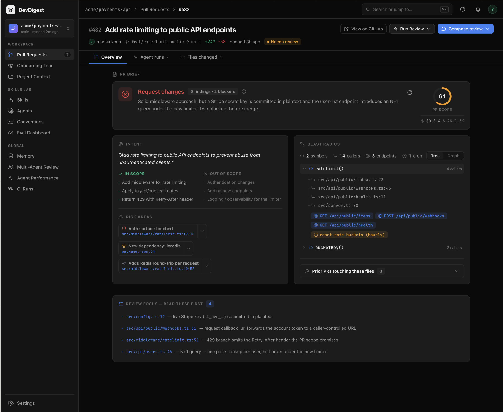
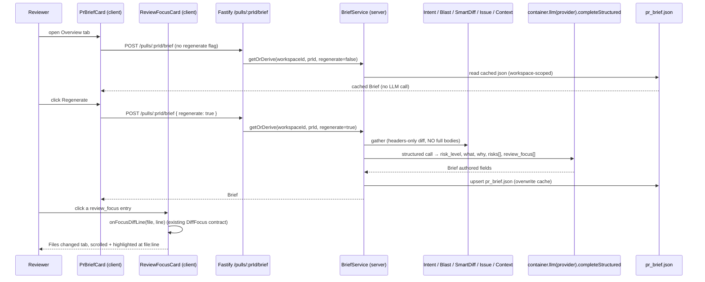

# Spec: PR Brief card & Review Focus card  |  Spec ID: 2026-08-08-pr-brief-card  |  Status: implemented
Supersedes: None

## Problem & why
A reviewer opening a PR's Overview tab today sees Intent and Blast Radius, but has to
assemble the "should I be worried, and where do I start reading?" judgement themselves —
scrolling findings, the score, the cost, and the diff separately. The pieces exist but are
scattered, so the first 30 seconds on a PR are spent orienting instead of reviewing. This
feature adds a single **PR Brief** summary at the top of the Overview tab (risk-level
headline, findings/blockers, score, cost) and a **Review Focus** list at the bottom that
names the riskiest files to read first, each a one-click jump straight to that exact spot in
the diff. If we do nothing, the reviewer keeps doing the triage the tool could do for them.

## Goals / Non-goals
**Goals**
- Add a compact **PR Brief** card at the top of the Overview tab summarising the PR's risk
  level (the headline), findings/blockers count, PR score, and cost (money + tokens).
- Add a **Review Focus** card at the bottom of the Overview tab listing the files/locations
  to review first, each `file:line — reason`, each clickable straight to the diff.
- Generate the Brief's authored fields (`what`, `why`, `risk_level`, `risks[]`,
  `review_focus[]`) from a single structured LLM call over already-derived, deterministic
  inputs — never over full diff bodies.
- Cache the Brief per PR; offer a regenerate control.

**Non-goals**
- **No `reviewer-core` changes** — the Brief is a non-review structured call (like Intent,
  Conventions, Blast-Explain) routed through the server's `container.llm()`; `reviewer-core`
  is the review engine only, is shared with the CI runner, and modifying it risks that
  seam. Confirmed against `intent/service.ts` (`resolveFeatureModel` → `container.llm` →
  `completeStructured`), which never touches `reviewer-core`.
- **No new DB table or migration** — the `pr_brief` table (`{pr_id PK, json jsonb}`) already
  exists and is migrated (`server/src/db/migrations/0000_init.sql:211`), with zero
  consumers today. Persistence reuses its untyped `json` column, which constrains no Brief
  shape.
- **No changes to the existing Intent or Blast Radius cards, and the existing Overview
  "Description" section stays as-is** — Intent and Blast Radius are unchanged; the current
  `pr.body` Description section (`OverviewTab.tsx:24`) is neither removed nor merged into the
  Brief's `what`/`why` — it stays below the Review Focus card, unmoved.
- **No new deep-link/diff-focus mechanism** — Review Focus clicks reuse the existing
  `onFocusDiffLine`/`DiffFocus` contract (`docs/superpowers/specs/2026-06-29-findings-deep-link-navigation.md`),
  not a new one.
- **No separate `GET` route** — a single `POST /pulls/:prId/brief` serves both the cached
  read (no body flag) and recompute (`{regenerate:true}`), per the assignment's literal
  route shape (explicit human decision, overriding the Intent two-route convention).
- **RISK AREAS block rendering is out of scope** — the user named two new cards; the mockup's
  "RISK AREAS" strip inside the Intent column is not built today and is not scheduled here.
  The Brief's `risks[]` is still generated and persisted (for the model's own reasoning and
  future use) but is NOT rendered as a separate block in v1.
- **No Graph/Tree toggles, no multi-agent aggregation, no auto-generation on PR sync**
  (v1 mirrors Intent's manual "generate then cache" model — the Brief is computed on an
  explicit action, not on PR open or sync).

## User stories
- As a reviewer opening a PR, I want a one-glance Brief (risk level, findings, blockers,
  score, cost) at the top of Overview, so that I know how worried to be before reading anything.
- As a reviewer, I want a ranked "read these first" list of files with a reason each, so
  that I start where the risk is, not at the top of the file tree.
- As a reviewer, I want each Review Focus entry to jump me to that exact file and line in the
  Files changed tab, so that I don't hunt for it manually.
- As a reviewer, I want to regenerate the Brief after new commits or a fresh review, so that
  it reflects the current state of the PR.

## Design sources
-  — user-supplied mockup. Target Overview layout, top-to-bottom: a `PR BRIEF` card (a colored icon+label headline — in the mockup a red "Request changes"-style state, which this feature drives from the Brief's `risk_level`, NOT a separate reused review verdict + "6 findings · 2 blockers" badge + an (i) info icon + a regenerate ⟳ icon top-right + one-sentence summary + a right-side `PR SCORE` circular ring showing `61` in orange + a `$ $0.014  8.2K→1.3K` cost/tokens line); then the existing two-column `INTENT` (left) + `BLAST RADIUS` (right) row — **unchanged, not part of this feature**; then a `REVIEW FOCUS — READ THESE FIRST` card with 4 rows, each `file:line — one-line reason` (e.g. `src/config.ts:12 — live Stripe key (sk_live_…) committed in plaintext`). The existing "Description" section (not in this mockup) stays below Review Focus, unchanged.
-  — user-supplied mockup. The existing Files changed tab (Smart-order groups Core logic / Wiring / Boilerplate, per-line blocker/warning/suggestion badges) that a Review Focus click must land on, scrolled to the referenced file and line. Not modified by this feature — it is the navigation target.

## Contracts & flows

| Contract | Direction | Shape | Notes |
|---|---|---|---|
| `POST /pulls/:prId/brief` (no body flag / `{regenerate:false}`) | client → server | `Brief \| null` (null = not generated yet) | Cached read — returns the persisted Brief with NO new LLM call. The client's initial page-load fetch sends this. Workspace-scoped (IDOR). |
| `POST /pulls/:prId/brief` `{ regenerate: true }` | client → server | `Brief` | Forces one structured LLM call, overwrites the cache. Both the empty-state "Generate" action and the "Regenerate" control send this. |
| `Brief` (new contract, LLM-authored fields) | server → client | `{ risk_level, what, why, risks[], review_focus[] }` | New `Brief` type in `contracts/brief.ts`. The old `PrBrief{intent,blast,risks,history}` stub is left untouched/deprecated — not repurposed, not renamed, not deleted. Persisted in `pr_brief.json`. |
| `risk_level` | field | enum — reuse `RiskSeverity` (`high\|medium\|low`) | Drives the card's color-coded icon+label **headline** — this is the headline signal, not a separate reused review verdict. `RiskSeverity` already exists (`contracts/brief.ts:47`). |
| `risks[]` item | field | reuse existing `Risk` — `{ kind, title, explanation, severity, file_refs[] }` | Reuse the existing `Risk`/`RiskSeverity` shape verbatim (no parallel risk type). Generated + persisted; not rendered as a block in v1 (see Non-goals). `file_refs` already means "links to real files". |
| `review_focus[]` item | field | `{ file: string, line: number, reason: string }` | New shape; drives the Review Focus rows and the deep-link. |
| Top-card metrics (findings, blockers, score, cost_usd, tokens_in→out) | reused | from the latest completed review run (`ReviewRecord.score/findings`, run `cost_usd`/tokens) | NOT Brief-LLM output, and NOT a verdict — the headline is `risk_level`. Rendered when a completed run exists; absent gracefully otherwise (AC-20). |
| `onFocusDiffLine(file, line)` / `DiffFocus{file,line,nonce}` | client internal | existing | Threaded `PrDetailView → OverviewTab → ReviewFocusCard`. `OverviewTab` does NOT receive it today (`OverviewTab.tsx:16`) — this feature threads it, mirroring `FindingsTab`. |
| `risk_brief` feature-model | server config | existing (`FeatureModelId` enum, default `openai/gpt-4.1`) | Reuse `resolveFeatureModel(container, workspaceId, 'risk_brief')` for the Brief call's provider/model. |
| Brief LLM input: reviewing agent's Project Context | server internal | existing | When a review run exists, reuse THAT run's agent's attached context (`ContextService`, keyed by the run's `agentId`); when no run/agent exists, no context to resolve — degrade silently (AC-19). |

**i18n note (resolved).** The leftover `client/messages/en/brief.json` keys `block.{intent,blast,risks,history}` and the `why.{…}` sub-namespace are dead (zero consumers, from the differently-scoped earlier design) and are removed. Fresh keys are added under the same `brief` namespace for the risk-level headline, PR-score label, review-focus rows, generate/regenerate controls, and the empty/error states; findings/blockers count strings reuse the existing `prReview` namespace keys (`verdict.findingsCount`, `verdict.blockers`) rather than duplicating them; cost/tokens need no keys (formatter output). `unavailable`/`unavailableHint` are kept only if they fit AC-17/AC-18's actual copy, else replaced.

## Acceptance criteria (EARS)
- **AC-1** — WHEN a user opens a PR's Overview tab, the system SHALL render, top-to-bottom: the PR Brief card, then the existing Intent + Blast Radius two-column row, then the Review Focus card, then the existing Description section — the last two of which (Intent+Blast, Description) are unchanged.
- **AC-2** — The PR Brief card SHALL convey the Brief's `risk_level` as the card's headline — driven by `risk_level` (not by a separate review verdict) — by color AND by an accompanying icon+text label, so that color is never the only signal of risk.
- **AC-3** — WHERE a completed review run exists for the PR, the PR Brief card SHALL display that run's findings count and its blockers count. (The headline is `risk_level` per AC-2, not a verdict; no-run behavior — see AC-20.)
- **AC-4** — WHERE a completed review run exists for the PR, the PR Brief card SHALL display the PR score as a circular ring, reusing the existing `CircularScore` primitive.
- **AC-5** — WHERE a completed review run exists for the PR, the PR Brief card SHALL display the run's cost in USD and its token counts (in→out), reusing the existing `formatCost`/`formatTokenCount` helpers.
- **AC-6** — The PR Brief card SHALL display the Brief's summary (`what`/`why`) as a compact block; the summary SHALL be constrained at generation time (a prompt guideline, target ≤ ~4 lines) to stay brief, and SHALL be rendered as returned with NO hard UI truncation or line-clamp.
- **AC-7** — The PR Brief card SHALL provide a regenerate control that triggers `POST /pulls/:prId/brief` with body `{ regenerate: true }`.
- **AC-8** — WHEN a Brief is derived, the system SHALL compose its input from already-derived artifacts — Intent, the Blast Radius summary, Smart-Diff group/diff statistics, the linked issue, and (where a review run exists) that run's agent's attached Project Context — and produce the authored fields via a single structured LLM call.
- **AC-9** — WHEN deriving a Brief, the system SHALL NOT send full diff hunk bodies to the LLM; it SHALL send hunk headers / diff statistics only, mirroring Intent's `hunkHeadersOnly` token-saving pattern.
- **AC-10** — WHEN a Brief is derived, the LLM output SHALL include `risk_level`, a `what`/`why` summary, `risks[]` whose `file_refs` name real files in the PR, and `review_focus[]` entries whose `file`/`line` name real locations in the PR.
- **AC-11** — WHEN `POST /pulls/:prId/brief` is called with no `regenerate` flag (or `{regenerate:false}`) and a Brief is already cached in `pr_brief.json`, the system SHALL return the cached Brief without a new LLM call.
- **AC-12** — WHEN `POST /pulls/:prId/brief` is called with `{ regenerate: true }`, the system SHALL recompute the Brief via one structured LLM call and overwrite the cached copy in `pr_brief.json`.
- **AC-13** — The Review Focus card SHALL list the Brief's `review_focus[]` entries, each rendered as `file:line — reason`.
- **AC-14** — Each Review Focus entry SHALL be a keyboard-focusable actionable control (a real `<button>`, not a non-interactive row), with an accessible label naming the file and line.
- **AC-15** — WHEN a user activates a Review Focus entry, the system SHALL switch to the Files changed tab and scroll to and highlight the referenced file and line, reusing the existing `onFocusDiffLine`/`DiffFocus` deep-link mechanism.
- **AC-16** — IF a Review Focus entry references a file or line not present in the diff, THEN the system SHALL switch to the Files changed tab without scrolling and without raising an error (the existing not-found focus behavior).
- **AC-17** — WHILE no Brief has been generated for a PR (the cached-read returns null), the system SHALL render the PR Brief card and the Review Focus card as an explicit prompt with a Generate action (which sends `{regenerate:true}`), never as a bare blank card.
- **AC-18** — IF the Brief structured LLM call fails, THEN the system SHALL render the card's error/degraded state with the reason and a regenerate action, instead of crashing or showing a blank card.
- **AC-19** — IF an optional Brief input is absent (Intent not yet derived, Blast index incomplete, no linked issue, or no review run/agent from which to resolve Project Context), THEN the system SHALL still produce a best-effort Brief from the available inputs rather than failing the derivation.
- **AC-20** — IF no completed review run exists for the PR, THEN the PR Brief card SHALL render its Brief-authored fields (headline `risk_level` + summary) and SHALL omit the run-derived findings/blockers/score/cost/tokens without error.
- **AC-21** — IF the Brief has no `review_focus[]` entries, THEN the Review Focus card SHALL render an explicit "nothing flagged to read first" state, not an empty card.
- **AC-22** — The system SHALL treat all PR-author-influenced text fed to the Brief call (PR title, body, diff headers, linked issue text, any file contents) as untrusted data, wrapped (e.g. via the existing `wrapUntrusted` helper) so it cannot be interpreted as instructions to the model.
- **AC-23** — The system SHALL render all Brief-generated text as data (no HTML injection); `review_focus[]` file paths SHALL be used only for display and in-app navigation, never for filesystem reads.
- **AC-24** — The `POST /pulls/:prId/brief` endpoint SHALL be workspace-scoped so a PR's Brief cannot be read or generated across tenants, mirroring Intent's `getPull(workspaceId, prId)` IDOR guard.

## Edge cases
| Case | Expected behavior | Criterion |
|---|---|---|
| Brief never generated for this PR | Card shows Generate prompt, not blank | AC-17 |
| Brief LLM call fails / times out | Error state + regenerate + reason, never blank/crash | AC-18 |
| Intent not derived yet when Brief runs | Best-effort Brief from available inputs | AC-19 |
| Blast index incomplete / new files invisible to index | Best-effort Brief; degrade silently | AC-19 |
| No linked issue in PR body | Degrade silently, omit that signal | AC-19 |
| No review run/agent yet → no agent Project Context to resolve | Degrade silently, compose Brief without context specs | AC-19 |
| No completed review run yet | Headline `risk_level` + summary render; findings/blockers/score/cost/tokens omitted, no error | AC-20 |
| `review_focus[]` empty | Explicit "nothing flagged" state | AC-21 |
| review_focus points at a file/line not in the diff | Switch tab, no scroll, no error | AC-16 |
| Very long summary from the model | Constrained at generation to stay compact | AC-6 |
| Malicious PR title/body/diff ("ignore your rules…") | Wrapped as untrusted data | AC-22 |
| Model emits an arbitrary/hostile file path in review_focus | Path used for display/nav only; no fs read; nav simply won't match | AC-16, AC-23 |
| PR from another workspace requested by id | Workspace-scoped guard blocks it | AC-24 |
| Huge diff | No full bodies sent; headers/stats only bound the token cost | AC-9 |

## Non-functional
- **Performance** — Deriving a Brief SHALL be a single structured LLM call over deterministic
  inputs with headers-only diff (AC-9), not full bodies. A cached read (`POST` with no
  `regenerate` flag) SHALL return without any LLM call (AC-11), so revisiting an
  already-briefed PR is a fast DB read.
- **Security** — All PR-author-influenced inputs wrapped as untrusted data (AC-22); no secrets
  in the Brief input or output; review_focus paths are display/nav only, never fs reads
  (AC-23); endpoints workspace-scoped (AC-24). Note the tokenizer worst-case caveat
  (server INSIGHTS.md, 2026-07-17) if any pre-flight token counting is added on
  author-controlled text.
- **Accessibility** — Risk level never signalled by color alone (AC-2); Review Focus rows are
  real keyboard-focusable buttons with accessible labels (AC-14), following the
  nested-interactives rule (client INSIGHTS.md, 2026-07-16 SymbolRow/FileCard).

## Inputs (provenance)
- PR title & body — [deterministic: pulls] — seed text for the Brief call (untrusted, AC-22).
- Intent (`intent`, `in_scope`, `out_of_scope`) — [reused: L03 intent] — cached; `IntentService.getIntent`. Null if not derived → degrade (AC-19).
- Blast Radius `summary` + coverage/index state — [reused: L04 blast] / [deterministic: repo-intel].
- Smart-Diff groups + diff statistics — [reused: L03 smart-diff] — [deterministic: no LLM] classification into core/wiring/boilerplate.
- Linked GitHub issue — [reused: via Intent's resolution] / [deterministic: github fetch] — non-fatal (AC-19); reuses whatever Intent resolved rather than re-resolving.
- Project Context specs — [reused: L05 context] — the reviewing agent's own attached context (`ContextService`, keyed by the review run's `agentId`); absent when no run/agent exists → degrade (AC-19).
- Findings count, blockers count, PR score — [reused: latest review run] (`ReviewRecord.score/findings`) — no verdict (headline is `risk_level`).
- Cost (USD) + tokens in/out — [reused: latest review run] (`cost_usd`, token counts).
- `risk_level`, `what`, `why`, `risks[]`, `review_focus[]` — [new: 1 LLM call] via `risk_brief` feature-model (`resolveFeatureModel(..., 'risk_brief')`).

## Untrusted inputs
- **PR title / body / diff headers** — authored by the PR author, not the project — MUST be wrapped as data (AC-22), not interpreted as model instructions.
- **Linked issue title/body** — external, author-influenced — same wrapping (AC-22).
- **File contents / any repo-clone text** referenced into the Brief input — same wrapping, plus path-traversal/symlink guards if any file is read (mirror `intent/service.ts` realpath+lstat guards).
- **Brief LLM output** (`what`/`why`/`risks`/`review_focus` text and file paths) — model-generated — rendered as data only (AC-23); React escaping, no `dangerouslySetInnerHTML`; file paths drive navigation only, never filesystem access.
