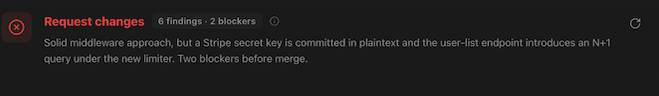
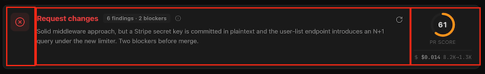
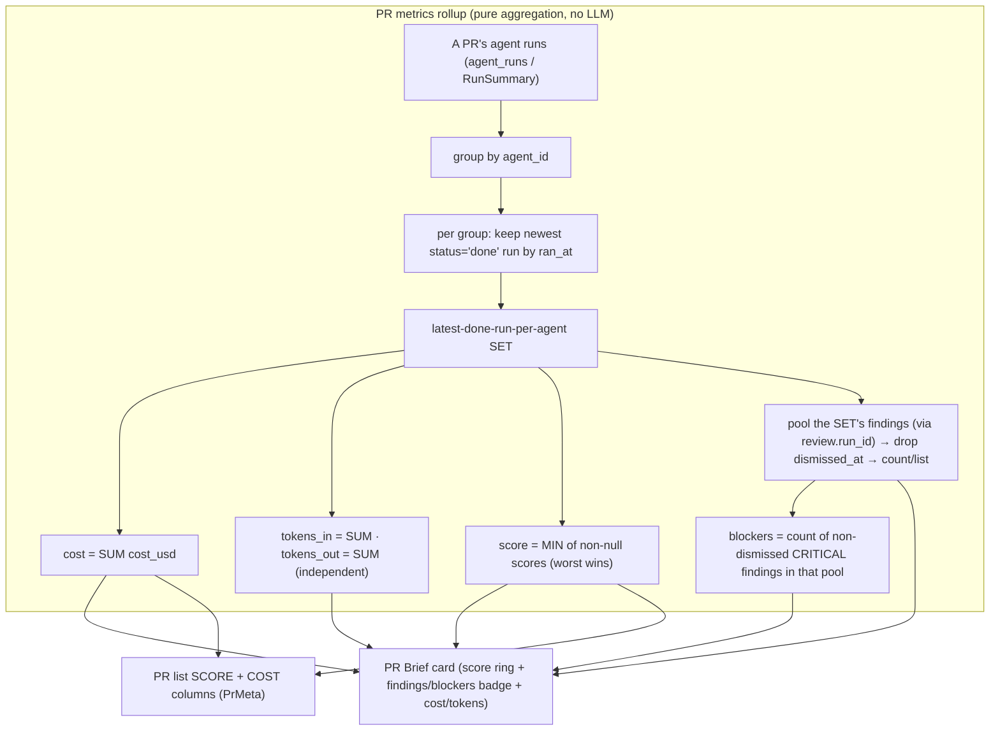

# Spec: PR Brief cross-run rollup & 3-column card layout  |  Spec ID: 2026-08-11-pr-brief-rollup-layout  |  Status: approved
Supersedes: 2026-08-08-pr-brief-card

## Problem & why
The PR Brief top card and the PR-list SCORE/COST columns both summarise a PR from a **single
run** — the latest completed one. A PR reviewed by several agents (e.g. a Security Reviewer
and a General Reviewer) therefore shows only one agent's numbers, hiding the others' cost,
tokens, findings and — most importantly — their score. A reviewer reading "78" when a
security agent scored the same PR 61 is told the PR is safer than it is, and the money/tokens
line under-reports what the PR actually cost to review. This spec makes both surfaces present
a **PR-wide rollup** across every agent's most recent completed run, and — separately —
restructures the Brief card into an explicit three-region layout with a filled risk
indicator. If we do nothing, a multi-agent PR keeps being judged by one agent's slice.

## Goals / Non-goals
**Goals**
- Define one **PR metrics rollup**: group a PR's agent runs by `agent_id`, keep the most
  recent `status='done'` run per agent, then roll that set up per field — SUM cost, SUM
  tokens (in/out independently), MIN score, and count/list findings + blockers from the
  pooled non-dismissed finding records of those runs.
- Compute that rollup **once, server-side**, as the single source of truth, and expose it via
  the API contract so **both** consumers read the same figures: the PR-list table's **SCORE and
  COST** columns (`GET /repos/:id/pulls` → `PrMeta`) and the PR Brief top card (`PrBriefCard`).
- Restructure the PR Brief card into three explicit left-to-right regions (risk indicator /
  headline+summary / score+cost+tokens), feeding the right region the rolled-up figures.
- Change the risk-severity indicator to render as a **solid/filled** shape, not the current
  outline-only glyph.

**Non-goals**
- **No change to the Brief's authored document or its endpoint** — `risk_level` / `what` /
  `why` / `risks[]` / `review_focus[]` and the `POST /pulls/:prId/brief` contract are
  untouched; this spec only changes the *run-derived metrics* portion of the card and the
  list's SCORE/COST. Reason: the metrics were never Brief-LLM output (2026-08-08-pr-brief-card
  Contracts table), so nothing about the cached Brief needs to move.
- **No new LLM call** — the rollup is pure aggregation of already-persisted run metrics and
  finding severities. Reason: keeping it deterministic means it is free to recompute on every
  render/list read.
- **No change to the PR-list FINDINGS columns** (`findings_by_severity`, `top_findings`) —
  the table rollup is scoped to SCORE and COST only. Reason: those columns already pool
  every non-dismissed finding across all of a PR's reviews (`activeFindingsForPrs`), a wider
  set than "latest-done-run-per-agent". **Known accepted residual inconsistency:** the list's
  findings tally can now exceed the card's rollup-scoped findings count for the same PR — this
  is documented rather than papered over, not silently reconciled.
- **No change to the risk-level values or logic** — only how the indicator *renders* (filled
  vs outline). The `risk_level` enum and its high/medium/low mapping are unchanged.
- **No move back to verdict language** — the restructured card keeps the shipped `risk_level`
  headline ("High risk" / "Medium risk" / "Low risk"), not a "Request changes" verdict. Reason:
  the user described Change 2 as restructuring the *same existing elements* (see Design sources
  for the screenshot discrepancy this resolves).

## User stories
- As a reviewer of a multi-agent PR, I want the Brief card's score, findings, blockers, cost
  and tokens to reflect **every** agent's latest completed review, so that no agent's risk or
  cost is hidden behind another's.
- As a reviewer, I want the PR-wide score to be the **worst** agent's score, so that a single
  security agent flagging danger is never averaged away by a lenient general reviewer.
- As a reviewer scanning the PR list, I want its SCORE and COST columns to mean the same thing
  as the Brief card, so that the two never disagree for the same PR.
- As a reviewer, I want the Brief card's risk indicator to read as a clear, solid signal in a
  dedicated column, so that the PR's risk is legible at a glance.

## Design sources
-  — user-supplied screenshot of the current card.
-  — user-supplied; **the red boxes are explanatory annotation marking the three target column groups, NOT a UI element to build — no red border is part of the design.** Box 1 (leftmost, full card height) = the risk-severity indicator alone. Box 2 (middle) = the risk headline + findings/blockers badge on a title row, with the what/why summary below. Box 3 (rightmost) = the PR score ring + `PR SCORE` label + cost + tokens, stacked.

**Screenshot vs shipped-code discrepancy (design-source observation).** Both screenshots
show a red **"Request changes"** headline with an X-in-circle icon and an `(i)` info icon —
but the shipped card (`PrBriefCard.tsx:88-114`, `PrBriefCard/constants.ts` `RISK_META`) renders
a `risk_level` headline ("High risk"/"Medium risk"/"Low risk"), an `AlertOctagon`/
`AlertTriangle`/`CheckCircle` icon, and **no** `(i)` info icon. The screenshots therefore
appear to be an older, verdict-styled mockup rather than the literal shipped card. This spec
restructures the **shipped** elements into the three annotated regions; the "Request changes"
wording, the X-in-circle icon and the `(i)` icon are **confirmed stale mockup detail, not new
requirements** — the restructure keeps the shipped `risk_level` headline and the
`AlertOctagon`/`AlertTriangle`/`CheckCircle` icon family (see the matching Non-goal).

## Contracts & flows

The rollup is a **server-computed figure exposed via the API contract** — the single source of
truth both surfaces read (resolved). This makes AC-7 consistency structural, not a convention
two hand-synced implementations must keep.

| Contract | Direction | Shape | Notes |
|---|---|---|---|
| PR Brief card metrics rollup | server → client (card) | `{ score, findings_count, blockers, cost_usd, tokens_in, tokens_out }` — nullable per-field per AC-2/AC-4 | New server-computed rollup carried on the Brief card's response so the card reads it instead of computing `latestDoneMetrics(runs)` client-side (`PrBriefCard/helpers.ts:18`). Exact carrier field/response is the planner's call, but it MUST be server-computed. |
| `PrMeta.score` | server → client (list) | `number \| null` — rollup MIN | Today the latest *review's* score (`reviewScoresForPrs`+`latestByPr`, `pulls/service.ts:96`); becomes the MIN over the rollup set. **Source changes** from `reviews.score` to the agent-run-grouped set. |
| `PrMeta.latest_run_cost_usd` | server → client (list) | `number \| null` — rollup SUM | Today the single latest done-run cost (`doneRunCostsForPrs`+`latestByPr`); becomes the SUM over the rollup set. Field name is now a slight misnomer (it is no longer a single run's cost) but is **not renamed** — renaming a shipped `PrMeta` field is out of scope. |
| `POST /pulls/:prId/brief` + `Brief` | client ↔ server | unchanged | The cached Brief *document* and its route semantics are untouched (Non-goals). The rollup rides alongside it as server-computed metrics, not as Brief-LLM output. |
| Finding blocker predicate | internal | `severity === 'CRITICAL' && !dismissed_at` | The existing app convention (`ReviewRunAccordion.tsx:69`). Findings have **no** `'blocker'` severity — the enum is `CRITICAL\|WARNING\|SUGGESTION` (`contracts/findings.ts:11`), so blockers are the pooled non-dismissed CRITICAL findings, not a `agent_runs.blockers` gate-field sum. |

**Tension with a just-written insight (noted, not silently contradicted).** `client/INSIGHTS.md`
(2026-08-08) records that the Brief card's metrics need *zero* server work because
`usePrRuns`/`RunSummary` already carries them. This spec **partially supersedes** that: because
the rollup needs finding records (dismissed-filter, CRITICAL-count) that `RunSummary` does not
carry, and because the list and card must be guaranteed identical, the rollup is now computed
server-side and the card reads it from the response rather than from `usePrRuns` client-side.
The 2026-08-08 insight stays true for a *single-run* metric read; it no longer holds for this
cross-run, findings-aware rollup.

## Acceptance criteria (EARS)
- **AC-1** — WHEN the system computes a PR's metrics rollup, it SHALL take the PR's agent runs, group them by `agent_id`, and within each group retain only the most recent `status='done'` run by `ran_at`, discarding that agent's older done runs and all non-done runs — yielding the "latest-done-run-per-agent" set.
- **AC-2** — The rollup cost SHALL be the SUM of `cost_usd` over the set, ignoring runs whose `cost_usd` is null; IF no run in the set has a non-null cost, THEN cost SHALL be omitted rather than shown as `$0`.
- **AC-3** — The rollup SHALL compute `tokens_in` and `tokens_out` each as an independent SUM over the set.
- **AC-4** — The rollup score SHALL be the MINIMUM of the non-null `score` values over the set; IF no run in the set has a non-null score, THEN the score SHALL be omitted.
- **AC-5** — The rollup findings SHALL be derived by pooling the actual finding records belonging to the runs in the set (via each run's review) and dropping any with a non-null `dismissed_at`; the findings **count** SHALL be the size of that pooled non-dismissed set — NOT a sum of per-run `findings_count`.
- **AC-6** — The rollup blockers count SHALL be the number of non-dismissed CRITICAL findings within that same pooled set, reusing the existing blocker convention (`severity === 'CRITICAL' && !dismissed_at`, `ReviewRunAccordion.tsx:69`).
- **AC-7** — The rollup (AC-1…AC-6) SHALL be computed on the server as a single source of truth and exposed via the API contract; the PR Brief card and the PR-list SCORE/COST columns SHALL both render that server-computed figure — neither SHALL recompute the rollup client-side — so that for any one PR the score shown on the card and in the list agree, and the cost shown on the card and in the list agree.
- **AC-8** — WHERE the latest-done-run-per-agent set is non-empty, the PR Brief card SHALL display the rolled-up score, findings count, blockers count, cost, and tokens (in→out), replacing the previous single-latest-done-run source.
- **AC-9** — WHERE the latest-done-run-per-agent set is non-empty, the PR list SCORE column SHALL show the rolled-up MIN score and the COST column the rolled-up SUM cost, replacing the previous latest-review-score / latest-done-run-cost source.
- **AC-10** — IF a PR has no `status='done'` run for any agent, THEN the rollup set is empty and both surfaces SHALL omit the run-derived metrics without error — the card renders only its `risk_level` headline and `what`/`why` summary; the list SCORE and COST cells render their existing not-yet-reviewed empty state.
- **AC-11** — IF one or more of a PR's runs has a null `agent_id`, THEN the system SHALL treat each such run as its own singleton group — never merging distinct null-`agent_id` runs and never discarding any — so each null-`agent_id` run's latest done metrics participate in the rollup on their own.
- **AC-12** — The PR Brief card SHALL arrange its content in three left-to-right regions: (1) the risk-severity indicator alone; (2) the risk headline with the findings/blockers badge on its title row and the `what`/`why` summary below; (3) the PR score ring with its `PR SCORE` label, the cost, and the tokens.
- **AC-13** — The card's risk-severity indicator SHALL render as a solid/filled shape (a filled disc/bullet), not an outline-only glyph, WHILE still distinguishing the three risk levels by shape and label so that color is never the sole risk signal.
- **AC-14** — The regenerate control SHALL remain in its current top-right position on the card, unchanged in placement and behavior.
- **AC-15** — In region (2), the findings/blockers badge numbers SHALL be the rollup's findings count and blockers count (AC-5, AC-6), not a single run's counts.
- **AC-16** — In region (3), the score ring, cost, and tokens SHALL be the rollup values (AC-2, AC-3, AC-4); IF the rollup set is empty, THEN region (3) SHALL be omitted and the layout SHALL remain intact (region (2) reflows) rather than rendering an empty column.
- **AC-17** — The PR Brief cached document (`risk_level`/`what`/`why`/`risks[]`/`review_focus[]`) and the `POST /pulls/:prId/brief` contract SHALL be unchanged by this spec.
- **AC-18** — The regenerate control SHALL remain a single real `<button>` and SHALL NOT be nested inside another interactive element in the restructured layout (nested-interactives rule, `client/INSIGHTS.md` 2026-07-16).
- **AC-19** — WHEN the server computes the cost rollup SUM (AC-7), it SHALL respect the `NUMERIC(12,6)` column type of `agent_runs.cost_usd` and the `Number()`-cast-on-read convention (`server/INSIGHTS.md` 2026-06-25), never `double precision` arithmetic.
- **AC-20** — WHEN the PR list rollup is computed for a repo, the system SHALL compute it across all of the repo's PRs without a per-PR round trip (batched over the PR id set, as `reviewScoresForPrs`/`doneRunCostsForPrs` do today), so grouping cost stays bounded for repos with many PRs.

## Edge cases
| Case | Expected behavior | Criterion |
|---|---|---|
| PR reviewed by 2 agents, security=61 / general=78 | Card + list score = 61 (MIN) | AC-4, AC-7 |
| Same agent ran twice (older + newer done run) | Only the newer done run counts for that agent | AC-1 |
| An agent's only run is `failed`/`cancelled` | That agent contributes nothing to the set | AC-1 |
| Two agents flag the same real issue | Two finding records pooled, both counted (no cross-agent semantic dedup — consistent with app-wide finding counting) | AC-5 |
| A finding was dismissed after the run | Excluded from findings count and blockers | AC-5, AC-6 |
| All done runs have null score | Score omitted, no `0` shown | AC-4 |
| All done-run costs null | Cost omitted, no `$0` shown | AC-2 |
| Run(s) with null `agent_id` | Each treated as its own singleton group; none merged or dropped | AC-11 |
| PR never reviewed (no done run) | Card shows headline+summary only; list score/cost blank | AC-10 |
| Rollup set empty on the card | Region (3) omitted; layout intact | AC-16 |
| Repo with dozens of PRs each multi-agent | Batched rollup, no N+1 per-PR queries | AC-20 |

## Non-functional
- **Performance** — The list-side rollup SHALL stay batched over the repo's PR id set (no
  per-PR query), and the per-PR grouping is O(runs) in memory; this bounds the added cost for
  a repo with many multi-agent PRs (the `pulls/service.ts:90-99` `Promise.all` batch pattern).
  The server-side cost SUM SHALL respect `NUMERIC(12,6)` + `Number()` casts (AC-19).
- **Security** — No new endpoint and no new tenant surface: the rollup reads only a PR's own
  runs and findings, already workspace-scoped via `getPull` / `listRunsForPull` /
  `activeFindingsForPrs`. Workspace scoping is unchanged.
- **Accessibility** — The filled risk indicator SHALL still convey risk by shape + label, not
  color alone (AC-13); the regenerate control stays a single keyboard-focusable `<button>`
  (AC-18).

## Inputs (provenance)
- Agent runs — `agent_id`, `status`, `ran_at`, `score`, `blockers`, `cost_usd`, `tokens_in/out` — [reused: `agent_runs` / `RunSummary` via `usePrRuns` / `listRunsForPull`] — [deterministic: no LLM].
- Finding records — `severity`, `dismissed_at`, `review_id`/`run_id` linkage — [reused: `reviews`/`findings` via `usePrReviews` / `activeFindingsForPrs`] — [deterministic: no LLM].
- `risk_level`, `what`, `why` — [reused: cached `pr_brief` Brief] — unchanged by this spec.
- The rollup itself — [new: **0 LLM calls**] — pure aggregation of the above.

## Untrusted inputs
- **None new.** This spec only aggregates numeric/enum fields (scores, costs, tokens, finding
  severities, dismissed flags) and renders counts — it introduces no new author- or
  model-authored *text* into either surface. The Brief's authored text (`what`/`why`) and its
  untrusted-input handling are unchanged from `2026-08-08-pr-brief-card` (its AC-22/AC-23),
  which still governs them.
