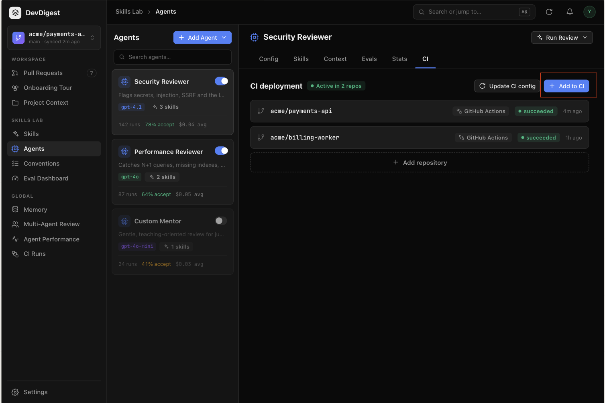
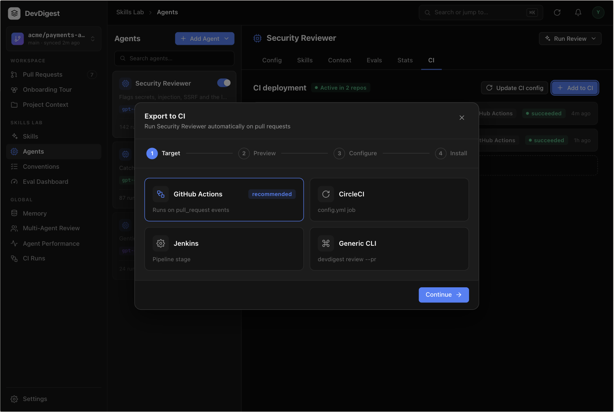
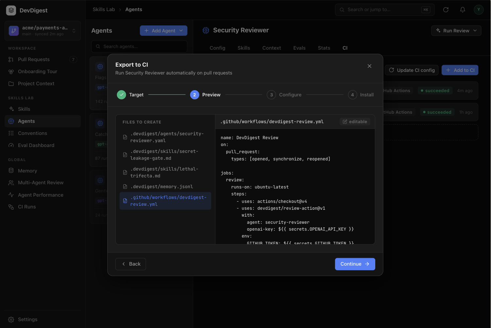
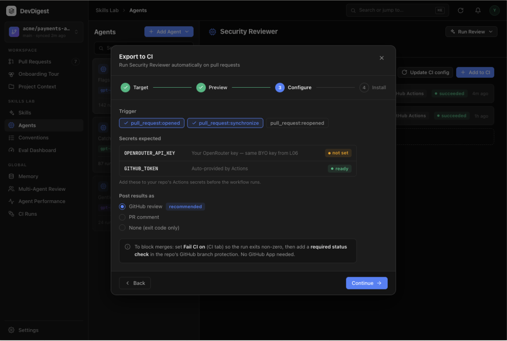
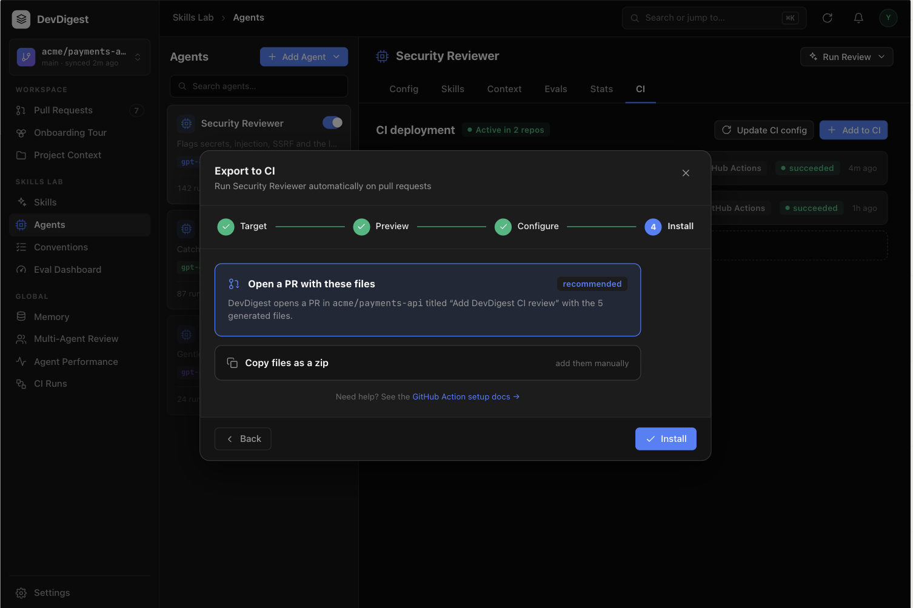
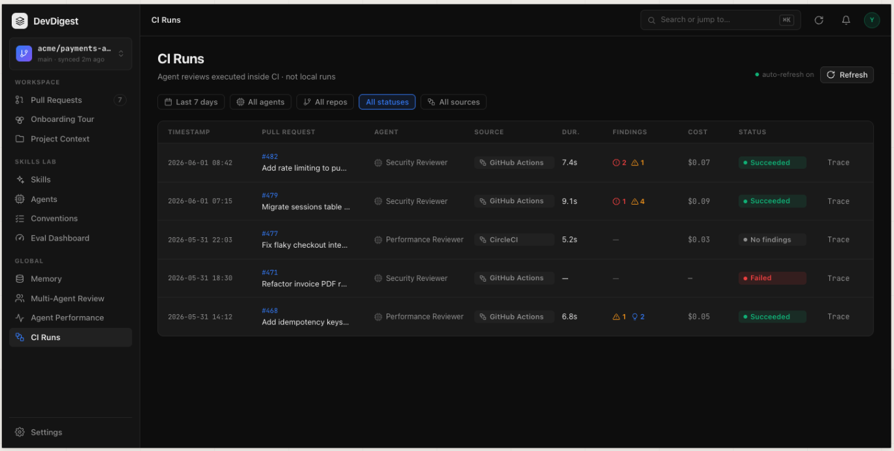
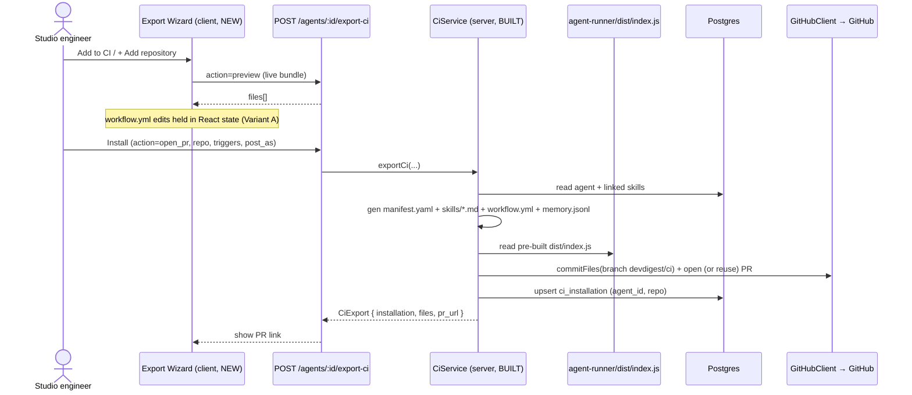
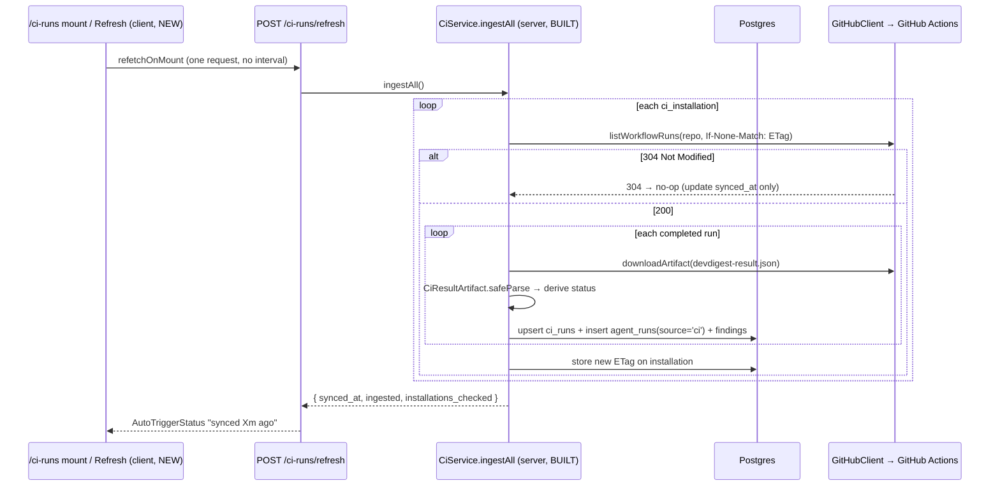

# Spec: Export to CI (wizard, agent CI tab, CI Runs page)  |  Spec ID: 2026-08-25-export-to-ci  |  Status: approved
Supersedes: None

<!--
BASIS & ADAPTATION. This spec adopts the AC skeleton, edge cases, data model, and sequence
diagrams of the upstream spec `SPEC-2026-07-19-export-to-ci` (on branch
`upstream/emdash/export-to-ci-k82lb`, never merged here — it is almost certainly the spec the
already-built `server/src/modules/ci/` backend was implemented against; it explains the
`AC-39/40/41` comments in `generators/workflow.ts`). It is ADAPTED, not blind-copied, to THIS
repo's actual code and to the six mockups the user pasted this session — per commit ca46213's
convention ("adapted to this repo's own schema/contracts rather than a blind merge"). AC numbers
are kept aligned with the upstream so the `AC-39/40/41` code comments stay meaningful.

Related: agent-runner/specs/SPEC-2026-07-19-agent-runner-findings-artifact.md defines the
`devdigest-result.json` artifact (incl. `findings[]`) this feature's ingest consumes.

IMPLEMENTATION STATUS (verified against current source):
  - [BUILT]  Sections A, E, F, G, H — the server ci/ module, ingest, GitHubClient port, DB
             migrations, and workflow security are ALREADY IMPLEMENTED and correct in this repo.
             These ACs are stated so the full end-to-end contract the client depends on is
             recorded and independently re-testable; they are NOT net-new work.
  - [NEW]    Sections B, C, D — Export Wizard, agent CI tab, CI Runs page. The client has ZERO
             wiring today (ExportWizardSteps.tsx is used only by /showcase; no `ci` tab in
             AgentEditor TABS; no /ci-runs route; no nav entry). This is the driving scope.
  - [NEW server delta] ONE deliberate server change: a new edited-`workflow.yml` field on
             `CiExportInput` + a server-side security re-lint that hard-rejects AC-39/40/41
             violations before committing (AC-14/AC-48, human-resolved). Everything else in A/E/F/G/H
             stays as-built.
Each AC below is tagged [BUILT …] or [NEW].
-->

## Problem & why
Agents configured in the studio run only locally today (`agent_runs.source='local'`) — GitHub
cannot reach the studio (local tool, secrets in `~/.devdigest/secrets.json`, no public URL), so a
team cannot rely on an agent for every PR. "Export to CI" deploys a versioned agent configuration
(model, system prompt, linked skills, parameters) into a target repository so its GitHub Actions
auto-review every PR with the same `reviewer-core` engine, and feeds results back into the studio.
**The server that performs the export, workflow generation, and pull-based ingest is already built
and correct** (`server/src/modules/ci/`); the studio has **no client UI to reach it** — no CI tab,
no wizard wired to real data, no CI Runs page. Without that UI the shipped backend is unreachable:
a user cannot deploy an agent to CI at all.

## Goals / Non-goals
**Goals**
- **[NEW]** An Export Wizard (4 steps on `ExportWizardSteps`: Target → Preview → Configure →
  Install), wired to the existing `POST /agents/:id/export-ci` (`action` = `preview`|`open_pr`|`files`).
  Only GitHub Actions is active; only `workflow.yml` is editable, via a CodeMirror-6 YAML editor
  with syntax validation and a structural security lint.
- **[NEW]** A CI tab on the agent page: "Active in N repos", installation rows (repo + target_type +
  last-run status + `ran_at`), a "Fail CI on" selector over the agent's existing `ci_fail_on`, and
  Add to CI / + Add repository / Update CI config actions.
- **[NEW]** A standalone CI Runs page: server-side filters and a table (Timestamp | Pull request |
  Agent | Source | Dur. | Findings | Cost | Status | Trace), an auto-refresh indicator and a manual
  Refresh, and a lightweight per-run Trace drawer.
- **[BUILT — record & verify]** The server export/ingest/generation contract and workflow security
  invariants that the client ACs depend on.

**Non-goals**
- The multi-agent-run service and the PR feed — **explicitly out of scope for worktree B**; must not
  be touched, so they cannot regress.
- The "Stats" tab on the agent page — a pre-existing/separate concern; not specified here, so this
  work neither adds nor changes it.
- `agent-runner` internals and the `devdigest-result.json` shape — owned by its own spec; consumed,
  not redefined, here.
- Real CircleCI / Jenkins / Generic CLI generation, PR logic, **or ingest** — only `'gha'` is real;
  the other three are shown disabled ("Coming soon") everywhere in v1. A CircleCI row appearing in
  the CI Runs mockup is illustrative visual variety, not a requirement that CircleCI ingest work.
- A webhook / cron / background poller, and ingest of in-progress (running) runs — ingest is
  pull-based on page-mount + manual Refresh, completed runs only.
- Full RunTrace parity for CI runs — the CI Trace drawer shows only ingested run data + a link to
  the GitHub Actions logs; no prompt assembly, tool calls, or raw model output.
- A GitHub App — merge-blocking is achieved via "Fail CI on" + a required status check in the target
  repo's branch protection, which needs no App.
- New columns `workflow_version` / `suspended_at`; the memory subsystem (this feature only *includes*
  a possibly-empty `.devdigest/memory.jsonl` in the bundle — the subsystem is a separate spec).
- A `verdict` column/field anywhere — the blocker signal is STATUS(Failed) + FINDINGS(critical
  count), never a verdict (deliberately removed from the CI design).
- **[BUILT]** Re-implementing the server ci/ module, its migrations, the GitHubClient port, or the
  workflow generator — they already exist; changing them is out of scope beyond what a client AC
  strictly requires. (The one deliberate server change in scope is the edited-`workflow.yml`
  round-trip on `CiExportInput` + its server-side security re-lint — see AC-14/AC-48 and Contracts.)
- **Building the legacy single-step "Publish to CI" flow.** `client/messages/en/ci.json` ships
  pre-seeded keys `publishDialog.*`, `ciTab.publish`, `ciTab.republish`, and `ciTab.empty` — leftover
  cruft from an earlier, simpler design that the 4-step Export Wizard superseded (human-confirmed).
  Implementation SHALL build ONLY the `exportWizard.*`-keyed 4-step flow and SHALL NOT build, wire,
  or reference those legacy keys. Per this repo's INSIGHTS precedent (root `INSIGHTS.md` 2026-07-16 /
  client `INSIGHTS.md` on pre-seeded i18n), an unused key is a scope signal, not a mandate — here the
  signal has been explicitly resolved as dead. Any CI-tab empty state uses new copy, not `ciTab.empty`.

## User stories
- As a studio engineer, I want to deploy an agent to a target repo's GitHub Actions through a wizard,
  so it auto-reviews every PR with the same engine I use locally.
- As a studio engineer, I want to edit the generated `workflow.yml` in the wizard with syntax
  highlighting and validation, so I can fix small things before the PR is opened.
- As a studio engineer, I want to install either by opening a PR or by downloading a zip, so I can
  deploy even without giving the studio a write token.
- As a studio engineer, I want the agent page to show how many repos it is active in and each repo's
  last-run status, so I can watch the health of the integration.
- As a studio engineer, I want a CI Runs page listing all CI runs with filters, finding details, and
  status, so I can review agents' CI work at parity with local runs.
- As a studio engineer, I want to click Refresh (or just open the page) to pull new CI results from
  GitHub without any background polling.

## Design sources
<!-- Design assets are PLACED under ./assets/2026-08-25-export-to-ci/ (six files, by /design-assets).
     Each link below is live. The two CI-tab states the user pasted map to the single placed file
     ci-tab-repo-list.png (add-to-ci vs populated-list are the same tab in two states). -->
-  — Agent detail "CI" tab (rightmost after Config/Skills/Context/Evals; "Stats" tab is out of scope). "CI deployment" header, "Active in N repos" pill, "Update CI config" button, primary "+ Add to CI" button, installed-repo rows (`acme/payments-api`, `acme/billing-worker` — GitHub Actions, succeeded — each with target-type badge, last-run status pill, relative time), and an "+ Add repository" row that attaches the same agent to another repo without redoing the wizard from scratch.
-  — pasted in chat. Four target cards; GitHub Actions "recommended", selected by default. **Confirmed:** only GitHub Actions is interactive; CircleCI/Jenkins/Generic CLI render disabled ("Coming soon") — the visually-equal cards must not mislead the AC.
-  — pasted in chat. Left "FILES TO CREATE" panel; right editable code view of the selected file. **Confirmed:** the panel renders the LIVE backend response (`action=preview`), NOT the mockup's own YAML sample — that sample is stale (`uses: devdigest/review-action@v1`, `OPENAI_API_KEY`, no `permissions:`). The real generator (`server/src/modules/ci/generators/workflow.ts`) is the source of truth.
-  — pasted in chat. Trigger chips (`opened` on, `synchronize` on, `reopened` off/optional); "Secrets expected" list (`OPENROUTER_API_KEY` "not set", `GITHUB_TOKEN` "ready"); "Post results as" radio (GitHub review default / PR comment / None); info callout "To block merges: set Fail CI on… then add a required status check… No GitHub App needed."
-  — pasted in chat. Two selectable panels: "Open a PR with these files" (default) and "Copy files as a zip"; footer help link; primary "Install".
-  — pasted in chat. Header "CI Runs" + subtitle "Agent reviews executed inside CI · not local runs"; top-right "auto-refresh on" indicator + "Refresh". Filter bar of 5 pills: "Last 7 days" (date range), "All agents", "All repos", "All statuses", "All sources". Columns: TIMESTAMP · PULL REQUEST (#num link + truncated title) · AGENT (icon + name) · SOURCE (CI-platform badge) · DUR. · FINDINGS (severity-coded inline counts, "—" when none) · COST · STATUS (Succeeded/No findings/Failed pill) · TRACE (per-row link).

**Mockup ↔ upstream-text disagreements (recorded so the planner does not guess):**
- **Nav section.** The upstream text (its AC-20) puts "CI Runs" under the SKILLS LAB nav section; the pasted `ci-runs-page.png` clearly places it in a **GLOBAL** tier (alongside Memory / Multi-Agent Review / Agent Performance). **Trust the mockup** — AC-20 below is written for GLOBAL placement.
- **Route path (RESOLVED).** The upstream text uses `/ci`; this repo's `client/src/components/app-shell/helpers.ts` `activeKeyFor` already maps `/ci-runs` → `"ci-runs"`, and `ci.json` ships `page.crumb: "CI Runs"`. **Human confirmed `/ci-runs`** — used everywhere below (AC-20), never `/ci`.

## Contracts & flows
All server contracts below **already exist** in `*/vendor/shared/contracts/eval-ci.ts` (synced in
both vendor copies — verified) and in `server/src/modules/ci/`. They are a **read-only dependency**
of the new client work.

### Export flow (open_pr)

### Ingest flow (Refresh / page mount)

### Endpoints consumed by the new client
| Contract | Direction | Shape | Notes |
|---|---|---|---|
| `POST /agents/:id/export-ci` `action=preview` | client → server | body `CiExportInput`; resp `{ files: CiFile[], installation: null, pr_url: null }` | Live bundle for Preview. No side-effect. |
| `POST /agents/:id/export-ci` `action=open_pr` | client → server | resp `CiExport` `{ installation, files, pr_url }` (201) | Commits to branch `devdigest/ci`, reuses an existing open PR. |
| `POST /agents/:id/export-ci` `action=files` | client → server | resp `application/zip` (`devdigest-ci.zip`) | Server-side zip; no installation row. |
| `GET /agents/:id/ci-installations` | client → server | resp `CiInstallationsResponse` `{ installations: CiInstallationRow[], active_count }` | Rows carry `repo`, `target_type`, `last_run_status`, `last_ran_at`. |
| `POST /agents/:id/ci-config` | client → server | resp `{ ok: true }` | "Update CI config": re-export to every installation. |
| `GET /ci-runs` | client → server | query `CiRunsQuery` `{ from?, to?, agent?, repo?, status?, source? }`; resp `{ runs: CiRun[] }` | Rows join agent + target_type; include `pr_title`, `duration_*`, severity counts, `findings[]`. |
| `POST /ci-runs/refresh` | client → server | body `CiRefreshInput` (`{ repo? }`, empty allowed); resp `CiRefreshResult` `{ synced_at, ingested, installations_checked }` | Pull ingest; per-installation 304 = no-op. |

**New field on `CiExportInput` (human-resolved: edited-workflow round-trip).** `CiExportInput` gains
one optional field carrying the user's edited `workflow.yml` from the Preview step — e.g.
`workflow_yml?: string` (semantics: the override for the single editable file; when present on
`open_pr`/`files` the server commits THIS content for `.github/workflows/devdigest-review.yml`
instead of its freshly-regenerated copy). **Only `workflow.yml` is overridable** — all other files
(manifest, skills, memory, runner bundle) are always server-generated and cannot be supplied by the
client, minimizing the attack surface of accepting caller-supplied file content. The server SHALL run
its security lint (AC-39/40/41 invariants) against the *edited* content before committing and SHALL
hard-reject a violating override (AC-48). This is a synced change to both `eval-ci.ts` mirrors
(server + client), overriding the earlier "no contract change" assumption. Exact Zod shape is an
implementer detail.

### Two distinct `source` columns — do not conflate them (existing, correct behavior)
- `agent_runs.source` is a `['local','ci']` enum (`server/src/db/schema/runs.ts:24`). CI ingest writes
  the literal `'ci'` (`CiRepository.insertAgentRun`, `server/src/modules/ci/repository.ts:376`) — the
  "ingest writes `agent_runs.source='ci'`" requirement is **already fully satisfied**.
- `ci_runs.source` (surfaced as `CiRun.source`) is a *separately-named* column holding the CI
  **platform** type (`installation.targetType`, e.g. `'gha'`). The CI Runs "Source" column/filter
  reads this platform value, not the local/ci flag.

## Acceptance criteria (EARS)

### A. Export service (`server/src/modules/ci/`) — [BUILT, verified]
- **AC-1** — **[BUILT]** WHEN `POST /agents/:id/export-ci` with `action="open_pr"` arrives, the system SHALL read the agent + linked skills, generate the manifest YAML (`.devdigest/agents/<slug>.yaml`), one `.devdigest/skills/<slug>.md` per skill, the self-contained `.github/workflows/devdigest-review.yml`, include `.devdigest/memory.jsonl` and the runner bundle `.devdigest/runner/index.js`, assemble `CiFile[]`, commit them to branch `devdigest/ci`, open (or reuse) a PR, upsert one `ci_installation` on (agent_id, repo), and return `CiExport { installation, files, pr_url }`. (Verified: `service.ts:83-187`.)
- **AC-2** — **[BUILT]** WHEN the export reads the runner bundle, it SHALL read the pre-built `agent-runner/dist/index.js` from disk; IF absent, THEN it SHALL error with build-it guidance and SHALL NOT build via `child_process` in the HTTP handler. (Verify against `generators/`.)
- **AC-3** — **[BUILT]** WHEN a slug is generated, the system SHALL compute it on the fly as kebab-case with `-2`/`-3` collision suffixes, without persisting a slug column.
- **AC-4** — **[BUILT]** WHEN `CiFile[]` is assembled, the system SHALL set `editable=false` for all derived files and `editable=true` only for `workflow.yml`.
- **AC-5** — **[BUILT]** WHEN `action="files"` arrives, the system SHALL generate the same files, zip them server-side preserving paths, return the zip as a download, and NOT create a `ci_installation`. (Verified: `routes.ts:40-53`, `zip.ts`.)
- **AC-6** — **[BUILT]** WHEN "Update CI config" runs (`POST /agents/:id/ci-config`), the system SHALL re-export the bundle to all existing installations, upserting on (agent_id, repo), without opening the wizard. (Verified: `service.ts:211-227`.)
- **AC-7** — **[BUILT]** The `ci` module SHALL be registered in `server/src/modules/index.ts` as a Fastify plugin per the existing pattern.

### B. Export Wizard (client) — [NEW]
- **AC-8** — **[NEW]** WHEN the user opens the wizard (via "Add to CI" OR "+ Add repository" — both open the same wizard), the system SHALL show a 4-step stepper on `ExportWizardSteps` with steps Target → Preview → Configure → Install; "+ Add repository" SHALL open it for the same agent scoped to a new repo, without re-selecting the agent.
- **AC-9** — **[NEW]** WHILE on the Target step, the system SHALL show 4 cards (GitHub Actions | CircleCI | Jenkins | Generic CLI) where only GitHub Actions is selectable, the other 3 disabled (`aria-disabled`) with a "Coming soon" affordance; `target` SHALL default to `"gha"`. IF the user attempts to select a disabled card, THEN the system SHALL keep `gha` selected and SHALL NOT advance.
- **AC-10** — **[NEW]** WHEN the Preview step is reached, the system SHALL fetch the live bundle via `POST /agents/:id/export-ci` `action=preview` and show a left selector listing the readable files (manifest, one `skills/*.md` per skill, `memory.jsonl`, `workflow.yml`) with the selected file's contents on the right; the runner bundle is committed but SHALL NOT appear in the preview list. The rendered content SHALL be the live backend response, never a hardcoded sample.
- **AC-11** — **[NEW]** WHILE on Preview, only `workflow.yml` SHALL be editable — in a CodeMirror-6 editor with YAML highlighting, auto-indent, and line numbers (badge "editable"); all other files SHALL be read-only monospace displays. (Human-resolved: editing is REAL and persists to the committed PR via the round-trip in AC-14 — not a read-only display.)
- **AC-12** — **[NEW]** IF the edited `workflow.yml` fails to parse as YAML (`yaml.parse` throws), THEN the client SHALL hard-block Continue/Install and show a syntax error.
- **AC-13** — **[NEW]** IF the edited `workflow.yml` violates the structural security lint (permissions broader than `contents:read` + `pull-requests:write`; presence of `pull_request_target`; a hardcoded secret instead of `${{ secrets.* }}`; no runner-invocation step), THEN the client SHALL show a SOFT warning (advisory assistance, framed as not replacing the Phase-2 human PR review) WITHOUT blocking Install — the real safety gate is the server-side hard-reject in AC-48, not this client warning.
- **AC-14** — **[NEW]** The system SHALL hold `workflow.yml` edits in the wizard's React state (Variant A, no Save button), preserve them across Back/Continue, and on Install SHALL send the edited content to the server via the new `CiExportInput` field (see Contracts) so it is committed into the PR / included in the zip; IF the modal is closed before Install, THEN edits SHALL be discarded (no draft persistence). (Human-resolved: server-side round-trip — the server, not the client, is the source of the committed file.)
- **AC-15** — **[NEW]** WHILE on Configure, the system SHALL show trigger checkboxes (`opened` on, `synchronize` on, `reopened` off) mapping to `triggers`; a "Post results as" single-choice control (`github_review` default | `pr_comment` | `none`) mapping to `post_as`, each option with a static label plus a dynamic hint block whose text changes with the selection; a "Secrets expected" list (`OPENROUTER_API_KEY`, `GITHUB_TOKEN`) showing names/status only; and a static block-merge callout (exact copy per AC-47).
- **AC-16** — **[NEW]** WHILE on Install, the system SHALL offer two delivery options: "Open a PR with these files" (default → `action=open_pr`, creates a `ci_installation`) and "Copy files as a zip" (`action=files`, no installation), plus a help link to the GitHub Actions docs. On `open_pr` success it SHALL surface the returned `pr_url`. IF any `export-ci` request fails (non-2xx), THEN the system SHALL surface the error and SHALL NOT report success (no false `pr_url`, no phantom installation).
- **AC-47** — **[NEW]** WHILE on Configure, the block-merge callout SHALL read exactly: "To block merges: set Fail CI on (CI tab) so the run exits non-zero, then add a required status check in the repo's GitHub branch protection. No GitHub App needed." The stale `ci.exportWizard.blockMergeDesc` string ("Requires a GitHub App — not available with PAT in local mode") SHALL be corrected to (or replaced by a key carrying) this copy and SHALL NOT be displayed.
- **AC-48** — **[NEW]** IF an Install request supplies an edited `workflow.yml` that violates the AC-39/40/41 invariants (permissions broader than `contents:read` + `pull-requests:write`; a `pull_request_target` trigger; a hardcoded secret instead of `${{ secrets.* }}`; or no `node .devdigest/runner/index.js` invocation step), THEN the SERVER SHALL hard-reject the export with a non-2xx error and SHALL NOT commit the file — the client-side soft warning (AC-13) is advisory only and is never the sole safety gate.

### C. CI tab (agent page) — [NEW]
- **AC-17** — **[NEW]** WHEN the CI tab opens, the system SHALL show an "Active in N repos" badge where N = `CiInstallationsResponse.active_count`, and SHALL add a "CI" tab to `AgentEditor` `TABS` (label `agents.editor.tabs.ci`) so the `?tab=` allowlist (`VALID_TABS = TABS.map(t => t.key)`) accepts `ci` and `?tab=ci` selects it without snap-back.
- **AC-18** — **[NEW]** WHEN installation rows render, each SHALL show repo + target-type badge + the last `ci_run` STATUS (`last_run_status`) + last `ran_at` (`last_ran_at`); IF an installation has no runs yet, THEN the row SHALL show "No runs yet".
- **AC-19** — **[NEW]** WHEN the user changes the "Fail CI on" selector (Critical | Warning+ | Never), the system SHALL update the agent's `ci_fail_on` via the existing agents-update path (Critical→`critical`, Warning+→`warning`, Never→`never`), and SHALL NOT silently auto-push — the new policy reaches CI only on the next explicit "Update CI config".
- **AC-43** — **[NEW]** IF the agent has no `ci_installation`, THEN "Update CI config" SHALL be disabled with a tooltip "No repos yet — use Add to CI" (not a silent no-op).

### D. CI Runs page (`/ci-runs`) — [NEW]
- **AC-20** — **[NEW]** The system SHALL add a "CI Runs" nav entry (`key: "ci-runs"`) in the **GLOBAL** nav tier (per the mockup, alongside Memory / Multi-Agent Review / Agent Performance — NOT under SKILLS LAB), routing to `/ci-runs`; the page SHALL show the header "CI Runs", the subtitle "Agent reviews executed inside CI · not local runs", an auto-refresh indicator, and a manual Refresh button. The existing `activeKeyFor` already maps `/ci-runs` → `"ci-runs"`, so the entry SHALL rely on that mapping.
- **AC-21** — **[BUILT]** WHEN `GET /ci-runs` arrives with filters (date range | agent | repo | status | source), the server SHALL apply them server-side and return the matching runs. (Verified: `CiRunsQuery`, `service.getCiRuns`.) The client SHALL send active filters as these params.
- **AC-22** — **[NEW]** WHEN the CI Runs table renders, it SHALL have columns TIMESTAMP (`ran_at`) | PULL REQUEST (`#`num + `pr_title` truncated) | AGENT (join) | SOURCE (`target_type` via join) | DUR. | FINDINGS | COST | STATUS | Trace.
- **AC-23** — **[NEW]** In the FINDINGS column, the system SHALL reuse the existing severity primitives (`SeverityBadge`/`SEV` / severity-chip + a findings popover) to render per-severity counts and, on hover, per-finding details (title, category, file:line, confidence, rationale) from the ingested individual findings; when a run has no findings it SHALL render "—".
- **AC-24** — **[NEW]** WHEN findings render in CI Runs, the system SHALL sort them render-side (e.g. severity, then file:line), because the artifact is unordered.
- **AC-25** — **[NEW]** WHEN the user clicks Trace on a run row, the system SHALL open a lightweight drawer with only the available data (agent, PR #+title, source, status, duration, cost, severity-breakdown findings, timestamp) plus a prominent "View full logs on GitHub Actions" button linking `CiRun.github_url`, with no prompt assembly / tool calls / raw output. IF `github_url` is null, THEN the button SHALL be omitted or disabled (no broken link).
- **AC-26** — **[NEW]** IF there are no CI runs, THEN the page SHALL show an empty state (`ci.runs.emptyTitle`/`emptyBody`) with a CTA "+ Set up CI for an agent" navigating to `/agents`.
- **AC-45** — **[NEW]** The CI Runs page SHALL only present CI-executed runs (`agent_runs.source='ci'`), i.e. a filtered slice of the same run history as local-run views — never local runs — relying on `GET /ci-runs` already scoping to CI runs.

### E. Ingest (Refresh) — [BUILT, verified]
- **AC-27** — **[BUILT (server)] / [NEW (client trigger)]** The client SHALL make ONE ingest request on `/ci-runs` mount (TanStack `refetchOnMount`) and on manual Refresh, with no recurring interval or background poller; IF the user never opens `/ci-runs`, THEN there SHALL be zero auto-requests. (Server `ingestAll` verified: `service.ts:238-371`.)
- **AC-28** — **[BUILT]** WHEN ingest runs, it SHALL send a per-installation `If-None-Match` conditional request; on `304` it SHALL no-op (update synced_at, keep ETag); on `200` it SHALL ingest and update the stored ETag. (Verified: `service.ts:249-260,360-363`.)
- **AC-29** — **[BUILT]** WHEN ingest lists runs, it SHALL ingest only completed runs (skip in-progress/queued in v1). (Verified: `service.ts:264`.)
- **AC-30** — **[BUILT]** WHEN a completed run is ingested, the system SHALL download `devdigest-result.json`, validate via `CiResultArtifact.safeParse`, upsert `ci_runs`, create `agent_runs(source='ci')`, and store individual findings bound to that run. (Verified: `service.ts:292-356`, `repository.ts:376`.)
- **AC-31** — **[BUILT]** WHEN a run is ingested, the system SHALL fetch the PR title and store it in `ci_runs.pr_title` (best-effort). (Verified: `service.ts:272-280`.)
- **AC-32** — **[BUILT]** The system SHALL derive `CiRunStatus`: in_progress/queued → `running`; completed + artifact ABSENT → `failed`; completed + artifact + findings_count>0 → `succeeded`; completed + artifact + findings_count===0 → `no_findings`. (Verified: `deriveRunStatus`, `service.ts:43-50`.)
- **AC-33** — **[BUILT]** IF a completed run has an artifact BUT the job is red due to a gate-block, THEN the status SHALL be `succeeded` (with blockers), not `failed` — `failed` only when the artifact is absent. (Verified: `deriveRunStatus` docstring, `service.ts:34-50`.) The client status pill SHALL render this server-derived value (AC-22), never the GitHub job conclusion.
- **AC-34** — **[NEW]** The auto-refresh/"synced" indicator SHALL show the last-synced time (e.g. "synced 2m ago"), not a "polling" state.

### F. Migration (`ci_runs` / `ci_installations`) — [BUILT, verified]
- **AC-35** — **[BUILT]** `ci_runs` SHALL carry `pr_title`, `duration_ms`, `critical`, `warning`, `suggestion`, and SHALL NOT carry `verdict`, `agent`, a source-as-column beyond the platform `source`, `workflow_version`, or `suspended_at` (agent + source shown via join). (Verified: `schema/ci.ts:23-47`.)
- **AC-36** — **[BUILT]** WHEN ingest maps `CiResultArtifact` into `ci_runs`, it SHALL fill `critical`/`warning`/`suggestion`/`duration_ms`/`findings_count`/`cost_usd`/`pr_number` from the artifact and store individual findings separately. (Verified: `service.ts:314-353`.)
- **AC-42** — **[BUILT]** `ci_installations` SHALL carry `lastSyncedEtag` (text, nullable) and `lastSyncedAt` (timestamp, nullable) for conditional requests. (Verified: `schema/ci.ts:14-16`.)

### G. GitHubClient port — [BUILT, verified]
- **AC-37** — **[BUILT]** The `GitHubClient` interface SHALL provide `listWorkflowRuns` (status + conclusion + artifact refs + ETag, conditional-request support) and `downloadArtifact`, implemented in the Octokit adapter and the mock. (Used by `service.ts:249,296`.)
- **AC-38** — **[BUILT baseline] / [NEW for the one added field]** Both mirrors of `eval-ci.ts` (`server/…` and `client/…`) SHALL stay identical in the `CiRun`/`CiResultArtifact`/`CiExportInput` shapes. The existing shapes are already synced (verified); the one change this feature makes — the edited-`workflow.yml` field added to `CiExportInput` (AC-14, Contracts) — SHALL be applied identically to BOTH vendor copies in the same commit, per the repo's dual-vendor-sync rule.

### H. Security (generated workflow.yml) — [BUILT, verified]
- **AC-39** — **[BUILT]** The generated `workflow.yml` SHALL contain `permissions:` of exactly `contents: read` + `pull-requests: write` and nothing broader. (Verified: `generators/workflow.ts:35-37`.)
- **AC-40** — **[BUILT]** The generated `workflow.yml` SHALL obtain the secret only via `${{ secrets.OPENROUTER_API_KEY }}` (never hardcoded, never in the manifest) and SHALL NOT use `pull_request_target` (so fork PRs get no secret). (Verified: `generators/workflow.ts:30-54`.)
- **AC-41** — **[BUILT]** The generated `workflow.yml` SHALL run the runner via `node .devdigest/runner/index.js` (no marketplace action, no `npm install` at CI runtime). (Verified: `generators/workflow.ts:54`.)
- **AC-46** — **[NEW]** WHEN the Preview step renders the generator's `workflow.yml`, the client SHALL display it verbatim — it SHALL NOT substitute the mockup's stale `devdigest/review-action@v1` / `OPENAI_API_KEY` sample — so the user audits the real, secure output (AC-39/40/41).

### Cross-cutting rendering safety — [NEW]
- **AC-44** — **[NEW]** WHEN the client renders any GitHub-/model-originated text (PR title, repo name, finding title/rationale, source) on the CI tab or CI Runs page, it SHALL render it as inert text (default JSX escaping), never as HTML or executable content.

## Edge cases
| Case | Expected behavior | Criterion |
|---|---|---|
| Missing `agent-runner/dist/index.js` | Export errors with clear "build first" guidance, not an unexplained 500 | AC-2 |
| Slug collision in the bundle | `-2`/`-3` suffixes | AC-3 |
| Zip path creates no installation | A CI-tab row appears only when the first real run is ingested via Refresh | AC-5, AC-16 |
| "Update CI config" with no installations | Button disabled + tooltip | AC-43 |
| 304 on all installations | Full no-op; indicator only updates "synced … ago" | AC-28, AC-34 |
| Completed + artifact absent + conclusion=success | Treated as `failed` (artifact should have uploaded — a config anomaly, nothing ingestible) | AC-32 |
| Gate-blocked run (red job, artifact present) | `succeeded` with blockers, not `failed` | AC-33 |
| In-progress/queued runs | Skipped in v1 | AC-29 |
| Empty `memory.jsonl` | Valid — present in the bundle, possibly empty | AC-1 |
| Fork PR (no secret, `GITHUB_TOKEN` read-only) | No `pull_request_target` → review step fails/skips on fork PRs; accepted (safety over coverage) | AC-40 |
| Invalid edited YAML | Client hard-blocks Install | AC-12 |
| Security-lint-violating edited YAML (client) | Client soft-warns; Install still allowed | AC-13 |
| Insecure edited YAML reaches the server on Install | Server hard-rejects (non-2xx), does NOT commit | AC-48 |
| Edit → Back → Continue → Install | Edit preserved and sent to the server; closing the modal before Install discards it | AC-14 |
| 0 findings in a run | STATUS `no_findings`; FINDINGS column "—" | AC-23, AC-32 |
| Unordered findings in the artifact | Render-side sort | AC-24 |
| Non-`gha` target card clicked | Selection stays `gha`; cannot advance | AC-9 |
| `export-ci` (preview or install) fails | Error surfaced; no stale sample, no false success | AC-10, AC-16 |
| Run row with null `github_url` | Trace drawer omits/disables the logs button | AC-25 |
| Long repo / PR title (200 chars) | Truncates without breaking layout | AC-18, AC-22 |
| Malicious PR title / finding text | Rendered inert, never executed | AC-44 |

## Data model / Schema (verified against `server/src/db/schema/`)
- **ci_installations** (`schema/ci.ts`): id, agentId, repo, targetType (`gha|circle|jenkins|cli`), installedAt, **lastSyncedEtag** (text, nullable), **lastSyncedAt** (timestamp, nullable). Per-installation ingest ETag state lives here, not on `ci_runs`.
- **ci_runs** (`schema/ci.ts`): id, ciInstallationId, prNumber, **prTitle**, ranAt, status, findingsCount, **critical**, **warning**, **suggestion**, **durationMs**, costUsd (NUMERIC(12,6)), githubUrl (unique), source (platform type). Agent + platform shown via join; no `verdict` / `workflow_version` / `suspended_at`.
- **ci_run_findings** (`schema/ci.ts`): CI-owned findings (FK `ci_run_id`) mirroring the `Finding` shape — so the FINDINGS column renders without touching the reviews-core `findings` table.
- **agent_runs** (`schema/runs.ts:24`): ingest inserts a row with `source='ci'`; individual findings attach for parity with local runs.
- **CiFile** (contract): path, contents, editable (default true; export overrides → false for derived files).
- **CiRunStatus** (enum): `succeeded | failed | no_findings | running`.

## Non-functional
- **Security (workflow permissions)** — generated workflow has `permissions` exactly `{contents:read, pull-requests:write}` (AC-39).
- **Security (fork PR / secret)** — no `pull_request_target`; secret only via `${{ secrets.OPENROUTER_API_KEY }}`; the wizard never reads/displays/transmits a secret value, only names/status (AC-15, AC-40).
- **Security (supply chain)** — CI runtime runs `node .devdigest/runner/index.js`, no `npm install` / marketplace action (AC-41).
- **Reliability (rate limit)** — ingest uses ETag/If-None-Match so `304`s do not count against GitHub rate limit or change state (AC-28).
- **Reliability (no background load)** — IF the user never opens `/ci-runs`, THEN zero auto-ingest requests (no interval/poller) (AC-27).
- **Bundle (client deps)** — the wizard editor adds only CodeMirror 6 (`@codemirror/lang-yaml`) + the `yaml` package for editing/validation — **NOT** Monaco, **NOT** JSZip (zip is generated server-side). `observable: client/package.json gains codemirror + yaml; no monaco/jszip`.
- **Accessibility** — disabled target cards are programmatically disabled (`aria-disabled`), not merely greyed (AC-9); trigger chips expose toggle state; "Post results as" and the install options are single-choice groups; per the client INSIGHTS nested-interactive rule, a clickable row that also holds its own buttons (installation row, run row) SHALL NOT nest interactive elements inside a single `role="button"`.

## Inputs (provenance)
- Manifest / skills content — [deterministic: ci module] from `agents` + linked `skills`. No LLM.
- `workflow.yml` — [deterministic: ci module] generated template + user edits (React state).
- Runner bundle — [deterministic: disk] pre-built `agent-runner/dist/index.js`.
- `memory.jsonl` — [deterministic: memory snapshot] possibly empty.
- Findings shown in CI Runs — [reused: agent-runner artifact] from `CiResultArtifact.findings` (grounded in the runner; no new studio LLM call). **This feature adds zero LLM calls.**
- STATUS / run metrics — [deterministic: ci module] from workflow-run status/conclusion + artifact content.
- PR title — [deterministic: GitHub] fetched during ingest.

## Untrusted inputs
- **PR text (title/body)** — ingested into `ci_runs.pr_title` and shown in CI Runs — rendered as inert, escaped text (AC-44); in the CI runtime it is already wrapped by `wrapUntrusted` inside `reviewer-core` (unchanged here).
- **Finding titles / rationale / file paths** (model output, grounded) — rendered as inert text (AC-44).
- **`devdigest-result.json`** (artifact from GitHub) — validated via `CiResultArtifact.safeParse` before any DB write; an invalid artifact skips the run rather than crashing (AC-30).
- **Fork PRs** — the generated workflow gives no secret to fork PRs (no `pull_request_target`); no action is triggered from PR comment/body text (AC-40).
- **Edited `workflow.yml`** — now caller-supplied content committed to a PR, so treat it as untrusted input to the SERVER: client-side YAML-syntax hard-block (AC-12) + structural lint soft-warn (AC-13) are advisory; the authoritative gate is the **server-side security re-lint that hard-rejects any AC-39/40/41 violation before committing** (AC-48). Only `workflow.yml` is overridable — no other bundle file accepts client content. Final human decision is still the Phase-2 PR review.
- **Secret values** — not handled by the client at all; only names/status are shown (AC-15).
- **Target repository input (`owner/name`)** — user-authored, flows to a server-side GitHub API call; passed through unchanged on the client (no shell/interpolation).

## Resolved decisions (were open questions; human-ratified — no open clarifications remain)
1. **Editable Preview round-trip → "add server-side round-trip"** (NOT read-only). `CiExportInput` gains an edited-`workflow.yml` field; the server commits the edited content and re-lints it against the AC-39/40/41 invariants before committing, hard-rejecting violations. Reflected in AC-11/12/13/14/48 and Contracts. Only `workflow.yml` is overridable.
2. **Route path → `/ci-runs`** (not upstream's `/ci`) — matches the wired `activeKeyFor` + `ci.json` crumb. Used throughout (AC-20).
3. **Stale i18n `blockMergeDesc` → fix/remove.** Replaced by the exact Configure-callout copy (AC-47).
4. **Legacy `publishDialog.*` / `ciTab.publish` / `ciTab.republish` / `ciTab.empty` keys → dead.** Build ONLY the `exportWizard.*` 4-step flow; do not build/wire/reference the legacy keys (Non-goals).
