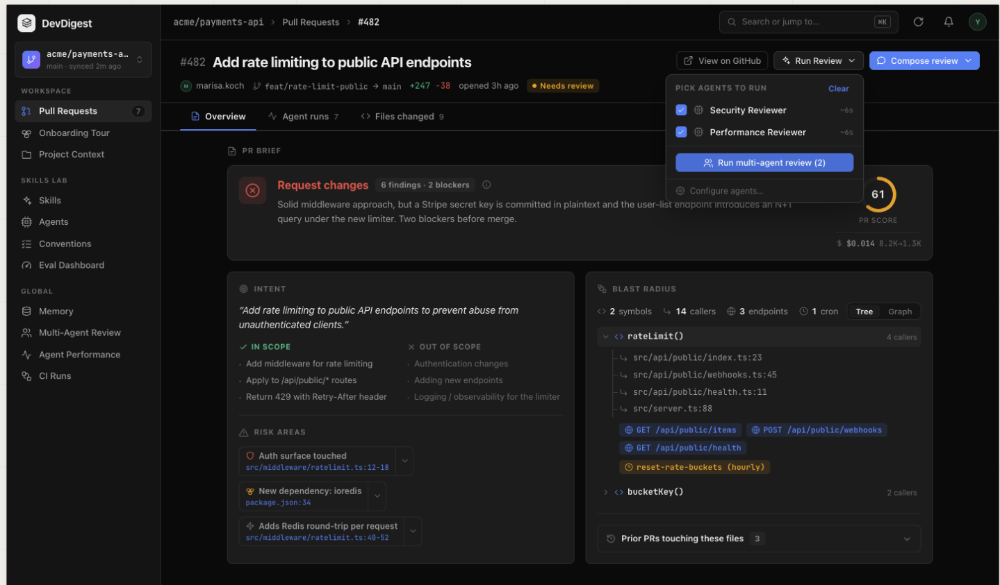
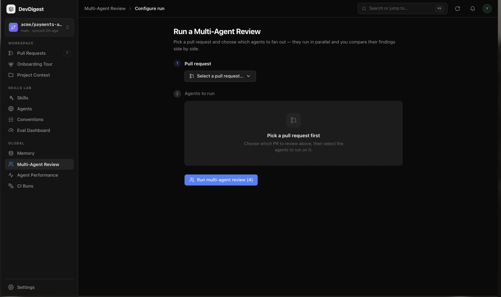
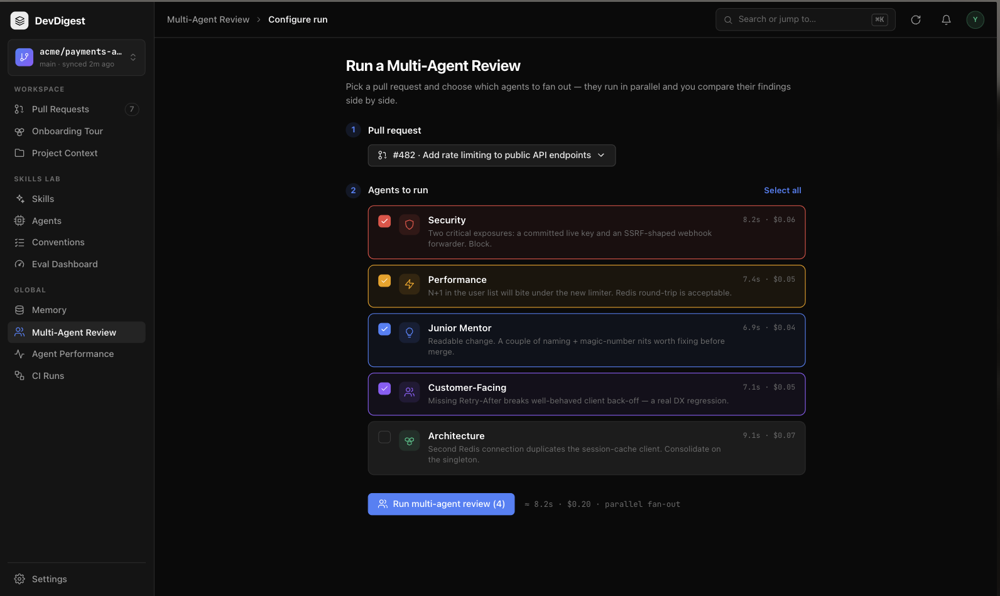
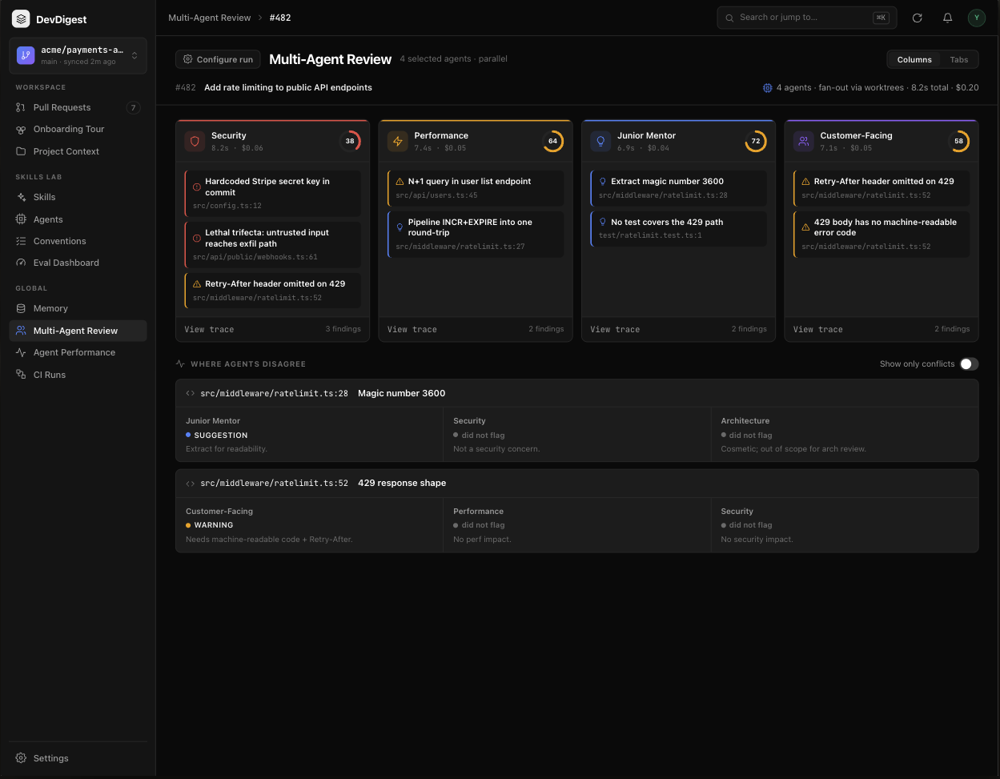
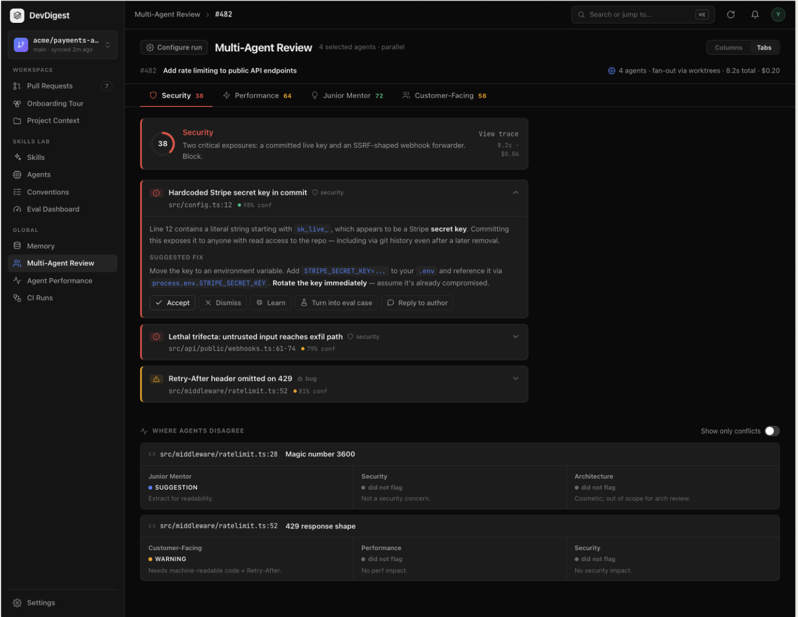
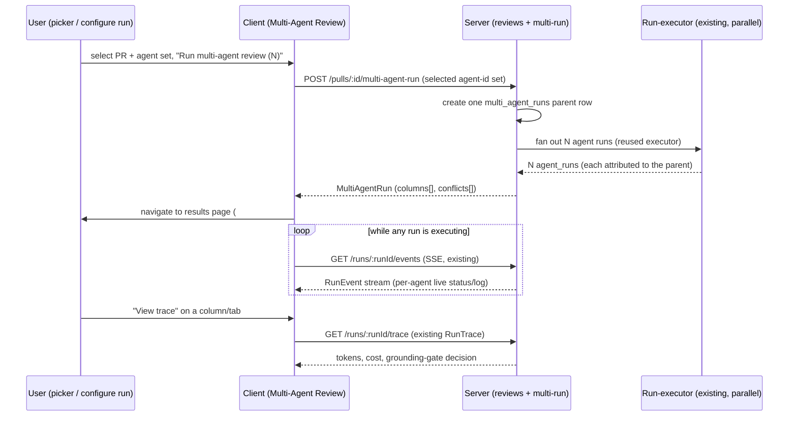

# Spec: Multi-Agent Review  |  Spec ID: 2026-08-25-multiagent-review  |  Status: approved
Supersedes: None

## Problem & why
A single pull request can carry security risk, a performance regression, and a domain-rule
violation at the same time, but a single reviewer agent only looks through one lens. Running
several specialised agents widens coverage — yet that only helps if the product
de-duplicates the findings that overlap, makes it obvious where the agents *disagree*, and
never hides the extra cost of running N agents instead of one. Today there is no way to fan a
PR out to a chosen set of agents and compare their results side by side: the PR page runs one
review at a time, and the `multi_agent_runs` table plus the observability contracts exist only
as stubs. Without this, wider review coverage stays manual and the cost of it stays invisible.

## Goals / Non-goals
**Goals**
- Let a user pick a PR and a set of agents and fan them out in one multi-agent run, from two
  entry points (the PR-page "Run Review" dropdown and a dedicated "Configure run" screen).
- Show a per-agent time/cost estimate before running, and the aggregate cost of the fan-out,
  so the cost of N agents is never hidden.
- Render both entry points' runs on one Multi-Agent Review results page: per-agent columns
  (with live status) and per-agent tabs (with expandable finding detail and actions).
- Group findings across agents by exact `file:line`, keeping every original finding and its
  authoring agent inspectable, and surface where agents disagree — including agents that
  reviewed a location but did not flag it.
- Reuse the existing parallel review execution, run trace drawer, live-log stream, and
  finding-card components rather than rebuilding them.

**Non-goals**
- **`ci/` and `agent-runner/` changes** — out. This is Worktree A of several parallel scoped
  workstreams; it owns only the PR-page picker, the Multi-Agent Review pages, and the
  multi-run service. Touching `ci/`/`agent-runner/` would collide with a sibling workstream.
- **Real per-agent git worktrees** — out. The header copy "fan-out via worktrees" (mockups
  4–5) means "isolated parallel execution"; it is not a spec for literal worktree-per-agent
  execution, which would require `agent-runner/` changes that are out of bounds.
- **A new parallel execution engine** — out. `POST /pulls/:id/review` and the run-executor
  already run multiple agents in parallel (`server/src/modules/reviews/routes.ts`,
  `run-executor.ts`); rebuilding it would duplicate working code and diverge from it.
- **Fuzzy / near-duplicate / embedding-based finding grouping** — out. Grouping is exact
  `file:line` only (confirmed), because that matches the existing `Conflict`/`ConflictTake`
  contract and keeps grouping deterministic and explainable; similarity grouping is deferred.
- **Agent management (defining/editing agents), and the Memory / Agent Performance /
  Onboarding Tour / CI Runs nav pages** — out. The picker consumes the existing agent roster;
  only the "Multi-Agent Review" nav item is added here, not the other GLOBAL-section items
  shown in the mockups (they are separate features). The "Configure agents…" link therefore
  points at the Configure run screen, not an agent-management page (AC-31).
- **A browsable history of a PR's past fan-out runs on this page** — out. The results page
  shows the latest multi-agent run per PR only (AC-29); older fan-out runs are not individually
  re-openable from here (they remain queryable via existing run history where that exists). We
  considered keying the page on `MultiAgentRun.id` for a full history and chose latest-per-PR to
  match the breadcrumb; requester decision, 2026-08-26.

## User stories
- As a reviewer, I want to pick several agents and run them on one PR in a single fan-out, so
  that I get security, performance and domain coverage at once instead of running reviews one
  at a time.
- As a reviewer, I want to see each agent's estimated time and cost — and the aggregate —
  before I run, so that I can decide whether the extra coverage is worth the spend.
- As a reviewer, I want the agents' findings compared side by side and grouped by location,
  with the disagreements called out, so that I can reconcile overlapping opinions quickly.
- As a reviewer, I want to act on an individual finding (accept, dismiss, learn, turn into an
  eval case, reply to author) from the multi-agent results, so that I do not have to leave the
  comparison to triage.
- As a reviewer, I want each agent's run trace (tokens, cost, grounding-gate decision) one
  click away, so that I can see why an agent reached its verdict and what it cost.

## Design sources
Five product mockups, user-supplied, saved under `./assets/2026-08-25-multiagent-review/`:
-  — the PR detail page's "Run Review" button opens a "PICK AGENTS TO RUN" dropdown: one checkbox row per agent (name, icon, ~time estimate), a "Run multi-agent review (N)" footer button, and a "Configure agents…" link.
-  — the Multi-Agent Review > Configure run page. Step 1 "Pull request" (PR picker); step 2 "Agents to run" shows a "Pick a pull request first" empty state until a PR is chosen.
-  — after a PR is picked, step 2 shows one card per agent (Security, Performance, Junior Mentor, Customer-Facing, Architecture) with icon, name, a one-line per-PR summary, a per-agent time/cost estimate (e.g. "8.2s · $0.06"), and a checkbox (all checked except Architecture). "Select all" top-right. Footer: "Run multi-agent review (4)" plus an aggregate "≈ 8.2s · $0.20 · parallel fan-out".
-  — results page (breadcrumb "Multi-Agent Review > #482"), header "4 agents · fan-out via worktrees · 8.2s total · $0.20", Columns/Tabs toggle. One column per agent with a partial-ring score badge (doubles as a live "running" state), duration/cost, verdict summary, its own severity-bordered findings list, "View trace" + finding count. Below: a "WHERE AGENTS DISAGREE" section with a "Show only conflicts" toggle; each conflict is a `file:line` + title with one card per agent showing that agent's verdict (or "did not flag").
-  — same page in Tabs mode: one tab per agent (name + score). The selected tab shows a summary header (score ring, verdict, "View trace", duration/cost) then findings as expandable cards — severity icon, title, category tag, file:line, confidence %; expanded shows markdown rationale, a "SUGGESTED FIX" block, and actions Accept / Dismiss / Learn / Turn into eval case / Reply to author. Same disagreement block below.

## Contracts & flows
These contracts already ship pre-vendored in `server/src/vendor/shared/contracts/observability.ts`
(and the client copy) as A5's stubs. The two endpoints are named in that file's comments but
not yet implemented as routes.

| Contract | Direction | Shape | Notes |
|---|---|---|---|
| `POST /pulls/:id/multi-agent-run` | client → server | request: the selected agent-id set; response: `MultiAgentRun` | Referenced in `observability.ts` comments, not yet a route. Must run the selected agents via the existing parallel executor and attribute the resulting `agent_runs` to one `multi_agent_runs` parent. Existing `RunRequest` (`{agentId?, all?}`, `platform.ts:292`) carries no explicit list — a request shape carrying the selected agent-id set is required (planner decides its exact shape). |
| `GET /pulls/:id/multi-agent` | client → server | `MultiAgentRun` | The multi-agent run for the PR that the results page reads: `columns[]` + `conflicts[]` + `agent_count` + `total_duration_ms` + `total_cost_usd`. |
| `AgentColumn` / `AgentColumnFinding` | server → client | `observability.ts:23-49` | One column per agent (`run_id`, `agent_id`, `agent_name`, `status: done\|failed\|running`, `verdict`, `score`, `summary`, `duration_ms`, `cost_usd`, `findings[]`). **Gap for the planner:** `AgentColumnFinding` has no `confidence` / `suggestion` / `rationale`, which the Tabs-detail cards need (AC-18) — resolve by extending the contract or fetching full `FindingRecord`s (`review-api.ts:15`) separately. The spec fixes the requirement, not the resolution. |
| `Conflict` / `ConflictTake` | server → client | `observability.ts:52-72` | `file` + `line` + `takes[]`; each take is `agent_id` + `persona` + `verdict: Severity\|'ignored'` + `note`. `'ignored'` models "did not flag". Computed from persisted findings; not stored. |
| `GET /runs/:runId/events` | server → client (SSE) | `RunEvent` stream (`trace.ts:21`) | Existing. Per-agent live status/log; reused as-is via `LiveLogStream`. |
| `GET /runs/:runId/trace` | client → server | `RunTrace` (`trace.ts:71`) | Existing. `stats.grounding` / `tokens_in` / `tokens_out` / `cost_usd` per run; "View trace" wires the column's `run_id` into the existing `RunTraceDrawer`. |
| Per-agent estimate | server → client | avg `duration_ms` / avg `cost_usd` over the agent's runs across all PRs | `AgentStats` (`observability.ts:96`: `avg_latency_ms`, `avg_cost_usd`, `runs`) is a strong reuse candidate; `runs === 0` maps to the "no history yet" state (AC-5). |

## Acceptance criteria (EARS)
- **AC-1** — WHEN the user opens the PR page's "Run Review" dropdown, the system SHALL present one selectable row per agent in the workspace, each showing the agent's name and its time estimate.
- **AC-2** — WHILE no pull request is selected on the Configure run screen, the system SHALL show a "pick a pull request first" empty state in the agents step and SHALL NOT allow any agent to be selected.
- **AC-3** — WHERE a pull request is selected on the Configure run screen, the system SHALL show one card per agent with the agent's name, its per-agent time and cost estimate, a one-line summary of that agent's most recent review of the selected PR, and a selection checkbox.
- **AC-4** — The system SHALL compute each agent's time and cost estimate as the average of that agent's own past runs' `duration_ms` and `cost_usd` across all pull requests, not scoped to the selected PR.
- **AC-5** — IF an agent has no past runs, THEN the system SHALL display an explicit "no history yet" estimate state for that agent instead of a numeric estimate.
- **AC-6** — IF the selected agent has no prior review on the selected PR, THEN the system SHALL render that agent's card with a neutral no-summary placeholder instead of a fabricated summary.
- **AC-7** — The system SHALL label the run trigger "Run multi-agent review (N)" on both the PR-page dropdown and the Configure run screen, where N is the count of currently selected agents.
- **AC-8** — WHILE the count of selected agents is zero, the system SHALL disable the "Run multi-agent review" trigger.
- **AC-9** — WHERE at least one agent is selected on the Configure run screen, the system SHALL show an aggregate estimate whose displayed time equals the maximum of the selected agents' time estimates (parallel wall-clock) and whose displayed cost equals the sum of the selected agents' cost estimates.
- **AC-10** — WHEN the user triggers a multi-agent review from either the PR-page dropdown or the Configure run screen, the system SHALL start one multi-agent run over exactly the selected agent set and SHALL navigate to the Multi-Agent Review results page for that run.
- **AC-11** — The system SHALL execute the selected agents through the existing parallel review path (`POST /pulls/:id/review` / run-executor) and SHALL NOT introduce a separate execution engine.
- **AC-12** — The system SHALL attribute every `agent_runs` row produced by one multi-agent trigger to a single parent `multi_agent_runs` row, so that a run's agents are retrievable as one group.
- **AC-13** — WHERE the results page is in Columns mode, the system SHALL render one column per agent in the run, each showing the agent's status, score, duration, cost, verdict summary, and its own findings list.
- **AC-14** — WHILE an agent's run is executing, the system SHALL show that agent's column in a live running state that updates as run events arrive, without blocking the other agents' columns.
- **AC-15** — WHEN the user activates "View trace" on an agent's column or tab, the system SHALL open the existing run trace drawer for that agent's `run_id`.
- **AC-16** — IF one agent's run fails, THEN the system SHALL render that agent's column and tab in a failed state showing the failure reason, and SHALL continue to display the other agents' results.
- **AC-17** — WHERE the results page is in Tabs mode, the system SHALL present one tab per agent (name and score) and render the selected agent's findings as expandable cards.
- **AC-18** — WHEN a finding card is expanded in Tabs mode, the system SHALL show that finding's confidence, rationale, and suggested fix, and SHALL offer the Accept, Dismiss, Learn, Turn into eval case, and Reply to author actions.
- **AC-19** — The system SHALL provide a Columns/Tabs view toggle on the results page.
- **AC-20** — The system SHALL group findings across agents by exact `file:line` match only, and SHALL NOT apply fuzzy, near-duplicate, or embedding-based similarity grouping.
- **AC-21** — WHEN findings from different agents are grouped, the system SHALL preserve each original finding's text and its attribution to the agent that produced it, so that both remain inspectable.
- **AC-22** — WHERE at least two of the run's participating agents take differing stances on the same `file:line` (one flags it and another that also reviewed did not, or they assign divergent severities), the system SHALL surface that `file:line` in the "Where agents disagree" block, showing every participating agent's stance including an explicit "did not flag" for agents that reviewed but did not flag it. The block SHALL include only agents that were part of this run and SHALL NOT include agents that reviewed the PR in earlier or other runs (requester decision, 2026-08-26 — resolves the mockup 4–5 "Architecture" inconsistency; Architecture must not appear in a run it was not part of).
- **AC-23** — WHEN the user enables "Show only conflicts", the system SHALL restrict the disagreement view to `file:line` locations where the run's participating agents disagree.
- **AC-24** — WHEN a multi-agent run completes, the system SHALL display the run's actual total duration and total cost in the results page header.
- **AC-25** — The system SHALL make each agent's run trace able to explain that run's tokens, cost, and grounding-gate decision, reusing the existing run trace's grounding field (`RunStats.grounding`, `trace.ts:65`).
- **AC-26** — IF a requested multi-agent run or its PR belongs to another workspace, THEN the system SHALL respond as not found (workspace-scoped; no cross-workspace read).
- **AC-27** — The system SHALL treat all agent-produced text (finding titles, rationale, suggested fixes, verdict summaries) and PR-derived text as data and render it without executing embedded markup or scripts.
- **AC-28** — The system SHALL derive a multi-agent run's total time and cost from the run's own `agent_runs` data (total time = wall-clock of the parallel fan-out; total cost = sum of per-agent costs), and any 1-agent-vs-N-agent comparison SHALL use these recorded actuals rather than a fixed multiple of the single-agent figure.
- **AC-29** — The system SHALL add a "Multi-Agent Review" navigation item routing to the feature, and the results page SHALL be reachable at a stable URL keyed on the PR number (breadcrumb `#<pr>`) that shows the **latest** multi-agent run for that PR and survives reload (requester decision, 2026-08-26 — latest-per-PR, not a browsable history keyed on `MultiAgentRun.id`).
- **AC-30** — WHEN the user selects exactly one agent and triggers the run from either entry point, the system SHALL treat it as a valid multi-agent run and navigate to the results page rendering a single-column result, using the same flow as a multi-agent run of two or more (requester decision, 2026-08-26 — N≥1 allowed; no separate single-agent routing branch).
- **AC-31** — WHEN the user activates the "Configure agents…" link in the PR-page dropdown, the system SHALL open the Configure run screen with the current PR preselected (step 1 complete), and SHALL NOT route to an agent-management page (requester decision, 2026-08-26 — agent management is a non-goal).

## Edge cases
| Case | Expected behavior | Criterion |
|---|---|---|
| Zero agents selected | Trigger disabled; count reads (0) | AC-8 |
| Agent never run anywhere | "no history yet" estimate, not a default number | AC-5 |
| Agent never reviewed this PR | Card renders with no-summary placeholder | AC-6 |
| Workspace has zero agents | Picker / Configure step 2 show an empty roster state; trigger stays disabled | AC-8 |
| One agent's run fails mid-fan-out | Its column/tab shows failed + reason; others unaffected | AC-16 |
| An agent still running when page renders | Column shows live running state; disagreement block reflects only agents whose runs have completed | AC-14, AC-22 |
| Failed run has null score/cost | Column shows failed state rather than a numeric score/cost | AC-16 |
| Agent flags a location another agent reviewed but ignored | Location appears in disagreement block with "did not flag" for the ignoring agent | AC-22 |
| Same finding at same `file:line` from two agents | Grouped, but both original texts + authorship remain inspectable | AC-20, AC-21 |
| Aggregate of selected estimates | time = max (parallel), cost = sum — not a naive N× of one agent | AC-9, AC-28 |
| Cross-workspace PR / run id requested | Not found | AC-26 |
| Model output contains markup/script-like text | Rendered as inert data | AC-27 |

## Non-functional
- **Performance** — The fan-out runs the selected agents in parallel; the results page SHALL
  render each agent's column independently so a slow or still-running agent does not block the
  others (AC-14). Wall-clock time for the run is the slowest agent's run, not the sum (AC-9,
  AC-28).
- **Security** — Multi-agent runs and results are workspace-scoped; a cross-workspace read
  returns not found (AC-26, mirroring the server's repeated IDOR guidance in
  `server/INSIGHTS.md`). All agent- and PR-derived text is rendered as data, never executed
  (AC-27) — the results page renders model-authored markdown (rationale, suggested fix), which
  is untrusted output.
- **Accessibility** — The Columns/Tabs toggle, per-column "View trace" controls, and expandable
  finding cards SHALL be keyboard-operable, and a collapsible header that also contains its own
  actionable elements SHALL not nest interactive controls inside one another (per
  `client/INSIGHTS.md` 2026-07-16 on `SymbolRow`/`FileCard`).

## Inputs (provenance)
- Selected agent set — [new] — the user's checkbox selection in the picker / Configure run.
- Selected PR — [reused] — chosen from the existing PR list.
- Per-agent time/cost estimate — [deterministic: agent_runs / AgentStats] — average of the
  agent's past `duration_ms` / `cost_usd`; `runs === 0` → "no history yet".
- Per-agent per-PR summary — [reused] — the agent's most recent `ReviewRecord.summary` for the
  selected PR.
- Agent review runs (findings, score, verdict, duration, cost, grounding) — [new: N LLM calls]
  — one review model call per selected agent, run in parallel via the **existing** executor.
  This feature adds N model calls per run, where N = number of selected agents.
- Conflicts / disagreement block — [deterministic: repo data] — computed from persisted
  findings by exact `file:line`; not stored.
- Run totals (duration, cost) — [deterministic] — aggregated from the run's `agent_runs`.

> All four Phase-1 open questions were answered by the requester (2026-08-26) and folded into
> AC-22, AC-29, AC-30, AC-31 and the Non-goals above; no open questions remain.

## Untrusted inputs
- **Agent (LLM) output** — finding titles, rationale, suggested-fix markdown, and verdict
  summaries are model-generated and rendered on the results page. Untrusted: must be rendered
  as data (react-markdown default escaping, no `dangerouslySetInnerHTML`; the vendored
  `Markdown` primitive per `client/INSIGHTS.md` does not use it) — never executed (AC-27).
- **PR-derived text** — PR title/description and changed-file paths originate from a repo the
  reviewer did not author. Untrusted: display-only; `file`/`line` values from findings are used
  for exact-match grouping as opaque data, never interpolated into a query or a path lookup.
