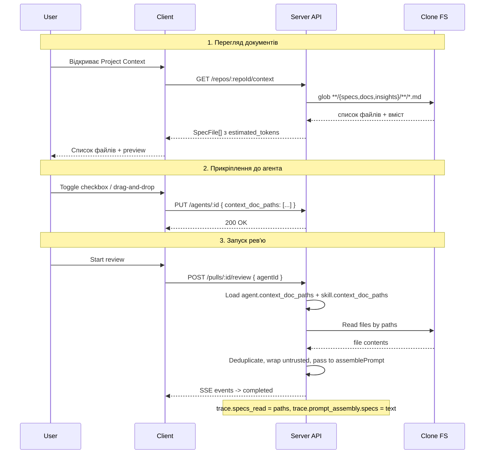

# Spec: Project Context | SPEC-2026-07-02-project-context | Status: draft
Supersedes: N/A
Related: N/A

## Проблема й навіщо

Markdown-документи (специфікації, архітектурні docs, insights) лежать у репозиторії, але рев'ю-агенти їх не бачать. Користувач не може вказати, які документи має читати агент під час рев'ю. Після цієї фічі будь-який `.md`-файл зі спеціальних тек репозиторію стає контекстом, який прикріплюється до агента або скіла і детерміновано вклеюється в промпт при кожному run.

## Goals / Non-goals

**Goals:**
- Дати змогу користувачу бачити всі markdown-документи проекту на окремій сторінці Project Context
- Дати змогу прикріплювати документи до агентів і скілів з контролем порядку
- При запуску рев'ю — детерміновано вклеювати прикріплені документи в промпт як untrusted контент
- Показувати оцінку токенів кожного документа та загальну суму при attach
- Відображати в Run Trace, які документи було прикріплено і їхній повний текст

**Non-goals:**
- Автоматичний вибір документів під конкретний PR (flash-селектор) — відкладено
- Векторний пошук або семантичне ранжування документів
- Редагування `.md`-файлів через UI (тільки preview)
- Створення нових `.md`-файлів через UI

## User stories

- Як рев'ю-інженер, я хочу бачити всі специфікації та docs мого проекту в одному місці, щоб розуміти які документи доступні для контексту
- Як рев'ю-інженер, я хочу прикріплювати документи до агента у визначеному порядку, щоб агент отримував потрібний контекст при кожному рев'ю
- Як рев'ю-інженер, я хочу прикріплювати документи до скіла, щоб будь-який агент з цим скілом автоматично наслідував цей контекст
- Як рев'ю-інженер, я хочу бачити оцінку токенів кожного документа, щоб контролювати бюджет промпту
- Як рев'ю-інженер, я хочу бачити в Run Trace які документи були вкладені і їхній повний текст, щоб верифікувати що агент отримав правильний контекст

## Acceptance criteria (EARS)

### Reader (сервер)

- **AC-1:** КОЛИ користувач запитує список контекстних документів для репозиторію, система повинна (shall) рекурсивно знайти всі `.md`-файли під теками `specs/`, `docs/`, `insights/` (на будь-якій глибині у клоні) та повернути список з повними шляхами відносно кореня репозиторію.
  `observable: curl GET /repos/:repoId/context -> 200 з масивом SpecFile`

- **AC-2:** КОЛИ знайдено `.md`-файли, система повинна (shall) повернути для кожного файлу: шлях, розмір у байтах, дату останньої зміни та оцінку кількості токенів (estimated_tokens).
  `observable: кожен елемент масиву містить path, size, updated_at, estimated_tokens`

- **AC-3:** КОЛИ натиснуто кнопку refresh / reindex, система повинна (shall) перечитати файлову структуру клону та повернути оновлений список разом із загальним підсумком (кількість файлів, сума токенів, час оновлення).
  `observable: POST /repos/:repoId/context/reindex -> 200 { files_count: N, tokens_total: X, refreshed_at: ISO }`

### UI: сторінка Project Context

- **AC-4:** КОЛИ користувач відкриває сторінку Project Context, система повинна (shall) відобразити список знайдених `.md`-файлів зі шляхами та оцінкою токенів кожного файлу.
  `observable: E2E — навігація до Project Context показує список файлів з path і tokens`

- **AC-5:** КОЛИ користувач обирає файл зі списку, система повинна (shall) відобразити preview з rendered markdown у центральній панелі.

- **AC-21:** КОЛИ сторінка Project Context завантажена або після reindex, система повинна (shall) показати рядок-статус у форматі `● N documents · X tokens total · refreshed Xm ago`, де N — кількість знайдених `.md`-файлів, X — сума estimated_tokens усіх файлів, Xm — час від останнього reindex. Слово "chunks" або "indexed" у цьому рядку не з'являється.
  `observable: E2E — футер Project Context містить рядок з кількістю документів і сумою токенів; після reindex час оновлюється`
  `observable: E2E — клік на файл показує markdown preview з вмістом файлу`

### UI: Agent Context tab

- **AC-6:** КОЛИ користувач відкриває вкладку Context у редакторі агента, система повинна (shall) відобразити список контекстних документів з чекбоксами для attach/detach, drag-handle для зміни порядку, бейджем типу (specs/docs/insights) та кнопкою Preview.
  `observable: E2E — агент > Context tab показує список з чекбоксами, drag-handles, бейджами`

- **AC-7:** КОЛИ користувач прикріплює або відкріплює документ через чекбокс, система повинна (shall) зберегти оновлений список шляхів у метаданих агента.
  `observable: toggle чекбокс -> PUT /agents/:id оновлює context_doc_paths; повторне завантаження показує збережений стан`

- **AC-8:** КОЛИ користувач змінює порядок документів через drag-and-drop, система повинна (shall) зберегти новий порядок, і цей порядок повинен (shall) визначати послідовність вставки документів у промпт.
  `observable: drag-and-drop -> PUT /agents/:id оновлює порядок у context_doc_paths; Run Trace підтверджує порядок`

- **AC-9:** ПОКИ у агента прикріплені документи, система повинна (shall) показувати загальну суму оцінених токенів у нижній частині списку.
  `observable: при прикріплених документах видно "~ N tokens" знизу списку`

### UI: Skill Context tab

- **AC-10:** КОЛИ користувач відкриває секцію "Project context to use" у редакторі скіла, система повинна (shall) відобразити аналогічний до агента список документів з attach/detach та drag-and-drop.
  `observable: E2E — скіл > Context секція показує список з чекбоксами і drag`

- **AC-11:** КОЛИ агент використовує скіл з прикріпленими документами, система повинна (shall) автоматично додати ці документи до контексту агента (наслідування).
  `observable: скіл має прикріплений doc -> агент з цим скілом отримує doc у промпті, навіть якщо doc не прикріплений безпосередньо до агента`

### Prompt injection (run-executor)

- **AC-12:** КОЛИ запускається рев'ю з агентом, що має прикріплені контекстні документи, система повинна (shall) прочитати файли за збереженими шляхами та передати їх як untrusted content у слот `## Project context` промпту.
  `observable: Run Trace -> prompt_assembly.specs містить текст прикріплених документів, обгорнутий untrusted-делімітерами`

- **AC-13:** Система повинна (shall) зберігати порядок вставки документів відповідно до порядку, встановленого користувачем (drag-and-drop).
  `observable: Run Trace -> specs відповідає порядку з context_doc_paths агента`

- **AC-14:** ЯКЩО файл за збереженим шляхом не існує у клоні на момент запуску, ТОДІ система повинна (shall) пропустити цей файл і продовжити з наступним, записавши попередження у run log.
  `observable: видалити .md-файл з клону -> запустити рев'ю -> run log містить попередження, рев'ю завершується без помилки`

### Token counting

- **AC-15:** КОЛИ відображається список документів (Project Context page, Agent tab, Skill tab), система повинна (shall) показувати оцінку токенів для кожного документа.
  `observable: кожен документ у списку має відображення estimated_tokens`

- **AC-16:** КОЛИ запускається рев'ю, система повинна (shall) враховувати токени прикріплених документів у загальному бюджеті промпту.
  `observable: Run Trace -> stats.tokens_in включає токени від spec-документів`

### Run Trace

- **AC-17:** КОЛИ рев'ю завершено, система повинна (shall) записати в Run Trace поле `specs_read` зі списком шляхів прикріплених документів.
  `observable: GET /runs/:id -> trace.specs_read містить шляхи прикріплених файлів`

- **AC-18:** КОЛИ рев'ю завершено, система повинна (shall) записати в Run Trace поле `prompt_assembly.specs` з повним текстом прикріплених документів (обгорнутих untrusted-делімітерами).
  `observable: GET /runs/:id -> trace.prompt_assembly.specs !== null, містить текст документів`

- **AC-19:** КОЛИ користувач відкриває Run Trace у Prompt Assembly, система повинна (shall) показати блок "Project context -- attached specs (untrusted)" з можливістю розгорнути та прочитати повний текст.
  `observable: E2E — Run Trace -> Prompt Assembly -> блок specs розгортається і показує повний текст`

- **AC-20:** КОЛИ користувач відкриває Run Trace у Configuration, система повинна (shall) показати поле "Specs read" зі списком шляхів прикріплених документів.
  `observable: E2E — Run Trace -> Configuration -> поле Specs read показує шляхи файлів`

## Edge cases

- **0 документів у репозиторії:** список порожній, підпис "No documents found" — AC-4 покриває (порожній масив рендериться як empty state)
- **Документ видалено з репозиторію після attach:** AC-14 покриває (пропуск + попередження у run log)
- **Один документ прикріплено і до агента, і до скіла цього агента:** система повинна (shall) дедублікувати — вклеїти файл один раз; accepted risk: порядок бере перший occurrence
- **Дуже великий `.md`-файл (>100 KB):** accepted risk — токени рахуються як оцінка, але файл вклеюється повністю; обмеження розміру файлу не входить у цей spec
- **Репозиторій ще не клоновано:** Reader повертає порожній масив, UI показує "Repository not cloned yet"
- **Зміна `.md`-файлу між attach і run:** run-executor читає файл на момент запуску (актуальна версія), а не на момент attach
- **Drag-and-drop з одним документом:** порядок не змінюється, стан зберігається нормально
- **Символи `</untrusted>` у тексті `.md`-файлу:** escaping за існуючим патерном (`.replaceAll("</untrusted>", "<\\/untrusted>")`)

## Data model / Schema

**Agents** (розширення): додається поле `context_doc_paths` -- впорядкований масив рядків (шляхи `.md`-файлів відносно кореня репозиторію). Порожній масив за замовчуванням.

**Skills** (розширення): додається поле `context_doc_paths` -- аналогічне поле як у агентів.

**SpecFile** (вже існує в platform.ts:259): path, content, size, updated_at. Додається `estimated_tokens`.

**ContextSummary** (нова): files_count (int), tokens_total (int), refreshed_at (ISO timestamp) — відповідь POST /repos/:repoId/context/reindex та джерело даних для рядка-статусу (AC-21). Замінює використання `IndexStatus.chunks_indexed` — чанкінг та векторна індексація не є частиною цієї фічі.

**IndexStatus** (вже існує в platform.ts:267): status, pct, message, chunks_indexed. Для цієї фічі НЕ використовується — /context/reindex повертає ContextSummary, а не IndexStatus.

## Workflows



## Service communication

- client -> GET /repos/:repoId/context -> server (context/reader module) -> filesystem (clone)
- client -> POST /repos/:repoId/context/reindex -> server -> filesystem
- client -> PUT /agents/:id { context_doc_paths } -> server (agents module) -> DB
- client -> PUT /skills/:id { context_doc_paths } -> server (skills module) -> DB
- server (run-executor) -> filesystem (read files by paths) -> reviewer-core.assemblePrompt({ specs }) -> LLM
- server (run-executor) -> trace persistence (specs_read, prompt_assembly.specs) -> DB
- client -> GET /runs/:id -> server -> trace with specs_read + prompt_assembly.specs -> client (RunTraceDrawer)

## Contracts (high-level)

Існуючі ендпоінти (вже визначені, потрібно заповнити реальними даними):

```
GET  /repos/:repoId/context              -> 200 SpecFile[]
POST /repos/:repoId/context/reindex      -> 200 IndexStatus
```

Розширення існуючих ендпоінтів:

```
PUT  /agents/:id  body: { ..., context_doc_paths?: string[] }  -> 200
PUT  /skills/:id  body: { ..., context_doc_paths?: string[] }  -> 200
GET  /agents/:id  -> response includes context_doc_paths: string[]
GET  /skills/:id  -> response includes context_doc_paths: string[]
```

Без змін (вже є слот, потрібно заповнити):

```
GET  /runs/:id    -> trace.specs_read: string[], trace.prompt_assembly.specs: string | null
```

## Non-functional

- КОЛИ репозиторій містить понад 500 `.md`-файлів у target-теках, GET /repos/:repoId/context повинен (shall) відповідати менше ніж за 2 секунди.
- Система повинна (shall) рахувати estimated_tokens як `Math.ceil(content.length / 4)` (heuristic, без виклику tokenizer API).
- ЯКЩО сума токенів прикріплених документів перевищує 50% контекстного вікна моделі, система повинна (shall) показати попередження в UI. [NEEDS CLARIFICATION: конкретний поріг та чи блокувати запуск]

## Inputs (provenance)

- GET /repos/:repoId/context: [deterministic: filesystem] -- glob по клону репозиторію
- PUT /agents/:id context_doc_paths: [deterministic: user input] -- масив шляхів від UI
- run-executor specs injection: [deterministic: filesystem] -- читає файли за шляхами з метаданих агента/скіла
- estimated_tokens: [deterministic: server] -- heuristic від розміру файлу, без LLM

## Untrusted inputs

- Вміст `.md`-файлів -- зовнішній контент з репозиторію користувача. Обробляється як дані, не як команди. Обгортається `wrapUntrusted()` з delimiter escaping перед вставкою в промпт.
- Шляхи до файлів -- зберігаються як рядки у метаданих. Валідуються на відповідність реальним файлам у клоні при читанні (AC-14). Path traversal prevention: шляхи мають бути відносними до кореня клону і не містити `..`.

## Verification hints

- AC-1, AC-2, AC-3 -> integration test: створити тимчасовий клон зі структурою specs/a.md, docs/b.md, other/c.md -> GET /repos/:id/context -> перевірити що a.md і b.md є, c.md немає; перевірити estimated_tokens > 0
- AC-4, AC-5 -> E2E: навігація на Project Context, перевірити список файлів, клікнути файл, перевірити preview
- AC-21 -> E2E: відкрити Project Context, перевірити футер "● N documents · X tokens total · refreshed Xm ago"; натиснути reindex, перевірити що час оновився і слово "chunks" відсутнє
- AC-6, AC-7, AC-8 -> E2E: відкрити агент > Context tab, toggle документ, перевірити збереження; drag-and-drop, перевірити новий порядок
- AC-9 -> E2E: прикріпити 2 документи, перевірити суму токенів знизу
- AC-11 -> unit test: скіл має context_doc_paths, агент використовує скіл -> run-executor об'єднує шляхи з агента і скіла
- AC-12, AC-13 -> unit test: mock filesystem, запустити run-executor з agent.context_doc_paths -> перевірити prompt_assembly.specs і порядок
- AC-14 -> unit test: шлях до неіснуючого файлу -> run-executor пропускає файл, log містить warning
- AC-17, AC-18 -> integration test: запустити рев'ю з прикріпленими docs -> GET /runs/:id -> specs_read і specs не порожні
- AC-19, AC-20 -> E2E: відкрити Run Trace -> перевірити блок specs в Prompt Assembly та Specs read в Configuration

## [NEEDS CLARIFICATION]

- Який конкретний поріг токенів для попередження при перевищенні бюджету? Чи блокувати запуск рев'ю при перевищенні, чи тільки показати warning?
- Чи потрібна пагінація для списку файлів на сторінці Project Context, якщо їх дуже багато (500+)?
- Чи потрібен Filter/Search по назві файлу на сторінці Project Context та у вкладках Context агента/скіла?
- Чи має UI показувати "Used by N agents" badge на кожному документі, як на дизайні? Якщо так — потрібен додатковий API endpoint або join.
