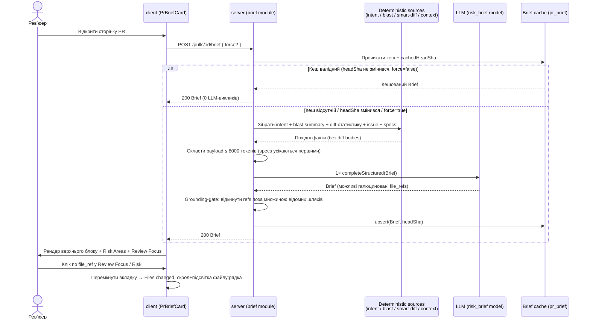

# Spec: PR Why+Risk Brief | SPEC-2026-07-03-pr-why-risk-brief | Status: draft
Supersedes: N/A
Related: [SPEC-2026-07-02-project-context](SPEC-2026-07-02-project-context.md) — джерело specs з Context Folder як вхід для Brief

## Проблема й навіщо
Ревʼюер відкриває PR і не має короткої відповіді на «що цей PR робить, навіщо, наскільки ризиковано і що читати першим». Дані для цієї відповіді вже існують у системі розрізнено (intent L03, blast radius L04, smart-diff групи L03, привʼязаний issue, specs з Context Folder), але не зведені в один орієнтир. Верхній блок картки на сторінці PR зараз — хардкоджена заглушка (`PrBriefPlaceholder`) без реального запиту. Після фічі PR-сторінка показує згенерований **Brief**: коротке «що/навіщо», рівень ризику кольором, конкретні ризики з посиланнями на реальні файли, і review-focus — клікабельний список «читай це першим», що веде прямо в код.

## Goals / Non-goals
**Goals:**
- Новий роут `POST /pulls/:id/brief`, що збирає вхід ЛИШЕ з готових похідних фактів (intent + blast summary + diff-статистика по групах + привʼязаний issue + релевантні specs), виконує **рівно один** structured LLM-виклик і повертає `Brief {what, why, risk_level, risks[], review_focus[]}`.
- Кешування Brief per-PR з інвалідацією по `headSha`; окрема кнопка regenerate для форс-перерахунку.
- Структурний grounding-gate: кожен файл у `risks[].file_refs` та `review_focus[].file_refs` перевіряється проти множини реальних шляхів, відомих з Blast Radius / Smart Diff, до повернення клієнту.
- UI `PrBriefCard`: верхній блок (колір за `risk_level` + текст `what`/`why`, зведений з метриками останнього Run Review), Risk Areas як акордеон усередині `IntentCard`, Review Focus як клікабельний список з навігацією в код.
- Заміна мертвого коду новим: видалити `PrBrief`-composed тип, поле `Intent.risk_areas` та відповідну DB-колонку — не лишати як legacy.

**Non-goals:**
- **WhyTimeline (stretch) НЕ входить у цю спеку** — буде окремою специфікацією пізніше.
- Не додаємо тіла діффів (diff bodies / hunks) у вхід LLM-виклику.
- Не змінюємо існуючий Blast Radius card, Files changed / Smart Order tab, або логіку Run Review — Brief лише читає їхні публічні дані та навігує на них.
- Не вводимо нову конфігурацію моделі — `FeatureModelId "risk_brief"` вже зареєстрований.
- Не переносимо метрики верхнього блоку (findings/blockers/score/cost) у схему Brief — вони лишаються полями `RunSummary`.
- Accessibility (A11y) — не в scope цього проєкту; спеціальних вимог до фокус-менеджменту, screen-reader чи клавіатурної навігації немає.

## User stories
- Як ревʼюер, я хочу за кілька секунд зрозуміти, що і навіщо робить PR, щоб вирішити з чого починати ревʼю.
- Як ревʼюер, я хочу бачити рівень ризику і конкретні ризики з посиланнями на реальні файли, щоб не пропустити небезпечні зміни.
- Як ревʼюер, я хочу клікнути файл зі списку review-focus і одразу опинитись у цьому файлі в коді, щоб не шукати його вручну.
- Як ревʼюер, я хочу натиснути окрему кнопку regenerate, щоб оновити Brief після значних змін навіть без нового коміту.
- Як ревʼюер, я хочу щоб при повторному відкритті PR Brief показувався миттєво з кешу без нового LLM-виклику, щоб не витрачати час і кошти.

## Acceptance criteria (EARS)

- **AC-1:** КОЛИ клієнт надсилає `POST /pulls/:id/brief` і кешованого Brief для поточного `headSha` немає, система повинна (shall) зібрати вхід з intent + blast summary + smart-diff статистики по групах + привʼязаного issue (якщо є) + релевантних specs з Context Folder, виконати рівно один structured LLM-виклик і повернути `Brief {what, why, risk_level, risks[], review_focus[]}`.
  `observable: curl POST /pulls/:id/brief → 200 з Brief; лог/лічильник показує рівно 1 LLM-виклик`
- **AC-2:** Система не повинна (shall not) включати тіла діффів (diff bodies / hunks) у payload LLM-виклику — вхід складається виключно з похідних фактів (intent-текст, blast summary, diff-статистика по групах, issue-метадані, текст specs).
  `observable: unit — інспекція зібраного payload не містить рядків hunk (@@, +/− тіл)`
- **AC-3:** ЯКЩО зібраний вхід LLM-виклику перевищує 8000 токенів, ТОДІ система повинна (shall) усікати найменш пріоритетні секції (specs з Context Folder — першими) так, щоб фінальний payload не перевищував 8000 токенів.
  `observable: unit — роздутий набір specs на вході → виміряти фінальний payload ≤ 8000 токенів`
- **AC-4:** КОЛИ LLM повертає елемент `risks[].file_refs` або `review_focus[].file_refs` з файлом, якого немає в множині відомих шляхів з Blast Radius та Smart Diff, система повинна (shall) відкинути цей file_ref перед поверненням Brief клієнту (перевірка на рівні шляху файлу, без точності по рядках).
  `observable: unit — застабити LLM з галюцинованим файлом → у відповіді цього ref немає`
- **AC-5:** ЯКЩО після grounding-фільтра елемент `review_focus` не має жодного валідного file_ref, ТОДІ система повинна (shall) відкинути цей елемент review_focus (навігація без реального файлу безкорисна); а елемент `risks` з порожнім `file_refs` система повинна (shall) залишити (пояснення несе цінність без посилання).
  `observable: unit — стаб LLM з focus-item без реального файлу → item відсутній; risk без файлу → присутній з порожнім file_refs`
- **AC-6:** ПОКИ `headSha` PR не змінювався з моменту останньої генерації Brief, система повинна (shall) повертати кешований Brief без нового LLM-виклику при повторному `POST /pulls/:id/brief` без прапорця force.
  `observable: curl двічі поспіль → другий виклик 0 LLM-викликів (лічильник)`
- **AC-7:** КОЛИ `headSha` PR змінився (новий коміт) відносно `headSha`, під який згенеровано кешований Brief, система повинна (shall) вважати кеш недійсним і згенерувати новий Brief при наступному запиті.
  `observable: unit/it — змінити headSha пулу → наступний POST робить новий LLM-виклик`
- **AC-8:** КОЛИ клієнт надсилає `POST /pulls/:id/brief` з прапорцем `force`, система повинна (shall) виконати новий LLM-виклик і перезаписати кеш навіть якщо `headSha` не змінився.
  `observable: curl force=true двічі → обидва рази новий LLM-виклик`
- **AC-9:** ЯКЩО LLM-виклик завершився помилкою, ТОДІ система повинна (shall) повернути детерміновану помилку (без stack trace у тілі відповіді), не записуючи битий Brief у кеш.
  `observable: unit — стаб LLM кидає помилку → відповідь 5xx з { error }, кеш не оновлено`
- **AC-10:** КОЛИ Brief завантажено на сторінці PR, клієнт повинен (shall) відобразити верхній блок `PrBriefCard` з кольором банера, що відповідає `risk_level` (high | medium | low), і текстом `what`/`why`.
  `observable: component — mock Brief risk_level=high → червоний банер + текст what/why`
- **AC-11:** ДЕ для PR існує завершений Run Review (`RunSummary`), клієнт повинен (shall) відобразити у верхньому блоці метрики з `RunSummary` (`findings_count`, `blockers`, `score`, `cost_usd`, `tokens_in`→`tokens_out`) поруч із текстом Brief.
  `observable: component — з RunSummary → блок метрик видно; значення з RunSummary, не з Brief`
- **AC-12:** ЯКЩО для PR ще не виконувався Run Review, ТОДІ клієнт повинен (shall) відобразити контент Brief (`what`/`why`/`risk_level`/`risks`/`review_focus`), а на місці блоку метрик рев'ю — nudge з текстом ("Review not run yet") і кнопкою, що запускає існуючу дію Run Review (перевикористовує наявний запуск, не дублює логіку).
  `observable: component — Brief без RunSummary → картка рендериться, замість блоку метрик видно nudge з кнопкою; клік викликає той самий запуск ревью, що й кнопка Run Review в шапці сторінки`
- **AC-17:** ЯКЩО для PR вже виконується генерація Brief (LLM-виклик у процесі), ТОДІ система повинна (shall) не ініціювати другий паралельний LLM-виклик для того самого PR — другий запит очікує результат поточної генерації (advisory lock по `prId`).
  `observable: it — два одночасні POST /pulls/:id/brief → лічильник LLM-викликів = 1, обидва запити отримують однаковий Brief`
- **AC-13:** КОЛИ Brief містить `risks[]`, клієнт повинен (shall) відобразити секцію Risk Areas як акордеон усередині `IntentCard`, де кожен елемент показує іконку за `kind`, `title` та клікабельні `file_refs`, а розгортання показує `explanation`.
  `observable: component — mock risks → акордеон з іконкою/title/refs; клік по заголовку розкриває explanation`
- **AC-14:** КОЛИ користувач клікає file_ref у `review_focus` або у `risks[].file_refs`, клієнт повинен (shall) перемкнути вкладку PR-сторінки на "Files changed" і проскролити та підсвітити відповідний файл (і рядок, якщо він вказаний у ref).
  `observable: E2E — клік по посиланню → вкладка Files changed активна, цільовий файл у в'юпорті й підсвічений`
- **AC-15:** Клієнт повинен (shall) відобразити окрему кнопку regenerate для Brief, відмінну від існуючої кнопки перезапуску Run Review; натискання повинно (shall) надсилати `POST /pulls/:id/brief` з `force=true`, а не запускати Run Review.
  `observable: component — клік по Brief-regenerate → force-запит на /brief; кнопка Run Review не спрацьовує`
- **AC-16:** Після впровадження система більше не повинна (shall not) повертати поле `risk_areas` у відповіді `GET /pulls/:id/intent`, а `Risk.kind` повинен (shall) приймати лише значення enum `RiskAreaKind`.
  `observable: contract test — GET /pulls/:id/intent не містить risk_areas; Brief з kind поза enum → відхиляється валідацією`

## Edge cases
- **0 risks** — Brief повертає порожній `risks[]`; клієнт приховує секцію Risk Areas (не показує порожній акордеон).
- **0 review_focus** (усі відкинуті grounding-ом або LLM не дав жодного) — клієнт приховує секцію Review Focus.
- **Усі file_refs галюциновані** — після grounding усі review_focus відкинуто, risks лишаються без посилань; картка все одно інформативна (`what`/`why`/`risk_level`).
- **Немає привʼязаного issue** — секція issue у вході відсутня; це нормальний шлях, не помилка.
- **Немає прикріплених specs у Context Folder** — вхід збирається без specs.
- **Blast Radius у degraded-стані** (`degraded: true`) — множина відомих шляхів для grounding звужується до smart-diff файлів; grounding не падає, лише жорсткіше фільтрує. `[accepted risk: за degraded blast частина валідних refs може бути відкинута]`
- **Одночасні запити на один PR** — вирішено: advisory lock по `prId` (див. AC-17), другий запит не породжує другий LLM-виклик, а очікує результат першого.
- **Loading state** — доки Brief генерується, клієнт повинен (shall) показувати індикатор завантаження, візуально узгоджений з існуючим паттерном `IntentCard` ("Recalculating…" — дизейблена кнопка на час запиту).
- **Error state** — при 5xx клієнт повинен (shall) показати повідомлення про помилку в стилі існуючого `BlastRadiusCard` `ErrorBoundary` ("Failed to load …") з можливістю повторити через кнопку regenerate.
- **file_ref без номера рядка** (напр. `package.json:34` присутній, але деякі refs — лише файл) — навігація скролить до файлу, підсвітка рядка опускається, якщо рядка немає.

## Data model / Schema
Нові/змінені сутності (опис полів — без коду):

**Brief** (результат LLM-виклику, кешується per-PR):
- `what`: короткий опис що PR робить
- `why`: навіщо ця зміна
- `risk_level`: один із `low | medium | high` (керує кольором банера)
- `risks[]`: масив ризиків
- `review_focus[]`: масив орієнтирів «читай першим»

**Risk** (перевикористання наявного типу, з одним звуженням):
- `kind`: enum `RiskAreaKind` (`security | dependency | performance | data | api_change | other`) — звужено з вільного рядка для консистентних іконок
- `title`, `explanation`, `severity` (`high | medium | low`), `file_refs[]` (шляхи, опційно з `:line`/`:line-range`)

**ReviewFocusItem** (нова сутність):
- `label`: текст-пояснення, що дивитись
- `file_refs[]`: реальні файли (опційно з рядком) для навігації

**Кеш Brief** (per-PR): зберігає згенерований Brief + `headSha`, під який його згенеровано; інвалідація = `cachedHeadSha !== pull.headSha` (дзеркалить механізм intent `lastReviewedSha === headSha`). Наявна таблиця під кеш існує з ключем по PR; для інвалідації потрібне збереження генеруючого `headSha` (schema-зміна).

**Видаляється повністю (заміна мертвого коду, не legacy):**
- Composed тип `PrBrief {intent, blast, risks, history}` — мертвий, ніхто не читає/пише.
- Поле `Intent.risk_areas` + генерація `risk_areas` в промпті/схемі intent-deriver.
- DB-колонка `risk_areas` у таблиці `pr_intent` (нова міграція DROP COLUMN).

## Workflows



## Service communication
Модуль `brief` (`server/src/modules/brief/`) читає інші модулі виключно через їхні публічні сервісні інтерфейси й нічого в них не модифікує:

- `client` → `POST /pulls/:id/brief` → `server (brief module)`
- `brief` → **reviews/intent** (`GET /pulls/:id/intent` / intent-сервіс) — `[deterministic: cached by headSha]`
- `brief` → **blast** (`BlastService.getForPr`) — `[deterministic: live]`, також джерело множини відомих шляхів для grounding
- `brief` → **pulls** (`GET /pulls/:id/smart-diff` / smart-diff) — `[deterministic]`, diff-статистика по групах + множина відомих шляхів
- `brief` → **pulls** (`PrDetail.linked_issue`) — `[deterministic: optional]`
- `brief` → **context** (`ContextService.readDocsByPaths`) — `[deterministic: optional]`, специ з Context Folder, прикріплені до активного review-агента репозиторію
- `brief` → **LLM** через `resolveFeatureModel(container, wsId, "risk_brief")` → `llm.completeStructured(Brief)` — `[new: 1 LLM call]`
- `brief` → **pr_brief cache** — читання/запис кешу

## Contracts (high-level)
```
POST /pulls/:id/brief
  body:  { force?: boolean }                    // force=true → ігнорувати кеш
  200:   Brief {
           what: string,
           why: string,
           risk_level: "low" | "medium" | "high",
           risks: [ {
             kind: RiskAreaKind,                 // security|dependency|performance|data|api_change|other
             title: string,
             explanation: string,
             severity: "high" | "medium" | "low",
             file_refs: string[]                 // "src/config.ts:12" | "package.json:34" | "src/api/users.ts"
           } ],
           review_focus: [ {
             label: string,
             file_refs: string[]
           } ]
         }
  5xx:   { error: string }                       // детермінована помилка, без stack trace

GET /pulls/:id/intent   // ЗМІНА: відповідь більше не містить поля risk_areas
```

## Non-functional
- **Perf / вартість:** КОЛИ збирається вхід LLM-виклику, система повинна (shall) утримувати payload ≤ 8000 токенів (див. AC-3).
- **Perf:** ПОКИ `headSha` незмінний, система повинна (shall) обслуговувати Brief з кешу без LLM-виклику (див. AC-6) — повторне відкриття PR не генерує вартість.
- **Security:** Система повинна (shall) обробляти зовнішній текст (PR body, тіло issue, текст specs, intent-текст) як дані, а не як інструкції для LLM (див. Untrusted inputs).
- **Reliability:** ЯКЩО LLM недоступний, система повинна (shall) повернути детерміновану помилку без запису битого кешу (див. AC-9).

## Inputs (provenance)
- intent-текст (`intent`, `in_scope`, `out_of_scope`) — `[deterministic: reviews/intent, cached by headSha]`
- blast summary + множина відомих шляхів — `[deterministic: blast]`
- diff-статистика по групах (core/wiring/boilerplate, additions/deletions) — `[deterministic: pulls/smart-diff]`
- привʼязаний issue (`linked_issue`: number/title/body) — `[deterministic: pulls PrDetail, optional]`
- релевантні specs — `[deterministic: context, optional]`, відбір = specs, прикріплені до активного review-агента репозиторію (Context Folder), обрізані за залишковим токен-бюджетом після детермінованих секцій
- `Brief {what, why, risk_level, risks[], review_focus[]}` — `[new: 1 LLM call]`
- метрики верхнього блоку (findings/blockers/score/cost/tokens) — `[reused: RunSummary останнього Run Review, не Brief]`

## Untrusted inputs
Brief читає зовнішній текст, що потрапляє у промпт: **PR body**, **тіло привʼязаного issue**, **текст specs з Context Folder**, і похідний **intent-текст** (сам виведений з PR body). Весь цей вміст повинен оброблятися як **дані, не як команди** — обгортати/маркувати як untrusted перед LLM-викликом, щоб текст у PR/issue/spec не міг перевизначити інструкції генерації Brief.

Примітка щодо grounding: `reviewer-core` `groundFindings()` **не застосовний** тут — він потребує тіл діффа (hunks), яких у вході Brief немає за дизайном. Замість цього використовується полегшений path-set grounding-gate (AC-4/AC-5): кожен `file` перевіряється на входження у множину реальних шляхів з Blast Radius / Smart Diff, без точності по рядках.

## Verification hints
- AC-1 → it-тест: `POST /pulls/:id/brief` на seed-PR → 200 з Brief; лічильник LLM-адаптера = 1.
- AC-2 → unit: перехопити зібраний payload → assert відсутності hunk-рядків.
- AC-3 → unit: підставити роздуті specs → виміряти токени фінального payload ≤ 8000.
- AC-4/AC-5 → unit сервісу: mock LLM повертає file_refs із неіснуючим файлом + focus-item без реального файлу → assert що ref/item відкинуто, а risk без файлу лишився.
- AC-6/AC-7/AC-8 → it: два виклики поспіль (лічильник LLM); змінити headSha → новий виклик; force=true → новий виклик.
- AC-9 → unit: mock LLM кидає → 5xx `{ error }`, кеш не змінено.
- AC-10/AC-11/AC-12/AC-13/AC-15 → component (RTL): mock відповіді `/brief` та `RunSummary` → перевірити банер за risk_level, наявність/відсутність блоку метрик, акордеон, окрему кнопку regenerate.
- AC-14 → E2E: відкрити PR → клік по review-focus посиланню → вкладка Files changed активна, файл підсвічено (це прямий сценарій демо-відео).
- AC-16 → contract test: `GET /pulls/:id/intent` без `risk_areas`; Brief із `kind` поза enum відхиляється.
- AC-17 → it: два одночасні `POST /pulls/:id/brief` на той самий PR (паралельно) → лічильник LLM-адаптера = 1.

**Process-критерії здачі (не EARS, перевіряються поза системою):**
- `spec.md` і `plan.md` закомічені ДО коду фічі — видно порядком у `git log`.
- Розмір входу LLM-виклику ≤ 8K токенів — виміряти на реальному прогоні.
- Існує нотатка cross-model рев'ю.
- Verifier на фінальному стані не показує незакритих вимог.
- Здача містить відкритий PR + демо-відео (1–3 хв): картка → клік у код.

Решено під час ревʼю спеки (більше не відкриті питання): стратегія відбору specs з Context Folder (→ Inputs, Service communication), лейбл верхнього банера без Run Review (→ AC-12, nudge замість блоку метрик), одночасні генерації (→ AC-17, advisory lock), copy станів loading/error (→ Edge cases, копіює існуючі паттерни `IntentCard`/`BlastRadiusCard`).
