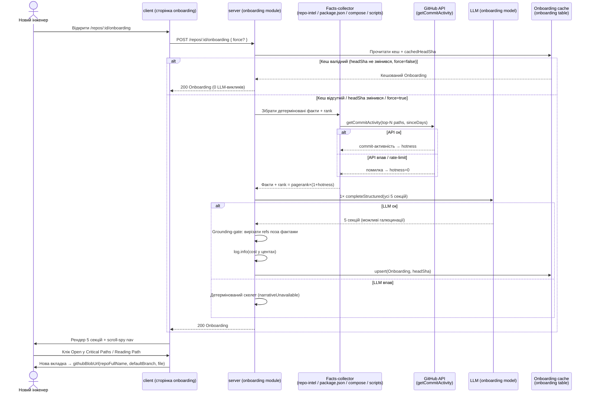

# Spec: Onboarding Generator (Onboarding Tour) | SPEC-2026-07-04-onboarding-generator | Status: draft
Supersedes: N/A
Related: [SPEC-2026-07-03-pr-why-risk-brief](SPEC-2026-07-03-pr-why-risk-brief.md) — той самий паттерн «детерміновані факти → рівно один structured LLM-виклик → grounding-gate → кеш по headSha»; [SPEC-2026-07-02-project-context](SPEC-2026-07-02-project-context.md) — механізм doc-discovery з Context Folder перевикористовується детектором «missing-doc» у First Tasks

## Проблема й навіщо
Новий інженер (або ревʼюер, що вперше відкриває незнайоме репо) не має єдиної відповіді на «як влаштований цей код, з чого почати читати, як його запустити і за яку першу задачу взятись». Сигнали для цієї відповіді вже існують розрізнено: repo-intel будує import-граф і рахує PageRank (`getTopFilesByRank`, `getCriticalPaths`), система знає `package.json`-и, `docker-compose`, `.env.example`, orchestration-скрипти. Але зведеного орієнтиру немає, а наявний scaffold (`onboarding` таблиця, `onboarding.system.md`, `FeatureModelId "onboarding"`, згадка модуля в `modules/index.ts`) стоїть незаповненим. Після фічі репо отримує сторінку **Onboarding Tour** з 5 секціями (архітектура з діаграмою, критичні файли, як запустити локально, порядок читання, перші задачі), згенерованими з детермінованих фактів рівно одним LLM-викликом і очищеними grounding-gate від галюцинацій.

## Goals / Non-goals
**Goals:**
- Новий серверний модуль `server/src/modules/onboarding/` (`routes.ts`, `service.ts`), дзеркалить контракт `brief`: `POST /repos/:id/onboarding?force=true` (генерація/регенерація) + `GET /repos/:id/onboarding` (кеш, 404 якщо немає), rate-limit `{max:10, timeWindow:"1 minute"}`.
- Детермінований facts-collector (звичайний код) збирає все перевірюване (rank/critical-paths, усі `package.json` за роллю, docker-compose services, `.env.example` імена змінних, package-manager по lockfile, orchestration-скрипти) → **рівно один** `llm.completeStructured` формує всі 5 секцій за один виклик → grounding-gate вирізає будь-яке галюциноване посилання на файл/пакет/сервіс проти множини відомих фактів.
- Кеш per-`(repoId, headSha)`: розширити наявну таблицю `onboarding` новою колонкою `headSha` однією міграцією (`pnpm db:generate` → `pnpm db:migrate`), не створювати нову таблицю.
- Реальний hotness-сигнал: `rank = pagerank × (1 + hotness)`, де hotness рахується новим методом `getCommitActivity(repo, paths, sinceDays)` в `OctokitGitHubClient` лише для top-N кандидатів; при збої API — graceful degrade до `hotness = 0`.
- Клієнтська сторінка `client/src/app/repos/[repoId]/onboarding/`: 5 колапсибл-акордеон-секцій, sticky scroll-spy навігація, three-level drill-down діаграма через наявний `MermaidDiagram`, «Open» на GitHub blob, copy-кнопки для команд.
- Строга резолюція feature-моделі БЕЗ мовчазного fallback: замінити всі виклики `resolveFeatureModel` на `getFeatureModelOverride` + `ValidationError` (422), і видалити мертві `resolveFeatureModel`/`defaultFeatureModel`/`DEFAULTS`. Застосувати до нового Onboarding-виклику ТА всіх 5 наявних call-sites (retrofit у цій же спеці).
- Перше логування вартості: `log.info` з `costUsd` (в центах) одразу після structured-виклику.

**Non-goals:**
- Не підтримуємо не-JS/TS репо для секцій із import-графом (архітектура, критичні файли, порядок читання) — це наявне мовчазне обмеження dependency-cruiser; такі репо отримують наявний degraded-скелет.
- Не переписуємо pipeline індексації / shallow-clone; hotness не чіпає індексацію, а окремо кличе GitHub API для top-N.
- Не вводимо read-progress tracking («mark as read») у Guided Reading Path.
- Не робимо First Tasks клікабельними (для ще-не-створеного файлу немає навігаційної цілі).
- Не використовуємо D3 force-graph (`BlastGraph.tsx`) для архітектурної діаграми — рендер через `MermaidDiagram`.
- Не створюємо нову таблицю під кеш і не додаємо новий `FeatureModelId` — обидва вже існують у scaffold.
- Не зберігаємо complexity-mapping / gap-детектори в Postgres чи конфіг-файлі — це TS-константи в коді (як `CRITICAL_PATH_ROOTS`).
- Accessibility (A11y) — поза scope цього проєкту; вимог до клавіатурної навігації / screen-reader немає (scroll-spy IntersectionObserver — функціональна вимога UX, не A11y).

## User stories
- Як новий інженер, я хочу за хвилину зрозуміти архітектуру репо з коротким текстом і діаграмою, щоб не читати весь код підряд.
- Як новий інженер, я хочу список 5-8 критичних файлів з поясненням «чому важливо» і кнопкою Open, щоб одразу відкрити їх у коді.
- Як новий інженер, я хочу копіювані команди запуску локально (з правильним entrypoint і потрібними env-змінними), щоб підняти проєкт без вгадування.
- Як новий інженер, я хочу порядок читання (~3 файли), щоб знати послідовність занурення в код.
- Як новий інженер, я хочу 2-3 персоналізовані стартові задачі з реального пробілу (нема тесту/доки/патерну), щоб взятись за щось корисне з першого дня.
- Як користувач, я хочу натиснути Regenerate, щоб перегенерувати тур після значних змін у репо.
- Як користувач, я хочу щоб при повторному відкритті тур показувався миттєво з кешу без нового LLM-виклику.
- Як адміністратор воркспейсу, я хочу явну помилку «оберіть модель», а не мовчазний дефолт, коли для фічі не обрано модель у Settings.

## Acceptance criteria (EARS)

### Генерація, кеш, API
- **AC-1:** КОЛИ клієнт надсилає `POST /repos/:id/onboarding` і валідного кешу для поточного `(repoId, headSha)` немає, система повинна (shall) зібрати детерміновані факти, виконати **рівно один** `llm.completeStructured`-виклик, що повертає всі 5 секцій одразу, застосувати grounding-gate і повернути `Onboarding {repoName, filesIndexed, generatedAt, sections{architecture, criticalPaths, howToRun, readingPath, firstTasks}}`.
  `observable: it — POST на seed-репо → 200 з 5 секціями; лічильник LLM-адаптера = 1`
- **AC-2:** Система повинна (shall) виконати рівно ОДИН structured LLM-виклик на всі 5 секцій, а не окремий виклик на секцію.
  `observable: it — лічильник LLM-адаптера після повної генерації = 1`
- **AC-3:** ПОКИ `headSha` репо не змінювався з моменту генерації кешованого Onboarding, система повинна (shall) при повторному `POST /repos/:id/onboarding` без `force` повертати кеш без нового LLM-виклику.
  `observable: it — два POST поспіль → другий 0 LLM-викликів`
- **AC-4:** КОЛИ `headSha` репо змінився відносно `headSha`, під який згенеровано кеш, система повинна (shall) вважати кеш недійсним і згенерувати новий Onboarding при наступному запиті.
  `observable: it — змінити headSha → наступний POST робить новий LLM-виклик`
- **AC-5:** КОЛИ клієнт надсилає `POST /repos/:id/onboarding?force=true`, система повинна (shall) виконати новий LLM-виклик і перезаписати кеш навіть якщо `headSha` не змінився.
  `observable: it — force=true двічі → обидва рази новий виклик`
- **AC-6:** КОЛИ клієнт надсилає `GET /repos/:id/onboarding`, система повинна (shall) повернути кешований Onboarding, а ЯКЩО кешу немає — повернути 404.
  `observable: it — GET без попередньої генерації → 404; після генерації → 200`
- **AC-7:** ЯКЩО кількість запитів на `POST /repos/:id/onboarding` перевищує 10 за 1 хвилину, ТОДІ система повинна (shall) відхилити надлишкові запити rate-limit-відповіддю (конфіг `{max:10, timeWindow:"1 minute"}`, як у `brief`).
  `observable: it — 11-й POST за хвилину → 429`
- **AC-8:** КОЛИ structured-виклик завершено, система повинна (shall) залогувати `log.info` вартість виклику в центах з `costUsd`, повернутого LLM-провайдером.
  `observable: unit — стаб LLM з costUsd → перехопити log.info з полем вартості в центах`
- **AC-31:** ПОКИ генерація Onboarding для конкретного `repoId` вже виконується, система повинна (shall) використати advisory lock по `repoId` (той самий патерн, що й у `brief`), щоб паралельний `POST /repos/:id/onboarding` (інший таб, інший користувач по Share link, повторний клік) не запускав другий LLM-виклик — другий запит або очікує результат першого, або отримує явну відповідь «генерація вже виконується», але не оплачує окремий structured-виклик.
  `observable: it — два паралельні POST на той самий repoId → лічильник LLM-адаптера = 1, обидва запити повертають однаковий результат`

### Grounding
- **AC-9:** КОЛИ LLM повертає посилання на файл, пакет або зовнішній сервіс, якого немає у множині відомих фактів (реальні шляхи з rank/edges, імена пакетів з package.json, сервіси з docker-compose), система повинна (shall) відкинути це посилання перед поверненням Onboarding клієнту.
  `observable: unit — стаб LLM з галюцинованим файлом/пакетом → у відповіді цього посилання немає`
- **AC-10:** Система повинна (shall) допускати у секції Critical Paths лише елементи з `kind:'file'` і не повинна (shall not) включати елементи `kind:'service'` (кожен елемент потребує реального файлу для Open).
  `observable: unit — стаб LLM повертає service-елемент у criticalPaths → його відкинуто`
- **AC-11:** ДЕ вузлів-кандидатів архітектурної діаграми більше за верхню межу (5-8), система повинна (shall) детерміновано залишити top-N за центральністю і згорнути решту в один generic overflow-вузол (без LLM-кластеризації).
  `observable: unit — 12 вузлів-кандидатів → рівно ≤8 вузлів + 1 overflow-вузол`

### Hotness
- **AC-12:** КОЛИ система ранжує файли для Onboarding, вона повинна (shall) обчислювати `rank = pagerank × (1 + hotness)`, де `hotness` отримано з `getCommitActivity(repo, paths, sinceDays)` лише для top-N PageRank-кандидатів.
  `observable: it — стаб getCommitActivity з різною активністю → порядок rank змінюється відносно чистого pagerank`
- **AC-13:** ЯКЩО `getCommitActivity` завершився помилкою або rate-limit, ТОДІ система повинна (shall) деградувати до `hotness = 0` (чистий PageRank) і не повинна (shall not) провалити всю генерацію Onboarding.
  `observable: unit — стаб getCommitActivity кидає → генерація завершується, rank = pagerank`

### Feature-model строга резолюція (retrofit)
- **AC-14:** КОЛИ будь-який feature-виклик (Onboarding, risk_brief, conventions, blast, review_intent, конформність) резолвить модель і для неї не обрано override у Settings → Feature Models, система повинна (shall) кинути `ValidationError` (422) з повідомленням `"No model selected for {label} — choose one in Settings → Feature Models"` (label з реєстру `FEATURE_MODELS`), і не повинна (shall not) підставляти мовчазний дефолт.
  `observable: unit — для feature без override виклик кидає ValidationError 422 з очікуваним повідомленням; жоден із 6 call-sites не викликає resolveFeatureModel`
- **AC-15:** Після міграції всіх call-sites система не повинна (shall not) містити `resolveFeatureModel`, `defaultFeatureModel` чи `DEFAULTS` у `settings/feature-models.ts`.
  `observable: grep — жодного посилання на ці символи у server/src; typecheck зелений`

### Секції: детерміновані правила
- **AC-16:** ДЕ доступний lockfile, `package.json`-скрипти, docker-compose і orchestration-скрипти, секція How to run locally повинна (shall) формуватись повністю механічно і повинна (shall) працювати навіть при 0 LLM-викликів (degraded-режим).
  `observable: unit — facts-only збірка howToRun без LLM → непорожній набір команд`
- **AC-17:** КОЛИ формується секція Guided Reading Path, система повинна (shall) брати послідовність із `repoIntel.getCriticalPaths(repoId)` (BFS по rank+edges від top-ranked root, ~3 hops), кожен елемент з одним рядком-причиною і клікабельним посиланням.
  `observable: unit — getCriticalPaths стаб → readingPath дзеркалить порядок обходу`
- **AC-18:** КОЛИ формується секція First Tasks, система повинна (shall) виводити 2-3 задачі виключно з реально виявленого пробілу: два універсальні детектори (відсутній тест для важливого файлу; відсутня дока для критичної області, через наявний `modules/context/service.ts`) плюс v1-список style-conditional перевірок, обмежений трьома: health/readiness endpoint і rate-limiting для пакетів з роллю backend, error boundary/loading state для пакетів з роллю frontend. `suggestedPath` повинен (shall) бути новою локацією, похідною від конвенції (директорія реальна, іменування за конвенцією), позначеною як пропозиція, не наявний файл. ЯКЩО кілька задач мають однаковий score, система повинна (shall) обирати фінальні 2-3 за round-robin спершу по типу пробілу (test/doc/pattern), потім по пакету, щоб уникнути трьох задач одного типу чи одного пакета.
  `observable: unit — репо з файлом без тесту → задача missing-test із suggestedPath у реальній test-директорії; репо з рівними score у двох gap-типів → фінальний набір містить обидва типи`
- **AC-19:** КОЛИ обчислюється complexity-badge задачі, система повинна (shall) брати детерміновану базу за типом пробілу (missing-doc→Low, missing-pattern→Low, missing-test→Medium) з підняттям на один рівень, ЯКЩО fan-in цільового файлу високий; це відображення повинно (shall) бути TS-константою в коді, не в БД чи конфізі.
  `observable: unit — missing-test з високим fan-in → badge = High; mapping читається з константи`
- **AC-20:** ДЕ репо містить декілька пакетів (`package.json` з різними роллю), система повинна (shall) резервувати щонайменше 1-2 слоти на кожен виявлений пакет у Critical Paths (5-8) і у First Tasks (2-3) до заповнення решти слотів глобальним рангом.
  `observable: unit — 3-пакетне репо → кожен пакет представлений ≥1 елементом у criticalPaths`

### Degraded поведінка
- **AC-21:** ЯКЩО index репо у degraded/failed-стані, ТОДІ система повинна (shall) використати наявний контракт `IndexStatus`/`DegradedReason` (object-методи несуть `degraded?/reason?`, array-методи повертають `[]`, ніколи не кидають) і застосувати посекційний fallback: architecture → лише лістинг директорій верхнього рівня без прози/діаграми; criticalPaths/readingPath → rank-дані або entrypoint-евристика; howToRun → працює повністю механічно; firstTasks → пропущено з чесним повідомленням.
  `observable: it — degraded index → 200 зі скелетом; firstTasks порожній із повідомленням, howToRun непорожній`
- **AC-22:** ЯКЩО structured LLM-виклик завершився помилкою після збору фактів, ТОДІ система повинна (shall) повернути детермінований скелет (усі секції з фактів, без прози/діаграми/First Tasks, з чесним повідомленням «AI-наратив недоступний») і не повинна (shall not) повертати 5xx на всю сторінку; клієнт повинен (shall) показати affordance Regenerate для повторної спроби.
  `observable: unit — стаб LLM кидає → сервіс повертає скелет із прапорцем narrativeUnavailable, кеш битим не пишеться`

### Клієнт (UI)
- **AC-23:** КОЛИ сторінка Onboarding завантажена, клієнт повинен (shall) відобразити заголовок `Onboarding for {repo.name}` (синій моноширинний), підзаголовок `Generated from index of N files · last refreshed X ago`, і кнопки Regenerate та Share link.
  `observable: component — mock Onboarding → заголовок з repo.name, підзаголовок з filesIndexed, обидві кнопки`
- **AC-24:** Клієнт повинен (shall) відобразити рівно 5 колапсибл-акордеон-секцій, кожну з власною іконкою, заголовком і chevron-тоглом (▲/▼) у хедері.
  `observable: component — 5 секцій; клік по хедеру перемикає розгортання`
- **AC-25:** КОЛИ користувач клікає пункт sticky scroll-spy навігації «On this page», клієнт повинен (shall) проскролити до відповідної секції (`scrollIntoView`) і розгорнути її, якщо вона згорнута; активний маркер керується IntersectionObserver.
  `observable: E2E — клік по nav-пункту згорнутої секції → секція у в'юпорті й розгорнута; активний маркер оновлюється при скролі`
- **AC-26:** КОЛИ користувач натискає Open біля файлу в Critical Paths або Reading Path, клієнт повинен (shall) відкрити GitHub blob-сторінку цього файлу в новій вкладці через `githubBlobUrl(repoFullName, repo.defaultBranch, file)`.
  `observable: component — клік Open → href = githubBlobUrl(...) з target=_blank; sha = defaultBranch`
- **AC-27:** КОЛИ користувач взаємодіє з архітектурною діаграмою, клієнт повинен (shall) забезпечити three-level drill-down: (1) спрощена діаграма inline через `MermaidDiagram`; (2) клік по top-вузлу → модалка з детальною file-level діаграмою цього вузла; (3) клік по overflow-вузлу → модалка зі скролабельним списком, кожен елемент якого відкриває власний detail-в'ю.
  `observable: component — клік top-вузол → модалка з MermaidDiagram; клік overflow → модалка-список`
- **AC-28:** КОЛИ користувач натискає copy-кнопку біля команди в How to run locally, клієнт повинен (shall) скопіювати текст команди в буфер обміну (паттерн `PromptBlock`).
  `observable: component — клік copy → clipboard містить рядок команди`
- **AC-29:** КОЛИ користувач натискає Regenerate, клієнт повинен (shall) надіслати `POST /repos/:id/onboarding?force=true`; КОЛИ користувач натискає Share link, клієнт повинен (shall) скопіювати внутрішній URL сторінки (`/repos/:id/onboarding`) у буфер обміну.
  `observable: component — клік Regenerate → force-запит; клік Share link → clipboard містить внутрішній маршрут`
- **AC-30:** КОЛИ клієнт рендерить картку First Tasks, вона повинна (shall) показати `title`, `suggestedPath`, однорядковий grounded-rationale, pattern-pointer на реальний sibling-файл, complexity-badge (Low/Medium/High) і verification-hint; картка не повинна (shall not) бути клікабельною (навігаційної цілі немає).
  `observable: component — mock First Task → всі поля видно; немає навігаційного handler/href`

## Edge cases
- **Не-JS/TS репо** — секції з import-графом деградують до entrypoint/dir-евристики; це очікуваний degraded-шлях, не помилка (наявне обмеження dependency-cruiser).
- **0 виявлених пробілів для First Tasks** — секція пропускається з чесним повідомленням, а не фабрикацією задач.
- **getCommitActivity rate-limited** — hotness=0, генерація завершується (AC-13). `[accepted risk: ранжування зводиться до чистого pagerank]`
- **> 8 вузлів-кандидатів діаграми** — overflow-вузол (AC-11); клік по ньому → список-модалка (AC-27).
- **Однопакетне репо** — per-package мінімум (AC-20) тривіально = глобальний top-N.
- **Порожній `.env.example`** — секція howToRun формується без env-підказок; не помилка.
- **Репо без orchestration-скрипта** (`scripts/dev.sh`/Makefile/justfile відсутні) — howToRun падає назад на package.json-скрипти + docker-compose.
- **LLM-виклик успішний, але всі file-посилання галюциновані** — grounding-gate вирізає їх; секції з фактів (howToRun, rank-based paths) лишаються інформативними.
- **Модель для фічі не обрана** — 422 ValidationError з інструкцією обрати модель (AC-14), а не мовчазний дефолт.
- **Одночасні запити на один репо** — вирішено advisory lock по `repoId` (AC-31), той самий патерн що й у `brief`: другий паралельний POST не породжує другий LLM-виклик.
- **Loading state** — доки Onboarding генерується, клієнт повинен (shall) показувати індикатор, узгоджений з наявними паттернами карток репо.
- **Error state (5xx на GET, не на генерації)** — клієнт повинен (shall) показати повідомлення з можливістю Regenerate.

## Data model / Schema
Опис полів — без коду.

**Onboarding** (результат генерації, кешується per-`(repoId, headSha)`):
- `repoName`: назва репо для заголовка
- `filesIndexed`: кількість проіндексованих файлів (для підзаголовка)
- `generatedAt`: час генерації (для «last refreshed X ago»)
- `headSha`: sha, під який згенеровано (ключ інвалідації)
- `narrativeUnavailable?`: прапорець degraded-скелета (LLM-виклик впав) — керує чесним повідомленням у UI
- `sections`: `{ architecture, criticalPaths, howToRun, readingPath, firstTasks }`

**ArchitectureSection**: `overview` (2-3 речення прози), `style` (детерміновано: `api-only | fullstack-monolith | frontend-only | microservices`), `nodes[]`, `edges[]`.
- **DiagramNode**: `id`, `label`, `kind` (`file | package | service`), `isOverflow?`, `detail?` (file-level підвузли для drill-down).
- **DiagramEdge**: `from`, `to` (id вузлів), `label?` (опційний, напр. "imports" / "connects to" — для розрізнення import-ребер від service-звʼязків на рендері; відсутність label не блокує рендер).

**CriticalPathItem**: `file` (реальний шлях, завжди `kind:'file'`), `whyItMatters` (один рядок, напр. «used by 14 routes» з fan-in), `openUrl` (blob).

**HowToRunSection**: `packageManager` (з lockfile), `commands[]` (впорядковані, копіювані), `envVars[]` (лише імена з `.env.example` + коментар про load-bearing), `entrypoint` (обраний з урахуванням README/CLAUDE.md прози).

**ReadingPathItem**: `order` (числова послідовність), `file`, `reason` (один рядок), `openUrl`.

**FirstTask**: `title`, `suggestedPath` (пропонована НОВА локація), `gapType` (`missing-test | missing-doc | missing-pattern`), `rationale` (grounded, один рядок), `patternPointer` (реальний sibling-файл для копіювання структури), `complexity` (`Low | Medium | High`), `verificationHint` (template-fill з howToRun-фактів), `packageId?` (для diversity в multi-pkg).

**Зміна схеми БД:** наявна таблиця `onboarding` (`repoId` PK, `json` jsonb, `generatedAt`) розширюється новою колонкою `headSha` **NOT NULL, без backfill** однією міграцією (`~0017_*.sql`) — таблиця сьогодні не має жодного пишучого коду (`modules/onboarding/` ще не існує), тож існуючих рядків немає і заповнювати нічого. Кеш-ключ стає `(repoId, headSha)`; інвалідація = `cachedHeadSha !== repo.headSha` (дзеркалить brief).

**Перевикористання без нового реєстру:** `FeatureModelId "onboarding"` (label «Onboarding Tour», default deepseek/deepseek-v4-flash) вже існує — новий запис не додається.

## Workflows



## Service communication
Модуль `onboarding` (`server/src/modules/onboarding/`, під'єднаний у `platform/container.ts` поруч із `get repoIntel()`) читає інші модулі через публічні інтерфейси й нічого не модифікує:

- `client` → `POST/GET /repos/:id/onboarding` → `server (onboarding module)`
- `onboarding` → **repo-intel** (`getTopFilesByRank`, `getCriticalPaths`, `getIndexState`) — `[deterministic]`, джерело rank/edges/critical-paths + множини відомих шляхів для grounding
- `onboarding` → **GitHub adapter** (`OctokitGitHubClient.getCommitActivity`) — `[deterministic: optional, top-N only, degrade→0]`, hotness
- `onboarding` → **context** (`ContextService` doc-discovery) — `[deterministic: optional]`, детектор missing-doc у First Tasks
- `onboarding` → facts-collector (package.json/lockfile/docker-compose/.env.example/scripts) — `[deterministic]`
- `onboarding` → **settings** (`getFeatureModelOverride(container, wsId, "onboarding")`) → якщо `undefined` → `ValidationError` 422; інакше `llm.completeStructured` — `[new: 1 LLM call]`
- `onboarding` → **onboarding cache** — читання/запис по `(repoId, headSha)`

Retrofit-зміна (той самий строгий паттерн у наявних модулях): `brief`, `conventions`, `blast`, `reviews/intent-deriver`, `reviews/run-executor` переходять з `resolveFeatureModel` на `getFeatureModelOverride` + `ValidationError`.

## Contracts (high-level)
```
POST /repos/:id/onboarding?force=true
  body:  {}                                         // force у query, як brief
  202/200: Onboarding {
             repoName: string,
             filesIndexed: number,
             generatedAt: string,
             narrativeUnavailable?: boolean,
             sections: {
               architecture: {
                 overview: string,
                 style: "api-only"|"fullstack-monolith"|"frontend-only"|"microservices",
                 nodes: [ { id, label, kind: "file"|"package"|"service", isOverflow?, detail? } ],
                 edges: [ { from, to } ]
               },
               criticalPaths: [ { file, whyItMatters, openUrl } ],   // kind:'file' завжди
               howToRun: { packageManager, commands: string[], envVars: string[], entrypoint },
               readingPath: [ { order, file, reason, openUrl } ],
               firstTasks: [ { title, suggestedPath, gapType, rationale,
                               patternPointer, complexity: "Low"|"Medium"|"High",
                               verificationHint } ]
             }
           }
  422:   { error }                                  // модель не обрана у Settings

GET /repos/:id/onboarding
  200:   Onboarding { ... }                         // кеш
  404:   { error }                                  // кешу немає
```

## Non-functional
- **Perf / вартість:** ПОКИ `headSha` незмінний, система повинна (shall) обслуговувати Onboarding з кешу без LLM-виклику (AC-3) — повторне відкриття не генерує вартість.
- **Perf:** КОЛИ обчислюється hotness, система повинна (shall) кликати `getCommitActivity` лише для top-N PageRank-кандидатів, а не для всього репо (AC-12) — обмежує кількість GitHub-запитів.
- **Cost observability:** КОЛИ structured-виклик завершено, система повинна (shall) залогувати вартість у центах (AC-8).
- **Reliability:** ЯКЩО LLM або GitHub API недоступні, система повинна (shall) деградувати (скелет / hotness=0) без 5xx на всю сторінку (AC-13, AC-22).
- **Security:** Система повинна (shall) обробляти зовнішній текст репо (README/CLAUDE.md проза, package.json, PR-суміжний текст) як дані, не як інструкції для LLM (див. Untrusted inputs).
- **Correctness gate:** Система повинна (shall) провести кожне file/package/service-посилання через grounding-gate до повернення клієнту (AC-9).

## Inputs (provenance)
- rank/critical-paths/index-state — `[deterministic: repo-intel]`
- усі package.json за роллю, lockfile→package-manager, docker-compose services, .env.example імена, orchestration-скрипти — `[deterministic: facts-collector]`
- hotness (commit-активність top-N) — `[deterministic: github adapter, optional, degrade→0]`
- README.md / CLAUDE.md проза (як контекст для entrypoint/env-коментарів) — `[deterministic: repo files, untrusted]`
- fan-in (in-degree з file_edges) для captions/complexity-bump — `[deterministic: repo-intel graph]`
- doc-discovery для детектора missing-doc — `[deterministic: context]`
- 5 секцій Onboarding — `[new: 1 LLM call]`
- complexity-mapping, style-conditional check-list, gap-детектори — `[deterministic: TS-константи в коді]`

## Untrusted inputs
Onboarding подає у промпт зовнішній текст із репо: **README.md / CLAUDE.md проза**, вміст **package.json**, імена змінних із **.env.example**, і будь-який файловий вміст-екстракт. Весь цей вміст повинен оброблятися як **дані, не як команди** — обгортати/маркувати як untrusted перед LLM-викликом (наявний `onboarding.system.md` уже має `<untrusted>…</untrusted>` конвенцію — переписаний промпт повинен її зберегти). Grounding-gate (AC-9) — другий бар'єр: навіть якщо untrusted-текст спробує змусити LLM вигадати шляхи/пакети, вони вирізаються проти множини реальних фактів. `.env.example` подаються ЛИШЕ як імена змінних, ніколи значення.

## Verification hints
- AC-1/AC-2 → it: POST на seed-репо → 200 з 5 секціями; лічильник LLM-адаптера = 1.
- AC-3/AC-4/AC-5 → it: два POST поспіль (0 LLM на другому); змінити headSha → новий виклик; force=true → новий виклик.
- AC-6 → it: GET до генерації → 404; після → 200.
- AC-7 → it: 11 POST/хв → 429.
- AC-8 → unit: стаб LLM з costUsd → перехопити log.info з вартістю в центах.
- AC-9/AC-10/AC-11 → unit сервісу: стаб LLM з галюцинованим файлом/пакетом/сервісом + service-елемент у criticalPaths + 12 вузлів → перевірити вирізання/overflow-згортання.
- AC-12/AC-13 → it/unit: стаб getCommitActivity (різна активність / кидає) → rank змінюється / degrade до pagerank.
- AC-14/AC-15 → unit + grep: feature без override → 422; жодного resolveFeatureModel у server/src; typecheck зелений.
- AC-16..AC-20 → unit сервісу: facts-only howToRun; getCriticalPaths→readingPath; репо з gap→First Task; complexity-константа; multi-pkg diversity.
- AC-21/AC-22 → it/unit: degraded index → скелет; стаб LLM кидає → narrativeUnavailable-скелет, кеш не битий.
- AC-23..AC-30 → component (RTL) + E2E: заголовок/підзаголовок/кнопки; 5 акордеонів; scroll-spy (E2E); Open→githubBlobUrl new tab; drill-down модалки; copy; Regenerate force / Share link copy; First Task не клікабельна.

**Process-критерії здачі (не EARS, поза системою):**
- `spec.md` і `plan.md` закомічені ДО коду фічі — видно у `git log`.
- Рівно один LLM-виклик на генерацію — виміряти на реальному прогоні.
- Вартість виклику залогована в центах.
- Feature-model строга резолюція застосована до всіх 6 call-sites; мертвий код видалено.
- Здача містить відкритий PR + демо-відео: сторінка → drill-down діаграми → Open у код.

## [NEEDS CLARIFICATION]
Розв'язано за замовчуванням у цій спеці, підтверджено користувачем:
- **Multi-pkg selection (Critical Paths / First Tasks)** — прийнято «guaranteed per-package minimum (1-2 слоти) + глобальний fill» (AC-20), як найкраще для microservices; альтернатива — pure global top-N.
- **Hotness window/нормалізація** — прийнято `sinceDays = 90`, hotness нормалізований 0-1 по top-N кандидатах; альтернативи 30d або raw-capped.
- **Share link** — прийнято «копіювати внутрішній URL» (AC-29, нульовий backend, без нової auth-поверхні); альтернатива — публічне tokenized-посилання (нова auth-поверхня, окремий scope).
- **LLM-fail fallback** — прийнято «детермінований скелет + Regenerate» (AC-22), узгоджено з degrade-first філософією; альтернатива — 5xx+retry як у brief.
- **Advisory lock по `repoId`** — потрібен, той самий патерн що у Brief (AC-31): захищає від подвійної оплати LLM при одночасних POST (два таби, два колеги по Share link, F5 під час генерації) — фронтенд-блокування кнопки покриває лише один таб, не є заміною серверного лока.
- **`onboarding.headSha` NOT NULL чи nullable** — прийнято **NOT NULL без backfill**: таблиця `onboarding` сьогодні не має жодного пишучого коду (`modules/onboarding/` ще не існує, `modules/index.ts:26` лишає його в roadmap) → рядків немає → backfill нічого заповнювати, колонку можна одразу зробити обов'язковою в тій самій міграції.
- **`DiagramEdge` label** — прийнято опційний `label?` (AC у Data model), не блокує рендер якщо відсутній.
- **Style-conditional перелік v1** — прийнято мінімальний список із 3 перевірок (AC-18): health/readiness endpoint + rate-limiting (backend), error boundary/loading state (frontend); список розширюваний після v1.
- **First Tasks tie-break** — прийнято round-robin спершу по gap-type, потім по пакету (AC-18).

Усі пункти вирішені; відкритих `[NEEDS CLARIFICATION]` не залишилось.
