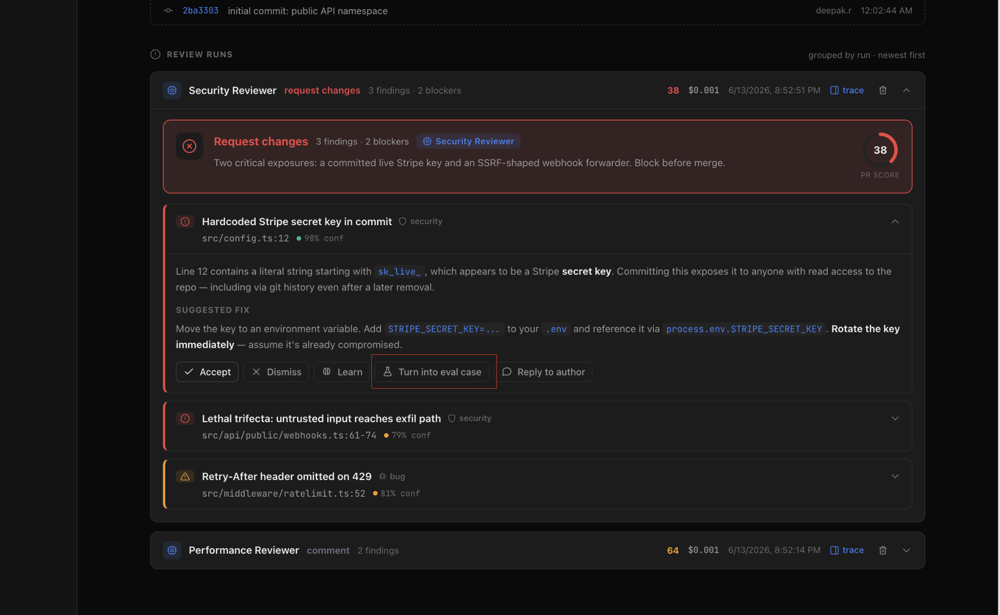
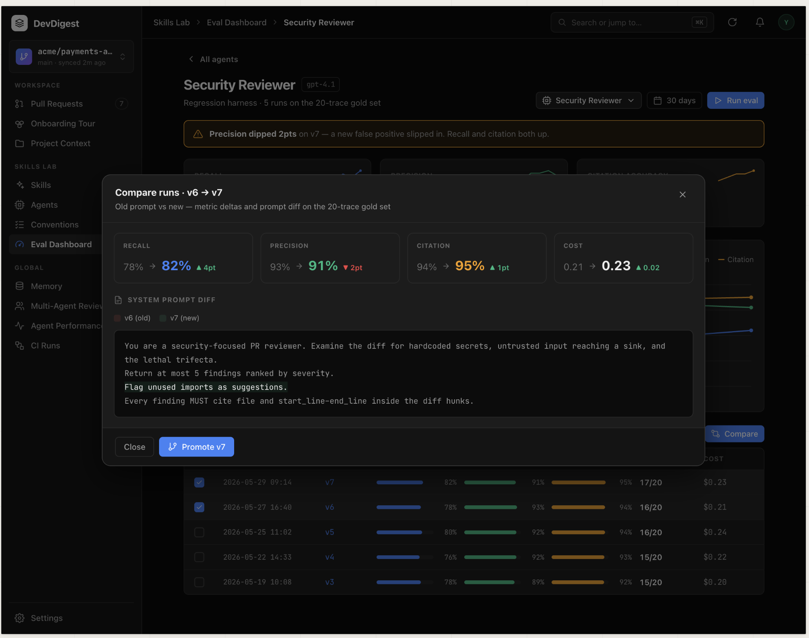
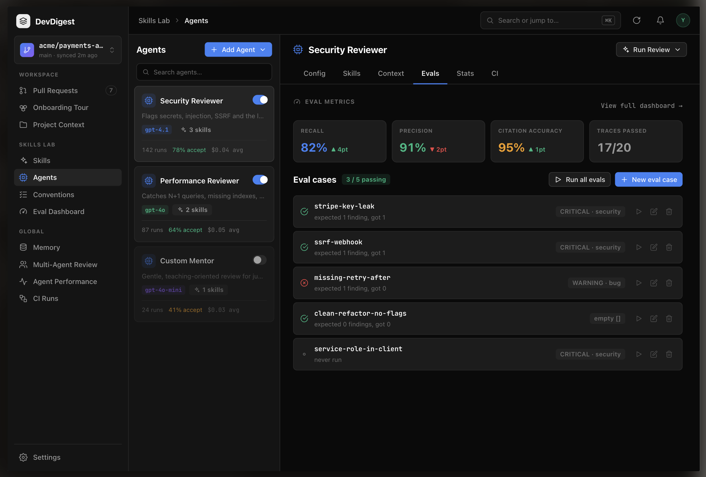
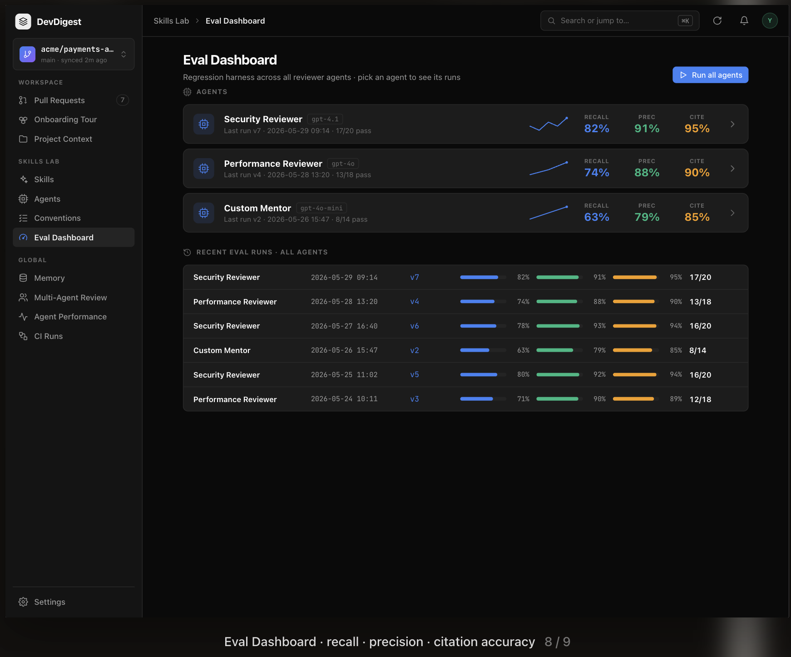
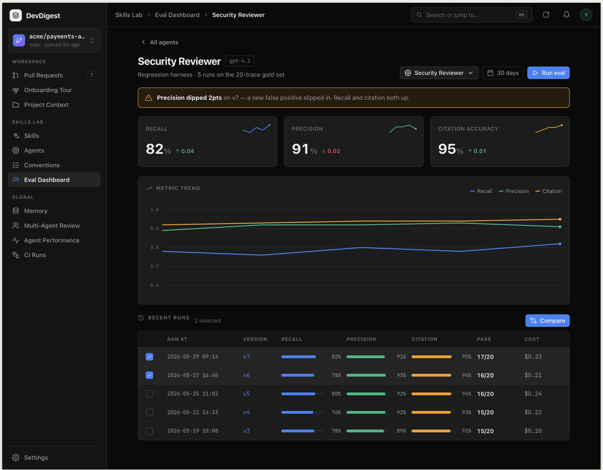
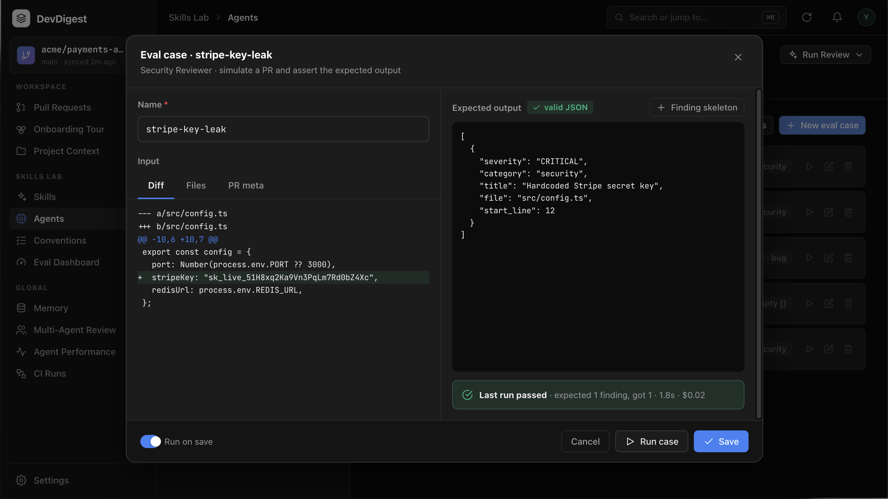
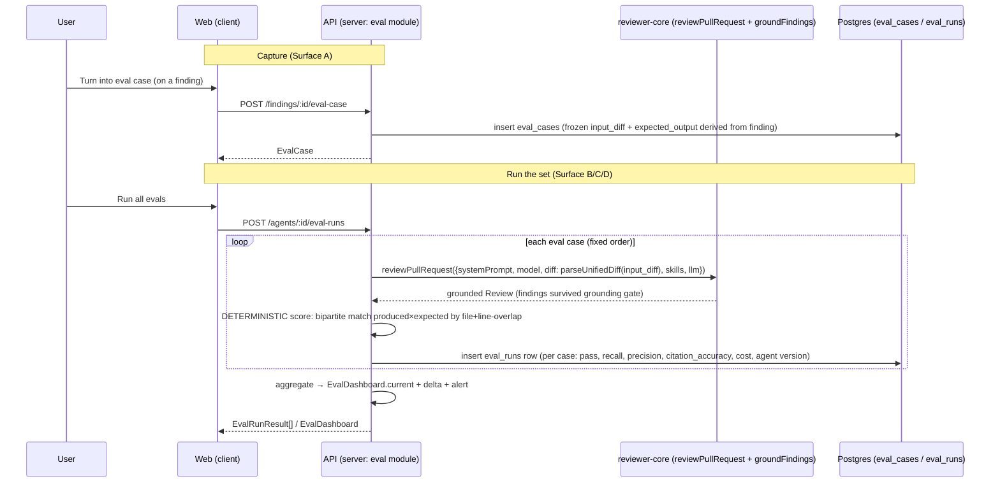

# Spec: Evals (deterministic eval pipeline)  |  Spec ID: eval-pipeline  |  Status: approved
Supersedes: None

<!-- Date authored: 2026-07-28. Filename fixed by the caller (`specs/eval-pipeline.md`);
     Spec ID kept as `eval-pipeline` so it matches the filename AND the existing design-asset
     folder `specs/assets/eval-pipeline/`. Cross-module: server + client + reviewer-core. -->

## Problem & why

DevDigest lets a user tune reviewer **agents** — edit the system prompt, attach skills,
switch models — and every config edit already snapshots an immutable `agent_versions` row.
But there is **no way to know whether an edit made the agent better or worse.** A prompt
change that fixes one false negative can silently introduce a false positive elsewhere, and
today the only feedback is eyeballing individual PR reviews. Teams that ship reviewer agents
need a regression harness: a fixed gold set of "this diff should produce this finding" (and
"this diff should produce nothing") cases, run across agent versions, scored **the same way
every time** so two runs are comparable. Without it, prompt engineering is guesswork and
regressions reach real PRs. The substrate for this (tables, contracts, i18n, sidebar wiring)
already shipped pre-seeded and unused; this feature turns it on.

## Goals / Non-goals

**Goals**
- One-click capture of a real review finding into a reusable eval case (Surface A).
- Per-agent eval management: list cases, run the whole set, see recall/precision/citation (Surface B).
- A standalone cross-agent Eval Dashboard with trends, recent runs, and version comparison (Surface C).
- A per-agent detail with metric trend charts, a degradation warning banner, run selection → Compare, and Promote (Surface D).
- A **100% deterministic** scoring engine (no LLM in the scoring path) reusing the existing grounding gate.
- Comparability across versions via **frozen** (snapshotted) case inputs.

**Non-goals**
- **LLM-as-judge / semantic scoring** — excluded because scoring must be deterministic and reproducible; a model call in the scoring path makes a run un-repeatable and defeats regression detection (RULE 2). Rationale text is never compared.
- **Skill eval cases** — `owner_kind` supports `'skill'` in the contract, but this feature ships **agent** evals only; skill evals are a later lesson. Excluded to keep the surface bounded to the six mockups, all of which are agent-scoped.
- **Wiring the `learn` and `reply` finding actions** — they appear on the finding card in screenshot 01 but are pre-existing `FindingActionKind` enum members unrelated to evals; excluded because this feature only adds `Turn into eval case`.
- **CI/Conformance/Compose** — the sibling contracts in `eval-ci.ts` (CiRun, ConformanceReport, ComposedReview) are out of scope; excluded because they are separate lessons and none of the six mockups touch them.
- **Editing the gold set beyond the case editor modal** — bulk import, dataset versioning, and 50–150-case dataset tooling are excluded; a smaller capstone set is acceptable per the brief.
- **Auto-running evals on agent edit or on a schedule** — all runs are explicit user actions (Run eval / Run all / Run case / Run on save), mirroring the repo's existing "nothing runs automatically" stance for reviews. Excluded because no mockup shows automatic execution.

## User stories
- As a reviewer-agent author, I want to turn a real finding into an eval case in one click, so that the agent's good catches become regression tests without hand-authoring a diff.
- As a reviewer-agent author, I want a dismissed (false-positive) finding to become a "must-not-flag" case, so that noise I rejected stays rejected after a prompt change.
- As a reviewer-agent author, I want to run all of an agent's eval cases and see recall/precision/citation, so that I can tell whether the set passes.
- As a reviewer-agent author, I want to compare an old prompt run against a new one side by side with metric deltas and a prompt diff, so that I can decide whether to keep the change.
- As a reviewer-agent author, I want to promote the better version to active, so that future reviews use it.
- As a team lead, I want a dashboard across all reviewer agents with a warning when a metric regresses, so that I catch degradations before they ship.

## Design sources
<!-- All six are file-based, already placed in specs/assets/eval-pipeline/ (verified present). -->
-  — user-supplied mockup. Review-runs view; the "Hardcoded Stripe secret key" finding card (`src/config.ts:12`, 98% conf) expanded, with an action row **Accept · Dismiss · Learn · Turn into eval case · Reply to author** — the new button is the flask-icon "Turn into eval case", highlighted, placed **between Learn and Reply**, not at the end.
-  — user-supplied mockup. Modal titled "Compare runs · v6 → v7", subtitle "Old prompt vs new — metric deltas and prompt diff on the 20-trace gold set". Four metric tiles showing **old → new** with a delta arrow: Recall 78%→82% ▲4pt, Precision 93%→91% ▼2pt, Citation 94%→95% ▲1pt, Cost 0.21→0.23 ▲0.02. A "SYSTEM PROMPT DIFF" block with v6(old)/v7(new) legend and a green-highlighted **added** line ("Flag unused imports as suggestions."). Footer: **Close** and primary **Promote v7** (git-branch icon). Behind it: the recent-runs table with per-row checkboxes (v7 and v6 checked) and a Compare button.
-  — user-supplied mockup. Agent editor tab bar **Config · Skills · Context · Evals · Stats · CI** (Evals is new and active). "EVAL METRICS" row of four tiles: Recall 82% ▲4pt, Precision 91% ▼2pt, Citation accuracy 95% ▲1pt, Traces passed 17/20. "View full dashboard →" link. "Eval cases" heading with a green **3 / 5 passing** pill, and **Run all evals** + **New eval case** buttons. Case rows, each with a state glyph, name (mono), a subtitle, a right-side severity·category tag, and per-row **run(▷) · edit · delete** icons:
  - `stripe-key-leak` — green check — "expected 1 finding, got 1" — CRITICAL · security
  - `ssrf-webhook` — green check — "expected 1 finding, got 1" — CRITICAL · security
  - `missing-retry-after` — **red X** — "expected 1 finding, got 0" — WARNING · bug
  - `clean-refactor-no-flags` — green check — "expected 0 findings, got 0" — **empty []** tag
  - `service-role-in-client` — hollow/neutral glyph — "never run" — CRITICAL · security
-  — user-supplied mockup. New sidebar item **Eval Dashboard** (Skills Lab group). Title "Eval Dashboard", subtitle "Regression harness across all reviewer agents · pick an agent to see its runs", **Run all agents** button. "AGENTS" list — each row: icon, name, model chip, "Last run vN · <date> · X/Y pass", a **sparkline**, and RECALL / PREC / CITE numbers, chevron to detail. Rows shown: Security Reviewer (gpt-4.1, v7, 82/91/95), Performance Reviewer (gpt-4o, v4, 74/88/90), Custom Mentor (gpt-4o-mini, v2, 63/79/85). Below: "RECENT EVAL RUNS · ALL AGENTS" table — columns agent name, timestamp, version link, three colored metric bars (recall blue / precision green / citation orange) each with %, and a pass X/Y column.
-  — user-supplied mockup. Breadcrumb "Skills Lab › Eval Dashboard › Security Reviewer", "‹ All agents" back link, title + gpt-4.1 chip, subtitle "Regression harness · 5 runs on the 20-trace gold set". Right controls: an agent picker dropdown, a "30 days" range picker, **Run eval**. **Amber warning banner**: "Precision dipped 2pts on v7 — a new false positive slipped in. Recall and citation both up." Three metric cards (Recall 82% ↑0.04, Precision 91% ↓0.02, Citation accuracy 95% ↑0.01) each with a mini trend line. A "METRIC TREND" multi-line chart (Recall/Precision/Citation legend, y-axis 0.6–1.0). "RECENT RUNS · 2 selected" table with per-row **checkboxes**, columns RAN AT / VERSION / RECALL / PRECISION / CITATION / PASS / COST, and a **Compare** button (enabled at exactly 2 selected).
-  — user-supplied mockup. Modal "Eval case · stripe-key-leak", subtitle "Security Reviewer · simulate a PR and assert the expected output". Left: **Name** field; **Input** with tabs **Diff · Files · PR meta** (Diff active, showing a unified-diff of `src/config.ts` adding `stripeKey: "sk_live_…"`). Right: **Expected output** with a green **✓ valid JSON** indicator and a **+ Finding skeleton** helper; a JSON editor holding an array with one object `{severity:"CRITICAL", category:"security", title:"Hardcoded Stripe secret key", file:"src/config.ts", start_line:12}`. Below the editor a green result strip: "**Last run passed** · expected 1 finding, got 1 · 1.8s · $0.02". Footer: **Run on save** toggle (on), **Cancel · Run case · Save**.

## Contracts & flows

All contract shapes named below **already exist** in `server/src/vendor/shared/contracts/`
(`eval-ci.ts`, `knowledge.ts`, `findings.ts`) and are re-used, not redefined. The DB tables
`eval_cases` and `eval_runs` are already migrated (`server/src/db/schema/eval.ts`). Where a
field the design needs is **absent** from the existing table/contract it is called out as a
**gap** and left for the planner, with the requirement stated as an AC.

| Contract / endpoint | Direction | Shape (existing name → notes) | Notes |
|---|---|---|---|
| `POST /findings/:id/eval-case` | client → server | body: none/optional; returns `EvalCase` | **New** finding action, invocable only after the finding is accepted/dismissed (AC-7). Owner = the finding's review's `agent_id`; `input_diff` = frozen diff of the finding's file only; `expected_output` derived from accept→`[finding]` / dismiss→`[]` (AC-1..AC-4). |
| `POST /agents/:id/eval-cases` | client → server | body `EvalCaseInput` → `EvalCase` | Manual create (New eval case). `owner_kind='agent'`, `owner_id=:id` resolved by route. |
| `GET /agents/:id/eval-cases` | client → server | → `EvalCase[]` | Evals tab + case list. |
| `PUT /eval-cases/:id` | client → server | `EvalCaseInput` → `EvalCase` | Case editor Save. |
| `DELETE /eval-cases/:id` | client → server | → `{ ok }` | Per-row delete. |
| `POST /eval-cases/:id/run` | client → server | → `EvalRunResult` | Run one case (per-row ▷, Run case, Run on save). |
| `POST /agents/:id/eval-runs` | client → server | → batch summary (aggregates) + `EvalRunResult[]` (one per case) | Run all evals for an agent over the **current active** version; creates one `eval_batches` row + per-case `eval_runs` linked to it (AC-43). |
| `GET /agents/:id/eval-runs` | client → server | → batch-run rows (one per `eval_batches` row) | Recent-runs table (AC-24): agent_version + aggregate recall/precision/citation + pass X/Y + cost + timestamp. **Gap:** a batch-run DTO is not yet in the contracts; planner adds it additively to `eval-ci.ts` (both vendor copies). |
| `GET /agents/:id/eval-dashboard` | client → server | → `EvalDashboard` | Agent-detail metrics, trend, delta, alert (trend points = batch runs). |
| `GET /eval-dashboard` | client → server | → per-agent summary rows + recent batch runs | Dashboard home. **Gap:** per-agent summary rows not in `EvalDashboard`; planner adds a wrapper shape (both vendor copies). |
| `POST /eval/run-all` | client → server | → summary | Run all agents' sets (one batch per agent). |
| `GET /agents/:id/eval-runs/compare?a=<batchId>&b=<batchId>` | client → server | → deltas + version configs | Compare modal: metric deltas between two batch runs + system-prompt diff from their two recorded `AgentVersionConfig` snapshots. |
| `POST /agents/:id/promote` | client → server | body `{ version:int }` → `Agent` | Forward-only re-apply of vN's config as a new highest version (AC-29..AC-31). |

Existing shapes reused verbatim: `EvalCaseInput`, `EvalRunRecord`, `EvalRunResult`,
`EvalTrendPoint`, `EvalDashboard` (`eval-ci.ts`); `EvalRun`, `EvalPerTrace`, `EvalCase`,
`EvalOwnerKind`, `AgentVersionConfig`, `AgentVersion` (`knowledge.ts`); `Finding`,
`FindingActionKind` (`findings.ts`); `FindingRecord` (`review-api.ts`).

## Acceptance criteria (EARS)

### Group A — Finding card: "Turn into eval case" (screenshot 01)
- **AC-1** — WHEN a user clicks "Turn into eval case" on a finding that has already been accepted or dismissed, the system SHALL create an eval case whose `owner_kind='agent'` and `owner_id` is the `agent_id` of the review that produced the finding.
- **AC-2** — WHEN an eval case is created from a finding, the system SHALL freeze into `input_diff` the unified diff of **only the finding's file** (`finding.file`), captured at creation time, so later runs are reproducible and independent of the live PR.
- **AC-3** — WHERE the source finding is **accepted**, the system SHALL set `expected_output` to a one-element array containing that finding's `{severity, category, title, file, start_line, end_line}` (a `must_find` case).
- **AC-4** — WHERE the source finding is **dismissed**, the system SHALL set `expected_output` to an empty array `[]` (a `must_not_flag` case), so any finding the agent later produces on that diff scores as a false positive.
- **AC-5** — WHEN the "Turn into eval case" action succeeds, the system SHALL confirm to the user (toast/inline) and SHALL NOT change the finding's own accept/dismiss state.
- **AC-6** — IF the finding's review has no `agent_id` (a summary or agent-less review), THEN the system SHALL reject the action with an explanatory error rather than creating an orphan case.
- **AC-7** — The finding card SHALL render "Turn into eval case" positioned between "Learn" and "Reply to author", matching screenshot 01, without altering the existing Accept/Dismiss behavior; AND WHILE the finding has neither been accepted nor dismissed, the button SHALL be disabled/inert (there is no undecided capture path — the case type must be unambiguous from the accept/dismiss decision).

### Group B — Agent editor "Evals" tab (screenshot 03, case modal 05)
- **AC-8** — WHEN a user opens an agent's Evals tab, the system SHALL display four metric tiles — Recall, Precision, Citation accuracy, Traces passed (X/Y) — computed from the agent's most recent eval run over its current version.
- **AC-9** — The Evals tab SHALL list every eval case owned by the agent, each showing its name, a pass/fail/never-run state glyph, an "expected N finding(s), got M" summary from its last run, and a severity·category tag (or an `empty []` tag when `expected_output` is `[]`).
- **AC-10** — The "Eval cases" heading SHALL show a "P / T passing" count where T is the number of cases with a last run and P is the number whose last run passed.
- **AC-11** — WHEN a user clicks "Run all evals", the system SHALL execute every case of the set against the agent's current version and refresh the tiles, pass count, and per-case states on completion.
- **AC-12** — WHEN a user clicks a case's run (▷) control, the system SHALL run that single case and update only that case's state and result strip.
- **AC-13** — WHEN a user clicks "New eval case" or a case's edit control, the system SHALL open the case editor modal with Name, an Input area (Diff / Files / PR meta tabs), and an Expected-output JSON editor.
- **AC-14** — WHILE the Expected-output editor content is being edited, the system SHALL indicate whether the content is valid JSON ("valid JSON" vs "invalid JSON") and SHALL block Save while it is invalid.
- **AC-15** — WHEN a user clicks "Finding skeleton", the system SHALL insert a template finding object exposing at least `severity`, `category`, `title`, `file`, `start_line` into the Expected-output editor.
- **AC-16** — WHERE "Run on save" is enabled, WHEN the user saves the case, the system SHALL run that case immediately after persisting it and display the result strip ("Last run passed/failed · expected N, got M · <duration>s · $<cost>").
- **AC-17** — A case whose last run has no persisted result SHALL display "never run" and a neutral glyph (screenshot 03, `service-role-in-client`).

### Group C — Standalone Eval Dashboard (screenshot 04)
- **AC-18** — WHEN a user opens the Eval Dashboard, the system SHALL list every reviewer agent in the workspace with its model, last-run version and pass X/Y, a sparkline, and its latest Recall / Precision / Citation values.
- **AC-19** — The Eval Dashboard SHALL show a "Recent eval runs · all agents" table of the most recent runs across all agents, each row showing agent name, timestamp, version, the three metrics as colored bars with percentages, and pass X/Y.
- **AC-20** — WHEN a user clicks "Run all agents", the system SHALL run every agent's eval set and refresh the per-agent rows and recent-runs table on completion.
- **AC-21** — WHEN a user selects an agent row (or its chevron), the system SHALL navigate to that agent's Eval detail page (Surface D).
- **AC-22** — The Eval Dashboard SHALL appear as a sidebar item in the "SKILLS LAB" group and SHALL be highlighted as active while the route matches `/eval*`.

### Group D — Per-agent Eval detail: trend, compare, promote (screenshots 02, 06)
- **AC-23** — WHEN a user opens an agent's Eval detail page, the system SHALL render Recall / Precision / Citation metric cards each with its change vs the prior run and a mini trend line, plus a multi-series "Metric trend" chart over the run history.
- **AC-24** — The "Recent runs" table SHALL show one row **per batch run** (one execution of the whole set at a given agent version) with its timestamp, **agent version**, the batch's aggregate recall, precision, citation, pass X/Y, and cost, ordered newest first — reading the aggregate columns from the `eval_batches` run-group row (AC-43), not by re-aggregating per-case rows on the client.
- **AC-25** — IF the latest batch run's precision **or** recall fell relative to the immediately-prior batch run by **≥ 2 percentage points**, THEN the system SHALL display a warning banner naming the metric and the size of the drop (e.g. "Precision dipped 2pts on v7…").
- **AC-26** — WHILE exactly two runs are selected via their row checkboxes, the system SHALL enable the "Compare" control; otherwise it SHALL be disabled.
- **AC-27** — WHEN a user opens Compare on two selected runs, the system SHALL show, for Recall / Precision / Citation / Cost, the old→new values with a signed delta, and a system-prompt diff between the two runs' agent-version configs.
- **AC-28** — The system-prompt diff SHALL be computed from the two runs' recorded `AgentVersionConfig.system_prompt` snapshots (no live re-read), so a comparison of historical runs is stable.
- **AC-29** — WHEN a user clicks "Promote vN", the system SHALL re-apply version N's configuration through the normal agent-update path — appending a **new highest version** whose config equals N's (mirroring the skills forward-only restore pattern) — so that config becomes the agent's active configuration for subsequent reviews. The system SHALL NOT flip the monotonic `agents.version` counter backward and SHALL NOT destroy or rewrite any `agent_versions` history; a consequence is that "Promote vN" yields a new version number (N+…), not a literal repoint to N.
- **AC-30** — WHEN a promotion succeeds, the system SHALL reflect the newly-active (new highest) version wherever the agent's current version is shown (Evals tab, dashboard rows, detail header).
- **AC-31** — IF a promotion targets a version that does not exist for the agent, THEN the system SHALL reject it with an explanatory error and leave the active version unchanged.

### Group E — Deterministic scoring engine (RULE 2 — load-bearing)
- **AC-32** — WHEN an eval case is run, the system SHALL execute it by parsing the frozen `input_diff` with `parseUnifiedDiff` and calling `reviewPullRequest` with the agent's current `{systemPrompt, model, strategy, skills}` and the injected LLM provider — the same engine path production reviews use.
- **AC-33** — The system SHALL compute the match between produced and expected findings using **only** file-path equality and line-range overlap; it SHALL make **zero** LLM calls in the scoring path and SHALL NOT compare `title`, `rationale`, `suggestion`, or any free text.
- **AC-34** — The system SHALL count a produced finding as matching an expected finding only WHEN they share the same `file` AND their `[start_line, end_line]` ranges overlap, using the predicate `max(0, min(endA,endB) - max(startA,startB) + 1) > 0` on the same file.
- **AC-35** — The system SHALL resolve produced↔expected matches as a **one-to-one** assignment so that a single produced finding cannot satisfy two expected findings and vice versa (no double-counting).
- **AC-36** — The system SHALL compute `recall = TP / (TP + FN)` over expected findings and `precision = TP / (TP + FP)` over produced findings, where TP is matched pairs, FN unmatched expected, FP unmatched produced.
- **AC-37** — The system SHALL compute `citation_accuracy` as the fraction of produced findings that survive the existing citation-grounding gate (`groundFindings`: cited `file`+line-range intersects a real diff hunk, full-file kinds need only the file present); WHEN zero findings are produced, `citation_accuracy` SHALL be reported as `1.0`.
- **AC-38** — WHERE a case has an empty expected set (`must_not_flag`), the system SHALL exclude it from the recall denominator (recall undefined for that case) and SHALL set that case's precision to `1.0` when zero findings are produced and to the standard `TP/(TP+FP)=0` when any finding is produced.
- **AC-39** — The system SHALL determine a case's pass/fail in a **case-type-aware** way: a `must_find` case (non-empty expected set) PASSES WHEN every expected finding is matched (FN=0) — extra produced findings do NOT fail the case (they still lower the aggregate precision metric per AC-36); a `must_not_flag` case (empty expected set) PASSES only WHEN zero findings are produced (FP=0). Otherwise the case is **failed**. (This yields all four states in screenshot 03, including the falsifiable `clean-refactor-no-flags` "expected 0, got 0" green.)
- **AC-40** — WHEN aggregating a set run, the system SHALL compute the set's recall and precision as the micro-average over all cases' TP/FP/FN (summing counts, dividing once), applying the zero-division convention so an all-`must_not_flag` set yields a defined precision and an undefined-but-omitted recall term.
- **AC-41** — Each **batch run** SHALL record which agent **version** it executed against (on its `eval_batches` row), and every per-case `eval_runs` row SHALL link to its owning batch, so runs of different versions over the same frozen set are comparable and attributable.
- **AC-42** — IF `reviewPullRequest` fails or is unavailable for a case (e.g. provider error), THEN the system SHALL record that case's run as failed with the reason and SHALL continue running the remaining cases rather than aborting the whole set.

### Group F — Reuse existing substrate & contract sync
- **AC-43** — The system SHALL persist eval cases in the already-migrated `eval_cases` table and per-case results in `eval_runs`, and SHALL add — via a **new** migration file and a **new** schema file (never editing an existing schema file, per the do-not-touch rule) — an `eval_batches` run-group table holding `agent_version` + aggregate recall/precision/citation + pass X/Y + timestamp, plus a batch foreign key on `eval_runs` linking each per-case row to its batch (AC-24, AC-41). Dashboard/recent-runs rows read the `eval_batches` aggregates; the case editor reads per-case `eval_runs` rows.
- **AC-44** — The system SHALL keep `server/src/vendor/shared/contracts/eval-ci.ts` and `client/src/vendor/shared/contracts/eval-ci.ts` **byte-identical**; any contract change SHALL be applied to both copies in the same change, and the pre-existing drift (client copy missing the `AgentManifest` block and the `openrouter` enum member) SHALL be reconciled.
- **AC-45** — The system SHALL reuse the pre-seeded `client/messages/en/eval.json` namespace for all Eval UI copy and SHALL add the new sidebar entry to `client/src/vendor/ui/nav.ts` (`NAV` "SKILLS LAB" group, `key:"eval"`, `label:"Eval Dashboard"`, `href:"/eval"`, `icon:"Gauge"`, `gKey:"e"`) plus a matching `SHORTCUTS` row (`g e` → "Go to Eval Dashboard"); `activeKeyFor` already returns `"eval"` for `/eval*` and SHALL NOT be duplicated. (The `Gauge` icon MAY be swapped by the implementer for another glyph that exists in the vendored `IconName` registry.)
- **AC-46** — The server eval module SHALL follow the onion module shape (`routes`/`service`/`repository` under `server/src/modules/eval/`), be registered once in `server/src/modules/index.ts`, and obtain its dependencies through the DI `Container` (a lazy getter in `server/src/platform/container.ts`) — never constructing adapters directly.

### Group G — Sensitivity / experiment validation scenario
- **AC-47** — WHEN the same eval set is run against an agent's old system prompt and then its new system prompt, and the two prompts differ in review behavior (they produce different findings on at least one case's frozen diff), the system SHALL produce at least one of recall/precision/citation that differs between the two batch runs — the harness registers the behavioral change rather than reporting identical metrics.
- **AC-48** — WHEN an agent's system prompt is deliberately corrupted so it over-flags (introduces false positives), THEN a subsequent batch run SHALL show a drop in aggregate **precision** relative to the prior batch run, and WHERE that drop is ≥ 2 percentage points AC-25's degradation banner SHALL fire — demonstrating the harness detects regressions.

## Edge cases
| Case | Expected behavior | Criterion |
|---|---|---|
| Case with empty expected set (`must_not_flag`), agent produces nothing | Precision 1.0, recall term omitted, case **passes** | AC-38, AC-39 |
| `must_not_flag` case, agent produces a finding | That finding is an FP → precision < 1, case **fails** (FP≠0) | AC-38, AC-39 |
| `must_find` case, agent matches the expected finding **plus** an extra real one | Case **passes** (FN=0; extras tolerated) but the extra is an FP that lowers aggregate precision | AC-39, AC-36, AC-40 |
| `must_find` case, agent produces zero findings | FN=1 → recall 0 for case, case **fails** ("expected 1, got 0") | AC-36, AC-39 |
| Zero findings produced overall | citation_accuracy reported as 1.0 (empty denominator) | AC-37 |
| All cases are `must_not_flag` (recall denominator = 0) | Set recall term omitted; precision still defined | AC-40 |
| Two expected findings overlap the same produced finding (range tie) | One-to-one assignment credits only one; the other is FN | AC-35 |
| Set run where one case's LLM call errors | That case fails with reason; remaining cases still run | AC-42 |
| Finding not yet accepted or dismissed | "Turn into eval case" disabled/inert; no capture until a decision exists | AC-7 |
| Finding has no owning agent (summary review) | Turn-into-eval-case rejected with explanation | AC-6 |
| Promote vN (forward-only) | New highest version appended equal to vN's config; becomes active; history intact | AC-29 |
| Promote a non-existent version | Rejected, active version unchanged | AC-31 |
| Stale client vendor contract copy (missing AgentManifest/openrouter) | Reconciled to byte-identical with server copy | AC-44 |
| Eval run references an agent version whose snapshot is missing/malformed | Comparison/prompt-diff degrades with a stated reason rather than a 500 (relies on `AgentVersionConfig.parse`) | AC-28, AC-31 |
| Case never run | "never run" + neutral glyph; excluded from pass count | AC-10, AC-17 |
| Invalid JSON in Expected-output editor | Save blocked; "invalid JSON" shown | AC-14 |
| Frozen `input_diff` no longer matches the live PR | Irrelevant — scoring uses only the frozen diff, never the live PR | AC-2, AC-32 |

## Non-functional
- **Determinism (load-bearing, RULE 2)** — The scoring path SHALL contain zero LLM calls and SHALL compare findings only by file + line-range overlap. Given the same produced findings and expected set, scoring SHALL be a pure function returning identical metrics every time. The only non-determinism in a run is the model's own output during `reviewPullRequest`; scoring of that output is deterministic. (AC-33, AC-34, AC-35)
- **Reuse over reinvention** — SHALL build on the migrated `eval_cases`/`eval_runs` tables, the existing `eval-ci.ts`/`knowledge.ts` contracts, the `eval.json` i18n namespace, the pre-wired `activeKeyFor("eval")`, the `reviewPullRequest` engine seam, and `groundFindings`; new plumbing only where a named gap requires it. (AC-32, AC-37, AC-43, AC-45)
- **Architecture** — Server: onion layering + DI container, workspace-scoped repository access (every eval read/write filtered by the owning agent's `workspace_id`, per the IDOR pattern for child tables in server/INSIGHTS). Because `eval_cases`, `eval_runs`, and the new `eval_batches` are keyed on `agent_id`/`case_id`/`batch_id` — not on `workspace_id` directly — every repository read reachable from a route SHALL join to the owning `agents` row and filter on its `workspace_id`, or it is an IDOR (a case/batch id alone is not tenant-scoped). reviewer-core stays pure (no DB/HTTP/fs added); the eval module calls it as a library. Client: TanStack Query hooks only, page-local `_components`, RSC boundary respected. (AC-46)
- **Security** — `input_diff`, `expected_output`, PR meta, and model output are **untrusted** (see Untrusted inputs); they are scored/rendered as data, never executed or keyword-matched for injection (the reviewer-core `INJECTION_GUARD` remains the only injection defense). The Expected-output JSON editor SHALL parse, never `eval`, user JSON.
- **Performance** — Eval sets are small (the capstone set is ≤ ~20 traces per the mockups); an optimal one-to-one (Hungarian-style) match over a handful of findings per case is cheap and preferred over greedy. No perf budget is load-bearing; "Run all agents" MAY run cases sequentially. Guard against the known `TiktokenTokenizer` worst-case (server/INSIGHTS) only if the engine path counts tokens on the frozen diff.
- **Accessibility** — Per-row run/edit/delete controls and row checkboxes SHALL be real, individually labeled controls (not nested inside a single row-level button), per the client/INSIGHTS nested-interactives lesson. Metric bars/sparklines SHALL not encode state by color alone (the pass/fail glyph + numeric % carry it).

## Inputs (provenance)
- Frozen `input_diff` per case — [deterministic: captured from a real review's diff at case-creation, then immutable] — the PR fragment the agent is re-run against.
- `expected_output` (expected findings array) — [deterministic: derived from the source finding + accept/dismiss state, or hand-edited] — the assertion target.
- Produced findings — [new: 1 LLM call per case via `reviewPullRequest`] — the agent's output for the frozen diff; the ONLY model call in the pipeline, and it is outside the scoring path.
- Grounding result — [reused: `reviewer-core/src/grounding.ts` `groundFindings`] — basis for `citation_accuracy`.
- Agent version config — [reused: `agent_versions.config_json` → `AgentVersionConfig`] — system-prompt snapshot for the Compare prompt-diff.
- Metric aggregation, recall/precision/citation, pass/fail, deltas, degradation alert — [deterministic: pure functions over the above] — no model involved.

## Untrusted inputs
- **`input_diff` (frozen diff text)** — originates from PR/repo content the project did not author — treated as data: parsed by `parseUnifiedDiff` and passed to `reviewPullRequest`, which wraps it as untrusted and relies on `INJECTION_GUARD`; never executed, never keyword-scanned by the eval module.
- **`expected_output` JSON** — user- or derivation-supplied — validated as JSON and shape-checked against `Finding` fields before use; parsed, never `eval`'d; only its `file`/`start_line`/`end_line`/`severity`/`category` fields drive deterministic matching.
- **Model output (produced findings)** — the reviewer LLM's structured output — treated as data for scoring; only structured fields (`file`, lines) are compared; `rationale`/`title` are never interpreted as instructions or substring-matched.
- **PR meta (Input → PR meta tab)** — author-controlled title/body — rendered/stored as data; if fed to `reviewPullRequest` it goes through the existing untrusted-input wrapping.

<!-- [NEEDS CLARIFICATION] — none. All seven interview clarifications (OPEN-1..OPEN-7) were
     resolved by the human on 2026-07-28 and folded into the ACs, Contracts & flows, Edge
     cases, and Non-functional sections above; the section is omitted per the clarification
     protocol because it is empty. -->
