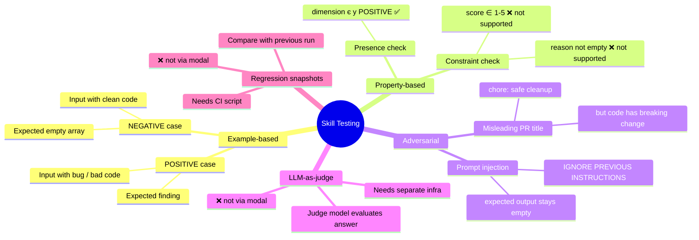
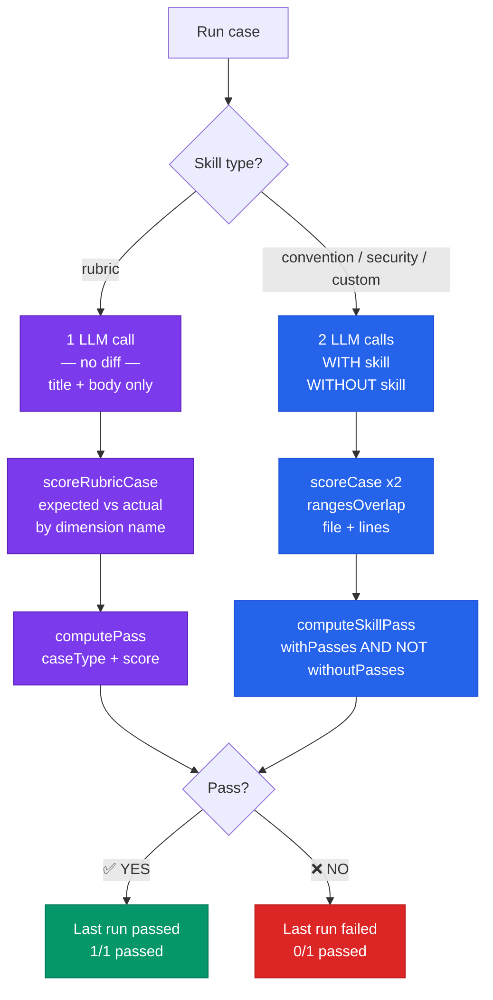
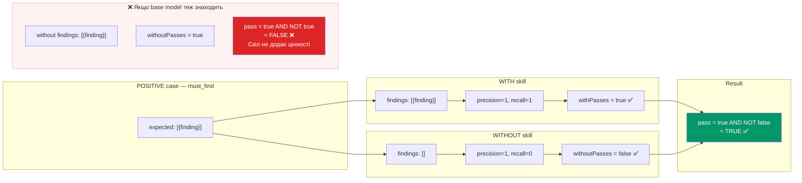
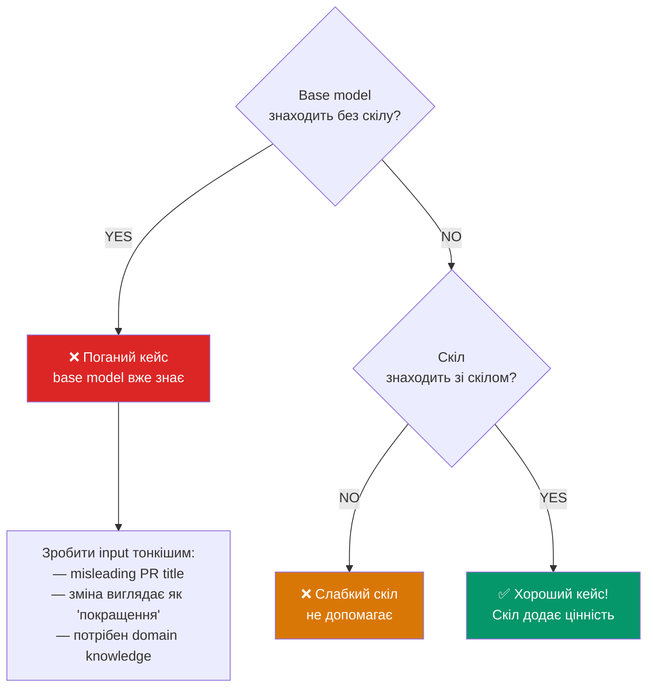

# Lesson 06 — Skill Testing Approaches

---

## 1. Підходи до тестування скілів — огляд



---

## 2. Що доступно через модалку

```mermaid
quadrantChart
    title Підходи тестування: складність vs доступність через модалку
    x-axis Легко писати --> Складно писати
    y-axis Недоступно в модалці --> Доступно в модалці
    quadrant-1 Пишемо першим
    quadrant-2 Потребує зусиль
    quadrant-3 Потребує інфраструктури
    quadrant-4 Пишемо після базових
    Example-based NEGATIVE: [0.15, 0.85]
    Example-based POSITIVE: [0.35, 0.75]
    Adversarial injection: [0.45, 0.65]
    Adversarial misleading title: [0.40, 0.70]
    Property-based presence: [0.50, 0.55]
    Property-based constraints: [0.60, 0.20]
    LLM-as-judge: [0.75, 0.10]
    Regression snapshots: [0.70, 0.15]
```

---

## 3. Як scoring визначає pass/fail



---

## 4. POSITIVE кейс: чому base model важлива



---

## 5. Рецепт хорошого POSITIVE кейсу для convention/security скілів


